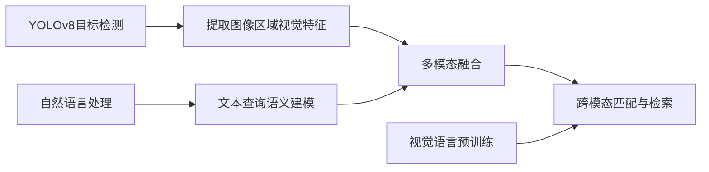

# YOLOv8与自然语言处理：融合视觉与语言的理解

## 1. 背景介绍
### 1.1 计算机视觉与自然语言处理的发展
计算机视觉(Computer Vision)和自然语言处理(Natural Language Processing)是人工智能领域的两大重要分支。近年来，随着深度学习技术的突破，这两个领域都取得了巨大的进步。计算机视觉使计算机能够"看懂"图像和视频，自然语言处理让机器能够理解和生成人类语言。

### 1.2 多模态学习的兴起
尽管计算机视觉和自然语言处理在各自领域取得了显著成果，但现实世界中的信息往往是多模态的，包含图像、文本、语音等不同形式。因此，如何将视觉和语言有机结合，让机器像人一样理解世界，成为了一个新的研究热点。这就是多模态学习(Multimodal Learning)的核心目标。

### 1.3 YOLO系列目标检测算法
YOLO(You Only Look Once)是一系列先进的实时目标检测算法，由Joseph Redmon等人于2015年提出。相比传统的目标检测方法，YOLO将检测问题转化为回归问题，大大提升了检测速度。其最新版本YOLOv8在精度和速度上都有了进一步的提升。

### 1.4 YOLOv8与自然语言处理的结合
本文将探讨如何将YOLOv8这一强大的视觉模型与自然语言处理技术相结合，实现图像和文本的跨模态理解。通过这种融合，我们可以让机器不仅能识别图像中的物体，还能根据文本描述定位到相应的目标。这对于图像检索、视频理解、智能问答等任务具有重要意义。

## 2. 核心概念与联系
### 2.1 YOLOv8目标检测
- 目标检测任务：给定一张图像，找出其中所有感兴趣的目标(如人、车、动物等)，并给出它们的类别和位置。
- YOLOv8网络结构：以CSPDarknet53为骨干网络，引入了Anchor-Free策略和自适应锚框，可以在不同尺度上高效检测目标。
- 损失函数设计：使用CIoU Loss作为回归损失，并采用Focal Loss处理类别不平衡问题。

### 2.2 自然语言处理
- 词嵌入(Word Embedding)：将词映射为稠密向量，使语义相似的词在向量空间中距离较近。常见的词嵌入模型有Word2Vec、GloVe等。
- 序列建模：使用RNN、LSTM、Transformer等模型对文本序列进行建模，捕捉词之间的依赖关系。
- 语言模型预训练：在大规模语料上预训练双向语言模型如BERT，可以学习到通用的语言表示，再针对下游任务进行微调。

### 2.3 视觉-语言表示学习
- 多模态融合：将图像特征和文本特征映射到同一语义空间，使它们可以直接比较和匹配。常见的融合方法有拼接、注意力机制等。
- 对比学习：通过最大化正样本对的相似度，最小化负样本对的相似度，学习到对齐的图文表示。代表性工作有CLIP、ALIGN等。
- 视觉语言预训练：在大规模图文对数据上进行预训练，学习跨模态的对齐和推理能力，如ViLBERT、UNITER等。

### 2.4 YOLOv8与NLP的结合点
- 基于YOLOv8的目标检测可以为图像区域生成视觉特征。
- 利用NLP技术对文本查询进行理解和建模，生成语义特征。
- 通过多模态融合将视觉特征和语义特征对齐，实现跨模态的匹配和检索。
- 引入视觉语言预训练模型，增强模型的泛化和理解能力。



## 3. 核心算法原理具体操作步骤
### 3.1 YOLOv8目标检测流程
1. 图像预处理：将输入图像缩放到固定尺寸(如640x640)，并进行归一化。
2. 骨干网络提取特征：使用CSPDarknet53对图像进行特征提取，得到多尺度特征图。
3. 特征融合：通过PANet(Path Aggregation Network)进行特征融合，融合不同尺度的语义信息。 
4. 检测头预测：在每个特征图上应用检测头，预测目标的类别、置信度和边界框坐标。
5. 后处理：对预测结果进行非极大值抑制(NMS)，去除冗余的检测框，得到最终的检测结果。

### 3.2 文本查询的语义建模
1. 文本预处理：对输入的文本查询进行分词、小写化等预处理操作。
2. 词嵌入：将每个词映射为稠密向量，可以使用预训练的词嵌入模型如GloVe。
3. 序列建模：使用双向LSTM或Transformer对词向量序列进行编码，捕捉词之间的上下文信息。
4. 句子表示：将序列中所有词的编码向量进行池化(如平均池化)，得到整个句子的语义表示向量。

### 3.3 多模态融合与匹配
1. 视觉特征提取：使用YOLOv8对图像进行目标检测，得到每个目标区域的视觉特征向量。
2. 文本特征提取：对文本查询进行语义建模，得到查询的语义特征向量。
3. 特征对齐：通过线性变换或多层感知机将视觉特征和文本特征映射到同一维度的公共空间。
4. 相似度计算：计算每个图像区域特征与文本特征之间的相似度，常用的相似度度量有内积、余弦相似度等。
5. 匹配与检索：根据相似度得分对图像区域进行排序，选择得分最高的区域作为查询的匹配结果。

### 3.4 引入视觉语言预训练
1. 选择合适的视觉语言预训练模型，如CLIP、ALIGN等。
2. 将预训练模型的图像编码器和文本编码器分别应用于图像区域和文本查询。
3. 使用预训练模型学习到的对齐方式计算图文相似度，进行匹配和检索。
4. 根据任务需求，可以选择固定预训练模型的参数，或在下游任务上进行微调。

## 4. 数学模型和公式详细讲解举例说明
### 4.1 YOLOv8的损失函数
YOLOv8的损失函数由三部分组成：类别损失、目标性损失和边界框回归损失。

1. 类别损失采用Focal Loss：
$$
FL(p_t) = -\alpha_t (1-p_t)^\gamma \log(p_t)
$$
其中$p_t$是模型预测的类别概率，$\alpha_t$和$\gamma$是平衡因子和聚焦因子。

2. 目标性损失采用二元交叉熵损失：
$$
L_{obj} = -\sum_{i=1}^S \sum_{j=1}^B \left[ y_{ij} \log(\hat{y}_{ij}) + (1-y_{ij}) \log(1-\hat{y}_{ij}) \right]
$$
其中$y_{ij}$表示第$i$个网格的第$j$个预测框是否包含目标，$\hat{y}_{ij}$是模型预测的目标性得分。

3. 边界框回归损失采用CIoU Loss：
$$
L_{box} = 1 - IoU + \frac{\rho^2(b,b^{gt})}{c^2} + \alpha v
$$
其中$IoU$是预测框和真实框的交并比，$\rho$是两个框中心点之间的欧氏距离，$c$是包含两个框的最小闭包区域的对角线长度，$\alpha$是平衡因子，$v$是长宽比一致性项。

### 4.2 文本特征提取的数学表示
给定一个长度为$n$的词序列$\{w_1, w_2, ..., w_n\}$，我们首先将每个词映射为$d$维的词向量$\{e_1, e_2, ..., e_n\}$。

然后，使用双向LSTM对词向量序列进行编码。双向LSTM由前向LSTM和后向LSTM组成，它们分别按照词序列的正向和反向进行处理：
$$
\overrightarrow{h}_t = LSTM(e_t, \overrightarrow{h}_{t-1})
$$
$$
\overleftarrow{h}_t = LSTM(e_t, \overleftarrow{h}_{t+1})
$$
最后，将前向和后向的隐状态拼接起来，得到每个词的上下文编码向量：
$$
h_t = [\overrightarrow{h}_t; \overleftarrow{h}_t]
$$
对整个序列的编码向量进行平均池化，得到句子的语义表示向量$s$：
$$
s = \frac{1}{n} \sum_{t=1}^n h_t
$$

### 4.3 多模态融合与匹配的数学表示
假设我们有一组图像区域特征$\{v_1, v_2, ..., v_m\}$和一个文本查询特征$q$，它们分别是$d_v$维和$d_q$维的向量。

我们首先通过线性变换将它们映射到$d$维的公共空间：
$$
\hat{v}_i = W_v v_i + b_v
$$
$$
\hat{q} = W_q q + b_q
$$
其中$W_v \in \mathbb{R}^{d \times d_v}$, $b_v \in \mathbb{R}^d$, $W_q \in \mathbb{R}^{d \times d_q}$, $b_q \in \mathbb{R}^d$是可学习的参数。

然后，我们计算每个图像区域特征与文本特征之间的相似度，常用的相似度函数有内积和余弦相似度：
$$
s_i = \hat{v}_i^T \hat{q} \quad \text{或} \quad s_i = \frac{\hat{v}_i^T \hat{q}}{\|\hat{v}_i\| \|\hat{q}\|}
$$
最后，我们选择相似度得分最高的图像区域作为查询的匹配结果：
$$
i^* = \arg\max_i s_i
$$

## 5. 项目实践：代码实例和详细解释说明
下面是使用PyTorch实现YOLOv8与自然语言处理结合的简化代码示例：

```python
import torch
import torch.nn as nn
import torchvision.models as models

# YOLOv8目标检测模型
class YOLOv8(nn.Module):
    def __init__(self, num_classes):
        super(YOLOv8, self).__init__()
        self.backbone = models.resnet50(pretrained=True)
        self.head = nn.Sequential(
            nn.Linear(2048, 512),
            nn.ReLU(),
            nn.Linear(512, num_classes + 5)
        )
    
    def forward(self, x):
        features = self.backbone(x)
        detections = self.head(features)
        return detections

# 文本特征提取模型
class TextEncoder(nn.Module):
    def __init__(self, vocab_size, embed_dim, hidden_dim):
        super(TextEncoder, self).__init__()
        self.embedding = nn.Embedding(vocab_size, embed_dim)
        self.lstm = nn.LSTM(embed_dim, hidden_dim, bidirectional=True, batch_first=True)
        self.fc = nn.Linear(hidden_dim * 2, hidden_dim)
    
    def forward(self, x):
        embedded = self.embedding(x)
        output, _ = self.lstm(embedded)
        output = torch.mean(output, dim=1)
        output = self.fc(output)
        return output

# 多模态融合与匹配模型
class MultimodalMatcher(nn.Module):
    def __init__(self, visual_dim, text_dim, common_dim):
        super(MultimodalMatcher, self).__init__()
        self.visual_proj = nn.Linear(visual_dim, common_dim)
        self.text_proj = nn.Linear(text_dim, common_dim)
    
    def forward(self, visual_features, text_features):
        visual_emb = self.visual_proj(visual_features)
        text_emb = self.text_proj(text_features)
        similarity = torch.matmul(visual_emb, text_emb.t())
        return similarity

# 创建模型实例
yolov8 = YOLOv8(num_classes=80)
text_encoder = Text