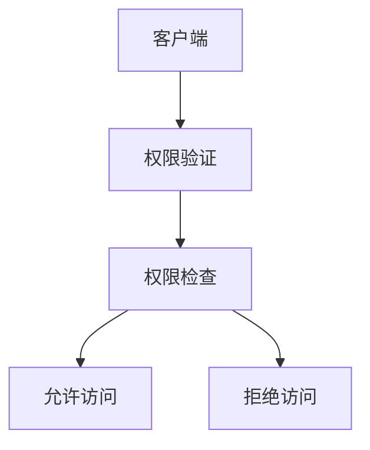

# Zookeeper安全机制及权限控制

## 1.背景介绍

### 1.1 Zookeeper的应用场景

Zookeeper是一个分布式的、开源的协调服务系统,它提供了一些简单的功能,分布式应用可以基于它实现同步服务、配置维护、命名服务等。Zookeeper的目标就是封装好复杂易出错的关键服务,将简单易用的接口和性能高效、功能稳定的系统提供给用户。

### 1.2 Zookeeper面临的安全挑战

随着Zookeeper在分布式系统中的广泛应用,其安全性问题也日益凸显。Zookeeper自身提供了一些安全保障机制,但仍然存在一些安全隐患:

- 未授权访问:恶意客户端可能会在未经授权的情况下访问Zookeeper,窃取或篡改敏感数据。
- 拒绝服务攻击:攻击者通过大量请求来耗尽系统资源,导致Zookeeper无法正常服务。
- 中间人攻击:攻击者可能会拦截并篡改客户端和服务端之间的通信数据。

因此,如何保障Zookeeper的安全性,成为了亟待解决的问题。本文将深入探讨Zookeeper的安全机制及其权限控制方案。

## 2.核心概念与联系

### 2.1 Zookeeper的ACL权限控制

ACL(Access Control List)是Zookeeper提供的一种权限控制机制。通过对znode设置ACL,可以限制客户端对其进行的操作。Zookeeper的ACL权限控制主要涉及以下几个核心概念:

- Authentication:权限验证,即对客户端身份进行识别和确认。
- Authorization:授权,验证通过身份认证的客户端是否具有访问特定资源的权限。
- Znode:Zookeeper的数据节点,ACL权限控制就是对znode的增删改查等操作进行限制。
- Scheme:权限控制模式,不同的scheme代表了不同的权限验证方式。
- ID:权限对象,表示允许访问特定znode的用户或者IP等。
- Permission:权限许可,包括CREATE、READ、WRITE、DELETE、ADMIN等。

### 2.2 Zookeeper ACL的工作流程

下面是Zookeeper ACL权限控制的基本工作流程:



1. 客户端发起请求,携带自身的身份信息。
2. Zookeeper服务端根据scheme对客户端身份进行权限验证。
3. 通过身份验证后,检查该客户端是否在znode的ACL列表中。
4. 如果在ACL允许范围内,则允许该客户端访问znode,否则拒绝访问。

## 3.核心算法原理具体操作步骤

### 3.1 Zookeeper ACL的存储结构

Zookeeper使用一个ACL对象来表示znode的权限控制列表,其数据结构如下:

```java
public class ACL implements Record {
   private final int perms;
   private final Id id;
    
   public ACL(int perms, Id id) {
       this.perms = perms;
       this.id = id;
   }
}
```

其中,perms表示权限许可,采用位图方式存储,每一位代表一种权限,1为允许,0为禁止。Id表示权限对象,不同的scheme有不同的Id格式。

### 3.2 ACL权限检查算法

当客户端访问一个znode时,Zookeeper会从其ACL列表中逐个匹配,检查是否允许该操作。

1. 将客户端请求携带的身份信息(scheme+id)与znode的ACL列表逐一比对。
2. 如果找到匹配项,则检查该ACL对应的permission是否包含当前请求的操作。
3. 如果允许该操作,则权限检查通过,允许访问。
4. 如果遍历完ACL列表还没有找到匹配项或者没有权限,则拒绝本次访问。

### 3.3 常用权限许可

- CREATE(c):创建子节点的权限,对应位图第0位。 
- READ(r):获取节点数据和子节点列表的权限,对应位图第1位。
- WRITE(w):更新节点数据的权限,对应位图第2位。
- DELETE(d):删除子节点的权限,对应位图第3位。
- ADMIN(a):设置节点ACL的权限,对应位图第4位。

可以通过逻辑或运算来组合多个权限,如 READ | WRITE 代表同时具有读写权限。

## 4.数学模型和公式详细讲解举例说明

### 4.1 ACL权限许可位图

Zookeeper使用整数来表示ACL权限许可,采用位图的方式,每一位代表一种权限。假设一个znode的权限许可为 `11`
,其二进制形式为 `01011`,代表该ACL拥有`ADMIN`、`WRITE`和`CREATE`权限,不具有`DELETE`和`READ`权限。

权限许可整数值`perms`与位图的对应关系如下:

$$
perms = 2^4a + 2^3d + 2^2w + 2^1r + 2^0c
$$

其中,`a`、`d`、`w`、`r`、`c`分别表示是否拥有相应的权限,1为拥有,0为没有。

### 4.2 权限检查示例

假设一个znode的ACL列表如下:

```
[
  {perms=READ, id=ip:192.168.0.1}, 
  {perms=WRITE|CREATE, id=digest:bob:aaa}, 
  {perms=ADMIN|READ, id=world:anyone}
]
```

当客户端请求对该znode进行`READ`操作时:

1. 如果客户端IP为`192.168.0.1`,则匹配第一条ACL,权限检查通过。
2. 如果客户端提供了用户名为`bob`,密码为`aaa`的digest认证信息,则匹配第二条ACL,但该ACL没有`READ`权限,权限检查失败。  
3. 对于其他任意客户端,都可以匹配第三条ACL,权限检查通过。

## 5.项目实践：代码实例和详细解释说明

下面通过一个简单的Zookeeper Java客户端代码示例,来演示如何进行ACL权限控制。

```java
// 创建一个znode并设置ACL
zk.create("/test", "data".getBytes(), 
  Arrays.asList(
    new ACL(ZooDefs.Perms.READ, new Id("ip", "192.168.0.1")),
    new ACL(ZooDefs.Perms.WRITE, new Id("auth", "bob:123"))
  ),
  CreateMode.PERSISTENT
);

// 使用授权信息访问znode
zk.addAuthInfo("digest", "bob:123".getBytes());
zk.getData("/test", false, null);
zk.setData("/test", "newdata".getBytes(), -1);

// 未授权访问znode
zk.getData("/test", false, null); // 抛出 NoAuthException
```

代码解读:

1. 首先创建了一个持久化的znode,设置其ACL列表,允许IP为`192.168.0.1`的客户端读取,允许通过`bob:123`授权的客户端写入。
2. 接着通过`addAuthInfo`提供授权信息,然后就可以正常读写`/test`节点了。
3. 最后,在没有授权信息的情况下访问`/test`节点,将抛出`NoAuthException`异常。

## 6.实际应用场景

### 6.1 敏感配置的安全访问

在分布式系统中,一些关键的配置信息通常存储在Zookeeper上,例如数据库连接串、加密密钥等。对这些敏感信息,我们可以通过ACL来控制访问权限,只允许特定的客户端读取,避免敏感数据泄露。

### 6.2 多租户环境的隔离

对于一些多租户场景,不同租户之间的数据需要严格隔离。我们可以在Zookeeper中为每个租户创建一个独立的znode,设置仅允许该租户访问的ACL。这样即使多个租户共用同一个Zookeeper集群,也能保证数据隔离与安全。

### 6.3 分布式锁的权限控制

在实现分布式锁时,我们经常利用Zookeeper的临时顺序节点来判断锁的归属。为了避免其他客户端恶意删除锁节点,我们可以利用ACL,只允许加锁的客户端本身有删除权限,其他客户端只有读权限,无法删除锁节点。

## 7.工具和资源推荐

- Zookeeper官网:https://zookeeper.apache.org/
- Curator:Netflix开源的Zookeeper客户端框架,使用更加便捷:http://curator.apache.org/
- ZooKeeper权威指南:Zookeeper经典书籍,对Zookeeper原理和使用进行了深入讲解。
- Zookeeper ACL官方文档:https://zookeeper.apache.org/doc/current/zookeeperProgrammers.html#sc_ZooKeeperAccessControl

## 8.总结：未来发展趋势与挑战

随着分布式系统的不断发展,对于协调服务的安全性要求也在不断提高。Zookeeper目前提供的ACL权限控制机制,在一定程度上满足了用户的安全需求。但是也存在一些局限性,例如:

- ACL配置较为复杂,容易出错,没有一个统一的管理平台。
- 缺乏更加细粒度的权限控制,例如基于数据内容的访问控制。
- 性能问题,当ACL规则过多时,会影响Zookeeper的访问效率。

未来,Zookeeper的安全机制还需要在易用性、粒度性、性能等方面进行进一步的改进和优化。同时,随着新的安全威胁的出现,Zookeeper还需要持续跟进安全领域的最新动向,及时修复漏洞,提升安全防护能力,为用户提供更加可靠、安全的服务。

## 9.附录：常见问题与解答

### 9.1 Zookeeper ACL的常见使用误区有哪些?

- 忘记设置ACL。新创建的znode默认继承父节点的ACL,如果父节点未设置ACL,则子节点也是完全开放的。
- 使用`world:anyone`的ACL。这会让所有客户端都能访问,并不安全。
- 仅依赖客户端设置ACL,没有在服务端统一管理。这容易导致ACL规则不一致。

### 9.2 Zookeeper是否支持加密传输?

Zookeeper 3.5及以上版本支持SSL加密传输,可以有效防止数据被窃听和篡改。具体可以参考官方文档:https://zookeeper.apache.org/doc/current/zookeeperAdmin.html#sc_zkSslUsage

### 9.3 Zookeeper ACL如何实现更细粒度的权限控制?

Zookeeper目前内置的ACL机制粒度比较粗,主要是针对znode的增删改查等操作。如果要实现更细粒度的权限控制,需要在应用层自行实现,常见的做法有:

- 在znode的数据内容中嵌入权限信息,客户端读取后自行解析和判断。
- 将ACL权限信息存储在第三方系统中,Zookeeper只存储数据,客户端访问前先到权限系统中校验。

这需要权衡实现复杂度和性能开销,根据实际业务场景权衡。

作者：禅与计算机程序设计艺术 / Zen and the Art of Computer Programming