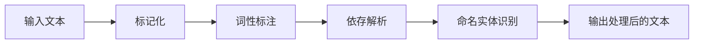

## 1.背景介绍
在自然语言处理（NLP）领域，spaCy是一个强大的开源库，它提供了一种简单且高效的方式来处理和理解大量的文本数据。自从2015年由Explosion AI公司发布以来，它已经成为许多研究者和开发者的首选工具。

## 2.核心概念与联系
spaCy库的核心在于其管道架构。在spaCy中，文本数据通过一个处理管道，每个步骤都对数据进行一定的处理，如标记化、词性标注、命名实体识别等。这种管道架构使得spaCy能够高效地处理大量数据。



## 3.核心算法原理具体操作步骤
在spaCy中，处理文本的核心步骤如下：

1. **标记化（Tokenization）**：将输入的文本分解成单独的词或标记。
2. **词性标注（Part-of-Speech Tagging）**：确定每个标记的词性，如名词、动词、形容词等。
3. **依存解析（Dependency Parsing）**：分析标记之间的语法关系。
4. **命名实体识别（Named Entity Recognition）**：识别文本中的特定实体，如人名、地点、日期等。

## 4.数学模型和公式详细讲解举例说明
spaCy使用了多种机器学习模型来实现其功能。例如，命名实体识别（NER）使用的是条件随机场（CRF）模型。CRF是一种统计模型，用于预测序列数据中的标签。CRF的目标函数可以表示为：

$$
L(\theta) = \sum_{i=1}^{n} \log P(y_i|x_i;\theta)
$$

其中，$x_i$是输入的特征，$y_i$是预测的标签，$\theta$是模型的参数。

## 5.项目实践：代码实例和详细解释说明
以下是一个使用spaCy进行命名实体识别的简单示例：

```python
import spacy

# 加载预训练模型
nlp = spacy.load('en_core_web_sm')

# 处理文本
doc = nlp("Apple is looking at buying U.K. startup for $1 billion")

# 打印识别的实体
for ent in doc.ents:
    print(ent.text, ent.label_)
```

在这个示例中，我们首先加载了一个预训练的模型`en_core_web_sm`。然后，我们使用这个模型处理一个英文句子。最后，我们打印出识别的实体及其标签。

## 6.实际应用场景
spaCy可以应用于多种NLP任务，包括但不限于：

- **信息提取**：从文本中提取有价值的信息，如命名实体、关键词等。
- **情感分析**：判断文本的情感倾向，如正面、负面或中性。
- **文本分类**：根据文本的内容将其分类到预定义的类别中。

## 7.工具和资源推荐
除了spaCy本身，还有一些其他的资源和工具可以帮助你更好地使用spaCy：

- **Prodigy**：一个由spaCy开发团队创建的注释工具，可以用于创建和管理训练数据。
- **displaCy**：一个可视化工具，可以用于显示spaCy的解析结果。
- **spaCy Universe**：一个包含了大量spaCy相关项目和资源的网站。

## 8.总结：未来发展趋势与