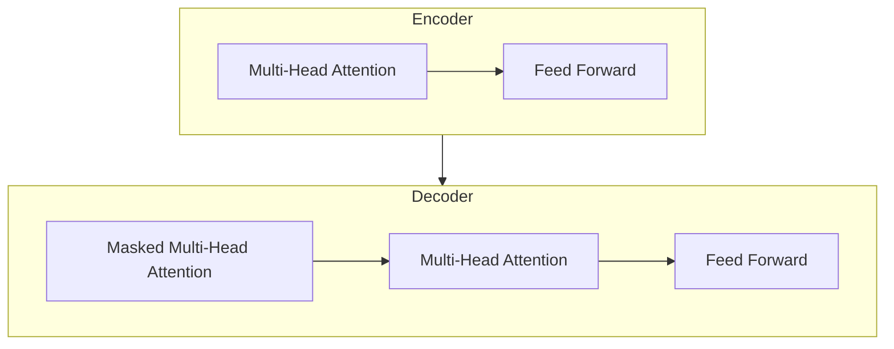

# transformer架构(Transformer Architecture)原理与代码实战案例讲解

## 1. 背景介绍

在自然语言处理(NLP)和序列数据建模领域,Transformer架构是一种革命性的技术突破。传统的序列模型如RNN(循环神经网络)和LSTM(长短期记忆网络)存在一些固有的局限性,例如难以并行化计算、对长期依赖关系建模能力较差等。为了解决这些问题,Transformer架构应运而生。

Transformer最初由Google的Vaswani等人在2017年提出,用于解决机器翻译任务。它完全摒弃了RNN和CNN(卷积神经网络)结构,利用Self-Attention机制来捕获输入序列中任意两个位置之间的依赖关系,从而更好地学习长期依赖特征。自从被提出以来,Transformer架构在NLP领域取得了巨大成功,并逐渐扩展到计算机视觉、语音识别等其他领域。

### 1.1 Transformer架构的革新之处

相较于传统的序列模型,Transformer架构具有以下几个关键的创新点:

1. **全新的Self-Attention机制**:Transformer完全抛弃了RNN和CNN结构,使用Self-Attention机制来捕获序列中任意两个位置之间的依赖关系,避免了RNN的路径遗忘和梯度消失问题。

2. **高度并行化**:由于没有序列操作,Transformer可以高度并行化,大大提高了训练速度。

3. **长期依赖建模能力强**:Self-Attention机制能够直接捕获任意距离的依赖关系,从而更好地学习长期依赖特征。

4. **编码器-解码器结构**:Transformer采用了编码器-解码器的架构,能够同时处理输入和输出序列,适用于序列到序列(Seq2Seq)的任务。

### 1.2 Transformer在NLP中的应用

Transformer架构在NLP领域取得了巨大成功,成为了主流的序列建模技术。一些典型的应用包括:

- **机器翻译**: Transformer最初就是为机器翻译任务而设计,并取得了超过RNN模型的性能。

- **文本生成**: Transformer可用于生成高质量的文本,如新闻摘要、对话系统等。

- **语言模型**: Transformer被广泛用于构建大型语言模型,如GPT、BERT等。

- **其他NLP任务**: 包括文本分类、命名实体识别、关系抽取等。

## 2. 核心概念与联系

为了理解Transformer架构的原理,我们需要先了解几个核心概念:Self-Attention、多头注意力机制、位置编码、编码器-解码器结构等。

### 2.1 Self-Attention机制

Self-Attention是Transformer架构的核心,它能够捕获输入序列中任意两个位置之间的依赖关系。与RNN不同,Self-Attention不需要按序列顺序计算,可以高度并行化,从而大大提高了计算效率。

Self-Attention的计算过程可以概括为:给定一个查询(Query)向量、键(Key)向量和值(Value)向量,通过计算查询和键之间的相似性得分,对值向量进行加权求和,得到注意力输出。具体计算公式如下:

$$Attention(Q, K, V) = softmax(\frac{QK^T}{\sqrt{d_k}})V$$

其中$Q$表示查询向量、$K$表示键向量、$V$表示值向量,$d_k$是键向量的维度,用于缩放点积结果。

Self-Attention的一个重要特性是,它允许任意位置之间的依赖关系建模,克服了RNN的局限性。

### 2.2 多头注意力机制

为了捕获不同子空间的依赖关系,Transformer引入了多头注意力机制(Multi-Head Attention)。多头注意力机制将查询、键和值向量线性投影到不同的子空间,分别计算注意力,然后将结果拼接起来。具体计算过程如下:

$$MultiHead(Q, K, V) = Concat(head_1, ..., head_h)W^O$$
$$where\ head_i = Attention(QW_i^Q, KW_i^K, VW_i^V)$$

其中$W_i^Q$、$W_i^K$、$W_i^V$分别表示第$i$个头的查询、键和值的线性投影矩阵,$W^O$是最终的线性变换矩阵。

多头注意力机制能够从不同的子空间捕获依赖关系,提高了模型的表达能力。

### 2.3 位置编码

由于Transformer完全抛弃了RNN和CNN结构,因此无法直接捕获序列的位置信息。为了解决这个问题,Transformer引入了位置编码(Positional Encoding)。

位置编码是一种将位置信息编码到向量中的方法,它将被加到输入的嵌入向量中,使得模型能够学习到序列的位置信息。常用的位置编码方法是正弦/余弦函数编码:

$$PE_{(pos, 2i)} = sin(pos / 10000^{2i/d_{model}})$$
$$PE_{(pos, 2i+1)} = cos(pos / 10000^{2i/d_{model}})$$

其中$pos$表示位置索引,$i$表示维度索引,$d_{model}$是模型的维度。

位置编码能够很好地捕获序列的位置信息,并且具有一些良好的数学性质,如相对位置关系保持不变等。

### 2.4 编码器-解码器结构

Transformer采用了编码器-解码器(Encoder-Decoder)的架构,能够同时处理输入和输出序列,适用于序列到序列(Seq2Seq)的任务,如机器翻译、文本摘要等。

- **编码器(Encoder)**:编码器由多个相同的层组成,每一层包含两个子层:Multi-Head Attention层和全连接前馈网络层。编码器的作用是将输入序列编码为一系列连续的向量表示。

- **解码器(Decoder)**:解码器也由多个相同的层组成,每一层包含三个子层:Masked Multi-Head Attention层、Multi-Head Attention层和全连接前馈网络层。Masked Multi-Head Attention层用于捕获当前位置之前的输出序列的依赖关系,Multi-Head Attention层则用于关注输入序列的表示。解码器的作用是根据编码器的输出和之前生成的输出序列,生成新的输出序列。

编码器-解码器结构使得Transformer能够灵活地处理不同类型的序列到序列任务,成为了NLP领域的主流模型架构。

## 3. 核心算法原理具体操作步骤

在了解了Transformer架构的核心概念之后,我们来详细介绍其核心算法的原理和具体操作步骤。

### 3.1 Self-Attention计算步骤

Self-Attention是Transformer架构的核心,它能够捕获输入序列中任意两个位置之间的依赖关系。Self-Attention的计算步骤如下:

1. **线性投影**:将输入序列$X$分别投影到查询($Q$)、键($K$)和值($V$)空间,得到$Q$、$K$和$V$矩阵。

   $$Q = XW^Q$$
   $$K = XW^K$$
   $$V = XW^V$$

   其中$W^Q$、$W^K$、$W^V$分别表示查询、键和值的线性投影矩阵。

2. **计算注意力分数**:计算查询($Q$)和键($K$)之间的点积,得到注意力分数矩阵$S$。为了避免较大的点积值导致软最大值饱和,通常会对点积结果进行缩放。

   $$S = \frac{QK^T}{\sqrt{d_k}}$$

   其中$d_k$是键向量的维度。

3. **计算注意力权重**:对注意力分数矩阵$S$进行软最大值操作,得到注意力权重矩阵$A$。

   $$A = softmax(S)$$

4. **计算注意力输出**:将注意力权重矩阵$A$与值矩阵$V$相乘,得到注意力输出矩阵$O$。

   $$O = AV$$

Self-Attention的计算过程可以用下面的公式总结:

$$Attention(Q, K, V) = softmax(\frac{QK^T}{\sqrt{d_k}})V$$

Self-Attention机制能够直接捕获任意距离的依赖关系,从而更好地学习长期依赖特征,这是Transformer架构的一个关键优势。

### 3.2 多头注意力机制计算步骤

为了捕获不同子空间的依赖关系,Transformer引入了多头注意力机制(Multi-Head Attention)。多头注意力机制的计算步骤如下:

1. **线性投影**:将查询($Q$)、键($K$)和值($V$)分别投影到$h$个不同的子空间,得到$Q_i$、$K_i$和$V_i$矩阵。

   $$Q_i = QW_i^Q$$
   $$K_i = KW_i^K$$
   $$V_i = VW_i^V$$

   其中$W_i^Q$、$W_i^K$、$W_i^V$分别表示第$i$个头的查询、键和值的线性投影矩阵,$i=1,2,...,h$。

2. **计算注意力输出**:对每个子空间,分别计算Self-Attention输出$O_i$。

   $$O_i = Attention(Q_i, K_i, V_i)$$

3. **拼接注意力输出**:将所有子空间的注意力输出$O_i$拼接起来,得到多头注意力输出矩阵$O$。

   $$O = Concat(O_1, O_2, ..., O_h)$$

4. **线性变换**:对拼接后的注意力输出矩阵$O$进行线性变换,得到最终的多头注意力输出$MultiHead(Q, K, V)$。

   $$MultiHead(Q, K, V) = Concat(O_1, O_2, ..., O_h)W^O$$

   其中$W^O$是最终的线性变换矩阵。

多头注意力机制能够从不同的子空间捕获依赖关系,提高了模型的表达能力,成为了Transformer架构中的一个重要组成部分。

### 3.3 编码器层计算步骤

Transformer的编码器由多个相同的层组成,每一层包含两个子层:Multi-Head Attention层和全连接前馈网络层。编码器层的计算步骤如下:

1. **Multi-Head Attention子层**:对输入序列$X$进行Multi-Head Attention计算,得到注意力输出$O_1$。

   $$O_1 = MultiHead(X, X, X)$$

2. **残差连接和层归一化**:将注意力输出$O_1$与输入$X$进行残差连接,然后进行层归一化操作,得到归一化输出$N_1$。

   $$N_1 = LayerNorm(X + O_1)$$

3. **全连接前馈网络子层**:将归一化输出$N_1$输入到全连接前馈网络中,得到前馈网络输出$O_2$。

   $$O_2 = FFN(N_1)$$

4. **残差连接和层归一化**:将前馈网络输出$O_2$与归一化输出$N_1$进行残差连接,然后进行层归一化操作,得到该层的最终输出$N_2$。

   $$N_2 = LayerNorm(N_1 + O_2)$$

编码器层的输出$N_2$将作为下一层的输入,或者在最后一层时作为编码器的最终输出,传递给解码器。

### 3.4 解码器层计算步骤

Transformer的解码器也由多个相同的层组成,每一层包含三个子层:Masked Multi-Head Attention层、Multi-Head Attention层和全连接前馈网络层。解码器层的计算步骤如下:

1. **Masked Multi-Head Attention子层**:对输入序列$Y$进行Masked Multi-Head Attention计算,得到注意力输出$O_1$。Masked Multi-Head Attention是一种特殊的Multi-Head Attention,它只关注当前位置之前的输出序列,避免了未来信息的泄露。

   $$O_1 = MultiHead(Y, Y, Y, mask)$$

2. **残差连接和层归一化**:将注意力输出$O_1$与输入$Y$进行残差连接,然后进行层归一化操作,得到归