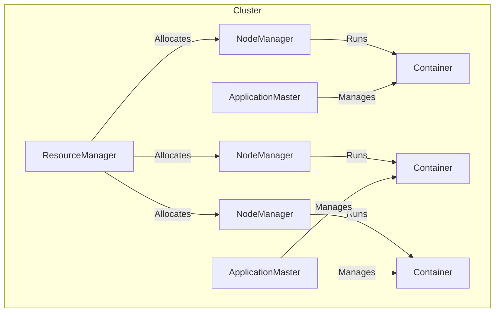
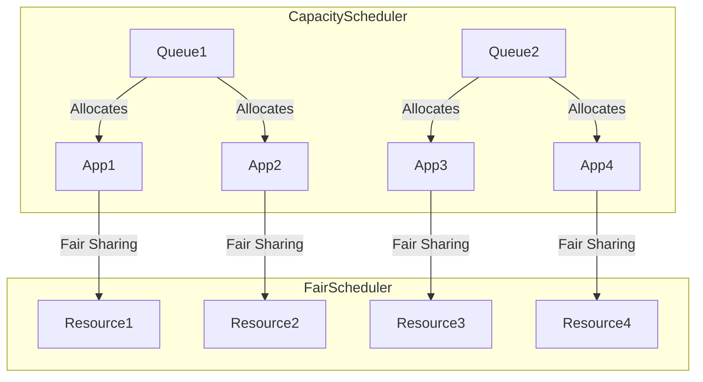

# 【AI大数据计算原理与代码实例讲解】Yarn

## 1.背景介绍

### 1.1 大数据时代的到来

随着互联网、物联网和云计算的快速发展,海量的数据像滚滚洪流一般涌现,传统的数据处理方式已经无法满足当前大数据时代的需求。大数据时代的到来,对数据存储、计算和处理提出了更高的要求,需要一种全新的大数据计算架构来应对这一挑战。

### 1.2 大数据计算的挑战

大数据计算面临着诸多挑战,包括:

- 海量数据存储和管理
- 数据处理的高并发和高吞吐
- 容错性和可扩展性
- 数据局部性计算

传统的计算架构很难满足上述要求,因此迫切需要一种全新的大数据计算架构。

### 1.3 Hadoop生态系统

为了应对大数据计算的挑战,Apache Hadoop生态系统应运而生。Hadoop生态系统提供了一整套大数据计算解决方案,包括分布式文件系统HDFS、资源协调调度框架YARN、分布式计算框架MapReduce等多个核心组件。其中,YARN作为Hadoop的资源管理和调度框架,扮演着至关重要的角色。

## 2.核心概念与联系

### 2.1 YARN架构

YARN的核心架构由ResourceManager(RM)、NodeManager(NM)、ApplicationMaster(AM)和Container四个核心组件组成。



- **ResourceManager**: 整个集群的资源管理和调度核心,负责监控NodeManager并根据应用程序的资源需求进行资源分配调度。
- **NodeManager**: 运行在每个节点上的资源和任务监控管理器,负责单节点的资源管理和使用,并定期向ResourceManager发送心跳和资源使用报告。
- **ApplicationMaster**: 每个应用程序对应一个AM,负责向RM申请资源,并与NM协同启动和监控任务。
- **Container**: 资源抽象的逻辑集合,由内存、CPU等多维资源构成,是YARN中最小的调度单位。

### 2.2 工作流程

YARN的工作流程可以概括为以下几个步骤:

1. 客户端向RM提交应用程序
2. RM为该应用程序分配第一个Container,并启动AM
3. AM向RM申请需要的资源容器
4. RM分配资源容器给AM
5. AM在分配的容器中启动任务
6. NM周期性地向RM发送心跳和资源使用报告
7. 应用程序运行完成后,AM向RM注销并释放资源

该流程实现了YARN的核心设计理念:将资源管理和任务监控解耦,提高系统伸缩性、利用率和可用性。

## 3.核心算法原理具体操作步骤

### 3.1 资源模型

YARN采用了资源模型,将集群资源视为多个资源维度的集合,如CPU、内存等。每个Container都是一组资源量的组合。

$$
Container = \{CPU, Memory, Disk, ....\}
$$

资源模型的优势在于可以根据不同应用的资源需求进行精细化调度,提高集群资源利用率。

### 3.2 资源调度

YARN的资源调度分为两个阶段:

1. **容量调度器(Capacity Scheduler)**: 基于容量的多队列调度,根据预先配置的队列容量比例,为每个队列分配可用资源。
2. **公平调度器(Fair Scheduler)**: 在队列内部,根据应用程序的资源需求,公平地分配资源。

调度器的工作原理如下:



1. 容量调度器根据预设的队列容量比例,为每个队列分配可用资源
2. 在队列内部,公平调度器根据应用的资源需求,公平地分配队列资源

该两级调度机制确保了集群资源的高效利用和公平分配。

### 3.3 容错与恢复

为了提高系统的容错性和可用性,YARN采用了多种容错与恢复机制:

1. **RM的高可用性(HA)**:通过配置多个RM实例,实现RM的热备份,防止单点故障。
2. **AM的容错恢复**:如果AM失败,RM会根据AM的请求重新启动AM,并为其分配资源。
3. **NM的容错恢复**:如果NM失败,RM会将其管理的Container转移到其他节点。
4. **工作重试**:如果某个任务失败,AM可以重新调度该任务,直到成功完成。

通过上述机制,YARN可以在节点或应用程序失败时自动恢复,提高了整个系统的可靠性。

## 4.数学模型和公式详细讲解举例说明

### 4.1 资源公平性模型

为了实现资源的公平分配,YARN采用了一种基于资源公平性的调度模型。该模型的核心思想是最大化整个集群的资源利用率,同时确保每个应用程序获得公平的资源份额。

令$N$为集群中节点数量,$R_i$为第$i$个节点的可用资源量,则集群总的可用资源为:

$$
R_{total} = \sum_{i=1}^{N}R_i
$$

假设有$M$个应用程序在运行,每个应用程序的资源需求为$D_j(1 \leq j \leq M)$,则理想情况下,每个应用程序应获得的资源份额为:

$$
S_{ideal} = \frac{R_{total}}{M}
$$

为了衡量资源分配的公平性,我们定义一个度量标准$F$:

$$
F = \sum_{j=1}^{M}\left(\frac{S_{actual}^j - S_{ideal}}{S_{ideal}}\right)^2
$$

其中$S_{actual}^j$为第$j$个应用程序实际获得的资源份额。$F$值越小,表示资源分配越公平。

YARN的公平调度器就是在尽量minimizeF的前提下,为每个应用程序分配资源。

### 4.2 局部性原理

为了提高数据计算的效率,YARN遵循数据局部性原理,尽量将计算任务调度到存储数据的节点上,减少数据传输开销。

我们定义一个代价函数$C$,表示将任务调度到远程节点的代价:

$$
C = \alpha * N_{remote} + \beta * D_{transfer}
$$

其中$N_{remote}$为远程节点的数量,$D_{transfer}$为需要传输的数据量,$\alpha$和$\beta$为相应的权重系数。

YARN的调度器会尽量minimizeC,优先将任务调度到本地节点,如果本地节点资源不足,则选择离数据最近的节点。

通过遵循局部性原理,YARN可以显著提高数据密集型应用的计算效率。

## 5.项目实践:代码实例和详细解释说明

### 5.1 提交YARN作业

以下是一个使用Python提交YARN作业的示例:

```python
from yarn_api_client import ResourceManager, ApplicationMaster

# 连接ResourceManager
rm = ResourceManager(rm_host, rm_port)

# 创建应用程序
app = rm.create_application()

# 设置应用程序参数
app.name = "MyApp"
app.queue = "default"
app.am_resources = {"memory": 1024, "vcores": 2}

# 启动ApplicationMaster
am = ApplicationMaster(app)
am.run()

# 等待作业完成
app.wait_completed()

# 打印作业状态和结果
print(f"Job State: {app.state}")
print(f"Job Result: {app.result}")
```

1. 首先,我们连接到YARN的ResourceManager。
2. 创建一个新的应用程序对象,设置应用程序名称、队列和AM所需的资源。
3. 启动ApplicationMaster,并等待作业完成。
4. 最后,打印作业的状态和结果。

### 5.2 实现自定义ApplicationMaster

下面是一个自定义ApplicationMaster的示例,用于运行WordCount作业:

```python
from yarn_api_client import ApplicationMaster

class WordCountAM(ApplicationMaster):
    def run(self):
        # 向RM申请容器资源
        containers = self.request_containers(2, memory=1024, vcores=1)
        
        # 在容器中启动WordCount任务
        for container in containers:
            cmd = "/usr/bin/wordcount -input /data/input -output /data/output"
            container.run(cmd)
        
        # 监控任务状态
        while not self.all_containers_completed():
            completed = self.get_completed_containers()
            for container in completed:
                if container.exit_status != 0:
                    print(f"Container {container.id} failed!")
                else:
                    print(f"Container {container.id} succeeded!")
        
        # 作业完成
        self.finish_success()

if __name__ == "__main__":
    am = WordCountAM()
    am.run()
```

1. 我们定义了一个WordCountAM类,继承自ApplicationMaster。
2. 在run()方法中,我们首先向RM申请两个容器资源。
3. 然后在每个容器中启动WordCount任务。
4. 监控容器的运行状态,直到所有任务完成。
5. 如果所有任务成功,调用finish_success()方法通知RM作业完成。

通过自定义ApplicationMaster,我们可以实现各种复杂的大数据计算作业。

## 6.实际应用场景

YARN作为Hadoop生态系统中的资源管理和调度框架,在众多大数据应用场景中发挥着重要作用:

1. **大数据分析**:YARN可以高效地调度和运行各种大数据分析工作负载,如Spark、Hive和Pig等。
2. **机器学习**:YARN为分布式机器学习框架(如TensorFlow on YARN)提供了资源管理和调度支持。
3. **流式计算**:实时流计算框架如Spark Streaming和Flink等,都可以在YARN上高效运行。
4. **数据湖**:YARN为构建数据湖提供了计算资源管理和调度能力。
5. **物联网(IoT)**:YARN可以支持IoT设备数据的实时处理和分析。

总的来说,YARN为大数据生态系统提供了一个统一的资源管理和调度平台,使得各种大数据应用能够高效、可靠地运行。

## 7.工具和资源推荐

以下是一些与YARN相关的有用工具和资源:

1. **Apache Hadoop**:YARN是Hadoop生态系统的核心组件,官方网站提供了丰富的文档和资源。
2. **YARN UI**:YARN自带的Web UI,可以方便地监控集群资源使用情况和作业运行状态。
3. **Apache Slider**:一个在YARN上运行长期服务的框架,可以方便地部署和管理各种大数据应用。
4. **Apache Twill**:一个用于构建和部署YARN应用程序的抽象层,简化了应用程序开发。
5. **YARN.Rocks**:一个YARN资源管理和监控工具,提供了丰富的可视化功能。
6. **YARN Books**:如《Apache Hadoop YARN: Concepts, Design, and Applications》等书籍,深入探讨了YARN的架构和原理。
7. **YARN社区**:包括YARN邮件列表、Stack Overflow等,可以与其他开发者交流讨论。

利用这些工具和资源,可以更好地理解和使用YARN,提高大数据应用的开发和运维效率。

## 8.总结:未来发展趋势与挑战

YARN作为大数据计算的资源管理和调度框架,在未来仍将面临一些发展趋势和挑战:

1. **多租户和多工作负载支持**:随着企业对大数据应用的需求不断增长