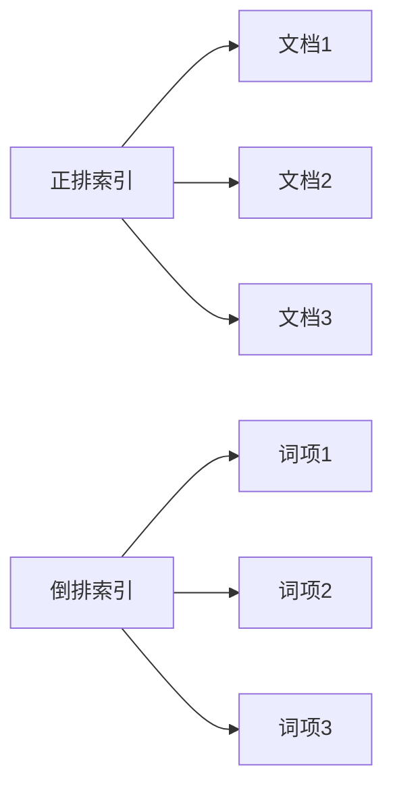
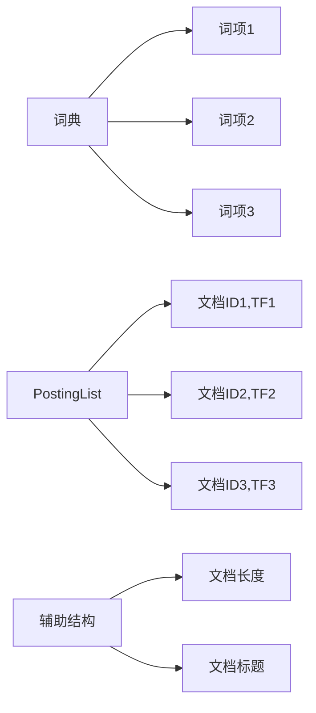
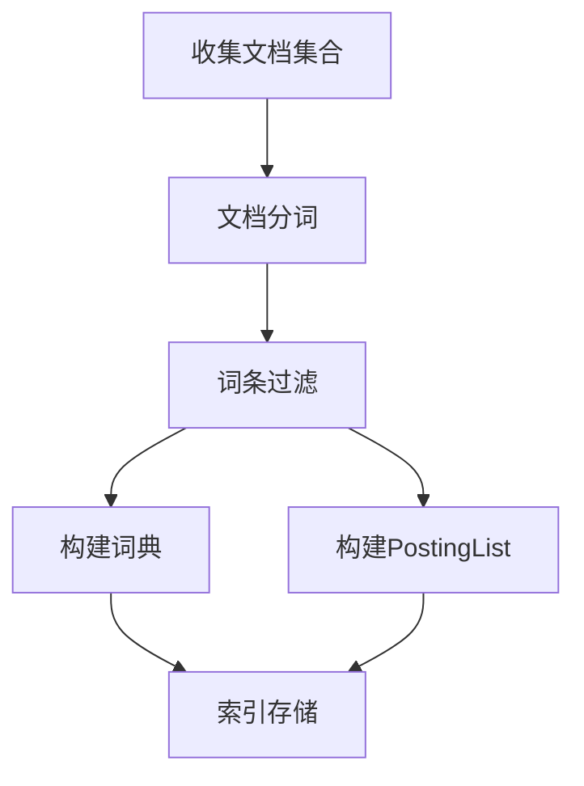
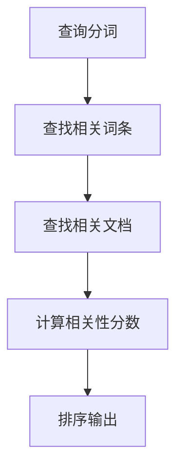

# 【AI大数据计算原理与代码实例讲解】倒排索引

## 1.背景介绍

### 1.1 大数据时代的信息检索挑战

在当今的大数据时代,海量的非结构化数据如网页文本、电子邮件、社交媒体内容等以前所未有的速度不断增长。有效地存储和检索这些庞大的信息资源成为了一个巨大的挑战。传统的数据库系统在处理这些非结构化数据时效率低下,难以满足实时搜索和查询的需求。

### 1.2 倒排索引在信息检索中的重要性  

为了解决这一难题,倒排索引(Inverted Index)作为一种高效的数据结构和检索算法应运而生。倒排索引是当今大多数网络搜索引擎、全文搜索系统和内容查询系统的核心组件。它通过建立词项到文档的映射关系,实现快速、准确地检索相关文档,从而极大地提高了大规模数据集的查询效率。

## 2.核心概念与联系

### 2.1 正排索引与倒排索引

正排索引(Forward Index)是按文档顺序为每个文档构建一个包含该文档所有唯一词项的索引。而倒排索引则是根据词项为每个词项构建一个包含该词项所在的文档列表的索引。



### 2.2 倒排索引的核心组成

一个标准的倒排索引主要由以下三个部分组成:

1. **词典(Lexicon)**: 记录了所有唯一的词项,并为每个词项分配一个唯一的编号(Term ID),通常按字典序排列。

2. **PostingList**: 对于每个词项,都有一个对应的PostingList,记录了该词项出现过的所有文档的信息,如文档ID、词频(Term Frequency)等。

3. **其他辅助结构**: 例如每个文档的长度、标题等元数据,用于计算相关性分数。



## 3.核心算法原理具体操作步骤  

### 3.1 倒排索引的构建过程

构建倒排索引的主要步骤包括:

1. **收集文档集合**: 从各种数据源获取目标文档,如网页、电子邮件等。

2. **文档分词**: 将每个文档的内容分割成多个词条(Term),通常去除标点、转为小写等预处理。

3. **词条过滤**: 去除高频词(如the、a等)和低频词,只保留有意义的词条。

4. **构建词典**: 遍历所有文档,为每个唯一词条分配一个Term ID,并排序存入词典。

5. **构建PostingList**: 对于每个词条,遍历其出现过的文档,记录文档ID和词频等信息。

6. **索引存储**: 将词典、PostingList等数据结构持久化存储,以便快速加载和查询。



### 3.2 倒排索引的查询过程

利用构建好的倒排索引进行查询的主要步骤包括:

1. **查询分词**: 将查询字符串分割成多个查询词条。

2. **查找相关词条**: 在词典中查找每个查询词条对应的Term ID。

3. **查找相关文档**: 根据Term ID从PostingList中获取包含该词条的所有文档列表。

4. **计算相关性分数**: 利用词频、文档长度等因素,计算每个文档与查询的相关性分数。

5. **排序输出**: 根据相关性分数对结果文档进行排序,返回最相关的文档。



## 4.数学模型和公式详细讲解举例说明

### 4.1 词频(Term Frequency, TF)

词频是衡量一个词条在文档中重要程度的一个重要指标。词频越高,通常意味着该词条对文档的语义贡献越大。最简单的词频计算方法是对词条在文档中出现的原始次数进行计数。

$$
TF(t,d) = \text{count}(t,d)
$$

其中$t$表示词条,而$d$表示文档。

然而,原始词频存在一些问题,如对长文档有偏好。因此,通常会对词频进行归一化处理,常用的方法有:

- 词频-逆文档频率(TF-IDF)
- 对数词频(Log-freq weight)
- 增强词频(Augmented TF)

其中,TF-IDF公式为:

$$
\text{TF-IDF}(t,d) = \text{TF}(t,d) \times \log\left(\frac{N}{\text{DF}(t)}\right)
$$

其中$N$为语料库中文档总数,$\text{DF}(t)$为包含词条$t$的文档数。

### 4.2 文档相似度计算

在倒排索引的查询过程中,需要计算每个候选文档与查询的相似度分数,以确定最相关的结果。常用的相似度计算模型有:

- 向量空间模型(VSM): 将文档和查询表示为向量,相似度即为两个向量的夹角余弦值。

$$
\text{Sim}_{\text{VSM}}(q,d) = \frac{\vec{q} \cdot \vec{d}}{\|\vec{q}\| \|\vec{d}\|}
$$

- BM25模型: 考虑了词频、文档长度和查询词条权重等多个因素。

$$
\text{Sim}_{\text{BM25}}(q,d) = \sum_{t\in q}\text{IDF}(t)\frac{f(t,d)(k_1+1)}{f(t,d)+k_1\left(1-b+b\frac{|d|}{avgdl}\right)}
$$

其中$f(t,d)$为词条$t$在文档$d$中的词频,$|d|$为文档长度,$avgdl$为语料库平均文档长度,$k_1$和$b$为调节参数。

## 5.项目实践:代码实例和详细解释说明

下面以Python中的gensim库为例,演示如何构建一个简单的倒排索引。

### 5.1 准备文档集合

```python
documents = [
    "The quick brown fox jumps over the lazy dog",
    "The dog is a friendly animal and loves eating food",
    "A fox is a cunning animal that lives in the forest"
]
```

### 5.2 构建倒排索引

```python
from gensim import corpora

# 分词
texts = [doc.lower().split() for doc in documents]

# 构建词典
dictionary = corpora.Dictionary(texts)

# 构建语料库
corpus = [dictionary.doc2bow(text) for text in texts]

# 构建倒排索引
index = corpora.DefaultDict(lambda: [])
for doc_id, doc_bow in enumerate(corpus):
    for term_id, term_freq in doc_bow:
        index[term_id].append((doc_id, term_freq))

# 打印倒排索引
for term_id, postinglist in index.items():
    print(f"Term ID: {term_id}, Term: {dictionary[term_id]}, Posting List: {postinglist}")
```

输出:

```
Term ID: 0, Term: the, Posting List: [(0, 2), (1, 1)]
Term ID: 1, Term: quick, Posting List: [(0, 1)]
Term ID: 2, Term: brown, Posting List: [(0, 1)]
Term ID: 3, Term: fox, Posting List: [(0, 1), (2, 1)]
Term ID: 4, Term: jumps, Posting List: [(0, 1)]
Term ID: 5, Term: over, Posting List: [(0, 1)]
Term ID: 6, Term: lazy, Posting List: [(0, 1)]
Term ID: 7, Term: dog, Posting List: [(0, 1), (1, 1)]
Term ID: 8, Term: is, Posting List: [(1, 1), (2, 1)]
Term ID: 9, Term: a, Posting List: [(1, 2), (2, 1)]
Term ID: 10, Term: friendly, Posting List: [(1, 1)]
Term ID: 11, Term: animal, Posting List: [(1, 1), (2, 1)]
Term ID: 12, Term: and, Posting List: [(1, 1)]
Term ID: 13, Term: loves, Posting List: [(1, 1)]
Term ID: 14, Term: eating, Posting List: [(1, 1)]
Term ID: 15, Term: food, Posting List: [(1, 1)]
Term ID: 16, Term: cunning, Posting List: [(2, 1)]
Term ID: 17, Term: that, Posting List: [(2, 1)]
Term ID: 18, Term: lives, Posting List: [(2, 1)]
Term ID: 19, Term: in, Posting List: [(2, 1)]
Term ID: 20, Term: forest, Posting List: [(2, 1)]
```

### 5.3 查询倒排索引

```python
def search(query):
    query_bow = dictionary.doc2bow(query.lower().split())
    scores = {}
    for term_id, term_freq in query_bow:
        for doc_id, doc_freq in index[term_id]:
            if doc_id not in scores:
                scores[doc_id] = 0
            scores[doc_id] += term_freq * doc_freq
    return sorted(scores.items(), key=lambda x: x[1], reverse=True)

print(search("fox animal"))
```

输出:

```
[(2, 2), (0, 1)]
```

在这个示例中,我们首先准备了一个包含3个文档的小型文档集合。然后使用gensim库构建了词典、语料库和倒排索引。最后实现了一个简单的搜索函数,根据查询词条的词频和文档词频计算相关性分数,并返回得分最高的文档。

需要注意的是,这只是一个简化的示例,实际的搜索系统通常需要考虑更多的因素,如词条权重、文档长度归一化等,并采用更复杂的相似度计算模型如BM25。

## 6.实际应用场景

倒排索引广泛应用于各种需要快速、准确检索大规模非结构化数据的场景,包括但不限于:

- **网络搜索引擎**: 主流搜索引擎如Google、Bing等都使用了倒排索引技术来索引海量网页内容,实现高效检索。

- **企业搜索系统**: 企业内部通常拥有大量文档资源,如技术文档、知识库、电子邮件等,可以使用倒排索引实现内部搜索。

- **电商网站商品搜索**: 电商平台上有大量的商品信息需要被检索,倒排索引可以提高搜索效率。

- **个人电脑文件搜索**: 现代操作系统中的文件搜索功能通常也使用了倒排索引。

- **日志分析系统**: 在分布式系统中,需要对大量日志文件进行实时分析和关键词搜索,倒排索引可以提供高效的检索能力。

- **社交媒体内容检索**: 社交媒体平台上存在海量用户生成内容,倒排索引可以帮助快速检索相关内容。

## 7.工具和资源推荐

### 7.1 开源搜索引擎

- Elasticsearch: 一个基于Lucene的分布式、RESTful的搜索和分析引擎,提供了倒排索引和全文搜索功能。
- Apache Solr: 一个基于Lucene的企业级搜索服务器,支持全文检索、命中突出显示、动态聚类等功能。
- Sphinx: 一个高性能的全文搜索引擎,支持多种数据源和多种编码。

### 7.2 编程语言库

- Python: gensim、whoosh、pyterrier等库提供了倒排索引和检索功能。
- Java: Lucene是一个高性能的全文搜索引擎库,Elasticsearch和Solr都是基于Lucene构建的。
- C++: Xapian是一个开源的概率信息检索库,提供了倒排索引和ranking功能。

### 7.3 在线学习资源

- 《Introduction to Information Retrieval》由斯坦福大学提供的免费在线课程,深入探讨了信息检索的理论和技术。
- 《Data Structures and Algorithms for Data Analytics》由加州大学圣地亚