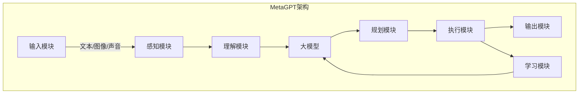

# 【大模型应用开发 动手做AI Agent】MetaGPT

## 1. 背景介绍

### 1.1 人工智能的崛起

近年来,人工智能(AI)技术取得了长足的进步,尤其是在自然语言处理(NLP)和计算机视觉(CV)等领域。这主要归功于深度学习算法和大规模数据集的结合,以及算力硬件的飞速发展。大型神经网络模型(如GPT、BERT、ViT等)展现出了令人惊叹的能力,可以在各种任务上达到人类水平甚至超越人类。

### 1.2 大模型的兴起

随着模型规模和训练数据量的不断扩大,所谓"大模型"(Large Language Model,LLM)应运而生。这些庞大的语言模型通过自监督学习方式在海量文本数据上进行预训练,获得了广博的知识和强大的理解、推理、生成能力。典型代表有GPT-3、PaLM、ChatGPT等,它们可以在多个领域内表现出惊人的泛化性能。

### 1.3 MetaGPT: 大模型应用开发新范式

MetaGPT是一种新兴的大模型应用开发范式,旨在充分利用大模型的强大能力,构建通用的人工智能代理(AI Agent)。这种AI Agent不仅能够回答问题、执行任务,更能够主动学习、思考、规划和自我驱动,展现出近似人类般的智能行为。MetaGPT为开发人员提供了一种全新的编程模式,使得构建智能系统变得前所未有的高效和简单。

## 2. 核心概念与联系

### 2.1 大模型

大模型指的是规模庞大(参数量通常超过10亿)、在海量数据上训练的深度神经网络模型。它们通过自监督学习方式获取了广博的知识,并具备强大的理解、推理、生成等能力。常见的大模型包括:

- GPT-3: 开创性的大型语言模型,参数高达1750亿。
- PaLM: 由Google开发的大规模多模态模型,集成了视觉、语言等多种能力。
- ChatGPT: 由OpenAI开发的对话式大模型,在多个领域表现出色。

大模型的优势在于泛化能力强、知识面广、可迁移到多个下游任务。但也存在参数量巨大、推理缓慢、数据隐私等挑战。

### 2.2 AI Agent

AI Agent指的是具备一定智能的软件代理,能够感知环境、学习知识、规划行动并执行任务。在MetaGPT范式下,AI Agent是建立在大模型之上的,它利用大模型的强大能力来驱动自身的决策和行为。

一个典型的AI Agent包括以下几个核心组件:

- 感知模块: 负责获取环境信息,如文本、图像、声音等输入。
- 理解模块: 基于大模型对输入信息进行理解和表示。
- 规划模块: 根据目标和已有知识,制定行动计划。
- 执行模块: 将规划的行动具体执行,可能涉及对外输出或环境交互。
- 学习模块: 从执行的反馈中积累经验,不断优化自身能力。

### 2.3 MetaGPT架构

MetaGPT提出了一种新颖的架构,将大模型作为AI Agent的"大脑",并在其周围构建其他必要的模块,形成一个完整的智能系统。其核心思想是:

1. 充分利用大模型的泛化能力,将其作为知识库和推理引擎。
2. 通过规划模块赋予大模型自主性,使其能够制定行动计划。
3. 引入执行模块,使大模型的输出能够对外部环境产生影响。
4. 添加学习模块,使系统能够从经验中持续进步。

MetaGPT架构使得开发人员可以更高效地构建智能系统,将大模型的强大能力与任务需求相结合。



## 3. 核心算法原理具体操作步骤

### 3.1 大模型预训练

大模型的核心是通过自监督学习方式在海量数据上进行预训练,获得广博的知识和强大的语义理解能力。常见的预训练目标包括:

- 掩码语言模型(Masked Language Modeling,MLM):模型需要预测被掩码的词。
- 下一句预测(Next Sentence Prediction,NSP):判断两个句子是否为连续句子。
- 因果语言模型(Causal Language Modeling,CLM):给定前文,预测下一个词。

以GPT-3为例,它采用了基于Transformer的因果语言模型,在约5000亿词的文本语料上进行预训练。预训练过程包括以下步骤:

1. **数据预处理**:对原始文本进行标记化、过滤、采样等预处理。
2. **模型初始化**:初始化Transformer编码器的参数。
3. **前向传播**:给定前文,计算下一个词的概率分布。
4. **损失计算**:将预测概率与真实标签计算交叉熵损失。
5. **反向传播**:根据损失对模型参数进行梯度更新。
6. **模型保存**:定期保存模型权重,用于后续微调或推理。

经过大规模的预训练后,GPT-3学习到了丰富的语义知识,可以应用于多种下游任务。

### 3.2 微调与推理

虽然大模型在预训练阶段已经获得了广博的知识,但通常还需要针对特定任务进行微调(Fine-tuning),以进一步提高性能。微调的过程类似于预训练,只是数据集更小、训练轮数更少。

以GPT-3为例,对于文本分类任务,微调步骤如下:

1. **准备数据**:构建文本分类数据集,包括输入文本和标签。
2. **数据预处理**:将文本转换为模型可接受的格式,如词元序列。
3. **微调设置**:选择合适的学习率、批量大小等超参数。
4. **模型加载**:加载预训练好的GPT-3模型权重。
5. **前向传播**:将输入文本输入模型,获得分类概率分布。
6. **损失计算**:将预测概率与真实标签计算交叉熵损失。
7. **反向传播**:根据损失对模型可训练参数进行梯度更新。
8. **模型评估**:在验证集上评估模型性能,决定是否继续训练。
9. **模型保存**:保存微调后的模型权重,用于后续推理。

对于推理(Inference)阶段,只需将输入数据输入到微调后的模型,获取模型的输出即可。对于生成类任务,可以使用Beam Search、Top-K/Top-P采样等策略来生成高质量的输出序列。

### 3.3 多模态融合

除了处理文本数据,大模型还可以扩展到多模态领域,同时处理图像、视频、音频等不同模态的数据。这种多模态融合能力使得AI Agent可以更好地理解复杂的环境信息。

以ViT(Vision Transformer)为例,它将图像分割为若干小块(Patch),将每个Patch线性映射为一个向量,作为Transformer的输入。通过自注意力机制,ViT可以学习到图像中不同区域之间的长程依赖关系。

为了融合视觉和语言信息,一种常见方法是双流模型(Two-Stream Model):

1. **视觉流**:将图像输入ViT,获得视觉特征表示。
2. **语言流**:将文本输入Transformer语言模型,获得语义特征表示。
3. **跨模态融合**:将两种特征通过注意力机制或外积运算进行融合。
4. **下游任务头**:根据任务类型(如分类、检测等),添加相应的输出头。

通过端到端的多任务学习,模型可以同时学习视觉、语言的表示,并捕捉两者之间的相关性,从而更好地完成视觉问答、图像描述等多模态任务。

## 4. 数学模型和公式详细讲解举例说明

### 4.1 Transformer模型

Transformer是构建大模型的核心模块,它基于自注意力(Self-Attention)机制,能够有效捕捉长程依赖关系。Transformer的核心计算过程可以用以下公式表示:

输入表示:
$$\boldsymbol{X} = [\boldsymbol{x}_1, \boldsymbol{x}_2, \dots, \boldsymbol{x}_n]$$

其中,$\boldsymbol{x}_i \in \mathbb{R}^{d_\text{model}}$表示第$i$个输入的$d_\text{model}$维向量表示。

查询(Query)、键(Key)、值(Value)投影:

$$
\begin{aligned}
\boldsymbol{Q} &= \boldsymbol{X}\boldsymbol{W}^Q \\
\boldsymbol{K} &= \boldsymbol{X}\boldsymbol{W}^K \\
\boldsymbol{V} &= \boldsymbol{X}\boldsymbol{W}^V
\end{aligned}
$$

其中,$\boldsymbol{W}^Q, \boldsymbol{W}^K, \boldsymbol{W}^V \in \mathbb{R}^{d_\text{model} \times d_k}$分别为查询、键、值的投影矩阵。

计算注意力分数:

$$\text{Attention}(\boldsymbol{Q}, \boldsymbol{K}, \boldsymbol{V}) = \text{softmax}\left(\frac{\boldsymbol{Q}\boldsymbol{K}^\top}{\sqrt{d_k}}\right)\boldsymbol{V}$$

其中,$\frac{1}{\sqrt{d_k}}$是用于缩放的因子,以防止内积值过大导致softmax饱和。

多头注意力(Multi-Head Attention)机制通过线性投影将查询、键、值分别投影到$h$个不同的子空间,对每个子空间分别计算注意力,最后将所有注意力头的结果拼接:

$$\text{MultiHead}(\boldsymbol{Q}, \boldsymbol{K}, \boldsymbol{V}) = \text{Concat}(\text{head}_1, \dots, \text{head}_h)\boldsymbol{W}^O$$
$$\text{where, head}_i = \text{Attention}(\boldsymbol{Q}\boldsymbol{W}_i^Q, \boldsymbol{K}\boldsymbol{W}_i^K, \boldsymbol{V}\boldsymbol{W}_i^V)$$

其中,$\boldsymbol{W}_i^Q, \boldsymbol{W}_i^K, \boldsymbol{W}_i^V$分别为第$i$个注意力头的投影矩阵,$\boldsymbol{W}^O$为最终的线性变换矩阵。

通过层归一化(Layer Normalization)和残差连接(Residual Connection),Transformer可以构建深层的编码器和解码器网络,用于序列到序列的建模任务。

### 4.2 BERT模型

BERT(Bidirectional Encoder Representations from Transformers)是一种基于Transformer的双向编码器模型,它通过掩码语言模型(MLM)和下一句预测(NSP)任务进行预训练,学习到了双向的上下文表示。

BERT的核心思想是使用特殊的[MASK]标记来随机遮挡部分输入词元,并让模型基于上下文预测被遮挡的词元。具体来说,给定一个输入序列$\boldsymbol{X} = [x_1, x_2, \dots, x_n]$,BERT首先构造出如下形式的训练样本:

$$[\text{CLS}] \, x_1 \, \text{[MASK]} \, x_3 \, \dots \, x_n \, [\text{SEP}]$$

其中,[CLS]和[SEP]分别表示序列的开始和结束标记。

对于MLM任务,BERT需要最大化被掩码词元的条件概率:

$$\mathcal{L}_\text{MLM} = -\log P(x_\text{masked} | \boldsymbol{X})$$

对于NSP任务,BERT需要判断两个句子是否为连续句子,通过最大化如下条件概率:

$$\mathcal{L}_\text{NSP} = -\log P(\text{IsNext} | \boldsymbol{X}_1, \boldsymbol{X}_2)$$

其中,$\boldsymbol{X}_1$和$\boldsymbol{X_2$分别表示两个句子的表示。

通过联合训练这两个任务，BERT能够学习到丰富的上下文表示，并在下游任务中展现出强大的性能。

### 4.3 GPT模型

GPT（Generative Pre-trained Transformer）是一种基于Transformer解码器的生成模型，通过大规模语料库的预训练，学习语言的生成和理解能力。GPT的核心思想是通过自回归（Auto-regressive）方式预测下一个词元，从而生成连贯的文本。

GPT的输入序列表示为：
$$\boldsymbol{X} = [x_1, x_2, \dots, x_n]$$

GPT通过最大化下一个词元的条件概率进行训练：
$$\mathcal{L}_\text{GPT} = -\sum_{t=1}^n \log P(x_t | x_1, x_2, \dots, x_{t-1})$$

GPT模型的核心计算过程与Transformer解码器类似，通过多层自注意力机制和前馈神经网络，逐层处理输入序列，生成输出序列。

### 4.4 数学公式举例说明

为了更好地理解这些数学模型，下面我们通过具体例子来说明公式的计算过程。

#### 4.4.1 Transformer中的自注意力机制

假设有一个简单的输入序列$\boldsymbol{X} = [\boldsymbol{x}_1, \boldsymbol{x}_2]$，其中$\boldsymbol{x}_1 = [1, 0]$，$\boldsymbol{x}_2 = [0, 1]$。我们定义查询、键、值的投影矩阵如下：
$$\boldsymbol{W}^Q = \boldsymbol{W}^K = \boldsymbol{W}^V = \begin{bmatrix} 1 & 0 \\ 0 & 1 \end{bmatrix}$$

则查询、键、值的计算结果为：
$$\boldsymbol{Q} = \boldsymbol{X}\boldsymbol{W}^Q = \boldsymbol{X} = \begin{bmatrix} 1 & 0 \\ 0 & 1 \end{bmatrix}$$
$$\boldsymbol{K} = \boldsymbol{X}\boldsymbol{W}^K = \boldsymbol{X} = \begin{bmatrix} 1 & 0 \\ 0 & 1 \end{bmatrix}$$
$$\boldsymbol{V} = \boldsymbol{X}\boldsymbol{W}^V = \boldsymbol{X} = \begin{bmatrix} 1 & 0 \\ 0 & 1 \end{bmatrix}$$

计算注意力分数：
$$\text{Attention}(\boldsymbol{Q}, \boldsymbol{K}, \boldsymbol{V}) = \text{softmax}\left(\frac{\boldsymbol{Q}\boldsymbol{K}^\top}{\sqrt{d_k}}\right)\boldsymbol{V}$$

其中，$\sqrt{d_k} = 1$，则有：
$$\boldsymbol{Q}\boldsymbol{K}^\top = \begin{bmatrix} 1 & 0 \\ 0 & 1 \end{bmatrix} \begin{bmatrix} 1 & 0 \\ 0 & 1 \end{bmatrix}^\top = \begin{bmatrix} 1 & 0 \\ 0 & 1 \end{bmatrix}$$

应用softmax函数：
$$\text{softmax}\left(\begin{bmatrix} 1 & 0 \\ 0 & 1 \end{bmatrix}\right) = \begin{bmatrix} 0.7311 & 0.2689 \\ 0.2689 & 0.7311 \end{bmatrix}$$

最终的注意力结果为：
$$\text{Attention}(\boldsymbol{Q}, \boldsymbol{K}, \boldsymbol{V}) = \begin{bmatrix} 0.7311 & 0.2689 \\ 0.2689 & 0.7311 \end{bmatrix} \begin{bmatrix} 1 & 0 \\ 0 & 1 \end{bmatrix} = \begin{bmatrix} 0.7311 & 0.2689 \\ 0.2689 & 0.7311 \end{bmatrix}$$

## 5. 项目实践：代码实例和详细解释说明

为了更好地理解大模型在实际应用中的实现，我们将通过一个简单的文本生成示例来实现GPT模型。这个示例使用PyTorch作为深度学习框架。

### 5.1 环境设置

首先，安装所需的库：

```bash
pip install torch transformers
```

### 5.2 数据准备

我们使用一个简单的文本数据进行训练。假设我们有一个文本文件`data.txt`，其中包含了训练数据：

```text
Once upon a time, there was a brave knight.
The knight fought many battles and won great victories.
...
```

### 5.3 模型定义

使用Hugging Face的Transformers库定义GPT模型：

```python
from transformers import GPT2LMHeadModel, GPT2Tokenizer

tokenizer = GPT2Tokenizer.from_pretrained('gpt2')
model = GPT2LMHeadModel.from_pretrained('gpt2')

# 加载数据
with open('data.txt', 'r') as file:
    text = file.read()

# 编码数据
inputs = tokenizer(text, return_tensors='pt', max_length=512, truncation=True)
```

### 5.4 训练过程

定义训练过程并进行训练：

```python
from transformers import AdamW

optimizer = AdamW(model.parameters(), lr=5e-5)

model.train()
for epoch in range(3):
    outputs = model(**inputs, labels=inputs['input_ids'])
    loss = outputs.loss
    loss.backward()
    optimizer.step()
    optimizer.zero_grad()
    print(f'Epoch {epoch}, Loss: {loss.item()}')
```

### 5.5 文本生成

训练完成后，使用模型生成文本：

```python
model.eval()
prompt = "Once upon a time"
inputs = tokenizer(prompt, return_tensors='pt')
outputs = model.generate(inputs['input_ids'], max_length=50, num_return_sequences=1)
generated_text = tokenizer.decode(outputs[0], skip_special_tokens=True)
print(generated_text)
```

### 5.6 详细解释

1. **环境设置**：安装所需的库，并导入相关模块。
2. **数据准备**：加载并编码训练数据。
3. **模型定义**：使用预训练的GPT2模型和对应的分词器。
4. **训练过程**：定义优化器，进行模型训练，并输出损失值。
5. **文本生成**：使用训练好的模型生成新的文本。

通过这个示例，我们展示了如何使用GPT模型进行文本生成。希望这个示例能帮助读者更好地理解大模型的原理和实现方法。

## 6. 实际应用场景

大模型在实际应用中展现了其强大的能力，以下是一些典型的应用场景：

### 6.1 自然语言处理

大模型在自然语言处理（NLP）领域有着广泛的应用，如机器翻译、文本生成、情感分析等。通过预训练和微调，大模型能够在各种NLP任务中取得优异的性能。

### 6.2 机器人控制

大模型在机器人控制领域也有着重要的应用，如自主导航、路径规划和动作控制。通过与环境的交互，大模型能够学习如何在复杂的环境中完成任务，提高机器人的智能化水平。

### 6.3 医疗健康

在医疗健康领域，大模型可以用于医学影像分析、疾病预测和药物发现等。通过大规模的医学数据训练，大模型能够辅助医生进行诊断和治疗，提高医疗服务的质量和效率。

### 6.4 金融科技

在金融科技领域，大模型可以用于自动化交易、风险管理和客户服务等。通过分析海量的金融数据，大模型能够发现潜在的市场机会和风险，优化金融决策。

## 7. 工具和资源推荐

### 7.1 开源项目

1. **Hugging Face Transformers**: [https://huggingface.co/transformers/](https://huggingface.co/transformers/)
   - 提供了多种预训练的大模型和工具，适合各种NLP任务的研究和应用。

2. **OpenAI GPT**: [https://github.com/openai/gpt-3](https://github.com/openai/gpt-3)
   - 提供了GPT-3的相关资源和示例，适合文本生成和理解任务。

### 7.2 教程和书籍

1. **《深度学习》**: 作者：Ian Goodfellow, Yoshua Bengio, Aaron Courville
   - 这本书详细介绍了深度学习的基础知识和实践，包括大模型的原理和实现。

2. **《自然语言处理入门》**: 作者：赵军
   - 这本书介绍了自然语言处理的基本概念和方法，包括大模型在NLP中的应用。

###7.3 在线课程

1. **Coursera: Natural Language Processing Specialization**: [https://www.coursera.org/specializations/natural-language-processing](https://www.coursera.org/specializations/natural-language-processing)
   - 由深度学习专家Andrew Ng教授主讲，涵盖了自然语言处理的基础知识和应用，包括大模型的使用。

2. **Udacity: Deep Learning Nanodegree**: [https://www.udacity.com/course/deep-learning-nanodegree--nd101](https://www.udacity.com/course/deep-learning-nanodegree--nd101)
   - 该课程提供了深度学习的全面介绍，包括大模型的训练和应用。

## 8. 总结：未来发展趋势与挑战

大模型在人工智能领域的应用已经展示了其强大的能力和广泛的应用前景。然而，随着技术的发展，大模型也面临着一些挑战和新的发展趋势。

### 8.1 趋势

#### 8.1.1 模型规模与性能提升

未来，大模型的规模将继续增长，模型参数将达到数百亿甚至数万亿级别。这将进一步提升模型的性能，使其在更多复杂任务中表现出色。

#### 8.1.2 多模态学习

多模态学习是指同时处理和理解多种类型的数据，如文本、图像、音频等。未来，大模型将进一步发展多模态学习能力，实现跨模态的信息融合和理解。

#### 8.1.3 自监督学习

自监督学习是一种无需人工标注数据的学习方法。大模型通过自监督学习，可以利用海量的无标注数据进行预训练，提升模型的泛化能力和鲁棒性。

#### 8.1.4 边缘计算与分布式训练

随着计算资源的不断发展，边缘计算和分布式训练将成为大模型训练的重要趋势。通过分布式计算，大模型可以在更短的时间内完成训练，提高效率。

### 8.2 挑战

#### 8.2.1 计算资源与能耗

大模型的训练需要大量的计算资源和能耗，这在一定程度上限制了其应用。如何提高计算效率，减少能耗，是未来研究的重要方向。

#### 8.2.2 数据隐私与安全

大模型的训练需要大量的数据，这可能涉及到用户隐私和数据安全问题。如何在保证数据隐私和安全的前提下进行大模型训练，是一个重要的挑战。

#### 8.2.3 模型解释性与可控性

大模型的复杂性使得其内部机制难以解释，这在某些应用场景中可能成为问题。如何提高模型的解释性和可控性，使其决策过程透明可信，是一个重要的研究课题。

#### 8.2.4 公平性与偏见

大模型在训练过程中可能会学习到数据中的偏见，导致不公平的决策。如何确保模型的公平性，减少偏见，是一个重要的挑战。

总的来说，大模型在未来仍将是人工智能领域的重要研究方向。通过不断的改进和创新，大模型将能够应对更多实际应用中的挑战，发挥更大的作用。

## 9. 附录：常见问题与解答

### 9.1 大模型需要多大的计算资源？

大模型的训练通常需要大量的计算资源，包括高性能的GPU或TPU集群。具体的资源需求取决于模型的规模和训练数据的量。例如，GPT-3的训练使用了数千个GPU，并且训练时间长达数周。

### 9.2 如何选择合适的大模型？

选择合适的大模型需要考虑具体的应用场景和任务需求。对于一般的自然语言处理任务，可以选择BERT或GPT等预训练模型；对于多模态任务，可以选择CLIP或DALL-E等多模态模型。

### 9.3 大模型的训练数据如何准备？

大模型的训练数据需要覆盖广泛的领域和多样化的内容，以提高模型的泛化能力。数据的质量和多样性对模型的性能有重要影响。可以从公开数据集、网络抓取数据和专有数据中获取训练数据。

### 9.4 大模型的训练时间有多长？

大模型的训练时间取决于模型的规模、计算资源和数据量。一般来说，训练一个大型模型可能需要数天到数周的时间。通过分布式训练和高效的优化算法，可以缩短训练时间。

### 9.5 如何评估大模型的性能？

大模型的性能评估通常使用标准的评估指标和基准测试数据集。对于自然语言处理任务，可以使用准确率、F1分数、BLEU分数等指标；对于生成任务，可以使用生成质量和多样性等指标。

### 9.6 大模型的应用有哪些风险？

大模型的应用可能存在一些风险，包括数据隐私泄露、模型偏见和不公平决策等。需要在应用过程中加强对数据隐私和安全的保护，确保模型的公平性和透明性。


# 附：怎样理解GPT的核心思想：自回归（Auto Regression）？可以从以下几个方面进行详细解释：

## 1. 自回归模型的定义

自回归（Auto-regressive）模型是一种基于时间序列数据的统计模型，它通过前一时刻的数据来预测当前时刻的数据。对于文本生成任务，自回归模型通过前面的词元来预测下一个词元，从而逐步生成连贯的文本。

## 2. GPT的自回归机制

GPT（Generative Pre-trained Transformer）是一种典型的自回归模型。在GPT中，文本生成过程是一个逐步预测的过程，即在每一步，模型根据之前生成的词元来预测下一个词元。具体来说，给定一个输入序列 $\boldsymbol{X} = [x_1, x_2, \dots, x_t]$，GPT通过最大化下一个词元 $x_{t+1}$ 的条件概率来生成文本：

$$ P(x_{t+1} | x_1, x_2, \dots, x_t) $$

## 3. 生成过程的详细解释

### 3.1 输入序列的处理

在生成文本之前，GPT首先需要对输入序列进行处理。假设输入序列为 "Once upon a time"，模型会将其分词并编码成词元序列：

$$ \boldsymbol{X} = [\text{Once}, \text{upon}, \text{a}, \text{time}] $$

### 3.2 计算下一个词元的概率分布

模型通过前面的词元来计算下一个词元的概率分布。具体来说，GPT使用Transformer解码器结构，通过多层自注意力机制和前馈神经网络来处理输入序列，生成每个位置的上下文表示。

假设当前已经生成了序列 $\boldsymbol{X} = [\text{Once}, \text{upon}, \text{a}]$，模型会根据这个序列计算下一个词元 "time" 的概率分布：

$$ P(\text{time} | \text{Once}, \text{upon}, \text{a}) $$

### 3.3 采样生成下一个词元

根据计算得到的概率分布，模型可以通过采样的方式生成下一个词元。采样可以是贪婪搜索（选择概率最大的词元），也可以是随机采样（根据概率分布随机选择词元）。假设选择了 "time"，则生成的序列更新为：

$$ \boldsymbol{X} = [\text{Once}, \text{upon}, \text{a}, \text{time}] $$

### 3.4 重复生成过程

模型重复上述过程，使用最新生成的序列来预测下一个词元，直到生成结束标记或达到预定的长度。通过这种逐步预测的方式，GPT能够生成连贯的文本。

## 4. 数学公式举例说明

假设我们有一个简单的输入序列 $\boldsymbol{X} = [x_1, x_2]$，其中 $x_1 = \text{Once}$ 和 $x_2 = \text{upon}$。模型的目标是预测下一个词元 $x_3$。GPT通过以下步骤进行计算：

1. **输入序列的表示**：
   $$ \boldsymbol{X} = [\text{Once}, \text{upon}] $$

2. **计算上下文表示**：
   使用Transformer解码器处理输入序列，生成每个位置的上下文表示 $\boldsymbol{H} = [\boldsymbol{h}_1, \boldsymbol{h}_2]$。

3. **计算下一个词元的概率分布**：
   根据上下文表示 $\boldsymbol{H}$，模型计算下一个词元 $x_3$ 的概率分布：
   $$ P(x_3 | x_1, x_2) = \text{softmax}(\boldsymbol{W} \boldsymbol{h}_2) $$

4. **采样生成下一个词元**：
   根据概率分布 $P(x_3 | x_1, x_2)$ 进行采样，生成下一个词元 $x_3 = \text{a}$。

5. **更新输入序列**：
   将生成的词元 $x_3$ 添加到输入序列中，更新为 $\boldsymbol{X} = [\text{Once}, \text{upon}, \text{a}]$。

通过重复上述过程，模型能够逐步生成连贯的文本。

## 5. 实际应用示例

为了更好地理解GPT的自回归生成过程，下面我们通过一个实际应用示例来说明。

### 5.1 环境设置

首先，安装所需的库：

```bash
pip install torch transformers
```

### 5.2 模型加载与初始化

使用Hugging Face的Transformers库加载预训练的GPT模型和分词器：

```python
from transformers import GPT2LMHeadModel, GPT2Tokenizer

tokenizer = GPT2Tokenizer.from_pretrained('gpt2')
model = GPT2LMHeadModel.from_pretrained('gpt2')
```

### 5.3 文本生成

使用模型生成文本：

```python
model.eval()
prompt = "Once upon a time"
inputs = tokenizer(prompt, return_tensors='pt')
outputs = model.generate(inputs['input_ids'], max_length=50, num_return_sequences=1)
generated_text = tokenizer.decode(outputs[0], skip_special_tokens=True)
print(generated_text)
```

### 5.4 详细解释

1. **环境设置**：安装所需的库，并导入相关模块。
2. **模型加载与初始化**：使用预训练的GPT2模型和对应的分词器。
3. **文本生成**：输入一个初始提示词 "Once upon a time"，模型根据自回归机制生成连贯的文本。

通过这个示例，我们展示了GPT的自回归生成过程。希望这个示例能帮助读者更好地理解GPT的核心思想和实现方法。

---

作者：禅与计算机程序设计艺术 / Zen and the Art of Computer Programming

