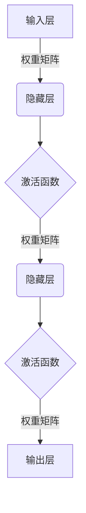
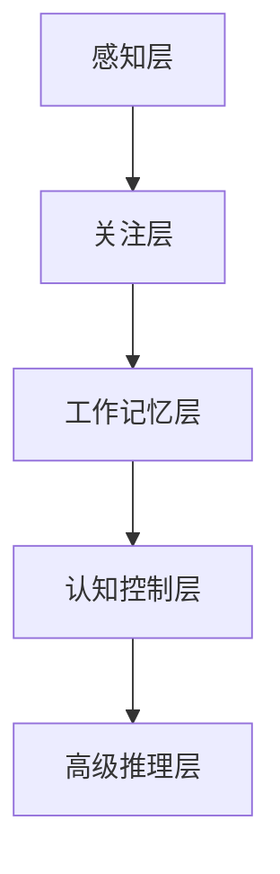
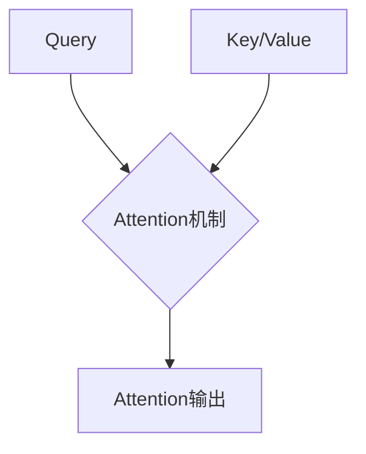
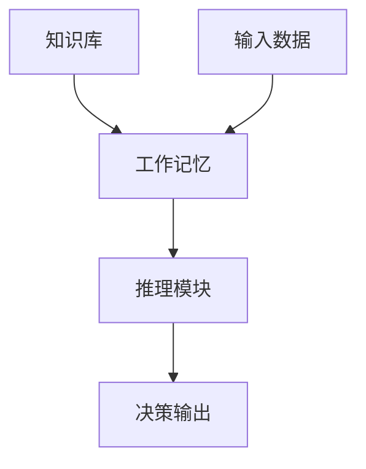
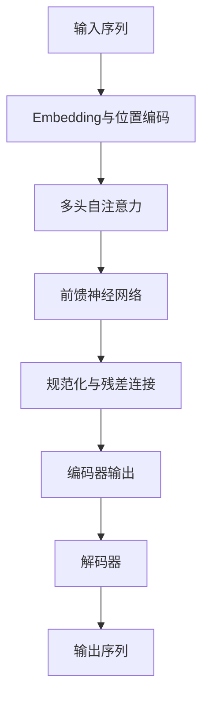
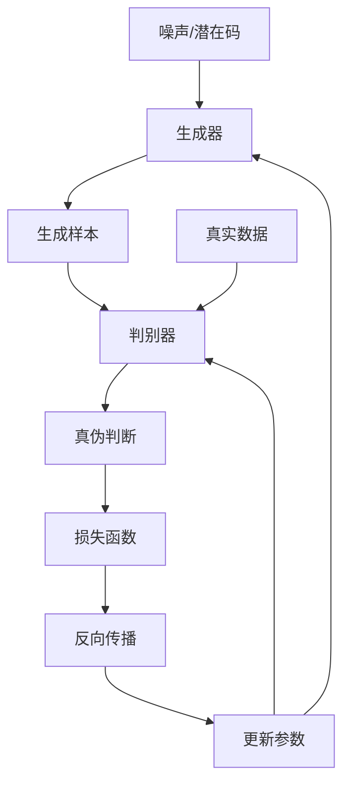
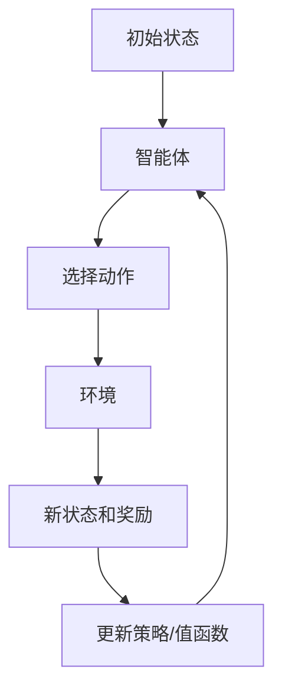

# 【大模型应用开发 动手做AI Agent】人类的大脑了不起

## 1. 背景介绍

### 1.1 人工智能的崛起

人工智能(Artificial Intelligence, AI)是当代科技发展的重要驱动力,正在深刻影响和改变着我们的生活、工作和思维方式。近年来,随着算力、数据和算法的飞速发展,人工智能取得了令人瞩目的进步,尤其是大型语言模型和多模态模型的出现,使得人工智能系统能够更好地理解和生成自然语言、图像、视频等多种形式的数据,展现出逼真的认知和推理能力。

### 1.2 大模型的兴起

大模型(Large Model)是指具有数十亿甚至上万亿参数的巨大神经网络模型,通过在海量数据上进行预训练,获得通用的表示能力和知识。这些大模型不仅能够胜任传统的自然语言处理任务,还能够生成逼真的文本、图像、视频等内容,并展现出一定的推理和决策能力。著名的大模型包括GPT-3、PaLM、Stable Diffusion等。

### 1.3 人类大脑的奥秘

尽管人工智能取得了长足进步,但人类大脑仍然是世界上最复杂、最高级的认知系统。人类大脑拥有约1000亿个神经元和更多的神经连接,通过精密的结构和高效的信息处理机制,实现了卓越的感知、学习、推理、决策、创造等认知功能。探索人类大脑的奥秘,不仅有助于揭开智能的本质,还能为人工智能系统的设计和优化提供宝贵的启示。

## 2. 核心概念与联系

### 2.1 人工神经网络

人工神经网络(Artificial Neural Network, ANN)是一种受生物神经系统启发而设计的计算模型,由大量互连的人工神经元组成。神经网络通过对大量数据的学习,自动获取知识表示和建模能力。深度神经网络(Deep Neural Network, DNN)是一种具有多层隐藏层的神经网络,能够有效地学习复杂的数据特征。

人工神经网络与生物神经网络在结构和工作原理上存在一定的相似性,都是通过大量的节点(神经元)和连接(突触)来处理信息。然而,人工神经网络目前还无法完全模拟生物神经网络的复杂性和灵活性。

### 2.2 大脑认知架构

人类大脑的认知架构是一种复杂的分层结构,包括感知层、关注层、工作记忆层、认知控制层和高级推理层等多个层次。每一层都负责特定的功能,并与其他层紧密协作,实现高级认知能力。

这种分层架构在人工智能系统中也有所体现,例如感知模块负责数据输入和预处理,注意力模块负责关注重点信息,记忆模块负责存储和检索知识,推理模块负责逻辑推理和决策等。通过模块化设计和层次协作,人工智能系统可以更好地模拟人类大脑的认知过程。

### 2.3 注意力机制

注意力机制(Attention Mechanism)是人工智能领域的一种重要技术,它模拟了人类大脑选择性关注重点信息的过程。在处理序列数据(如自然语言、视频等)时,注意力机制能够自适应地分配不同位置的注意力权重,从而更好地捕捉相关信息。

人类大脑中的注意力机制允许我们在海量信息中快速锁定目标,过滤掉无关信息,提高认知效率。类似地,注意力机制在人工智能模型中也发挥着关键作用,使模型能够更好地处理长期依赖和高维数据。

### 2.4 记忆与知识库

人类大脑拥有强大的记忆能力,能够长期保存和检索大量的知识和经验。这种记忆能力是人类进行推理和决策的基础。同样,人工智能系统也需要构建知识库,存储预训练获得的知识表示。

除了静态知识库外,人工智能系统还需要动态的工作记忆机制,用于临时存储和操作任务相关的信息,支持复杂的推理过程。人机协作智能系统中,人类可以充当外部记忆和知识源,为人工智能系统提供补充知识。

## 3. 核心算法原理具体操作步骤

### 3.1 transformer模型

Transformer是一种革命性的序列到序列(Sequence-to-Sequence)模型,它完全基于注意力机制,不需要复杂的递归或者卷积结构。Transformer模型的核心是多头自注意力(Multi-Head Self-Attention)机制和位置编码(Positional Encoding),能够有效地捕捉长距离依赖关系。

1. **输入embedding**:将输入序列(如文本)转换为embedding向量表示。
2. **位置编码**:为每个位置添加位置信息,使模型能够捕捉序列顺序。
3. **多头自注意力**:计算查询(Query)与键(Key)的相关性得分,根据相关性分配值(Value)的权重。
4. **前馈神经网络**:对注意力输出进行非线性变换,提取更高级特征。
5. **规范化与残差连接**:加入残差连接和层归一化,提高模型性能和收敛速度。
6. **解码器**:根据编码器输出和前一步预测,生成目标序列。

### 3.2 生成式对抗网络

生成式对抗网络(Generative Adversarial Network, GAN)是一种用于生成式建模的深度学习架构,由生成器(Generator)和判别器(Discriminator)两个对抗神经网络组成。生成器从噪声或潜在空间中生成样本,判别器则判断样本是真实数据还是生成数据。两者通过对抗训练,生成器逐渐学习生成逼真的数据分布。

1. **初始化生成器和判别器**:随机初始化两个神经网络的参数。
2. **生成器生成样本**:生成器从潜在空间或噪声中采样,生成假样本。
3. **判别器判别真伪**:判别器对真实数据和生成数据进行二分类。
4. **反向传播更新参数**:最大化判别器的真实数据概率,最小化生成数据概率,更新判别器参数;最小化判别器对生成数据的真实性评分,更新生成器参数。
5. **重复训练**:重复上述过程,直到生成器生成的样本足够逼真。

### 3.3 强化学习

强化学习(Reinforcement Learning)是一种基于环境交互的机器学习范式,智能体(Agent)通过不断尝试和学习,获得最大化累积奖励的策略。强化学习算法广泛应用于决策控制、游戏等领域。

1. **初始化智能体和环境**:定义状态空间、动作空间和奖励函数。
2. **智能体选择动作**:根据当前策略,智能体选择一个动作执行。
3. **环境反馈状态和奖励**:环境根据智能体的动作,转移到新状态并返回奖励值。
4. **更新策略或值函数**:根据状态转移和奖励,更新策略或值函数的参数。
5. **重复交互**:重复上述过程,直到策略收敛或达到预期目标。

## 4. 数学模型和公式详细讲解举例说明

### 4.1 神经网络损失函数

神经网络的训练目标是最小化损失函数(Loss Function),使模型输出尽可能接近期望输出。常用的损失函数包括均方误差(Mean Squared Error, MSE)、交叉熵损失(Cross-Entropy Loss)等。

$$
\begin{aligned}
\text{MSE} &= \frac{1}{N}\sum_{i=1}^{N}(y_i - \hat{y}_i)^2 \\
\text{Cross-Entropy Loss} &= -\frac{1}{N}\sum_{i=1}^{N}\sum_{j=1}^{C}y_{ij}\log(\hat{y}_{ij})
\end{aligned}
$$

其中,$y_i$是期望输出,$\hat{y}_i$是模型预测输出,$N$是样本数量,$C$是类别数量。

### 4.2 注意力机制计算

注意力机制的核心是计算查询(Query)与键(Key)的相关性得分,并根据相关性分配值(Value)的权重。常用的计算方法是点积注意力(Dot-Product Attention)。

$$
\begin{aligned}
\text{Attention}(Q, K, V) &= \text{softmax}\left(\frac{QK^T}{\sqrt{d_k}}\right)V \\
\text{head}_i &= \text{Attention}\left(QW_i^Q, KW_i^K, VW_i^V\right) \\
\text{MultiHead}(Q, K, V) &= \text{Concat}(\text{head}_1, \dots, \text{head}_h)W^O
\end{aligned}
$$

其中,$Q$、$K$、$V$分别是查询、键和值矩阵,$d_k$是缩放因子,$W$是可训练的线性变换矩阵。多头注意力机制可以从不同子空间捕捉不同的相关性。

### 4.3 生成式对抗网络目标函数

生成式对抗网络的目标是最小化生成器和判别器之间的对抗损失,使生成器生成的样本分布尽可能逼近真实数据分布。

$$
\begin{aligned}
\min_{G}\max_{D}V(D, G) &= \mathbb{E}_{x\sim p_{\text{data}}(x)}[\log D(x)] + \mathbb{E}_{z\sim p_z(z)}[\log(1-D(G(z)))] \\
&= \mathbb{E}_{x\sim p_{\text{data}}(x)}[\log D(x)] + \mathbb{E}_{x\sim p_g(x)}[\log(1-D(x))]
\end{aligned}
$$

其中,$G$是生成器,$D$是判别器,$p_{\text{data}}$是真实数据分布,$p_z$是噪声或潜在码的分布,$p_g$是生成器生成的样本分布。

### 4.4 强化学习价值函数和策略梯度

强化学习的目标是找到一个最优策略$\pi^*$,使累积折现奖励$G_t$的期望最大化。价值函数$V^{\pi}(s)$表示在策略$\pi$下从状态$s$开始获得的期望累积奖励,而$Q^{\pi}(s, a)$表示在策略$\pi$下从状态$s$执行动作$a$后获得的期望累积奖励。

$$
\begin{aligned}
V^{\pi}(s) &= \mathbb{E}_{\pi}\left[G_t|S_t=s\right] \\
Q^{\pi}(s, a) &= \mathbb{E}_{\pi}\left[G_t|