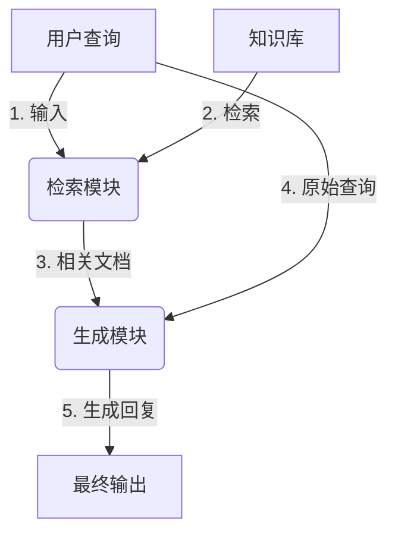

# 【大模型应用开发 动手做AI Agent】从用户角度看RAG流程

## 1. 背景介绍

### 1.1 大模型时代的到来

近年来,自然语言处理(NLP)领域取得了长足的进步,很大程度上归功于大型语言模型(Large Language Models, LLMs)的兴起。大模型是指具有数十亿甚至上百亿参数的深度神经网络模型,通过在海量文本数据上进行预训练,获得了强大的语言理解和生成能力。

代表性的大模型包括 GPT-3、PaLM、ChatGPT 等,它们展现出令人惊叹的语言理解、推理和生成能力,在各种自然语言处理任务上取得了超越人类的表现。大模型的出现,不仅推动了 NLP 技术的飞速发展,也为人工智能系统带来了全新的应用场景和商业价值。

### 1.2 RAG 架构:融合检索与生成

然而,尽管大模型表现出色,但它们仍然存在一些局限性。其中一个主要问题是,大模型的知识来源仅限于训练数据集,无法像人类那样根据需要查阅外部知识库。为了解决这一问题,研究人员提出了 RAG(Retrieval Augmented Generation) 架构,将检索(Retrieval)和生成(Generation)两个模块相结合。

RAG 架构的核心思想是:首先使用检索模块从知识库(如维基百科)中查找与输入查询相关的文档片段;然后将这些文档片段与原始查询一并输入到生成模型中,生成模型可以综合利用检索到的知识和自身的语言理解能力生成最终输出。这种融合检索与生成的方式,赋予了大模型获取外部知识的能力,从而有望构建更加通用和智能的人工智能系统。

### 1.3 用户视角:提高人机交互体验

从用户的角度来看,RAG 架构为人机交互带来了全新的体验。传统的问答系统或搜索引擎,要么只能提供简单的事实型回答,要么只能返回相关文档列表,用户仍需自行筛选和理解信息。而基于 RAG 架构的智能助手,则可以像人一样理解用户的自然语言查询,并结合检索到的知识,生成连贯、信息丰富的回复,从而极大地提高了人机交互的自然性和效率。

本文将从用户的视角出发,深入探讨 RAG 架构的核心概念、关键技术和实现细节,旨在为读者提供一个全面的理解,并展望该架构在未来的发展趋势和挑战。

## 2. 核心概念与联系



RAG 架构由两个关键模块组成:检索模块和生成模块。上图展示了它们在处理用户查询时的工作流程:

1. 用户输入自然语言查询
2. 检索模块从知识库中检索与查询相关的文档片段
3. 检索到的文档片段与原始查询一并输入生成模块
4. 生成模块综合利用检索知识和自身语言理解能力生成最终回复
5. 系统将生成的回复呈现给用户

从上述流程可以看出,RAG 架构的核心思想是将检索和生成两个模块有机结合,充分发挥各自的优势:

- **检索模块**负责从知识库中查找相关信息,弥补了大模型知识有限的缺陷
- **生成模块**利用自身的语言理解和生成能力,将检索到的知识片段融合并生成连贯、信息丰富的回复

通过这种紧密协作,RAG 架构赋予了人工智能系统获取外部知识、进行复杂推理和自然语言交互的能力,从而有望构建更加通用和智能的人工智能助手。

## 3. 核心算法原理具体操作步骤 

### 3.1 检索模块

RAG 架构的检索模块负责从知识库中查找与用户查询相关的文档片段。常见的实现方式是基于向量空间模型(Vector Space Model)进行语义相似性匹配。具体操作步骤如下:

1. **构建向量空间**:将知识库中的所有文档及用户查询转换为向量表示,通常采用预训练语言模型(如 BERT)对文本进行编码。
2. **相似性计算**:计算用户查询向量与所有文档向量之间的相似度得分,可使用余弦相似度等度量。
3. **排序和筛选**:根据相似度得分对文档进行排序,选取与查询最相关的 Top-K 个文档片段。

值得注意的是,由于知识库通常包含大量文档,为了提高检索效率,可以引入倒排索引(Inverted Index)或近似最近邻(Approximate Nearest Neighbor, ANN)等技术,先快速从全库中筛选出候选文档集,再在候选集上进行细粒度的相似度匹配。

此外,检索模块还需要考虑如何对长文档进行分块、如何平衡检索的召回率和精确率等问题,以确保输出高质量的相关文档片段。

### 3.2 生成模块

RAG 架构的生成模块接收检索模块输出的相关文档片段和原始查询,并生成最终的自然语言回复。生成模块的核心是一个基于 Transformer 的序列到序列(Seq2Seq)模型,例如 GPT、T5 等。

生成模块的工作流程如下:

1. **输入表示**:将原始查询和检索文档片段拼接为单个输入序列,添加特殊标记(如 [Q]、[D])以区分不同部分。
2. **模型编码**:使用 Transformer 编码器对拼接后的输入序列进行编码,获得其向量表示。
3. **自回归解码**:将编码器的输出作为初始状态,通过 Transformer 解码器自回归地生成目标序列(即最终回复)。

在解码过程中,生成模块需要综合考虑原始查询的语义和检索文档中的知识信息,并生成连贯、相关且信息丰富的自然语言回复。为了提高生成质量,通常需要在大量数据上对生成模型进行监督微调。

值得一提的是,生成模块不仅可以生成单一的回复,也可以生成多个候选回复,并通过重新排序或重新生成的方式进一步优化输出质量。

## 4. 数学模型和公式详细讲解举例说明

### 4.1 向量空间模型

在 RAG 架构的检索模块中,我们需要计算查询与文档之间的相似度。一种常见的方法是将它们表示为向量,并在向量空间中计算相似度得分。

假设我们有一个由 $N$ 个唯一词项 $t_1, t_2, \dots, t_N$ 组成的词汇表 $\mathcal{V}$。对于任意一个文本 $d$,我们可以将其表示为一个 $N$ 维向量:

$$\vec{d} = (w_{t_1}^{(d)}, w_{t_2}^{(d)}, \dots, w_{t_N}^{(d)})$$

其中 $w_{t_i}^{(d)}$ 表示词项 $t_i$ 在文本 $d$ 中的权重。常见的权重计算方法包括词频(TF)、词频-逆文档频率(TF-IDF)等。

有了文本的向量表示,我们就可以计算任意两个文本 $d_1$ 和 $d_2$ 之间的相似度,例如使用余弦相似度:

$$\text{sim}(\vec{d_1}, \vec{d_2}) = \cos(\theta) = \frac{\vec{d_1} \cdot \vec{d_2}}{||\vec{d_1}|| \times ||\vec{d_2}||} = \frac{\sum\limits_{i=1}^N w_{t_i}^{(d_1)} w_{t_i}^{(d_2)}}{\sqrt{\sum\limits_{i=1}^N {(w_{t_i}^{(d_1)})}^2} \sqrt{\sum\limits_{i=1}^N {(w_{t_i}^{(d_2)})}^2}}$$

余弦相似度的取值范围是 $[-1, 1]$,值越接近 1 表示两个向量越相似。在 RAG 架构中,我们可以计算查询向量与所有文档向量之间的余弦相似度,并根据得分从高到低排序,选取最相关的 Top-K 个文档作为检索结果。

### 4.2 注意力机制

在 RAG 架构的生成模块中,我们需要综合考虑原始查询和检索文档的信息,生成最终的自然语言回复。这个过程可以建模为一个序列到序列(Seq2Seq)学习问题,并使用 Transformer 等基于注意力机制的模型来解决。

注意力机制的核心思想是,在生成每个目标词时,允许模型对输入序列的不同部分赋予不同的权重,从而更好地捕获长距离依赖关系。具体来说,对于输入序列 $\mathbf{x} = (x_1, x_2, \dots, x_n)$ 和当前解码时刻 $t$,注意力机制首先计算查询向量 $\mathbf{q}_t$ 与每个输入向量 $\mathbf{x}_i$ 的相关性得分:

$$\alpha_{t,i} = \frac{\exp(\text{score}(\mathbf{q}_t, \mathbf{x}_i))}{\sum\limits_{j=1}^n \exp(\text{score}(\mathbf{q}_t, \mathbf{x}_j))}$$

其中 $\text{score}(\cdot, \cdot)$ 是一个相似度打分函数,例如点积或多层感知机。然后,注意力权重 $\alpha_{t,i}$ 被用于对输入向量进行加权求和,得到注意力向量表示 $\mathbf{c}_t$:

$$\mathbf{c}_t = \sum\limits_{i=1}^n \alpha_{t,i} \mathbf{x}_i$$

最后,注意力向量 $\mathbf{c}_t$ 与当前解码状态 $\mathbf{s}_t$ 一起,被输入到解码器中预测下一个目标词 $y_t$。

在 RAG 架构中,输入序列是由原始查询和检索文档片段拼接而成的。注意力机制可以自动学习到,在生成不同部分的回复时,需要更多关注查询还是文档信息,从而实现了检索和生成的无缝融合。

## 5. 项目实践:代码实例和详细解释说明

为了更好地理解 RAG 架构的实现细节,我们将基于 HuggingFace 的 Transformers 库,使用 PyTorch 编写一个简单的 RAG 系统示例。

### 5.1 数据准备

首先,我们需要准备一个小型的知识库和相应的查询-答案对数据集,用于模型训练和评估。为了简化问题,这里我们使用 SQuAD 2.0 数据集,它包含来自维基百科的一些文章段落及相关的问答对。

```python
from datasets import load_dataset

# 加载 SQuAD 2.0 数据集
dataset = load_dataset("squad_v2")

# 构建知识库(context)和查询-答案对(question-answer)列表
knowledgebase = list(dict.fromkeys([example["context"] for example in dataset["train"]]))
qa_pairs = [(example["question"], example["answer"]["text"]) for example in dataset["train"] if example["answer"]["text"]]
```

### 5.2 检索模块

接下来,我们实现检索模块。这里我们使用预训练的 BERT 模型对文本进行编码,并基于向量相似度进行匹配。

```python
from transformers import BertTokenizer, BertModel
import torch

# 加载 BERT tokenizer 和模型
tokenizer = BertTokenizer.from_pretrained("bert-base-uncased")
bert_model = BertModel.from_pretrained("bert-base-uncased")

# 对知识库和查询进行编码
def encode(texts):
    encoded = tokenizer.batch_encode_plus(texts, padding=True, truncation=True, return_tensors="pt")
    with torch.no_grad():
        outputs = bert_model(**encoded)
    return outputs.last_hidden_state.mean(dim=1)

# 计算查询与知识库文档的相似度
def retrieve(query, knowledgebase, top_k=3):
    query_vec = encode([query])
    doc_vecs = encode(knowledgebase