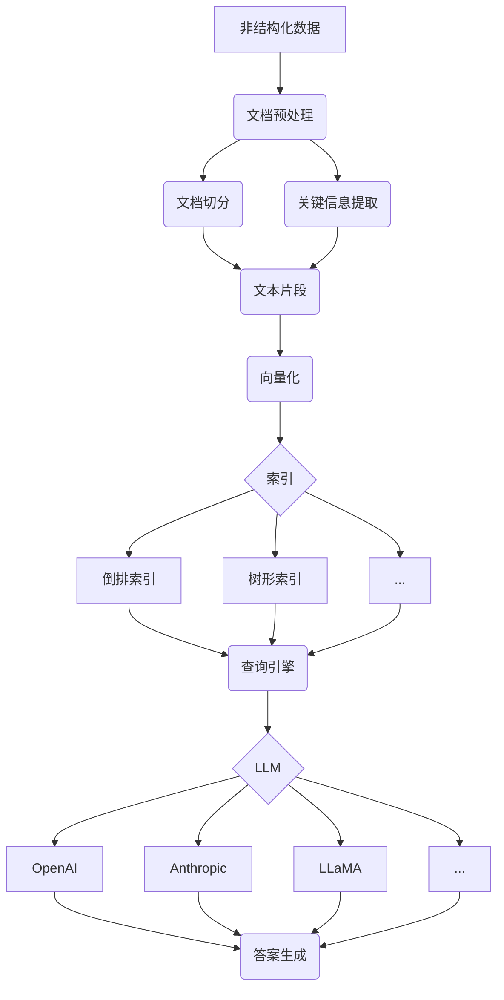
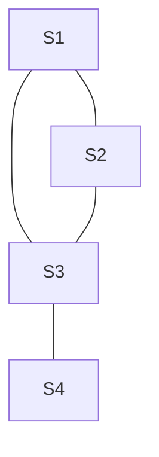
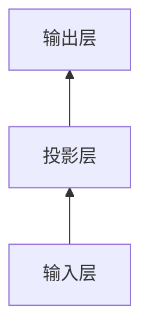

# 【大模型应用开发 动手做AI Agent】何谓LlamaIndex

## 1. 背景介绍
### 1.1 大语言模型的兴起
近年来,随着深度学习技术的飞速发展,大语言模型(Large Language Model, LLM)在自然语言处理领域取得了突破性的进展。从GPT-3到ChatGPT,再到最新的LLaMA模型,这些大语言模型展示了惊人的语言理解和生成能力,为人工智能领域带来了新的革命。

### 1.2 大模型应用开发面临的挑战
然而,要将这些强大的大语言模型应用到实际的场景中,仍然面临着诸多挑战:
- 大语言模型通常需要海量的计算资源和存储空间,对硬件要求很高
- 大语言模型训练需要大量高质量的语料数据,数据准备和清洗是一项繁重的工作  
- 大语言模型生成的内容虽然通顺,但可能存在事实性错误,需要人工审核把关
- 针对特定领域应用,需要对大语言模型进行微调(finetune),使其更好地理解上下文

### 1.3 LlamaIndex的诞生
为了解决上述大模型应用开发面临的痛点,一个名为LlamaIndex的开源项目应运而生。LlamaIndex旨在为大语言模型应用提供一套灵活、高效的工具集,帮助开发者快速构建基于LLM的智能应用。

## 2. 核心概念与联系
### 2.1 向量数据库(Vector Database)
LlamaIndex的核心是向量数据库。传统的关系型/非关系型数据库以结构化的方式存储数据,适合存储表格、文档等格式化数据。而向量数据库则以向量的形式存储数据,每个数据对象表示为一个高维向量。向量之间可以计算相似度,非常适合用于语义搜索、推荐等场景。

### 2.2 文档数据预处理
要将非结构化的文本数据存入向量数据库,需要先对其进行预处理和向量化表示。LlamaIndex提供了一系列工具,可以将文档拆分成片段,提取关键信息,并将文本映射为语义向量。

### 2.3 索引(Index)
LlamaIndex引入了索引的概念。索引将向量化后的数据组织成一定的数据结构,例如倒排索引、树形结构等,便于后续的查询检索。不同的索引方式适用于不同的应用场景。

### 2.4 查询引擎(Query Engine) 
当需要从知识库中查询信息时,查询引擎发挥作用。查询引擎根据用户输入的自然语言问题,从索引中检索出最相关的片段,并将其送入大语言模型生成回答。LlamaIndex提供了一套查询语言和执行引擎,让开发者可以灵活定义查询逻辑。

### 2.5 LLM接口
LlamaIndex对接了主流的大语言模型的API接口,包括OpenAI、Anthropic等,开发者可以方便地调用这些LLM服务。此外,LlamaIndex还支持本地部署的开源LLM模型,如LLaMA、BLOOM等。

下图展示了LlamaIndex的核心组件和工作流程:

## 3. 核心算法原理具体操作步骤
### 3.1 文档切分算法
LlamaIndex采用了一种基于TextTiling的文档切分算法。该算法的基本思想是:将文档看作是一系列相邻的文本块,每个文本块聚焦于某个子主题。算法通过计算文本块之间的相似度,找出子主题的边界,进而将文档切分成若干个片段。
具体步骤如下:
1. 将文档按照句子或段落划分为一系列文本块
2. 对每个文本块提取TF-IDF特征向量
3. 计算相邻文本块之间的余弦相似度
4. 寻找相似度的"谷值点",作为子主题的分界
5. 在分界点处对文档进行切分,得到最终的片段

### 3.2 关键信息提取算法
LlamaIndex使用了一种基于TextRank的关键信息提取算法。TextRank算法借鉴了PageRank的思想,将文本中的句子看作图中的节点,句子之间的相似度作为边的权重,通过迭代计算每个句子的重要性得分,得分最高的句子即为关键句。
具体步骤如下:  
1. 将文档中的句子作为图的节点
2. 计算句子之间的相似度作为边的权重
3. 通过迭代计算句子的重要性得分:
   - 初始化每个句子的得分为1
   - 每一轮迭代,句子的新得分为所有指向它的句子的得分的加权和
   - 重复迭代直到得分收敛
4. 选取得分最高的Top-K句子作为关键句

### 3.3 向量化算法
将文本转换为语义向量是向量数据库的基础。LlamaIndex集成了多种语义向量化算法,包括:
- TF-IDF:传统的词频-逆文档频率方法,简单高效
- Word2Vec:基于神经网络的词嵌入方法,可以刻画词之间的语义关系
- GloVe:基于全局词共现统计的词嵌入方法 
- FastText:考虑了字符级别信息的词嵌入方法
- BERT:基于Transformer的上下文词嵌入方法,在多个NLP任务上取得SOTA

LlamaIndex允许用户根据实际情况选择合适的向量化算法,并支持用户自定义向量化函数。同时,LlamaIndex还提供了一些向量后处理操作,如PCA降维、标准化等,帮助优化向量的质量。

### 3.4 索引构建算法
LlamaIndex提供了多种索引构建算法,每种算法都有其适用场景:
- 倒排索引:适合关键词匹配查询,查询速度快,占用空间小,但无法处理语义相似度
- 树形索引:适合层次结构数据,如文件目录、网页结构等,支持快速遍历和范围查询
- HNSW(Hierarchical Navigable Small World):一种近似最近邻图索引算法,在查询效率和空间占用之间取得了很好的平衡,适合高维向量数据
- FAISS(Facebook AI Similarity Search):Facebook开源的高效向量索引库,提供了多种索引类型,支持数十亿向量规模的查询

此外,LlamaIndex还支持基于用户自定义函数构建索引,赋予了开发者最大的灵活性。

## 4. 数学模型和公式详细讲解举例说明
在LlamaIndex的算法中,涉及了一些重要的数学概念和公式,这里我们对其进行详细的讲解和举例说明。

### 4.1 TF-IDF
TF-IDF(Term Frequency-Inverse Document Frequency)是一种用于评估词项在文档中重要性的统计方法。它由两部分组成:
- TF(词频):衡量词项t在文档d中出现的频率。通常使用归一化的频率,即词频除以文档总词数:
  $$ TF(t,d) = \frac{f_{t,d}}{\sum_{t'\in d} f_{t',d}} $$
  其中$f_{t,d}$表示词项t在文档d中出现的次数。
- IDF(逆文档频率):衡量词项t在整个语料库中的稀缺程度。IDF的计算公式为:
  $$ IDF(t) = \log \frac{N}{n_t} $$
  其中N为语料库中文档总数,而$n_t$为包含词项t的文档数。

将TF和IDF相乘,就得到了词项t在文档d中的TF-IDF权重:
$$ TFIDF(t,d) = TF(t,d) \cdot IDF(t) $$

直观地理解,TF-IDF体现了一个词在某篇文档中出现得越频繁,而在整个语料库的其他文档中出现得越少,那么它就越能代表这篇文档的主题。

举例来说,假设我们有如下三个文档:
- D1: This is a dog. It is a cute dog. I love this dog.
- D2: This is a cat. It is a cute cat. I love this cat.
- D3: This is a rabbit. It is a cute rabbit. I love this rabbit.

对于词项"dog",它在D1中出现了3次,在D2和D3中都没出现,因此它的TF-IDF值在D1中会很高。而对于词项"is",虽然它在每个文档中都出现了,但因为它在所有文档中都很常见,所以IDF值很低,因此它的TF-IDF值不会很高。

### 4.2 PageRank & TextRank
PageRank最初是Google用于网页排序的算法,后来被用于很多图结构的重要性计算中。PageRank的基本假设是:如果一个节点被很多其他重要节点指向,那么这个节点也应该很重要。

我们定义一个节点的PageRank值为PR(i),初始时所有节点的PR值都为1。每一轮迭代,各节点按照如下公式更新PR值:

$$ PR(i) = \frac{1-d}{N} + d \sum_{j \in B(i)} \frac{PR(j)}{L(j)} $$

其中d为阻尼因子,通常取0.85。N为节点总数。B(i)为指向节点i的节点集合,L(j)为节点j的出度。

迭代多轮直到PR值收敛,最终各节点的PR值就代表了它们在图中的重要程度。

TextRank将PageRank思想应用到文本处理中。将句子看作节点,句子之间的相似度作为边的权重,就得到了一个无向有权图。通过迭代计算,得到各句子的重要性得分,进而提取关键句。

假设我们有如下一段文本:
- S1: LlamaIndex is a powerful tool for LLM application development. 
- S2: It provides a suite of flexible and efficient components.
- S3: Developers can quickly build intelligent applications based on LLMs using LlamaIndex.
- S4: The core of LlamaIndex is the vector database.

我们可以计算句子之间的相似度(这里用简单的词重叠率代替),构建TextRank图:

然后通过迭代计算各句子的重要性得分,最终得分最高的S1和S3很可能就是这段文本的关键句。

### 4.3 词嵌入模型
词嵌入(Word Embedding)是一种将词映射为实值向量的技术。通过词嵌入,可以将词的语义信息编码到向量空间中,使得语义相似的词具有相近的向量表示。

Word2Vec是一种经典的词嵌入模型,包含CBOW和Skip-gram两种架构。以CBOW为例,模型的目标是根据中心词的上下文来预测中心词本身。网络结构如下:

其中输入是中心词的上下文词向量,输出是中心词的One-Hot编码。网络参数包括:
- 输入词向量矩阵$W_{V \times N}$
- 输出词向量矩阵$W'_{N \times V}$

其中V为词表大小,N为词向量维度。对于一个训练样本(context(w),w),损失函数为:

$$ E = -\log p(w|context(w)) $$

$$ p(w|context(w)) = \frac{\exp(v'_w \cdot \hat v)}{\sum_{i=1}^V \exp(v'_i \cdot \hat v)} $$

其中$\hat v$为上下文词向量的平均,$v'_i$为第i个词的输出向量。

训练时采用负采样等优化技巧,最终得到的输入词向量矩阵W即为我们需要的词嵌入结果。

举例来说,假设我们有如下一个句子:
- The quick brown fox jumps over the lazy dog.