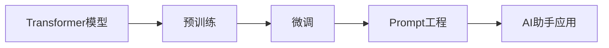

# 【大模型应用开发 动手做AI Agent】创建助手

## 1. 背景介绍

### 1.1 人工智能的发展历程

人工智能(Artificial Intelligence, AI)是计算机科学的一个重要分支,其目标是让机器能够执行通常需要人类智能才能完成的任务。人工智能的概念最早可以追溯到1950年代,但直到最近几年,随着计算能力的提升和大数据的普及,AI才真正迎来了爆发式的增长。

### 1.2 大语言模型的崛起 

近年来,自然语言处理(Natural Language Processing, NLP)领域取得了突破性的进展,尤其是以Transformer为代表的大语言模型(Large Language Model, LLM)的出现,让AI在理解和生成人类语言方面达到了前所未有的水平。GPT-3、BERT、T5等大语言模型展现出了惊人的语言理解和生成能力,为AI应用开发带来了无限可能。

### 1.3 AI助手的应用前景

基于大语言模型,我们可以开发出功能强大的AI助手,为人们的日常生活和工作提供智能化的帮助。无论是问答系统、对话机器人,还是智能写作助手,AI助手都有着广阔的应用前景。本文将详细介绍如何利用大语言模型来开发一个实用的AI助手,让读者能够动手实践,创建属于自己的智能助理。

## 2. 核心概念与联系

### 2.1 Transformer模型

Transformer是一种基于自注意力机制(Self-Attention)的神经网络模型,它摒弃了传统的循环神经网络(RNN)和卷积神经网络(CNN),通过Self-Attention实现了并行计算,大大提高了训练效率。Transformer模型由编码器(Encoder)和解码器(Decoder)组成,能够处理任意长度的序列数据。

### 2.2 预训练与微调

预训练(Pre-training)是指在大规模无标注数据上训练语言模型,让模型学习到语言的基本规律和知识。微调(Fine-tuning)则是在预训练的基础上,使用少量标注数据对模型进行针对性的训练,使其适应特定的任务。这种"预训练+微调"的范式极大地降低了任务特定数据的需求,提高了模型的泛化能力。

### 2.3 Prompt工程

Prompt工程(Prompt Engineering)是指根据任务需求,设计合适的输入提示(Prompt),引导语言模型生成期望的输出。通过精心设计的Prompt,我们可以控制模型的行为,实现更加精准和可控的文本生成。Prompt工程是应用大语言模型的关键技术之一。

以下是这些核心概念之间的联系:



## 3. 核心算法原理与具体操作步骤

### 3.1 Transformer的Self-Attention机制

Transformer的核心是Self-Attention机制,它允许模型的每个位置都能够关注输入序列的任意位置,从而捕捉到全局的依赖关系。具体来说,Self-Attention的计算过程如下:

1. 将输入序列X通过三个线性变换得到Query矩阵Q、Key矩阵K和Value矩阵V。
2. 计算Q与K的点积,得到注意力分数矩阵 $A=\text{softmax}(\frac{QK^T}{\sqrt{d_k}})$,其中 $d_k$ 是K的维度。
3. 将注意力分数矩阵A与V相乘,得到加权求和的结果 $\text{Attention}(Q,K,V)=AV$。
4. 将多头注意力的结果拼接,并通过一个线性变换得到最终的输出。

### 3.2 预训练的Masked Language Modeling

预训练阶段通常采用Masked Language Modeling(MLM)的方式,即随机遮挡输入序列中的一部分token,让模型根据上下文预测被遮挡的token。具体步骤如下:

1. 随机选择输入序列中15%的token进行遮挡,用特殊的[MASK]符号替换。
2. 将遮挡后的序列输入Transformer模型,得到每个位置的输出向量。
3. 将[MASK]位置的输出向量通过一个线性分类器,预测原始的token。
4. 使用交叉熵损失函数计算预测结果与真实token之间的差异,并通过反向传播更新模型参数。

### 3.3 微调的具体步骤

在预训练的基础上,我们可以通过以下步骤对模型进行微调:

1. 根据任务需求,准备少量的标注数据。
2. 在预训练模型的基础上,添加任务特定的输出层,如分类层或生成层。
3. 使用标注数据对模型进行微调,通过反向传播更新模型参数。
4. 评估微调后的模型在任务上的性能,根据需要调整超参数和训练策略。

### 3.4 Prompt的设计与优化

设计良好的Prompt对于应用大语言模型至关重要。以下是一些Prompt设计的技巧:

1. 根据任务需求,设计清晰、具体的指令,明确告知模型期望的输出。
2. 提供必要的背景信息和上下文,帮助模型理解任务。
3. 使用任务相关的关键词和示例,引导模型生成符合要求的内容。
4. 通过Few-shot Learning的方式,在Prompt中提供少量示例,让模型快速适应新任务。
5. 对Prompt进行持续优化,通过实验和反馈不断改进Prompt的质量。

## 4. 数学模型和公式详细讲解举例说明

### 4.1 Self-Attention的数学公式

Self-Attention的核心是计算Query、Key、Value三个矩阵,并通过它们的交互得到注意力分数和加权求和的结果。以下是Self-Attention的数学公式:

$$
\begin{aligned}
Q &= XW_Q \\
K &= XW_K \\
V &= XW_V \\
A &= \text{softmax}(\frac{QK^T}{\sqrt{d_k}}) \\
\text{Attention}(Q,K,V) &= AV
\end{aligned}
$$

其中,$X$是输入序列的嵌入表示,$W_Q$、$W_K$、$W_V$是可学习的参数矩阵。$A$是注意力分数矩阵,通过$Q$和$K$的点积计算得到,并经过softmax归一化。最终的输出是$A$与$V$的乘积。

举例说明:假设我们有一个长度为4的输入序列,嵌入维度为512。我们可以通过三个线性变换得到$Q$、$K$、$V$矩阵,它们的形状均为(4, 512)。然后,我们计算$QK^T$,得到一个(4, 4)的注意力分数矩阵$A$。最后,将$A$与$V$相乘,得到Self-Attention的输出,形状为(4, 512)。

### 4.2 Masked Language Modeling的损失函数

在MLM预训练中,我们通过最小化预测token与真实token之间的交叉熵损失来更新模型参数。交叉熵损失的数学公式如下:

$$
\mathcal{L}_{MLM} = -\sum_{i=1}^{N} y_i \log(\hat{y}_i)
$$

其中,$N$是被遮挡的token数量,$y_i$是第$i$个token的真实标签(one-hot向量),$\hat{y}_i$是模型预测的第$i$个token的概率分布。

举例说明:假设我们有一个包含10000个token的输入序列,其中1500个token被随机遮挡。对于每个被遮挡的位置,模型需要预测原始的token。假设在某个位置,真实的token是"apple",模型预测"apple"的概率为0.8,"banana"的概率为0.1,"orange"的概率为0.1。则该位置的交叉熵损失为:

$$
\mathcal{L} = -( 1\cdot \log(0.8) + 0\cdot \log(0.1) + 0\cdot \log(0.1) ) \approx 0.223
$$

我们对所有被遮挡位置的损失取平均,得到最终的MLM损失。

## 5. 项目实践:代码实例和详细解释说明

下面我们将使用PyTorch和Hugging Face的Transformers库,实现一个基于GPT-2的AI助手。

### 5.1 环境准备

首先,我们需要安装必要的库:

```bash
pip install torch transformers
```

### 5.2 加载预训练模型

接下来,我们加载预训练的GPT-2模型和分词器:

```python
from transformers import GPT2LMHeadModel, GPT2Tokenizer

model = GPT2LMHeadModel.from_pretrained('gpt2')
tokenizer = GPT2Tokenizer.from_pretrained('gpt2')
```

### 5.3 设计Prompt

我们设计一个简单的Prompt,让模型根据用户的输入生成回复:

```python
def generate_response(input_text):
    prompt = f"User: {input_text}\nAI: "
    input_ids = tokenizer.encode(prompt, return_tensors='pt')
    output = model.generate(input_ids, max_length=100, num_return_sequences=1, no_repeat_ngram_size=2, early_stopping=True)
    response = tokenizer.decode(output[0], skip_special_tokens=True)
    return response.split("AI: ")[-1]
```

在这个函数中,我们将用户输入和"AI: "拼接作为Prompt,然后使用分词器将其转换为模型可以处理的输入ID。接着,我们调用模型的generate方法生成回复,设置了一些参数以控制生成过程,如最大长度、重复惩罚等。最后,我们将生成的回复进行解码,并返回"AI: "之后的部分作为最终的回复。

### 5.4 运行AI助手

现在,我们可以运行我们的AI助手了:

```python
while True:
    user_input = input("User: ")
    if user_input.lower() in ['bye', 'quit', 'exit']:
        print("AI: Goodbye!")
        break
    response = generate_response(user_input)
    print(f"AI: {response}")
```

我们进入一个循环,不断读取用户的输入,并调用generate_response函数生成回复,直到用户输入"bye"、"quit"或"exit"时结束对话。

以上就是一个简单的基于GPT-2的AI助手的实现。你可以在此基础上进行扩展和优化,如微调模型、设计更复杂的Prompt等,以满足实际应用的需求。

## 6. 实际应用场景

AI助手可以应用于各种场景,为人们的生活和工作提供便利。以下是一些常见的应用场景:

### 6.1 客服聊天机器人

AI助手可以作为客服聊天机器人,24小时为用户提供服务。它可以解答常见问题、提供产品信息、处理投诉等,减轻人工客服的工作量,提高服务效率。

### 6.2 智能写作助手

AI助手可以辅助人们进行写作,如生成文章草稿、提供写作建议、进行文本校对等。它可以帮助用户快速组织思路,提高写作效率和质量。

### 6.3 个人助理

AI助手可以作为个人助理,帮助用户管理日程、设置提醒、回复邮件等。它可以通过自然语言交互,让用户更便捷地完成各种任务。

### 6.4 教育辅助工具

AI助手可以应用于教育领域,为学生提供个性化的学习支持。它可以解答学生的问题,提供学习资料推荐,评估学习进度等,促进学生的自主学习。

### 6.5 医疗咨询助手

AI助手可以应用于医疗领域,为患者提供初步的健康咨询。它可以根据患者的症状提供医疗建议,推荐就医方案,减轻医生的工作负担,提高医疗服务的可及性。

## 7. 工具和资源推荐

以下是一些常用的工具和资源,可以帮助你开发和应用AI助手:

### 7.1 开源框架和库

- PyTorch (https://pytorch.org/): 一个开源的深度学习框架,提供了灵活的API和强大的GPU加速。
- TensorFlow (https://www.tensorflow.org/): 另一个流行的开源机器学习框架,提供了丰富的工具和资源。
- Hugging Face Transformers (https://huggingface.co/transformers/): 一个基于PyTorch和TensorFlow的自然语言处理库,提供了大量预训练模型和示例。