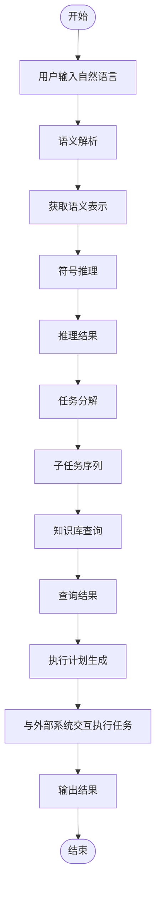
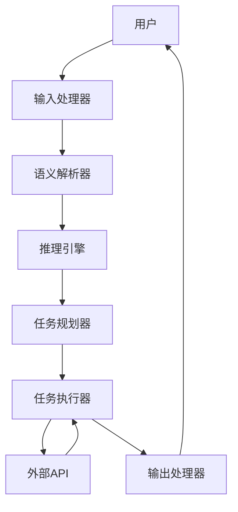

# 【大模型应用开发 动手做AI Agent】构建ReAct Agent

## 1. 背景介绍

随着人工智能技术的快速发展,大型语言模型(Large Language Model,LLM)已经成为当前最具影响力的AI技术之一。LLM通过从海量文本数据中学习,掌握了丰富的自然语言知识和推理能力,可以用于多种自然语言处理任务,如问答、摘要、翻译等。

在LLM的基础上,人们进一步探索了将其与其他AI技术(如计算机视觉、规划与决策等)相结合,打造通用人工智能Agent的可能性。这种AI Agent不仅具备强大的语言理解和生成能力,还可以根据用户需求完成复杂任务,如规划旅游路线、分析财务报表等,被视为通向人工通用智能(Artificial General Intelligence,AGI)的重要一步。

ReAct(Reasoning and Act)就是一种基于LLM的新型AI Agent框架,旨在赋予语言模型"思考和行动"的能力。通过引入符号推理、知识库查询、任务分解等模块,ReAct可以更好地理解用户意图,制定行动计划,并与外部系统交互以完成复杂任务。本文将详细介绍ReAct Agent的核心概念、关键技术,并通过实例讲解如何基于该框架开发实用的AI应用程序。

## 2. 核心概念与联系

ReAct Agent的核心思想是将大型语言模型(LLM)作为中心,与多个功能模块相结合,形成一个统一的智能Agent系统。其中包括以下几个关键概念:

### 2.1 语义解析(Semantic Parsing)

语义解析模块将用户的自然语言输入转化为结构化的语义表示(如逻辑形式、语义框架等),以便后续模块进行理解和推理。常用的语义解析方法包括基于规则的方法、基于机器学习的序列标注方法等。

### 2.2 符号推理(Symbolic Reasoning)

符号推理模块根据语义表示,结合一定的规则和知识库,进行逻辑推理,得出任务计划或中间结果。推理过程通常采用经典的符号推理算法,如规则引擎、规划算法等。

### 2.3 知识库查询(Knowledge Base Querying)

知识库查询模块从外部知识库(如维基百科、事实知识库等)中检索相关信息,为任务完成提供背景知识支持。查询方式包括基于模板的查询、基于语义解析的查询等。

### 2.4 任务分解(Task Decomposition)

任务分解模块将复杂的用户需求拆解为一系列可执行的子任务,并安排子任务的执行顺序。分解策略包括基于规则的分解、基于规划的分解等。

### 2.5 交互与执行(Interaction & Execution)

交互与执行模块负责与外部系统交互(如API调用、Web浏览等),并执行具体的任务操作,最终完成用户需求。

上述模块通过与LLM的交互与反馈,形成了一个闭环的智能Agent系统。Agent根据用户输入,依次经过语义解析、符号推理、知识库查询、任务分解等步骤制定行动计划,并与外部系统交互执行任务,最终输出结果给用户。在这个过程中,LLM起到连接各模块的关键作用。

## 3. 核心算法原理具体操作步骤  

ReAct Agent的核心算法流程如下:



1. **用户输入**：用户通过自然语言表述需求,如"我想安排一次三天两夜的旅行"。

2. **语义解析**：将用户输入转化为结构化的语义表示,如旅行领域的语义框架:
   ```
   旅行请求{
     目的地: 未指定
     出行时间: 未指定 
     天数: 3天2夜
     ...
   }
   ```

3. **符号推理**：基于语义表示和领域知识库(如旅游规划规则),进行符号推理以得出初步的任务计划,如:
   ```
   任务计划{
     步骤1: 确定目的地
     步骤2: 查询交通信息
     步骤3: 预订酒店
     ...  
   }
   ```

4. **任务分解**：将复杂任务分解为可执行的子任务序列,如:
    - 子任务1: 向用户询问目的地偏好
    - 子任务2: 根据偏好查询目的地信息
    - 子任务3: 调用地图API获取路线
    - ...

5. **知识库查询**：根据子任务需求,从相关知识库(如景点数据库、酒店数据库等)查询补充信息。

6. **执行计划生成**:根据查询结果,生成详细的执行计划,包括所需调用的API、参数等。

7. **任务执行**:与外部系统交互(如网页抓取、API调用等),逐步执行子任务。

8. **输出结果**:将执行过程中获得的信息综合起来,形成对用户需求的最终响应。

以上算法流程充分利用了LLM在自然语言理解和生成方面的能力,同时通过引入符号推理、知识库查询等模块,赋予了Agent一定的"思考和规划"能力,使其可以完成复杂的决策和执行任务。

## 4. 数学模型和公式详细讲解举例说明

在ReAct Agent中,数学模型主要应用于以下几个环节:

### 4.1 语义解析

语义解析常常被建模为一个序列标注问题,将自然语言输入$X=\{x_1,x_2,...,x_n\}$映射为语义标记序列$Y=\{y_1,y_2,...,y_n\}$。常用的序列标注模型包括条件随机场(CRF)、循环神经网络(RNN)等。以CRF为例,其目标是学习条件概率:

$$P(Y|X)=\frac{1}{Z(X)}\exp\left(\sum_{i=1}^{n}\sum_{j}{\lambda_jt_j(y_{i-1},y_i,X,i)}+\sum_{k}\mu_ks_k(X,i)\right)$$

其中$t_j$是转移特征函数,捕获相邻标记之间的依赖关系;$s_k$是状态特征函数,描述当前输入和标记的相关性;$\lambda_j$和$\mu_k$是对应的权重参数;$Z(X)$是归一化因子。通过对大量标注数据的训练,CRF可以学习到合理的特征权重,从而对新的输入序列进行准确的语义标注。

### 4.2 符号推理

符号推理过程可以建模为一个规划问题,即在给定的状态空间和操作空间内,寻找一个行动序列使得达到目标状态。一种常用的规划算法是启发式搜索,如A*算法。设$s_0$为初始状态,$s_g$为目标状态,对于状态$s$和操作$a$,令$succ(s,a)$表示由$s$经过$a$可达到的后继状态集合,则A*算法定义了一个估价函数:

$$f(s)=g(s)+h(s)$$

其中$g(s)$表示从$s_0$到达$s$的实际代价,$h(s)$为一个启发式函数,估计从$s$到$s_g$的最小代价。A*算法通过不断扩展$f$值最小的节点,并利用$h$的指导,可以有效地找到从初始状态到目标状态的最优路径。

在ReAct Agent中,可以将任务状态建模为一个事实库,操作即为对事实库的修改(如增删事实),目标状态则对应于完成任务所需的事实集合。通过设计合理的启发式函数$h$,A*算法就可以用于任务规划。

### 4.3 知识库查询

知识库查询可以看作一个信息检索问题。常用的相关性模型包括向量空间模型(VSM)、概率模型等。以VSM为例,对于查询$q$和文档$d$,它们的相关性分数可以计算为:

$$\text{score}(q,d)=\vec{q}\cdot\vec{d}=\sum_{t\in V}q_t\times d_t$$

其中$V$是词汇表,查询向量$\vec{q}$和文档向量$\vec{d}$的每个维度对应于一个词$t$的权重(如TF-IDF值)。通过计算查询和文档向量的余弦相似度,可以衡量它们的语义相关程度。在查询时,系统会检索与查询最相关的前$k$个文档作为结果返回。

此外,一些更先进的模型(如BERT)也可以用于语义匹配,计算查询和文档之间的相关性分数。

以上是ReAct Agent中几个关键环节所涉及的数学模型和公式,实现这些模型有助于提高Agent各个模块的性能,进而完成高质量的任务执行。

## 5. 项目实践:代码实例和详细解释说明

为了更好地理解ReAct Agent的实现细节,我们将通过一个具体的项目实例进行讲解。这个项目旨在开发一个基于ReAct框架的旅游规划助手,用户可以通过自然语言交互的方式,获取旅游路线、酒店、餐馆等信息,并完成在线预订。

### 5.1 系统架构



如上图所示,该系统主要由以下几个模块组成:

- **输入处理器(InputHandler)**: 接收用户的自然语言输入,并进行必要的预处理(如分词、词性标注等)。
- **语义解析器(Parser)**: 将预处理后的输入序列转化为结构化的语义表示,如旅游领域的语义框架。
- **推理引擎(Reasoner)**: 根据语义表示和旅游规划知识库,进行符号推理得出初步的任务计划。
- **任务规划器(Planner)**: 将复杂任务分解为可执行的子任务序列,合理安排执行顺序。
- **任务执行器(Executor)**: 与外部API系统交互,执行具体的子任务操作,如查询景点信息、预订酒店等。
- **输出处理器(OutputHandler)**: 将任务执行的中间结果综合起来,生成对用户的自然语言响应。

### 5.2 关键模块实现

#### 5.2.1 语义解析器

我们使用基于BERT的序列标注模型实现语义解析器。下面是一个示例,将自然语言输入"我想安排一次三天两夜的旅行去北京"转化为语义框架:

```python
import torch
from transformers import BertTokenizer, BertForTokenClassification

# 加载预训练BERT模型和分词器
tokenizer = BertTokenizer.from_pretrained('bert-base-chinese')
model = BertForTokenClassification.from_pretrained('path/to/finetuned/model')

# 对输入进行tokenize
inputs = tokenizer.encode_plus('我想安排一次三天两夜的旅行去北京', return_tensors='pt')

# 执行序列标注
outputs = model(**inputs)[0]
predictions = torch.argmax(outputs, dim=2)

# 解码预测结果
tokens = tokenizer.convert_ids_to_tokens(inputs['input_ids'][0])
labels = ['O' if label == 1 else label_list[label] for label in predictions[0].tolist()]

# 构建语义框架
semantic_frame = {
    '旅行目的': '旅行',
    '天数': '三天两夜',
    '目的地': '北京'
}
```

这里我们首先加载了基于BERT的序列标