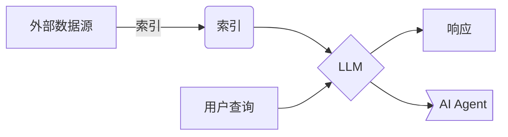

# 【大模型应用开发 动手做AI Agent】简单的LlamaIndex开发示例

## 1.背景介绍

在当前的人工智能发展浪潮中,大语言模型(Large Language Model,LLM)无疑成为了焦点所在。随着模型规模的不断扩大,LLM在自然语言处理、问答系统、内容生成等领域展现出了令人惊叹的能力。然而,仅依赖LLM的生成能力并不足以构建真正智能的应用系统。我们需要将LLM与其他组件相结合,以充分发挥其潜力。

LlamaIndex是一个开源的Python库,旨在简化LLM与外部数据源(如文本文件、网页等)的集成过程。它提供了一种统一的接口,使开发人员能够轻松地将LLM应用于各种数据源,构建智能应用系统。本文将探讨如何使用LlamaIndex快速开发一个简单的AI Agent,为您揭示大模型应用开发的魅力。

## 2.核心概念与联系

在深入探讨LlamaIndex之前,我们需要了解一些核心概念:

### 2.1 LLM(大语言模型)

LLM是一种基于深度学习的自然语言处理模型,能够从大量文本数据中学习语言模式和语义关系。LLM通常具有数十亿甚至数万亿个参数,能够生成看似人类编写的自然语言内容。著名的LLM包括GPT-3、PaLM、ChatGPT等。

### 2.2 索引(Index)

索引是LlamaIndex中的核心概念,它将外部数据源(如文本文件、网页等)转换为LLM可以理解和操作的内部表示形式。索引过程涉及文本分割、向量化和构建数据结构等步骤,以优化LLM的查询和处理效率。

### 2.3 查询(Query)

查询是用户与LLM交互的方式。用户可以提出自然语言查询,LlamaIndex会将查询传递给LLM,并根据索引的内容生成相关的响应。查询可以是简单的问题,也可以是更复杂的任务,如文本总结、分析等。

### 2.4 AI Agent

AI Agent是一种智能应用系统,它集成了LLM、索引和其他组件,能够根据用户的查询执行各种任务。AI Agent可以被视为一个虚拟助手,为用户提供信息、分析和决策支持。

上述概念之间的关系如下所示:



## 3.核心算法原理具体操作步骤

LlamaIndex的核心算法原理可以概括为以下几个步骤:

1. **文本分割(Text Splitting)**: 将原始文本数据划分为多个较小的文本块(chunks),以便后续处理。分割算法通常基于句子边界、最大长度或语义相关性等策略。

2. **向量化(Vectorization)**: 将每个文本块转换为向量表示形式,以便进行相似性计算和索引构建。常用的向量化方法包括TF-IDF、Word2Vec、BERT等。

3. **索引构建(Index Building)**: 根据向量化的文本块,构建适当的数据结构(如倒排索引、K-D树等),以加速查询过程。索引的选择取决于数据规模、查询需求等因素。

4. **相似性计算(Similarity Computation)**: 在查询过程中,计算用户查询与索引中文本块的相似度,以确定最相关的文本块。相似度计算通常基于向量空间模型,如余弦相似度。

5. **查询处理(Query Processing)**: 将用户查询传递给LLM,并将相关文本块的上下文信息提供给LLM,以生成更准确、更丰富的响应。

6. **响应生成(Response Generation)**: LLM根据查询和上下文信息生成自然语言响应,并返回给用户或AI Agent。

以上算法原理的具体实现细节因索引类型和LLM模型而异,但总体思路是相似的。下面是一个使用LlamaIndex构建简单AI Agent的示例:

```python
# 导入必要的库
from llama_index import GPTSimpleVectorIndex, SimpleDirectoryReader

# 加载文本数据
documents = SimpleDirectoryReader('data').load_data()

# 构建索引
index = GPTSimpleVectorIndex.from_documents(documents)

# 查询
query = "什么是LlamaIndex?"
response = index.query(query)
print(response)
```

在这个示例中,我们首先使用`SimpleDirectoryReader`加载文本数据,然后使用`GPTSimpleVectorIndex`构建索引。最后,我们提出一个查询,并获取LLM生成的响应。

## 4.数学模型和公式详细讲解举例说明

在LlamaIndex的算法原理中,向量化和相似性计算是两个关键步骤,它们涉及到一些数学模型和公式。

### 4.1 向量化

向量化是将文本数据转换为向量表示形式的过程。常用的向量化方法包括:

1. **TF-IDF(Term Frequency-Inverse Document Frequency)**: TF-IDF是一种基于词频统计的向量化方法,它将文本表示为一个高维稀疏向量,其中每个维度对应一个词项,值为该词项在文本中的TF-IDF权重。TF-IDF权重计算公式如下:

$$\text{tfidf}(t, d, D) = \text{tf}(t, d) \times \text{idf}(t, D)$$

其中,
- $\text{tf}(t, d)$ 表示词项 $t$ 在文档 $d$ 中的词频
- $\text{idf}(t, D) = \log \frac{|D|}{|\{d \in D: t \in d\}|}$ 表示词项 $t$ 的逆文档频率,用于降低常见词项的权重

2. **Word Embedding(词嵌入)**: 词嵌入是一种基于神经网络的向量化方法,它将每个词项映射到一个低维密集向量空间中,相似的词项在向量空间中也相近。常用的词嵌入模型包括Word2Vec、GloVe等。

3. **Sentence Embedding(句子嵌入)**: 句子嵌入是将整个句子或段落映射为单个向量的方法,常用模型包括BERT、RoBERTa等。

无论采用何种向量化方法,最终目标都是将文本数据转换为向量形式,以便进行相似性计算和索引构建。

### 4.2 相似性计算

相似性计算是根据向量表示形式,计算两个文本之间的相似程度。常用的相似性度量包括:

1. **余弦相似度(Cosine Similarity)**: 余弦相似度是计算两个向量之间夹角余弦值的度量,公式如下:

$$\text{sim}_\text{cosine}(\vec{a}, \vec{b}) = \frac{\vec{a} \cdot \vec{b}}{||\vec{a}|| \times ||\vec{b}||}$$

其中,
- $\vec{a}$ 和 $\vec{b}$ 分别表示两个向量
- $\vec{a} \cdot \vec{b}$ 表示两个向量的点积
- $||\vec{a}||$ 和 $||\vec{b}||$ 分别表示两个向量的范数(通常为 $L_2$ 范数)

余弦相似度的取值范围为 $[-1, 1]$,值越接近 1 表示两个向量越相似。

2. **欧几里得距离(Euclidean Distance)**: 欧几里得距离是计算两个向量之间的直线距离,公式如下:

$$\text{dist}_\text{euclidean}(\vec{a}, \vec{b}) = \sqrt{\sum_{i=1}^{n} (a_i - b_i)^2}$$

其中,
- $\vec{a} = (a_1, a_2, \dots, a_n)$ 和 $\vec{b} = (b_1, b_2, \dots, b_n)$ 分别表示两个 $n$ 维向量
- $a_i$ 和 $b_i$ 分别表示第 $i$ 个维度上的分量值

欧几里得距离的取值范围为 $[0, \infty)$,值越小表示两个向量越相似。

在LlamaIndex中,相似性计算通常基于余弦相似度,但也可以使用其他距离度量。选择合适的相似性度量对于提高索引和查询的准确性至关重要。

## 5.项目实践:代码实例和详细解释说明

接下来,我们将通过一个实际项目示例,演示如何使用LlamaIndex构建一个简单的AI Agent。在这个示例中,我们将使用一些维基百科文章作为数据源,并基于这些文章构建索引,然后用户可以提出自然语言查询,AI Agent将根据索引内容生成相关响应。

### 5.1 准备数据

首先,我们需要准备一些文本数据作为数据源。在这个示例中,我们将使用维基百科上的几篇文章,并将它们保存在一个名为`data`的目录中。

```
data/
    ├── article1.txt
    ├── article2.txt
    └── ...
```

### 5.2 导入必要的库

接下来,我们需要导入LlamaIndex和其他必要的库:

```python
from llama_index import GPTSimpleVectorIndex, SimpleDirectoryReader
from langchain.llms import OpenAI
import os
```

- `GPTSimpleVectorIndex`是LlamaIndex提供的一种索引类型,它使用向量相似性来检索相关文本块。
- `SimpleDirectoryReader`是一个用于读取目录中文件的工具类。
- `OpenAI`是一个用于与OpenAI API交互的客户端,我们将使用它来访问GPT-3模型。

### 5.3 加载数据并构建索引

现在,我们可以加载数据并构建索引:

```python
# 设置OpenAI API密钥
os.environ["OPENAI_API_KEY"] = "your_openai_api_key"

# 加载文本数据
documents = SimpleDirectoryReader('data').load_data()

# 构建索引
index = GPTSimpleVectorIndex.from_documents(documents)
```

1. 首先,我们设置OpenAI API密钥,以便能够访问GPT-3模型。
2. 然后,我们使用`SimpleDirectoryReader`加载`data`目录中的所有文本文件。
3. 最后,我们调用`GPTSimpleVectorIndex.from_documents`方法,基于加载的文本数据构建索引。

### 5.4 查询和响应

现在,我们可以提出自然语言查询,并获取AI Agent的响应:

```python
# 查询
query = "什么是LlamaIndex?"
response = index.query(query)
print(response)
```

在这个示例中,我们提出了一个简单的查询"什么是LlamaIndex?",AI Agent将根据索引中的相关内容生成响应。

### 5.5 完整代码

下面是完整的代码:

```python
from llama_index import GPTSimpleVectorIndex, SimpleDirectoryReader
from langchain.llms import OpenAI
import os

# 设置OpenAI API密钥
os.environ["OPENAI_API_KEY"] = "your_openai_api_key"

# 加载文本数据
documents = SimpleDirectoryReader('data').load_data()

# 构建索引
index = GPTSimpleVectorIndex.from_documents(documents)

# 查询
query = "什么是LlamaIndex?"
response = index.query(query)
print(response)
```

通过这个简单的示例,我们可以看到如何使用LlamaIndex快速构建一个AI Agent。当然,在实际应用中,我们可能需要进行更多的配置和定制,以满足特定的需求。

## 6.实际应用场景

LlamaIndex及其集成的LLM技术可以应用于各种场景,为用户提供智能化的服务和支持。以下是一些典型的应用场景:

1. **智能问答系统**: 基于大量的知识库或文档,构建智能问答系统,为用户提供准确、相关的答复。

2. **文本总结和分析**: 对大量文本数据进行自动总结和分析,提取关键信息和见解。

3. **内容生成**: 利用LLM的生成能力,自动创作文章、新闻、故事等内容。

4. **客户服务**: 构建智能客户服务助手,提供个性化的响应和建议。

5. **研究助手**: 协助研究人员快速查找相关文献,提供洞见和建议。

6. **教育辅助**: 为学生提供个性化的学习资源和解答,提高教学效率。

7. **医疗诊断**: 结合医学知识库,为医生提供辅助诊断和治疗建议。

8. **法律咨询**: 基于法律文件和