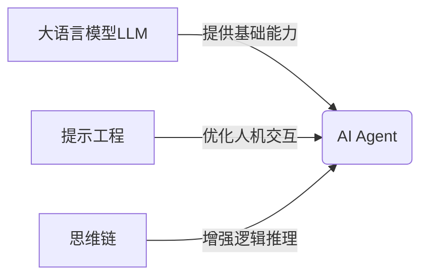

# 【大模型应用开发 动手做AI Agent】自动办公好助手

## 1. 背景介绍
### 1.1 人工智能时代的来临
随着人工智能技术的飞速发展,特别是大语言模型(LLM)的出现,AI已经开始渗透到我们生活和工作的方方面面。办公自动化是AI应用的一个重要领域,通过AI Agent技术,我们可以大大提高工作效率,节省时间成本。

### 1.2 AI Agent的定义与特点
AI Agent是一种智能化的软件程序,它能够根据用户的指令,自主完成各种办公任务,如信息检索、数据分析、文档撰写等。与传统的办公软件相比,AI Agent具有以下特点:

- 自主性:能够根据用户的需求,自主制定并执行任务计划。
- 交互性:通过自然语言交互,让人机交互更加友好便捷。 
- 学习性:通过机器学习不断优化,使得任务处理更加高效准确。
- 泛化性:可以处理多个领域的办公任务,实现一站式智能办公。

### 1.3 AI Agent在办公领域的应用前景
随着AI技术的不断进步,AI Agent必将在未来办公领域扮演越来越重要的角色。一方面,它可以替代人工完成大量重复性、规则性的工作,提高效率;另一方面,它可以辅助人类进行创造性工作,激发更多灵感。可以预见,拥抱AI Agent,实现人机协同,将成为未来办公的新模式。

## 2. 核心概念与联系
### 2.1 大语言模型(LLM)
大语言模型是AI Agent的核心组件之一。它是一种基于海量文本数据训练的深度学习模型,能够理解和生成接近人类水平的自然语言。目前主流的LLM包括OpenAI的GPT系列、Google的BERT、微软的Megatron-Turing NLG等。LLM为AI Agent提供了强大的语言理解与生成能力。

### 2.2 提示工程(Prompt Engineering) 
提示工程是指如何设计出优质的提示(Prompt),使AI模型能够更好地理解用户意图,给出符合需求的回答。一个好的提示需要明确任务目标、输入输出格式、评估标准等关键要素。提示工程是应用LLM构建AI Agent的关键技术之一。

### 2.3 思维链(Chain of Thought)
思维链是一种增强大语言模型推理能力的技术。通过引导模型进行逐步推理,将复杂问题分解为一系列简单的中间步骤,可以大幅提升模型对逻辑推理类任务的表现。思维链使得AI Agent具备了一定的逻辑分析与问题解决能力。

### 2.4 概念之间的联系
下面是LLM、提示工程、思维链三个核心概念之间的联系:



LLM为AI Agent提供语言理解与生成的基础能力,提示工程优化了人机交互体验,思维链赋予了逻辑推理能力。三者相辅相成,共同构成了AI Agent的核心技术内核。

## 3. 核心算法原理具体操作步骤
### 3.1 基于LLM的文本生成算法
1. 将海量文本数据进行预处理,进行分词、构建词表等;
2. 使用Transformer等模型对文本进行编码,学习其中的语义信息;
3. 通过自回归任务学习文本的生成规律,即根据前文预测下一个词;
4. 使用beam search、nucleus sampling等解码策略生成连贯的文本;
5. 通过引入各种约束(如思维链)对生成的文本进行优化与改进。

### 3.2 基于提示工程的任务描述生成
1. 定义任务的关键要素,如输入、输出、步骤、评估标准等;
2. 使用自然语言将关键要素拼接成连贯的提示模板;
3. 根据具体任务,向模板中填充特定的信息,生成完整的提示;
4. 将生成的提示输入LLM,引导其进行后续处理;
5. 分析LLM的输出,必要时对提示进行迭代优化。

### 3.3 基于思维链的逻辑推理
1. 将复杂的推理任务分解为多个简单的中间步骤; 
2. 对每个步骤设计思维链提示,引导LLM进行因果推理;
3. 将前一步的输出作为下一步的输入,形成逻辑链条;
4. 汇总所有步骤的结果,得出最终的推理结论;
5. 设计反例对推理过程进行验证,不断优化思维链提示。

通过以上步骤,即可利用LLM、提示工程、思维链构建一个具备基本办公能力的AI Agent原型系统。在实践中,还需要在此基础上进行场景定制与功能扩展。

## 4. 数学模型和公式详细讲解举例说明
### 4.1 Transformer模型
Transformer是大语言模型的核心组件,其基本结构如下:

$$
\begin{aligned}
\mathrm{Attention}(Q, K, V) &= \mathrm{softmax}(\frac{QK^T}{\sqrt{d_k}})V \\
\mathrm{MultiHead}(Q, K, V) &= \mathrm{Concat}(\mathrm{head_1}, ..., \mathrm{head_h})W^O \\
\text{where}~\mathrm{head_i} &= \mathrm{Attention}(QW_i^Q, KW_i^K, VW_i^V)
\end{aligned}
$$

其中$Q$、$K$、$V$分别表示查询、键、值,$W^Q$、$W^K$、$W^V$、$W^O$为可学习的权重矩阵,$d_k$为键向量的维度。

举例来说,假设我们有一个句子"The quick brown fox jumps over the lazy dog",Transformer会将其编码为一个向量序列:

$$X = [x_{the}, x_{quick}, x_{brown}, x_{fox}, x_{jumps}, x_{over}, x_{the}, x_{lazy}, x_{dog}]$$

然后通过自注意力机制计算句子中各个词之间的关联度,得到一个自注意力矩阵:

$$
A = 
\begin{bmatrix}
a_{11} & a_{12} & \dots & a_{1n} \\
a_{21} & a_{22} & \dots & a_{2n} \\
\vdots & \vdots & \ddots & \vdots \\
a_{n1} & a_{n2} & \dots & a_{nn}
\end{bmatrix}
$$

其中$a_{ij}$表示第$i$个词对第$j$个词的注意力权重。最后将自注意力矩阵应用于原始词向量,得到更新后的词表示:

$$
\begin{aligned}
y_1 &= a_{11}x_{the} + a_{12}x_{quick} + \dots + a_{1n}x_{dog} \\
y_2 &= a_{21}x_{the} + a_{22}x_{quick} + \dots + a_{2n}x_{dog} \\
&\vdots \\
y_n &= a_{n1}x_{the} + a_{n2}x_{quick} + \dots + a_{nn}x_{dog}
\end{aligned}
$$

通过这种自注意力机制,Transformer可以学习到词与词之间的依赖关系,从而更好地理解整个句子的语义。

### 4.2 Beam Search解码
Beam Search是一种启发式图搜索算法,常用于自然语言生成任务。其核心思想是每次只保留概率最大的$k$个候选结果,直到达到停止条件。

具体算法如下:
1. 定义束宽$k$,表示每次保留的候选数;
2. 初始化$k$个候选序列,置于集合$S$中;
3. 对于$S$中的每个候选$y$:
   - 计算$y+w$的条件概率$P(w|y)$,其中$w$为词表中的词;
   - 选取概率最大的$k$个$y+w$,置于集合$S'$中;
4. 用$S'$替换$S$,重复步骤3,直到达到停止条件;
5. 选取$S$中概率最大的序列作为最终结果。

举例来说,假设我们要生成一个句子,词表为$V=\{a,b,c,d,e\}$,束宽$k=2$。过程如下:

- 初始化:$S=\{[<start>], [<start>]\}$
- 第一步:
   - $P(a|<start>)=0.2, P(b|<start>)=0.3, P(c|<start>)=0.1, P(d|<start>)=0.4, P(e|<start>)=0.0$
   - $S'=\{[<start>,d], [<start>,b]\}$
- 第二步:
   - $P(a|<start>,d)=0.1, P(b|<start>,d)=0.2, P(c|<start>,d)=0.5, P(d|<start>,d)=0.1, P(e|<start>,d)=0.1$
   - $P(a|<start>,b)=0.0, P(b|<start>,b)=0.0, P(c|<start>,b)=0.6, P(d|<start>,b)=0.2, P(e|<start>,b)=0.2$
   - $S=\{[<start>,d,c], [<start>,b,c]\}$
- 停止条件:假设句子以$<end>$结尾
   - $P(<end>|<start>,d,c)=0.8, P(<end>|<start>,b,c)=0.7$
   - 最终结果:[<start>,d,c,<end>]

通过Beam Search,我们可以在保证效率的同时生成质量较高的句子。但$k$值设置过大会导致计算开销增加,而设置过小又可能错失最优解,需要根据实际任务进行权衡。

## 5. 项目实践：代码实例和详细解释说明
下面我们使用Python实现一个基于LLM的简单AI Agent。为了简化流程,我们直接调用OpenAI的API接口。

```python
import openai

# 设置API密钥
openai.api_key = "your_api_key"

# 定义AI Agent函数
def ai_agent(prompt):
    # 设置模型参数
    model_engine = "text-davinci-003"
    temperature = 0.7
    max_tokens = 1024
    top_p = 1
    frequency_penalty = 0
    presence_penalty = 0
    
    # 调用API生成回复
    response = openai.Completion.create(
        engine=model_engine,
        prompt=prompt,
        temperature=temperature,
        max_tokens=max_tokens,
        top_p=top_p,
        frequency_penalty=frequency_penalty,
        presence_penalty=presence_penalty
    )
    
    # 提取生成的文本
    reply = response.choices[0].text.strip()
    
    return reply

# 测试AI Agent
prompt = "请用Python写一个快速排序算法"
reply = ai_agent(prompt)
print(reply)
```

代码解释:
1. 首先导入openai库,设置API密钥;
2. 定义ai_agent函数,接受一个字符串prompt作为输入;
3. 设置模型参数,包括使用的模型(text-davinci-003)、生成温度(temperature)、最大单词数(max_tokens)等;
4. 调用openai.Completion.create方法,传入模型参数和prompt,生成回复;
5. 从API响应中提取生成的文本,去除首尾空格后返回;
6. 测试AI Agent,输入一个Python排序算法的需求,打印生成的代码。

运行结果示例:
```python
def quick_sort(arr):
    if len(arr) <= 1:
        return arr
    else:
        pivot = arr[0]
        less = [x for x in arr[1:] if x <= pivot]
        greater = [x for x in arr[1:] if x > pivot]
        return quick_sort(less) + [pivot] + quick_sort(greater)

# 测试代码
arr = [3, 6, 8, 10, 1, 2, 1]
print("原数组:", arr)
print("排序后:", quick_sort(arr))
```

可以看到,AI Agent根据我们的需求,自动生成了一段Quick Sort的Python实现代码,并附上了测试样例。通过这种方式,我们可以快速构建一个简单的代码生成机器人,辅助日常的开发工作。

当然,这只是一个最基本的例子。在实际应用中,我们还需要加入更多的提示优化、思维链推理、知识库检索等功能,以进一步提升AI Agent的性能。同时,还需要根据具体业务场景,对Agent进行微调和定制化开发。

## 6. 实际应用场景
AI Agent在办公自