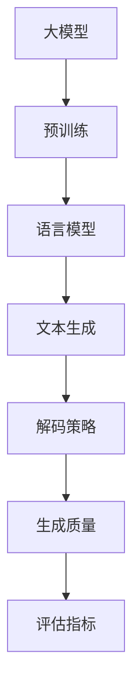
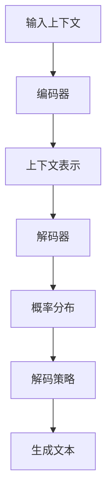

# 【大模型应用开发 动手做AI Agent】配置文本生成引擎大模型

## 1. 背景介绍

### 1.1 人工智能大模型的兴起

近年来,人工智能领域取得了长足的进步,其中大模型(Large Model)无疑是最具革命性的突破之一。大模型是指具有数十亿甚至上万亿参数的深度神经网络模型,通过在海量数据上进行预训练,可以学习到丰富的知识和语义表示能力。

大模型的出现极大地推动了自然语言处理、计算机视觉等领域的发展,展现出了令人惊叹的泛化能力。以GPT-3、PaLM、ChatGPT等著名的大语言模型为例,它们不仅能够进行高质量的文本生成、问答和任务完成,而且还能够根据上下文理解并生成相关的图像、代码等多模态输出。

### 1.2 大模型在文本生成中的应用

文本生成是大模型的一个重要应用场景。通过对大量高质量文本数据进行预训练,大模型可以学习到丰富的语言知识和生成能力,从而生成流畅、连贯、内容丰富的文本。

大模型在文本生成领域的应用非常广泛,包括但不限于:

- 内容创作:自动生成新闻、故事、诗歌、广告文案等内容
- 对话系统:生成自然、上下文相关的对话响应
- 问答系统:根据问题生成准确、详细的答复
- 文本续写:根据给定的文本开头,自动续写剩余内容
- 文本摘要:自动生成文本的摘要和概括
- ...

相比传统的基于规则或统计模型的文本生成方法,基于大模型的文本生成系统具有更强的泛化能力,可以生成更加自然、流畅、丰富多样的文本内容。

### 1.3 本文内容概览

本文将重点介绍如何配置和使用大模型进行文本生成任务。我们将从以下几个方面进行详细阐述:

- 大模型文本生成的核心概念和原理
- 文本生成任务的数学建模和算法流程
- 基于Python的代码实现示例
- 实际应用场景和案例分析
- 工具和资源推荐
- 未来发展趋势和挑战探讨
- 常见问题解答

通过本文,读者将能够全面深入地理解大模型在文本生成任务中的应用,掌握相关的核心概念、算法原理和实现技术,为将来开发文本生成系统奠定坚实的基础。

## 2. 核心概念与联系

在深入探讨大模型文本生成的具体细节之前,我们有必要先了解一些核心概念和它们之间的联系,为后续内容的理解打下基础。

### 2.1 大模型(Large Model)

所谓大模型,是指具有数十亿甚至上万亿参数的深度神经网络模型。这些庞大的模型通过在海量数据上进行预训练,可以学习到丰富的知识和语义表示能力,从而在各种下游任务上表现出卓越的泛化性能。

大模型的出现打破了传统的"数据 -> 模型 -> 任务"范式,使得我们可以先训练一个通用的大模型,然后将其应用于多种不同的任务,从而大大提高了模型的复用性和效率。

### 2.2 预训练(Pre-training)

预训练是指在大量通用数据(如网页、书籍等)上对模型进行初始训练,使其学习到基础的语言知识和表示能力。预训练过程通常采用自监督学习的方式,例如掩码语言模型(Masked Language Modeling)和下一句预测(Next Sentence Prediction)等任务。

经过预训练后,模型可以捕捉到丰富的语义和语法信息,为后续的任务精调(Fine-tuning)或者直接应用奠定了基础。值得一提的是,预训练过程往往非常耗时且需要大量计算资源,但只需完成一次即可,之后可以在多个下游任务中复用预训练模型。

### 2.3 语言模型(Language Model)

语言模型是自然语言处理领域的一个核心概念,其目标是学习语言的概率分布,即给定一个文本序列,计算它出现的概率。语言模型可以用于多种任务,如文本生成、机器翻译、语音识别等。

在大模型的背景下,我们通常将预训练过程视为一种特殊的语言模型训练,旨在学习通用的语言表示。而后续的任务精调则是在预训练模型的基础上,针对特定任务进行进一步的语言模型训练。

### 2.4 文本生成(Text Generation)

文本生成是指根据给定的上下文或提示,自动生成连贯、流畅、符合语义的文本内容。这是大模型在自然语言处理领域的一个重要应用场景。

在文本生成任务中,我们通常将模型视为一个条件语言模型,即给定上下文,预测下一个词或句子的概率分布。通过对概率分布进行采样或搜索,我们可以生成新的文本序列。

### 2.5 解码策略(Decoding Strategy)

解码策略指的是在文本生成过程中,如何根据模型输出的概率分布来生成实际的文本序列。常见的解码策略包括:

- 贪婪搜索(Greedy Search):每次选择概率最大的词
- 束搜索(Beam Search):保留若干个最有可能的候选序列,并逐步延展
- 核采样(Nucleus Sampling):根据累积概率密度函数采样词语
- 温度采样(Temperature Sampling):调整概率分布的熵值,控制生成的多样性
- ...

不同的解码策略会影响生成文本的质量、多样性和计算效率,需要根据具体任务和要求进行权衡选择。

### 2.6 生成质量(Generation Quality)

生成质量是评估文本生成系统性能的关键指标。一个高质量的文本生成系统应该能够生成流畅、连贯、语义合理且内容丰富的文本。常见的评估生成质量的维度包括:

- 流畅性(Fluency):生成的文本是否通顺、无语法错误
- 一致性(Consistency):上下文连贯,无逻辑矛盾
- 信息量(Informativeness):内容丰富,包含足够信息
- 多样性(Diversity):生成内容多样,不过于重复
- 相关性(Relevance):与给定主题或上下文相关
- ...

### 2.7 评估指标(Evaluation Metrics)

为了客观地评估文本生成系统的性能,我们需要一些定量的评估指标。常见的评估指标包括:

- 困惑度(Perplexity):衡量语言模型对数据的概率估计质量
- BLEU(Bilingual Evaluation Understudy):基于n-gram精确匹配计算相似性分数
- ROUGE(Recall-Oriented Understudy for Gisting Evaluation):基于n-gram重叠率计算相似性分数
- METEOR(Metric for Evaluation of Translation with Explicit ORdering):除了精确匹配,还考虑了词语的阶和语义相似度
- BERTScore:利用预训练的BERT模型计算句子的语义相似度
- ...

不同的评估指标侧重于不同的质量维度,通常需要结合多个指标进行综合评估。此外,人工评估也是必不可少的补充。

以上就是大模型文本生成任务中的一些核心概念及它们之间的联系。这些概念为后续内容的理解奠定了基础,接下来我们将深入探讨具体的算法原理和实现细节。

## 3. 核心算法原理具体操作步骤

在了解了核心概念之后,我们接下来深入探讨大模型文本生成任务的核心算法原理和具体操作步骤。

### 3.1 输入编码

文本生成任务的第一步是将输入的上下文(如提示、问题等)编码为模型可以理解的表示形式。这通常涉及以下几个步骤:

1. **分词(Tokenization)**: 将原始文本按照一定规则(如字符、子词、词等)分割成一系列token。
2. **Token映射(Token Mapping)**: 将每个token映射为一个对应的数值ID。
3. **位置编码(Positional Encoding)**: 为每个token添加位置信息,以捕捉序列的顺序关系。
4. **其他编码(Other Encodings)**: 根据需要添加其他辅助信息,如注意力掩码等。

经过上述步骤,原始文本就被转换为一个模型可以接受的数值表示形式,作为编码器的输入。

### 3.2 上下文表示

编码器的主要作用是从输入的token序列中捕捉上下文语义信息,并生成对应的上下文表示。

在大模型中,编码器通常采用基于自注意力机制(Self-Attention)的Transformer结构。自注意力机制允许每个token关注到其他token,从而建模长距离依赖关系。通过多层自注意力和前馈网络的组合,编码器可以学习到丰富的上下文语义表示。

对于给定的输入序列 $X = (x_1, x_2, ..., x_n)$,编码器将输出对应的上下文表示 $C = (c_1, c_2, ..., c_n)$,其中每个 $c_i$ 编码了以 $x_i$ 为中心的上下文信息。

### 3.3 解码与生成

解码器的任务是根据编码器输出的上下文表示 $C$,生成目标文本序列 $Y = (y_1, y_2, ..., y_m)$。

解码器也采用基于自注意力的Transformer结构,但与编码器不同的是,它还引入了编码器-解码器注意力机制(Encoder-Decoder Attention),允许每个生成token关注到输入序列的上下文表示,从而实现有条件的文本生成。

具体地,解码器按照自回归(Auto-Regressive)的方式逐个生成token:

1. 首先,将上一个时间步的生成token $y_{t-1}$ 和上下文表示 $C$ 输入解码器
2. 解码器输出当前时间步的隐状态表示 $s_t$
3. 将隐状态 $s_t$ 输入到输出层(通常为线性层和Softmax),得到当前时间步所有token的生成概率分布 $P(y_t|y_{<t}, C)$
4. 根据概率分布和解码策略(如贪婪搜索、束搜索等)采样或搜索得到 $y_t$
5. 重复上述过程,直到生成终止(如达到最大长度或遇到终止符)

通过上述自回归过程,解码器可以生成任意长度的文本序列。值得注意的是,由于每个时间步的计算都依赖于之前生成的token,因此解码过程无法完全并行化,这也是当前大模型推理效率较低的一个重要原因。

### 3.4 训练目标

在文本生成任务中,我们通常将模型训练为一个条件语言模型,目标是最大化给定上下文 $C$ 下目标序列 $Y$ 的条件概率 $P(Y|C)$。

具体来说,对于每个训练样本 $(C, Y)$,我们将最小化模型输出的交叉熵损失:

$$\mathcal{L}(C, Y) = -\sum_{t=1}^{m}\log P(y_t|y_{<t}, C)$$

其中 $m$ 是目标序列的长度。

通过在大量标注数据上最小化损失函数,模型可以学习到生成高质量文本所需的参数。在实际应用中,我们还可以引入其他辅助目标(如关注机制损失、覆盖率损失等)来进一步提升模型性能。

### 3.5 生成策略

在推理(Inference)阶段,我们需要一种策略来根据模型输出的概率分布生成实际的文本序列。常见的生成策略包括:

1. **贪婪