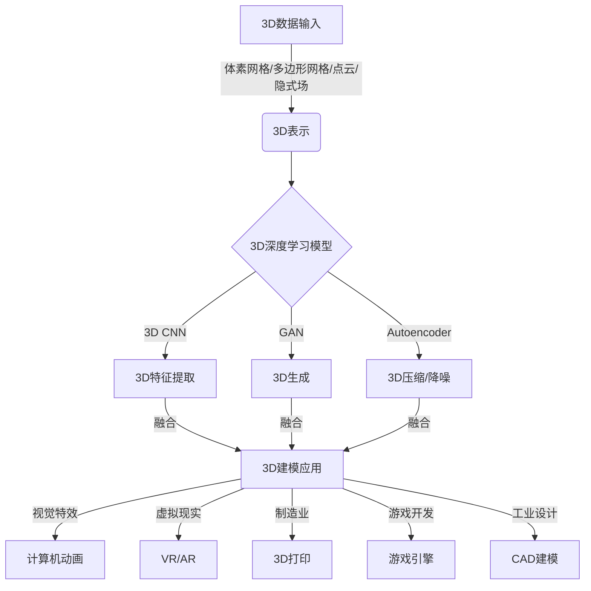

# 一切皆是映射：3D建模与深度学习技术的融合

## 1. 背景介绍

在过去的几十年里,三维(3D)建模技术在各个领域得到了广泛应用,包括计算机动画、视觉特效、虚拟现实、增强现实、工业设计等。传统的3D建模流程通常依赖于人工创建和编辑3D模型,这种方式既耗时又昂贵。随着深度学习技术的不断发展,基于数据驱动的3D建模方法正在兴起,为自动化和智能化的3D内容创作带来了新的可能性。

### 1.1 3D建模的重要性

3D建模是将真实世界的物体或场景转化为数字化的三维几何表示的过程。准确的3D模型对于许多应用程序至关重要,例如:

- 视觉特效和动画制作
- 虚拟现实和增强现实体验
- 3D打印和制造
- 游戏开发
- 建筑和工业设计

### 1.2 传统3D建模的挑战

传统的3D建模过程存在以下几个主要挑战:

- 耗时耗力:创建高质量的3D模型需要大量的人工劳动,包括建模、纹理绘制、光照设置等。
- 缺乏自动化:大多数3D建模软件缺乏智能化和自动化功能,无法从数据中学习和优化建模流程。
- 泛化能力差:手工创建的3D模型通常只能表示特定的对象或场景,难以泛化到其他类似的情况。

### 1.3 深度学习在3D建模中的作用

深度学习技术为3D建模带来了新的机遇,可以通过从大量数据中学习,实现3D内容的自动生成、优化和增强。具体来说,深度学习可以应用于以下3D建模任务:

- 3D重建:从2D图像或3D扫描数据重建出完整的3D模型。
- 3D生成:直接从随机噪声或低维条件输入生成新的3D形状。
- 3D编辑:对现有的3D模型进行智能化编辑和优化,例如细化网格、增强细节、风格迁移等。
- 3D理解:从3D数据中学习对象的结构和语义信息,为后续的建模和渲染提供指导。

通过将3D建模与深度学习相结合,我们可以极大地提高3D内容创作的效率和质量,并开辟出全新的应用场景。

## 2. 核心概念与联系

要理解3D建模与深度学习技术的融合,我们需要先了解一些核心概念及它们之间的联系。

### 2.1 3D表示

在将3D数据输入深度学习模型之前,我们需要将其转换为适当的数值表示形式。常见的3D表示方式包括:

1. **体素网格(Voxel Grid)**: 将3D空间划分为规则的三维网格,每个网格单元(体素)表示该位置是否被占据。体素网格通常用于表示密集的3D数据,如CT扫描或3D重构结果。

2. **多边形网格(Polygon Mesh)**: 由一系列顶点、边和面组成的曲面近似表示。多边形网格广泛用于表示3D模型,具有精确的几何形状和拓扑结构。

3. **点云(Point Cloud)**: 由一组无序的三维点组成,通常来自3D扫描仪或深度相机。点云数据通常是稀疏的,需要进一步处理才能重构出完整的3D模型。

4. **隐式场(Implicit Field)**: 通过一个连续的函数将3D空间映射到标量场或向量场,等值面即表示3D表面。隐式场可以精确表示复杂的3D形状,并具有良好的连续性和可微性。

不同的3D表示形式各有优缺点,选择合适的表示方式对于深度学习模型的性能至关重要。

### 2.2 3D卷积神经网络

卷积神经网络(CNN)在2D图像领域取得了巨大成功,但直接将其应用于3D数据会面临一些挑战,例如计算量大、内存占用高等。为了解决这些问题,研究人员提出了3D卷积神经网络(3D CNN),它在三个空间维度上进行卷积运算,可以直接处理体素网格或点云数据。

3D CNN的核心思想是将传统的2D卷积核扩展到3D空间,通过在三个维度上滑动3D卷积核来提取3D特征。这种方法保留了空间信息,并且可以自动学习3D数据的层次特征表示。

### 2.3 生成对抗网络

生成对抗网络(GAN)是一种基于深度学习的生成模型,由一个生成器(Generator)和一个判别器(Discriminator)组成。生成器的目标是生成逼真的数据样本,而判别器则试图区分生成的样本和真实的数据样本。通过生成器和判别器之间的对抗训练,GAN可以学习到数据的真实分布,并生成新的、逼真的样本。

在3D建模领域,GAN被广泛用于3D形状生成、3D样式迁移、3D超分辨率重建等任务。例如,一些工作使用3D卷积GAN直接从随机噪声生成3D物体模型;另一些工作则利用条件GAN从低分辨率输入生成高分辨率的3D模型。

### 2.4 自编码器

自编码器(Autoencoder)是一种无监督学习模型,它通过压缩和重构输入数据来学习数据的潜在表示。自编码器由两部分组成:编码器(Encoder)将输入数据映射到潜在空间,解码器(Decoder)则将潜在表示重构回原始输入。

在3D建模中,自编码器常被用于3D数据的压缩和降噪。例如,一些工作使用3D卷积自编码器对点云或体素数据进行压缩和解压,以减小存储和传输开销;另一些工作则利用自编码器从噪声数据中重建出清晰的3D模型。

自编码器还可以与其他模型(如GAN)相结合,用于各种3D生成和编辑任务。

### 2.5 Mermaid 流程图

以下是3D建模与深度学习技术融合的核心概念及其关系的 Mermaid 流程图:

在上述流程中,3D数据首先被转换为适当的表示形式,如体素网格、多边形网格、点云或隐式场。然后,不同的3D深度学习模型(如3D CNN、GAN和自编码器)被应用于这些表示,以提取特征、生成新形状或压缩/降噪数据。最后,这些模型的输出被综合应用于各种3D建模任务,包括计算机动画、虚拟现实、3D打印、游戏开发和工业设计等领域。

通过将3D建模与深度学习技术相结合,我们可以实现更加智能化、自动化和高效的3D内容创作流程。

## 3. 核心算法原理具体操作步骤

在本节中,我们将深入探讨一些核心算法的原理和具体操作步骤,以帮助读者更好地理解3D建模与深度学习技术的融合。

### 3.1 3D卷积神经网络

3D卷积神经网络(3D CNN)是将传统2D卷积神经网络扩展到三维空间的一种方法。它可以直接处理体素网格或点云数据,并学习3D数据的层次特征表示。

3D CNN的核心操作步骤如下:

1. **3D卷积(3D Convolution)**: 在三个空间维度上滑动3D卷积核,对输入数据进行卷积运算。这个过程可以提取局部的3D特征,例如边缘、角点等。

2. **3D池化(3D Pooling)**: 对卷积特征图进行下采样,以减小特征图的空间分辨率,提高模型的平移不变性和鲁棒性。常用的池化操作包括最大池化和平均池化。

3. **非线性激活(Non-linear Activation)**: 通过应用非线性激活函数(如ReLU)来增加网络的表达能力,使其能够学习更复杂的特征映射。

4. **全连接层(Fully Connected Layer)**: 将3D特征图展平并输入全连接层,用于进行高层次的特征整合和任务预测。

5. **损失函数(Loss Function)**: 根据具体任务定义合适的损失函数,例如分类任务使用交叉熵损失,回归任务使用均方误差损失等。

6. **反向传播(Backpropagation)**: 通过反向传播算法计算损失函数相对于网络参数的梯度,并使用优化器(如SGD、Adam等)更新网络参数。

7. **模型训练(Model Training)**: 在训练数据集上反复迭代上述步骤,直到模型收敛或达到预期性能。

通过端到端的训练,3D CNN可以自动学习出适合于特定任务的3D特征表示,并将其应用于3D物体分类、3D目标检测、3D语义分割等任务中。

### 3.2 3D生成对抗网络

3D生成对抗网络(3D GAN)是将生成对抗网络的思想应用于3D数据的一种方法。它可以用于直接生成新的3D形状,或从低分辨率输入生成高分辨率的3D模型。

3D GAN的核心操作步骤如下:

1. **生成器(Generator)**: 生成器是一个深度神经网络,它将随机噪声或条件输入(如低分辨率3D数据)映射到目标3D输出空间。生成器的目标是生成逼真的3D数据样本,以欺骗判别器。

2. **判别器(Discriminator)**: 判别器也是一个深度神经网络,它接收真实的3D数据样本和生成器生成的假样本作为输入,并尝试区分它们是真是假。判别器的目标是最大化真实样本的得分,最小化假样本的得分。

3. **对抗训练(Adversarial Training)**: 生成器和判别器通过对抗训练的方式相互竞争。生成器试图生成足以欺骗判别器的假样本,而判别器则努力区分真假样本。这种对抗过程迫使生成器不断改进,最终达到生成逼真样本的目标。

4. **损失函数(Loss Function)**: 生成器和判别器各自定义了不同的损失函数。生成器的损失函数通常是最小化判别器对假样本的负得分,而判别器的损失函数则是最大化真实样本的得分并最小化假样本的得分。

5. **反向传播和优化(Backpropagation and Optimization)**: 通过反向传播算法计算生成器和判别器的损失函数梯度,并使用优化器(如Adam)分别更新它们的参数。

6. **模型训练(Model Training)**: 在训练数据集上反复迭代上述对抗训练过程,直到生成器和判别器达到动态平衡,生成器能够生成高质量的3D样本。

3D GAN已被成功应用于多个领域,包括3D物体生成、3D样式迁移、3D超分辨率重建等。通过设计合适的生成器和判别器架构,3D GAN可以学习到3D数据的复杂分布,并生成具有高度真实感和多样性的3D内容。

### 3.3 3D自编码器

3D自编码器是一种无监督学习模型,它可以用于压缩和重构3D数据,以及学习3D数据的潜在表示。

3D自编码器的核心操作步骤如下:

1. **编码器(Encoder)**: 编码器是一个深度神经网络,它将输入的3D数据(如体素网格或点云)映射到一个低维的潜在