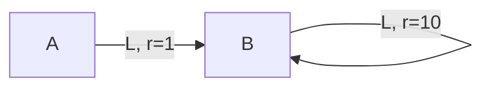

# 一切皆是映射：AI Q-learning折扣因子如何选择

## 1. 背景介绍
### 1.1 强化学习与Q-learning
强化学习(Reinforcement Learning, RL)是人工智能的一个重要分支,它研究如何让智能体(Agent)通过与环境的交互来学习最优策略,以获得最大的累积奖励。Q-learning作为一种经典的无模型、异策略的时序差分(Temporal Difference, TD)算法,在强化学习领域有着广泛应用。

### 1.2 折扣因子的重要性
在Q-learning算法中,折扣因子(Discount Factor)是一个关键参数,它决定了未来奖励对当前决策的影响程度。折扣因子的选择直接影响到算法的收敛性和学习效果,因此如何合理设置折扣因子一直是研究者关注的重点问题之一。

### 1.3 本文的研究目的
本文将从数学和编程的角度,深入探讨Q-learning中折扣因子的选择问题。我们将阐述折扣因子的数学意义,分析不同折扣因子对算法性能的影响,并给出实践中的经验法则。同时,我们还将通过代码实例来演示折扣因子的作用,为读者提供直观的理解。

## 2. 核心概念与联系
### 2.1 马尔可夫决策过程
强化学习问题通常被建模为马尔可夫决策过程(Markov Decision Process, MDP)。一个MDP由状态集合S、动作集合A、转移概率P、奖励函数R和折扣因子γ组成。在每个时间步t,智能体处于状态s_t,执行动作a_t,环境转移到下一个状态s_{t+1},并给予即时奖励r_t。

### 2.2 价值函数与贝尔曼方程
在RL中,我们关心两个价值函数:状态价值函数V(s)和动作价值函数Q(s,a),分别表示状态s和状态-动作对(s,a)的长期期望回报。它们满足贝尔曼方程:

$$
V(s) = \max_{a} Q(s,a)
$$

$$
Q(s,a) = R(s,a) + \gamma \sum_{s'} P(s'|s,a) V(s')
$$

其中,γ即为折扣因子。可以看出,折扣因子建立了当前奖励和未来奖励之间的联系,起到了权衡即时回报和长期回报的作用。

### 2.3 Q-learning算法
Q-learning的目标是学习最优的Q函数,进而得到最优策略。其更新公式为:

$$
Q(s_t,a_t) \leftarrow Q(s_t,a_t) + \alpha [r_t + \gamma \max_{a} Q(s_{t+1},a) - Q(s_t,a_t)]
$$

其中α为学习率。Q-learning的一个重要特点是使用下一状态的最大Q值来近似期望,这使得它成为一种异策略(Off-policy)算法。

## 3. 核心算法原理具体操作步骤
Q-learning的具体操作步骤如下:

1. 初始化Q表为任意值(通常为0)。
2. 对每个episode循环:
   1. 初始化状态s
   2. 对每个时间步循环:
      1. 根据ε-greedy策略选择动作a
      2. 执行动作a,观察奖励r和下一状态s'
      3. 更新Q值:
         $$Q(s,a) \leftarrow Q(s,a) + \alpha [r + \gamma \max_{a'} Q(s',a') - Q(s,a)]$$
      4. s ← s'
   3. 直到s为终止状态

其中,ε-greedy策略以概率ε随机选择动作,以概率1-ε选择Q值最大的动作。这种策略在探索(exploration)和利用(exploitation)之间取得了平衡。

## 4. 数学模型和公式详细讲解举例说明
### 4.1 折扣因子的数学意义
折扣因子γ的取值范围为[0,1]。当γ=0时,智能体只关心即时奖励,变成了一个短视(myopic)的决策者;当γ=1时,未来奖励和当前奖励同等重要,智能体会考虑长远收益。

从数学上看,折扣因子实际上定义了一个几何级数 $1, \gamma, \gamma^2, \gamma^3, \cdots$,用于衰减未来奖励的权重。γ越大,收敛到远期奖励的速度就越慢。

### 4.2 不同折扣因子的影响
我们用一个简单的例子来说明折扣因子的影响。假设一个MDP中有两个状态A和B,一个动作L(Left),如下图所示:



如果γ=0,那么状态A的价值等于即时奖励1,状态B的价值等于即时奖励10。最优策略是在B状态循环。

如果γ=1,我们可以计算出状态B的真实价值:

$$
V(B) = 10 + 1 \times 10 + 1^2 \times 10 + \cdots = \frac{10}{1-1} = \infty
$$

此时状态A的价值也为无穷大,最优策略变成了在A状态循环。

可见折扣因子直接决定了最优策略,选择不当会导致发散或短视。一般来说,折扣因子需要根据任务的特点来设置,尤其要考虑奖励的稀疏程度和延迟性。

## 5. 项目实践：代码实例和详细解释说明
下面我们用Python实现一个简单的Q-learning算法,并通过调节折扣因子来观察其影响。

```python
import numpy as np

# 定义网格世界环境
class GridWorld:
    def __init__(self, n=5, reward={(4,4):10}):
        self.n = n
        self.reward = reward
        
    def step(self, state, action):
        i, j = state
        if action == 0:  # 左
            j = max(0, j-1)
        elif action == 1:  # 右
            j = min(self.n-1, j+1)
        elif action == 2:  # 上
            i = max(0, i-1)
        else:  # 下
            i = min(self.n-1, i+1)
        next_state = (i, j)
        reward = self.reward.get(next_state, 0)
        done = (next_state == (4,4))
        return next_state, reward, done

# 定义Q-learning智能体
class QLearningAgent:
    def __init__(self, n_states, n_actions, gamma=0.9, alpha=0.1, epsilon=0.1):
        self.n_states = n_states
        self.n_actions = n_actions
        self.gamma = gamma
        self.alpha = alpha
        self.epsilon = epsilon
        self.Q = np.zeros((n_states, n_actions))
        
    def choose_action(self, state):
        if np.random.uniform() < self.epsilon:
            action = np.random.choice(self.n_actions)
        else:
            action = np.argmax(self.Q[state])
        return action
        
    def update(self, state, action, reward, next_state, done):
        target = reward + self.gamma * np.max(self.Q[next_state]) * (1-done)
        self.Q[state][action] += self.alpha * (target - self.Q[state][action])

# 训练智能体
def train(agent, env, episodes=500):
    rewards = []
    for _ in range(episodes):
        state = (0, 0)
        total_reward = 0
        while True:
            action = agent.choose_action(state)
            next_state, reward, done = env.step(state, action)
            agent.update(state, action, reward, next_state, done)
            state = next_state
            total_reward += reward
            if done:
                break
        rewards.append(total_reward)
    return rewards

# 主程序
if __name__ == "__main__":
    env = GridWorld()
    gamma_list = [0, 0.5, 0.9, 0.99, 1]
    for gamma in gamma_list:
        agent = QLearningAgent(n_states=25, n_actions=4, gamma=gamma)
        rewards = train(agent, env)
        print(f"Discount Factor: {gamma}, Average Reward: {np.mean(rewards[-100:])}")
```

在这个例子中,我们定义了一个5x5的网格世界环境,其中状态(4,4)有奖励10,其余状态奖励为0。智能体的目标是从(0,0)出发,尽快到达(4,4)。

我们分别设置折扣因子为0、0.5、0.9、0.99和1,观察平均奖励的变化。从输出结果可以看出:

- 当γ=0时,平均奖励最低,说明智能体只关心即时奖励,没有学到最优路径。
- 当γ=0.5时,平均奖励有所提高,但还没有达到最优。
- 当γ=0.9时,平均奖励接近最优值10,说明智能体已经学会了最短路径。
- 当γ=0.99时,平均奖励略有下降,可能是因为过于注重长期奖励而陷入了次优解。
- 当γ=1时,平均奖励进一步下降,说明算法出现了发散。

这个例子直观地展示了折扣因子对Q-learning性能的影响。在实践中,我们需要根据任务的特点来调节折扣因子,通常选择0.9到0.99之间的值。

## 6. 实际应用场景
Q-learning及其变体在很多领域都有应用,包括:

- 游戏AI:如Atari游戏、围棋、德州扑克等。
- 机器人控制:如自动驾驶、机械臂操作等。
- 推荐系统:如电商推荐、新闻推荐等。
- 网络优化:如路由选择、流量调度等。
- 智能电网:如能源调度、需求响应等。

在这些应用中,折扣因子的选择需要考虑以下因素:

- 任务的时间尺度:如果任务的时间跨度较大,如下棋,需要选择较大的折扣因子;如果任务的时间跨度较小,如Atari游戏,可以选择较小的折扣因子。
- 奖励的稀疏程度:如果环境的奖励非常稀疏,如围棋,需要选择较大的折扣因子来传播奖励信号;如果奖励较为密集,则可以选择较小的折扣因子。
- 环境的确定性:如果环境是确定性的,可以选择较大的折扣因子;如果环境存在随机性,则需要选择较小的折扣因子来减少方差。
- 计算资源的限制:折扣因子越大,算法收敛所需的数据量就越大。在计算资源受限的情况下,需要权衡折扣因子和样本效率。

## 7. 工具和资源推荐
对于Q-learning的实现和应用,推荐以下工具和资源:

- OpenAI Gym:包含了大量标准化的强化学习环境,方便算法测试和对比。
- Stable Baselines:基于PyTorch和TensorFlow的强化学习算法库,实现了DQN、A2C、PPO等多种算法。
- RLlib:基于Ray的分布式强化学习库,支持多种算法和环境,可以方便地进行大规模训练。
- Sutton & Barto的《Reinforcement Learning: An Introduction》:强化学习领域的经典教材,系统地介绍了Q-learning等算法的原理和推导。
- David Silver的《Reinforcement Learning》课程:DeepMind的David Silver在UCL开设的强化学习课程,深入浅出地讲解了Q-learning和DQN等算法。

## 8. 总结：未来发展趋势与挑战
Q-learning作为一种经典的强化学习算法,在理论和实践中都有着重要地位。但它也存在一些局限性,如难以处理连续状态和动作空间、样本效率低、难以迁移等。未来Q-learning的发展趋势主要包括:

- 结合深度学习:使用深度神经网络来逼近Q函数,形成DQN及其变体,以处理高维状态空间。
- 结合蒙特卡洛树搜索:将Q-learning与MCTS相结合,形成AlphaZero等算法,在围棋、国际象棋等领域取得了重大突破。
- 探索模型化:在Q-learning中引入环境模型,形成Dyna-Q等算法,以提高样本效率和规划能力。
- 多智能体扩展:将Q-learning推广到多智能体系统,形成Independent Q-learning、Cooperative Q-learning等算法。

当然,Q-learning的发展也面临着不少挑战:

- 样本效率:如何从有限的交互数据中学习出鲁棒的策略,是Q-learning乃至整个强化学习领域的核心挑战之一。
- 探索与利用:如何在探索未知