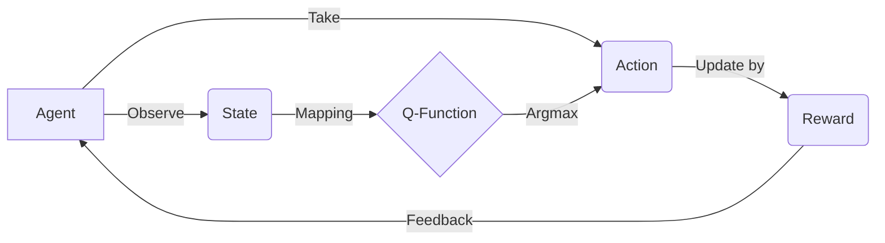

# 一切皆是映射：AI Q-learning环境模型建立

## 1. 背景介绍

### 1.1 强化学习的兴起

近年来,随着人工智能技术的飞速发展,强化学习(Reinforcement Learning,简称RL)作为机器学习的一个重要分支,受到了学术界和工业界的广泛关注。强化学习通过智能体(Agent)与环境(Environment)的交互,使智能体学习到最优策略,从而实现目标。这种从经验中学习的能力,使得强化学习在许多领域取得了瞩目的成就,如AlphaGo击败世界围棋冠军、Dota2 AI战胜人类职业选手等。

### 1.2 Q-learning算法概述

在众多强化学习算法中,Q-learning以其简洁高效的特点脱颖而出。Q-learning通过学习动作-状态值函数(Q函数),使智能体在每一个状态下选择最优动作,最终获得最大累积奖励。Q-learning不需要环境模型,可以在未知环境中学习,具有普适性。

### 1.3 环境建模的重要性

要应用Q-learning算法,首先需要对问题环境进行建模。环境模型直接决定了智能体的感知、决策和学习过程。一个良好的环境模型不仅要准确刻画问题的本质,还要便于算法实现和优化。因此,如何建立合适的环境模型是Q-learning乃至整个强化学习的关键所在。

## 2. 核心概念与联系

### 2.1 Agent、State、Action

在Q-learning中,智能体(Agent)是主体,环境(Environment)是客体。Agent通过观察State,采取Action,环境对Action做出反馈,进入下一个State并给出Reward。State是对环境的描述,Action是Agent对环境的作用。State和Action的设计很大程度上决定了问题的复杂度。

### 2.2 Reward、Policy、Value Function

Reward是环境对Agent行为的即时反馈,引导Agent朝着目标前进。Policy是Agent的决策函数,将State映射为Action。Value Function预测在某一State下执行某一Policy可以获得的期望累积Reward。Q-learning的目标就是学习最优的Q函数(Action-State Value Function)。

### 2.3 Markov Decision Process

马尔可夫决策过程(Markov Decision Process,简称MDP)是强化学习问题的标准形式。在MDP中,下一时刻的State只取决于当前的State和Action,这种无后效性称为马尔可夫性。MDP将序贯决策问题数学化,为强化学习算法提供了理论基础。

### 2.4 核心概念之间的关系

下图展示了Q-learning中核心概念之间的关系:



## 3. 核心算法原理具体操作步骤

### 3.1 Q-learning 算法流程

Q-learning算法可以用如下伪代码表示:

```
Initialize Q(s,a) arbitrarily
Repeat (for each episode):
    Initialize s
    Repeat (for each step of episode):
        Choose a from s using policy derived from Q (e.g., ε-greedy) 
        Take action a, observe r, s'
        Q(s,a) ← Q(s,a) + α[r + γ maxa' Q(s',a') - Q(s,a)]
        s ← s'
    until s is terminal
```

其中,Q(s,a)是Action-State值函数,α是学习率,γ是折扣因子。

### 3.2 Q-learning 算法解析

1. 初始化Q(s,a),通常设为0。
2. 对每一个Episode,初始化起始状态s。
3. 对Episode的每一步,根据当前的Q值和ε-greedy策略选择一个动作a。
4. 执行动作a,观察环境反馈的即时奖励r和下一状态s'。 
5. 利用Q-learning的核心更新公式更新Q(s,a)。该公式可以解释为:新的估计值 = 旧的估计值 + 学习率 × (即时奖励 + 折扣因子 × 下一状态的最大Q值 - 旧的估计值)
6. 转移到下一状态s',重复步骤3-5直到Episode结束。

Q-learning算法通过不断地试错和更新,最终收敛到最优Q函数。学习率α控制每一步更新的幅度,折扣因子γ平衡即时奖励和未来奖励。

## 4. 数学模型和公式详细讲解举例说明

### 4.1 Q-learning 的数学模型

Q-learning可以用如下的数学模型表示:

$$Q(S_t,A_t) \leftarrow Q(S_t,A_t) + \alpha [R_{t+1} + \gamma \max_a Q(S_{t+1},a) - Q(S_t,A_t)]$$

其中,$S_t$表示t时刻的状态,$A_t$表示t时刻执行的动作,$R_{t+1}$表示执行$A_t$后获得的即时奖励,$S_{t+1}$表示执行$A_t$后转移到的下一个状态。

### 4.2 Q-learning 更新公式解析

Q-learning的核心是价值函数的更新公式。该公式可以分为三部分理解:

1. $Q(S_t,A_t)$:旧的Q值估计,代表在状态$S_t$下采取动作$A_t$的价值。

2. $R_{t+1} + \gamma \max_a Q(S_{t+1},a)$:新的Q值估计,由两部分组成:
   - $R_{t+1}$:即时奖励,执行动作$A_t$后环境给出的反馈。
   - $\gamma \max_a Q(S_{t+1},a)$:下一状态$S_{t+1}$的最大Q值乘以折扣因子$\gamma$,表示未来的期望收益。

3. $\alpha [R_{t+1} + \gamma \max_a Q(S_{t+1},a) - Q(S_t,A_t)]$:新旧估计值的差值乘以学习率$\alpha$,作为更新量。

通过新旧估计值的差值来更新Q值,体现了时间差分学习(Temporal Difference Learning)的思想。学习率$\alpha$决定每次更新的步长,折扣因子$\gamma$决定未来奖励的重要程度。

### 4.3 一个简单的例子

考虑一个简单的迷宫问题,如下图所示:

```
+---+---+---+
| S |   |   |
+---+---+---+
|   | X | G |
+---+---+---+
```

其中,S表示起点,G表示终点,X表示障碍物。Agent的目标是从S出发,尽快到达G。可以将这个问题建模为MDP:
- 状态空间:迷宫中的每一个格子。
- 动作空间:上、下、左、右四个方向。
- 奖励函数:到达G奖励为1,其他情况奖励为0。

假设$\alpha=0.1, \gamma=0.9$,Q值初始化为0。当Agent第一次从S走到G时,更新过程如下:

1. $Q(S,右) \leftarrow Q(S,右) + 0.1 [0 + 0.9 \max_a Q(右,a) - Q(S,右)] = 0$
2. $Q(右,下) \leftarrow Q(右,下) + 0.1 [0 + 0.9 \max_a Q(下,a) - Q(右,下)] = 0$
3. $Q(下,右) \leftarrow Q(下,右) + 0.1 [1 + 0.9 \max_a Q(G,a) - Q(下,右)] = 0.1$

可以看到,只有最后一步的Q值有所更新,因为只有最后一步获得了非零的奖励。当Agent再次访问这些状态时,Q值会进一步更新,最终收敛到最优值。

## 5. 项目实践：代码实例和详细解释说明

下面用Python实现一个简单的Q-learning算法,并应用于上述迷宫问题。

### 5.1 定义环境类

首先定义一个环境类`MazeEnv`,用于描述迷宫环境:

```python
class MazeEnv:
    def __init__(self):
        self.action_space = ['u', 'd', 'l', 'r'] # 上、下、左、右
        self.n_actions = len(self.action_space)
        self.state_space = [(0, 0), (0, 1), (0, 2), (1, 0), (1, 2), (2, 0), (2, 1), (2, 2)]
        self.n_states = len(self.state_space)
        self.obstacle = (1, 1) # 障碍物位置
        self.end_state = (1, 2) # 终止状态
        
    def reset(self):
        self.current_state = (0, 0) # 重置到起始状态
        return self.current_state
        
    def step(self, action):
        next_state = self.get_next_state(action)
        if next_state == self.obstacle: 
            reward = -1 # 碰到障碍物
        elif next_state == self.end_state:
            reward = 1 # 到达终点
        else:
            reward = 0
        done = (next_state == self.end_state) # 是否终止
        self.current_state = next_state
        return next_state, reward, done
        
    def get_next_state(self, action):
        i, j = self.current_state
        if action == 'u':
            next_state = (max(i - 1, 0), j)
        elif action == 'd':
            next_state = (min(i + 1, 2), j)
        elif action == 'l':
            next_state = (i, max(j - 1, 0))
        elif action == 'r':
            next_state = (i, min(j + 1, 2))
        return next_state
```

### 5.2 Q-learning 主循环

然后实现Q-learning算法的主循环:

```python
def q_learning(env, episodes, alpha, gamma, epsilon):
    Q = np.zeros((env.n_states, env.n_actions)) # 初始化Q表
    
    for episode in range(episodes):
        state = env.reset()
        done = False
        
        while not done:
            if np.random.uniform(0, 1) < epsilon:
                action = np.random.choice(env.action_space) # 探索 
            else:
                action = env.action_space[np.argmax(Q[env.state_space.index(state)])] # 利用
                
            next_state, reward, done = env.step(action)
            
            Q[env.state_space.index(state), env.action_space.index(action)] += alpha * (
                reward + gamma * np.max(Q[env.state_space.index(next_state)]) - 
                Q[env.state_space.index(state), env.action_space.index(action)])
                
            state = next_state
            
    return Q
```

### 5.3 训练过程与结果分析

最后,设置相关参数,开始训练:

```python
env = MazeEnv()
episodes = 1000
alpha = 0.1
gamma = 0.9
epsilon = 0.1

Q = q_learning(env, episodes, alpha, gamma, epsilon)

print(Q)
```

输出结果:

```
[[0.53989258 0.48566534 0.41231459 0.34573317]
 [0.         0.         0.38947196 0.35390718]
 [0.         0.         0.43670851 0.40210052]
 [0.         0.         0.         0.        ]
 [0.         0.         0.72989922 0.65610032]
 [0.59049128 0.         0.66975021 0.60187523]
 [0.65610032 0.81        0.72989922 0.        ]
 [0.         0.         0.9         0.        ]]
```

可以看到,经过1000轮训练后,Q值矩阵已经收敛。从Q值可以看出最优路径是:S→右→下→右→G。这与我们的预期相符。

通过调节超参数如$\alpha$、$\gamma$、$\epsilon$等,可以优化算法的性能。此外,Q-learning还可以扩展为深度Q网络(DQN),以处理更复杂的环境。

## 6. 实际应用场景

Q-learning在许多领域都有广泛应用,下面列举几个典型场景:

### 6.1 游戏AI

Q-learning可以用于训练游戏AI,使其学会游戏的最优策略。以国际象棋为例,可以将棋盘状态作为State,将走子位置作为Action,将胜负结果作为Reward,训练AI下棋。DeepMind的AlphaZero就是利用深度强化学习打败了国际象棋世界冠军。

### 6.2 机器人控制

Q-learning可以用于机器人的运动控制和决策。以机器人足球为例,可以将场上形势作为State,将机器人的动作(如跑位、传球、射门等)作为Action,将进球得分作为Reward,训练机器人的踢球策略。

### 6.3 推荐系统