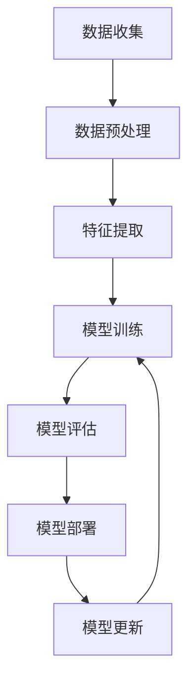

# 一切皆是映射：AI在网络安全中的应用

## 1.背景介绍

### 1.1 网络安全的重要性

在当今互联网时代，网络安全已经成为一个至关重要的话题。随着越来越多的个人和企业依赖网络进行日常活动和业务运营,网络攻击的威胁也日益增加。网络攻击不仅可能导致数据泄露、系统瘫痪等直接损失,还可能造成巨大的经济和声誉损失。因此,保护网络系统的安全性和可靠性是当务之急。

### 1.2 传统网络安全方法的局限性

传统的网络安全方法主要依赖于防火墙、入侵检测系统(IDS)和反病毒软件等技术。然而,这些技术往往只能检测已知的攻击模式,对于新型攻击手段往往无能为力。此外,随着网络环境的不断复杂化,人工分析和处理日益庞大的网络流量数据也变得越来越困难。

### 1.3 人工智能(AI)在网络安全中的应用前景

人工智能技术在网络安全领域展现出了巨大的潜力。AI系统可以自动学习和识别网络流量模式,并且能够快速响应新型攻击。与传统方法相比,AI可以提供更加智能、自适应和高效的网络安全解决方案。

## 2.核心概念与联系

### 2.1 机器学习在网络安全中的应用

机器学习是人工智能的一个重要分支,它赋予计算机系统自动学习和改进的能力。在网络安全领域,机器学习可以用于以下几个方面:

- **异常检测**: 通过学习正常网络流量模式,机器学习算法可以识别出异常行为,从而发现潜在的攻击。
- **入侵检测**: 机器学习模型可以训练用于检测各种类型的网络入侵,如分布式拒绝服务(DDoS)攻击、恶意软件等。
- **恶意软件分析**: 机器学习可以帮助自动化恶意软件的静态和动态分析,提高恶意软件检测的效率和准确性。
- **网络流量分类**: 通过对网络流量进行分类,机器学习可以帮助优化网络资源的分配和管理。

### 2.2 深度学习在网络安全中的应用

深度学习是机器学习的一个子领域,它利用深层神经网络模型来自动学习数据的特征表示。在网络安全领域,深度学习可以用于以下几个方面:

- **恶意软件检测**: 深度学习模型可以直接从原始数据(如二进制文件)中自动提取特征,从而提高恶意软件检测的准确性。
- **网络流量分析**: 深度学习可以用于分析复杂的网络流量数据,识别潜在的攻击模式和异常行为。
- **网络取证分析**: 深度学习可以帮助自动化网络取证分析过程,提高分析效率和准确性。

### 2.3 AI与传统网络安全技术的融合

AI技术不是完全取代传统的网络安全技术,而是与它们相互补充和融合。例如,AI可以与入侵检测系统(IDS)和安全信息和事件管理(SIEM)系统相结合,提高这些系统的智能化水平和检测能力。同时,传统的网络安全技术也可以为AI系统提供必要的数据和环境支持。

## 3.核心算法原理具体操作步骤

在网络安全领域,AI系统通常需要经历以下几个核心步骤:



### 3.1 数据收集

数据收集是AI系统的基础。在网络安全领域,需要收集的数据包括网络流量数据、系统日志、威胁情报数据等。数据的质量和数量直接影响AI系统的性能。

### 3.2 数据预处理

收集到的原始数据通常需要进行预处理,包括数据清洗、标准化、编码等操作。这一步骤可以提高数据的质量,并为后续的特征提取和模型训练做好准备。

### 3.3 特征提取

特征提取是将原始数据转换为机器学习算法可以理解的特征向量的过程。在网络安全领域,常用的特征提取方法包括统计特征、n-gram特征、嵌入特征等。选择合适的特征对于模型的性能至关重要。

### 3.4 模型训练

模型训练是机器学习算法的核心步骤。根据具体的任务,可以选择不同的机器学习算法,如逻辑回归、决策树、支持向量机、神经网络等。训练过程中,算法会不断调整模型参数,以最小化训练数据上的损失函数。

### 3.5 模型评估

在将模型投入实际使用之前,需要对模型进行评估。常用的评估指标包括准确率、精确率、召回率、F1分数等。评估结果可以反映模型的性能,并指导模型的优化和改进。

### 3.6 模型部署

经过评估并满足性能要求后,模型就可以部署到实际的网络环境中。部署过程需要考虑模型的可扩展性、实时性和安全性等因素。

### 3.7 模型更新

随着时间的推移,网络环境和攻击手段会不断变化。因此,AI系统需要定期更新模型,以适应新的数据和情况。模型更新可以通过增量学习或重新训练的方式实现。

## 4.数学模型和公式详细讲解举例说明

在网络安全领域,AI系统常常需要利用数学模型和公式来描述和解决问题。下面我们将介绍一些常用的数学模型和公式。

### 4.1 逻辑回归模型

逻辑回归是一种常用的机器学习分类算法,它可以用于网络入侵检测、恶意软件检测等任务。逻辑回归模型的核心公式如下:

$$
P(y=1|x) = \sigma(w^Tx + b) = \frac{1}{1 + e^{-(w^Tx + b)}}
$$

其中,$ \sigma(z) $是sigmoid函数,用于将线性函数$ w^Tx + b $的输出映射到(0,1)区间,从而得到样本$ x $属于正类($ y=1 $)的概率。模型的目标是通过优化权重向量$ w $和偏置项$ b $,使得训练数据上的负对数似然函数最小化:

$$
J(w,b) = -\frac{1}{m}\sum_{i=1}^m[y^{(i)}\log(h_w(x^{(i)})) + (1-y^{(i)})\log(1-h_w(x^{(i)}))]
$$

其中,$ m $是训练样本的数量,$ h_w(x) = P(y=1|x) $是模型的预测输出。

### 4.2 决策树模型

决策树是一种常用的机器学习分类和回归算法,它可以用于网络流量分类、入侵检测等任务。决策树的构建过程可以用信息增益或基尼系数作为特征选择的标准。

对于分类问题,决策树的目标是最小化训练数据的熵(entropy):

$$
H(X) = -\sum_{i=1}^c p(x_i)\log_2 p(x_i)
$$

其中,$ c $是类别的数量,$ p(x_i) $是样本$ x $属于第$ i $类的概率。在每个节点,决策树会选择能最大化信息增益的特征进行分裂:

$$
IG(X,a) = H(X) - \sum_{v=1}^V \frac{|X_v|}{|X|}H(X_v)
$$

其中,$ a $是特征,$ V $是特征$ a $的取值集合,$ X_v $是根据特征$ a $的值$ v $分割后的子集。

### 4.3 支持向量机模型

支持向量机(SVM)是一种常用的机器学习分类算法,它可以用于网络入侵检测、恶意软件检测等任务。SVM的核心思想是在高维空间中寻找一个超平面,使得不同类别的样本能够被很好地分开,同时最大化两类样本到超平面的距离(即间隔)。

对于线性可分的二分类问题,SVM的目标是求解以下优化问题:

$$
\begin{aligned}
&\min_{w,b} &&\frac{1}{2}\|w\|^2\\
&\text{s.t.} &&y_i(w^Tx_i + b) \geq 1, \quad i=1,\ldots,m
\end{aligned}
$$

其中,$ w $是超平面的法向量,$ b $是超平面的偏移量,$ m $是训练样本的数量。对于线性不可分的情况,可以引入松弛变量$ \xi_i $,将优化问题改写为:

$$
\begin{aligned}
&\min_{w,b,\xi} &&\frac{1}{2}\|w\|^2 + C\sum_{i=1}^m\xi_i\\
&\text{s.t.} &&y_i(w^Tx_i + b) \geq 1 - \xi_i, \quad i=1,\ldots,m\\
& &&\xi_i \geq 0, \quad i=1,\ldots,m
\end{aligned}
$$

其中,$ C $是一个超参数,用于控制模型的复杂度和误差惩罚之间的权衡。

### 4.4 神经网络模型

神经网络是一种强大的机器学习模型,它可以用于网络流量分析、恶意软件检测等任务。神经网络的核心思想是通过多层非线性变换来学习数据的复杂特征表示。

一个典型的前馈神经网络可以表示为:

$$
y = f_L(W_L\cdot f_{L-1}(W_{L-1}\cdot \ldots f_1(W_1\cdot x + b_1) \ldots + b_{L-1}) + b_L)
$$

其中,$ x $是输入,$ y $是输出,$ W_i $和$ b_i $分别是第$ i $层的权重矩阵和偏置向量,$ f_i $是第$ i $层的激活函数(如ReLU、sigmoid等)。

神经网络的训练过程是通过反向传播算法来优化网络参数,使得训练数据上的损失函数最小化。常用的损失函数包括交叉熵损失、均方误差损失等。

## 5.项目实践:代码实例和详细解释说明

为了更好地理解AI在网络安全中的应用,我们将通过一个实际项目来进行实践。在这个项目中,我们将使用Python和scikit-learn库来构建一个网络入侵检测系统。

### 5.1 数据集介绍

我们将使用著名的KDD Cup 1999数据集,该数据集包含了大量模拟的网络流量数据,包括正常流量和各种攻击类型(如DoS、R2L、U2R等)。数据集中每个样本都包含41个特征,描述了网络连接的各种属性。

### 5.2 数据预处理

在开始建模之前,我们需要对数据进行预处理。首先,我们将导入必要的Python库:

```python
import pandas as pd
from sklearn.preprocessing import LabelEncoder, OneHotEncoder
```

然后,我们读取数据集并对缺失值进行处理:

```python
# 读取数据集
data = pd.read_csv('kddcup.data.csv')

# 处理缺失值
data = data.dropna()
```

接下来,我们需要对分类特征进行编码,将它们转换为数值型特征:

```python
# 对分类特征进行编码
categorical_cols = ['protocol_type', 'service', 'flag']
label_encoder = LabelEncoder()
one_hot_encoder = OneHotEncoder()

for col in categorical_cols:
    data[col] = label_encoder.fit_transform(data[col])
    encoded_cols = one_hot_encoder.fit_transform(data[col].values.reshape(-1, 1)).toarray()
    data = data.drop(col, axis=1)
    data = pd.concat([data, pd.DataFrame(encoded_cols)], axis=1)
```

最后,我们将数据集划分为训练集和测试集:

```python
# 划分训练集和测试集
X = data.drop('label', axis=1)
y = data['label']
from sklearn.model_selection import train_test_split
X_train, X_test, y_train, y_test = train_test_split(X, y, test_size=0.2, random_state=42)
```

### 5.3 模型训练

在这个项目中,我们