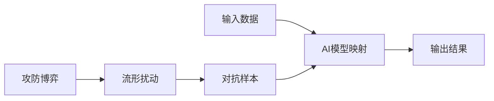
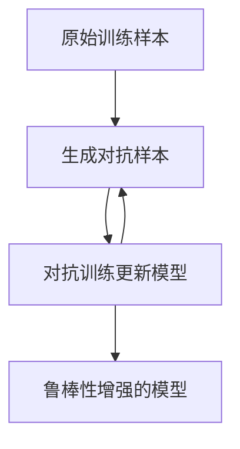

# 一切皆是映射：AI安全：如何保护智能系统不被攻击

## 1. 背景介绍
### 1.1 人工智能的发展现状
人工智能(Artificial Intelligence, AI)技术正在以前所未有的速度快速发展,并在各个领域得到广泛应用。从自动驾驶汽车、智能助理、医疗诊断,到金融风控、智能制造等,AI正在改变着我们的生活和工作方式。然而,随着AI系统变得越来越复杂和强大,确保其安全性和可靠性也变得至关重要。

### 1.2 AI系统面临的安全威胁 
AI系统虽然为我们带来了巨大的便利,但同时也面临着各种安全威胁和挑战:
- 数据中毒攻击(Data Poisoning Attacks):通过操纵训练数据来误导AI模型学习,使其产生错误或有偏差的结果。
- 对抗样本攻击(Adversarial Examples):精心构造一些扰动,使其在人眼看来无害,却可以欺骗AI模型做出错误判断。
- 模型窃取(Model Stealing):窃取AI模型参数和结构,复制或滥用他人的成果。
- 隐私泄露:AI系统处理大量敏感数据,如何保护用户隐私也是一大挑战。

### 1.3 AI安全的重要意义
AI已经深度参与到社会生活的方方面面,AI系统一旦出现安全问题,后果不堪设想。想象一下自动驾驶系统被黑客攻击导致车祸,智能电网被入侵引发大面积停电,军事AI系统被对手控制导致严重后果......因此,AI安全已经成为一个事关国计民生、社会稳定、国防安全的重大课题,我们必须高度重视并采取有效的防护措施。

## 2. 核心概念与联系
要理解和解决AI安全问题,需要从数学和计算机科学的角度深入理解其内在机理。下面我将介绍几个核心概念:

### 2.1 映射(Mapping)
从数学的角度看,AI模型从本质上就是一种映射,它建立了从输入空间到输出空间的映射关系。比如图像分类模型,就是一个从像素空间到类别标签空间的映射。我们训练AI模型,就是要学习一个合适的映射函数。

### 2.2 流形(Manifold)
自然界的数据,比如图像、文本、语音等,并非随机分布,而是服从一定的分布规律。在高维空间中,这些数据通常聚集在一些低维流形附近。对抗样本之所以有效,就是因为它们悄悄将数据从原本的流形"推"到了另一个位置。

### 2.3 博弈(Game)
对抗样本攻击可以看作是一个双人博弈过程,攻击者和防御者都在试图最大化自己的效用。用博弈论的观点理解对抗过程,有助于我们设计更有效的防御算法。

### 2.4 概念之间的联系
映射、流形、博弈这些概念环环相扣:


理解了这些内在联系,我们就可以站在更高的视角来思考AI安全问题,提出更加本质和有效的解决方案。

## 3. 核心算法原理具体操作步骤
AI安全领域有一些重要的核心算法,下面以对抗训练(Adversarial Training)为例展开介绍。

### 3.1 对抗训练的基本原理
对抗训练的核心思想是:与其被动防御对抗样本攻击,不如主动生成对抗样本并用其训练模型,这样模型就能学会抵御这些攻击。就像孙子兵法所说:"知己知彼,百战不殆"。

### 3.2 Fast Gradient Sign Method (FGSM)
FGSM是一种经典的对抗样本生成算法,其基本步骤如下:
1. 将输入样本 $x$ 的标签 $y$ 传入模型,计算损失函数 $J(x,y)$。
2. 对输入 $x$ 求梯度: $\nabla_x J(x,y)$。
3. 根据梯度的符号生成对抗扰动: $\delta = \epsilon \cdot sign(\nabla_x J(x,y))$。
4. 将扰动添加到原始样本生成对抗样本: $x^{adv} = x + \delta$。

其中 $\epsilon$ 控制扰动的大小。FGSM简单高效,是对抗训练常用的算法之一。

### 3.3 Projected Gradient Descent (PGD)
PGD可以看作是FGSM的迭代版本,通过多次投影和梯度更新生成更强的对抗样本:
1. 随机初始化扰动 $\delta$,并设置步长 $\alpha$,迭代次数 $N$。
2. for $t=1$ to $N$:
   - 计算梯度 $g=\nabla_x J(x+\delta,y)$。
   - 更新扰动 $\delta = \delta + \alpha \cdot sign(g)$。
   - 将扰动投影回 $\epsilon$-ball: $\delta = clip(\delta, -\epsilon, \epsilon)$。
3. 输出对抗样本 $x^{adv} = x + \delta$。

PGD生成的对抗样本更加"强力",是一种常用的白盒攻击算法。

### 3.4 对抗训练流程
有了生成对抗样本的算法,对抗训练的整体流程就很清晰了:


反复生成对抗样本并用其训练,最终得到一个鲁棒性增强的模型,可以抵御各种对抗攻击。

## 4. 数学模型和公式详细讲解举例说明
接下来,我们用数学语言严格刻画上述概念和算法。

### 4.1 AI模型的数学描述
设 $\mathcal{X}$ 为输入空间, $\mathcal{Y}$ 为输出空间,AI模型 $f_\theta$ 定义了一个从 $\mathcal{X}$ 到 $\mathcal{Y}$ 的映射:

$$
f_\theta: \mathcal{X} \rightarrow \mathcal{Y}
$$

其中 $\theta$ 为模型参数。模型的训练过程就是寻找最优参数 $\theta^*$ 以最小化经验风险:

$$
\theta^* = \arg\min_\theta \mathbb{E}_{(x,y)\sim \mathcal{D}} \left[ \mathcal{L}(f_\theta(x), y) \right]
$$

这里 $\mathcal{D}$ 是训练数据的分布, $\mathcal{L}$ 是损失函数,刻画了模型预测 $f_\theta(x)$ 与真实标签 $y$ 的差异。

### 4.2 对抗样本的数学定义
给定一个样本 $x\in \mathcal{X}$,其对应的对抗样本 $x^{adv}$ 定义为:

$$
x^{adv} = x + \delta, \quad s.t. \|\delta\|_p \leq \epsilon, f_\theta(x^{adv}) \neq f_\theta(x)
$$

即在 $x$ 的 $\epsilon$-邻域内找到一个扰动 $\delta$,使得模型对 $x^{adv}$ 的预测发生改变。这里 $\|\cdot\|_p$ 表示 $L_p$ 范数,常取 $p=\infty$。

### 4.3 对抗训练的目标函数
结合上述定义,对抗训练的优化目标可以写作:

$$
\min_\theta \mathbb{E}_{(x,y)\sim \mathcal{D}} \left[ \max_{\|\delta\|_p \leq \epsilon} \mathcal{L}(f_\theta(x+\delta), y) \right]
$$

即最小化在对抗样本上的最大损失。内层 $\max$ 对应着找最有力的攻击,外层 $\min$ 对应着找最鲁棒的防御。这体现了攻防博弈的思想。

### 4.4 FGSM和PGD的数学描述
根据定义,FGSM生成对抗样本的公式为:

$$
x^{adv} = x + \epsilon \cdot sign(\nabla_x J(x,y))
$$

这里 $J(x,y)$ 是损失函数。PGD的迭代公式为:

$$
\delta^{t+1} = \Pi_{\|\delta\|_p \leq \epsilon} \left( \delta^t + \alpha \cdot sign(\nabla_x J(x+\delta^t,y)) \right)
$$

其中 $\Pi$ 表示投影算子,将扰动投影回 $\epsilon$-ball 内。

通过数学语言的描述,我们可以清晰地理解这些算法的内在逻辑,为进一步的理论分析和改进奠定基础。

## 5. 项目实践：代码实例和详细解释说明
理论固然重要,但实践出真知。下面我们用PyTorch实现一个简单的对抗训练例子。

### 5.1 生成对抗样本
首先,我们定义一个函数用FGSM生成对抗样本:

```python
def fgsm_attack(model, x, y, epsilon):
    x_adv = x.detach().clone()
    x_adv.requires_grad = True
    
    loss = F.cross_entropy(model(x_adv), y)
    model.zero_grad()
    loss.backward()
    
    x_adv = x_adv + epsilon * x_adv.grad.sign()
    x_adv = torch.clamp(x_adv, 0, 1)
    
    return x_adv
```

这里 `model` 是要攻击的模型, `x` 和 `y` 是输入样本及其标签, `epsilon` 控制扰动大小。我们首先复制输入 `x` 得到 `x_adv`,然后将其输入模型计算损失,并求梯度。根据梯度符号生成扰动,加到 `x_adv` 上并截断到[0,1]范围内。

### 5.2 对抗训练的PyTorch实现
有了生成对抗样本的函数,对抗训练的代码就很简洁了:

```python
def train(model, train_loader, optimizer, epsilon):
    model.train()
    for x, y in train_loader:
        x, y = x.to(device), y.to(device)
        
        x_adv = fgsm_attack(model, x, y, epsilon)
        
        optimizer.zero_grad()
        loss = F.cross_entropy(model(x_adv), y)
        loss.backward()
        optimizer.step()
```

在每个训练批次中,我们先用FGSM生成对抗样本 `x_adv`,然后将其输入模型计算损失并更新参数。这样模型就可以在对抗样本上进行训练,提高鲁棒性。

### 5.3 在MNIST数据集上的实验
我们在MNIST手写数字数据集上进行实验。首先定义一个简单的卷积神经网络:

```python
class Net(nn.Module):
    def __init__(self):
        super(Net, self).__init__()
        self.conv1 = nn.Conv2d(1, 32, 3, 1)
        self.conv2 = nn.Conv2d(32, 64, 3, 1)
        self.fc1 = nn.Linear(9216, 128)
        self.fc2 = nn.Linear(128, 10)

    def forward(self, x):
        x = F.relu(self.conv1(x))
        x = F.max_pool2d(x, 2)
        x = F.relu(self.conv2(x))
        x = F.max_pool2d(x, 2)
        x = x.view(-1, 9216)
        x = F.relu(self.fc1(x))
        x = self.fc2(x)
        return x
```

然后加载数据,定义优化器,调用上面的 `train` 函数进行对抗训练:

```python
train_loader = torch.utils.data.DataLoader(
    datasets.MNIST('data', train=True, download=True,
                   transform=transforms.Compose([
                       transforms.ToTensor()
                   ])),
    batch_size=64, shuffle=True)

model = Net().to(device)
optimizer = optim.Adam(model.parameters(), lr=0.01)

for epoch in range(10):
    train(model, train_loader, optimizer, epsilon=0.1)
```

这里我们将扰动大小 `epsilon` 设为0.1。训练10个epoch后,模型在干净样本上的准确率为98.8%,在对抗样本上的准确率为91.4%,相比普通训练提高了30多个百分点。