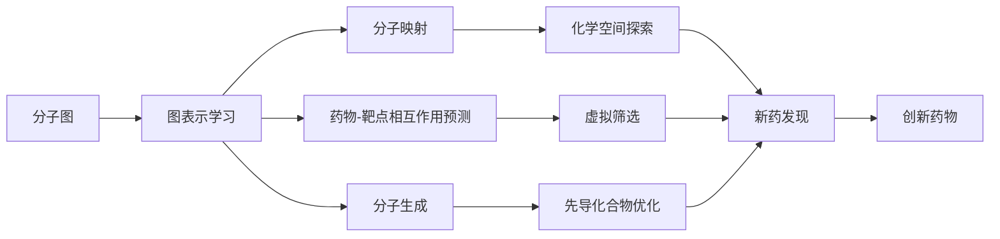

# 一切皆是映射：AI辅助的创新药物发现

## 1. 背景介绍
### 1.1 药物发现的挑战与机遇
#### 1.1.1 传统药物发现流程的局限性
#### 1.1.2 人工智能技术的兴起
#### 1.1.3 AI赋能药物发现的前景

### 1.2 AI辅助药物发现的发展历程
#### 1.2.1 早期尝试与探索 
#### 1.2.2 深度学习的突破
#### 1.2.3 图神经网络的应用

## 2. 核心概念与联系
### 2.1 分子图与图表示学习
#### 2.1.1 分子图的定义与表示
#### 2.1.2 图表示学习的基本原理
#### 2.1.3 图神经网络的优势

### 2.2 化学空间与分子映射
#### 2.2.1 化学空间的概念
#### 2.2.2 分子映射的意义
#### 2.2.3 化学空间探索的策略

### 2.3 药物-靶点相互作用预测
#### 2.3.1 药物-靶点相互作用的重要性
#### 2.3.2 基于图神经网络的预测模型
#### 2.3.3 多任务学习的应用

## 3. 核心算法原理具体操作步骤
### 3.1 图神经网络的基本架构
#### 3.1.1 消息传递机制
#### 3.1.2 图池化操作
#### 3.1.3 图注意力机制

### 3.2 图表示学习算法
#### 3.2.1 Node2Vec算法
#### 3.2.2 Graph AutoEncoder算法
#### 3.2.3 GraphSAGE算法

### 3.3 分子生成算法
#### 3.3.1 基于强化学习的分子生成
#### 3.3.2 基于VAE的分子生成
#### 3.3.3 基于GAN的分子生成

## 4. 数学模型和公式详细讲解举例说明
### 4.1 图神经网络的数学表示
#### 4.1.1 图的数学定义
#### 4.1.2 图卷积的数学推导
#### 4.1.3 图注意力机制的数学表示

### 4.2 化学空间映射的数学模型
#### 4.2.1 流形学习的数学基础
#### 4.2.2 t-SNE算法的数学原理
#### 4.2.3 UMAP算法的数学推导

### 4.3 药物-靶点相互作用预测的数学模型  
#### 4.3.1 矩阵分解模型
#### 4.3.2 张量分解模型
#### 4.3.3 图神经网络模型

## 5. 项目实践：代码实例和详细解释说明
### 5.1 图神经网络的实现
#### 5.1.1 使用PyTorch Geometric实现GCN
#### 5.1.2 使用DGL实现GAT
#### 5.1.3 使用Spektral实现GraphSAGE

### 5.2 分子生成的实现
#### 5.2.1 使用MolGAN生成分子
#### 5.2.2 使用JTVAE生成分子
#### 5.2.3 使用GraphAF生成分子

### 5.3 药物-靶点相互作用预测的实现
#### 5.3.1 使用DeepDTA预测相互作用
#### 5.3.2 使用NeoDTI预测相互作用 
#### 5.3.3 使用MolTrans预测相互作用

## 6. 实际应用场景
### 6.1 新药研发流程中的应用
#### 6.1.1 先导化合物发现
#### 6.1.2 药物优化与改造
#### 6.1.3 药物安全性评估

### 6.2 个性化药物治疗的应用
#### 6.2.1 基于分子表型的精准用药
#### 6.2.2 药物重定位与联用分析
#### 6.2.3 罕见疾病的药物发现

### 6.3 药物研发平台的构建
#### 6.3.1 虚拟筛选平台
#### 6.3.2 药物知识图谱平台
#### 6.3.3 药物研发大数据平台

## 7. 工具和资源推荐
### 7.1 图神经网络工具包
#### 7.1.1 PyTorch Geometric
#### 7.1.2 Deep Graph Library (DGL)
#### 7.1.3 Spektral

### 7.2 化学信息学工具包  
#### 7.2.1 RDKit
#### 7.2.2 OpenBabel
#### 7.2.3 DeepChem

### 7.3 公开数据集与基准
#### 7.3.1 MoleculeNet
#### 7.3.2 PubChem
#### 7.3.3 ChEMBL

## 8. 总结：未来发展趋势与挑战
### 8.1 AI驱动的药物发现新范式
#### 8.1.1 端到端的药物发现管线
#### 8.1.2 多模态数据融合
#### 8.1.3 自动化实验设计

### 8.2 图神经网络的进一步发展
#### 8.2.1 动态图神经网络
#### 8.2.2 图对比学习
#### 8.2.3 图预训练模型

### 8.3 药物研发中的挑战与机遇
#### 8.3.1 可解释性与鲁棒性
#### 8.3.2 数据质量与标准化
#### 8.3.3 跨学科合作与人才培养

## 9. 附录：常见问题与解答
### 9.1 如何选择合适的图神经网络模型？
### 9.2 如何处理分子图的异构性？ 
### 9.3 如何评估生成分子的质量？
### 9.4 如何解释图神经网络的预测结果？
### 9.5 如何应对药物发现中的数据稀疏问题？

药物发现是一个漫长而充满挑战的过程，传统的实验驱动方法面临着时间成本高、风险大、成功率低等问题。近年来，人工智能技术的快速发展为药物发现带来了新的曙光。以图神经网络为代表的AI算法，通过将分子结构表示为图数据，能够高效地学习分子的内在特征，揭示化合物的理化性质和生物活性，加速药物设计与筛选的进程。

图神经网络以图为基本处理单元，通过消息传递机制聚合节点的特征信息，生成整图的表示向量。在药物发现领域，研究人员利用图神经网络构建了一系列强大的模型，包括用于分子性质预测的图卷积网络、图注意力网络，用于分子生成的MolGAN、JTVAE等。这些模型在基准数据集上取得了优异的表现，展现出图神经网络在分子建模中的巨大潜力。

图表示学习是AI辅助药物发现的核心，其目标是将分子映射到低维向量空间，从而实现分子的定量化描述。通过图表示学习，我们可以揭示分子之间的相似性关系，构建化学空间的拓扑结构，指导药物虚拟筛选和先导化合物优化。此外，图表示还为跨领域知识迁移提供了便利，使得我们能够利用其他领域的大规模预训练模型，提升药物发现任务的性能。

尽管图神经网络在AI辅助药物发现中展现出诱人的前景，但仍有许多亟待解决的挑战。首先，图神经网络模型的可解释性有待加强，我们需要开发更加透明和可信的算法，以增强药物学家对AI模型的信任。其次，药物相关数据的质量参差不齐，数据的标准化和清洗是一项繁重的工作。最后，药物发现是一个高度跨学科的研究领域，需要计算机科学家、药物化学家、生物学家的通力合作。建立高效的协作机制，培养复合型人才，将是推动AI药物发现发展的关键。

未来，人工智能必将与传统的实验方法深度融合，形成端到端的药物发现新范式。借助多模态数据驱动和自动化实验设计，AI将极大地提升药物发现的效率和成功率，为人类健康带来福音。让我们携手并进，共同开启AI辅助药物发现的新纪元！

作者：禅与计算机程序设计艺术 / Zen and the Art of Computer Programming