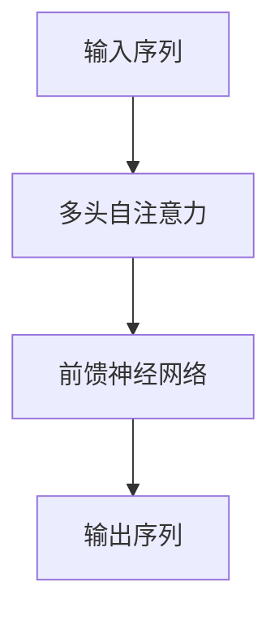
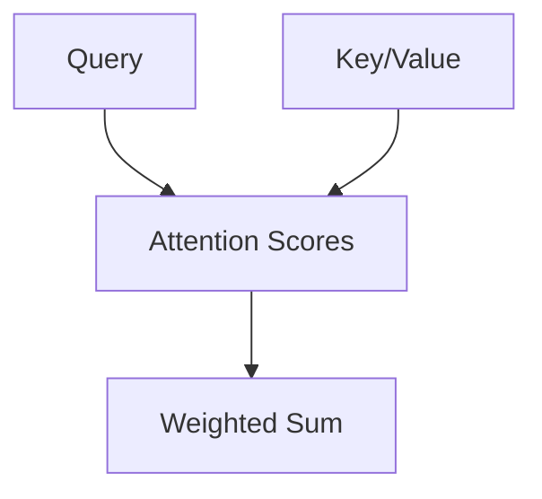
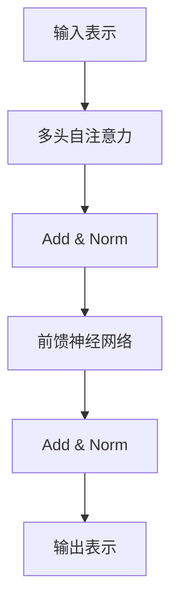
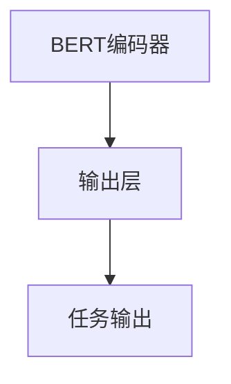

# 一切皆是映射：BERT模型原理及其在文本理解中的应用

## 1.背景介绍

### 1.1 自然语言处理的挑战

自然语言处理(NLP)是人工智能领域中一个极具挑战的任务。与机器能够轻松理解的结构化数据不同,自然语言存在着复杂的语义、语法和上下文依赖关系。传统的NLP模型通常采用基于规则或统计方法,难以有效捕捉语言的丰富语义信息。

### 1.2 表示学习的重要性

近年来,表示学习(Representation Learning)在NLP领域取得了突破性进展。表示学习旨在从原始数据中自动学习出有意义的特征表示,而不是依赖于人工设计的特征。这种数据驱动的方法显著提高了模型的泛化能力和性能。

### 1.3 BERT的崛起

2018年,谷歌发布了BERT(Bidirectional Encoder Representations from Transformers)模型,这是一种基于Transformer的双向编码器表示,在多项NLP任务上取得了state-of-the-art的表现。BERT的核心思想是利用自注意力(Self-Attention)机制,从大量未标记数据中学习上下文敏感的词向量表示,从而更好地捕捉语义信息。

## 2.核心概念与联系

### 2.1 Transformer架构

BERT模型的核心是Transformer架构,它是一种全新的基于注意力机制的序列到序列模型。与传统的基于RNN或CNN的模型不同,Transformer完全依赖于注意力机制来捕捉输入和输出之间的全局依赖关系。



### 2.2 自注意力机制

自注意力机制是Transformer的关键组成部分。它允许模型在计算目标单词的表示时,关注整个输入序列中的所有单词,并根据它们之间的关联程度分配不同的权重。这种机制有助于捕捉长距离依赖关系,克服了RNN在长序列处理中的梯度消失问题。



### 2.3 BERT的双向编码器

BERT采用了双向Transformer编码器,这意味着上下文的表示是通过融合了左右上下文的信息获得的。与传统的单向语言模型不同,BERT能够同时利用单词的左右上下文信息,从而学习到更加丰富和准确的表示。

### 2.4 掩码语言模型

BERT在预训练阶段采用了掩码语言模型(Masked Language Model)的目标,通过预测被掩码的单词来学习上下文表示。与传统语言模型只关注单词的左侧或右侧上下文不同,掩码语言模型迫使模型关注单词的全部上下文,从而学习到更加有意义的表示。

## 3.核心算法原理具体操作步骤

### 3.1 输入表示

BERT将输入序列表示为一系列token embeddings、segment embeddings和position embeddings的总和。

1. Token Embeddings:将每个单词映射到一个初始向量空间。
2. Segment Embeddings:区分输入序列是属于句子A还是句子B。
3. Position Embeddings:编码单词在序列中的位置信息。

$$\text{Input Representation} = \text{Token Embeddings} + \text{Segment Embeddings} + \text{Position Embeddings}$$

### 3.2 多头自注意力

BERT使用了多头自注意力机制,它允许模型同时关注不同的位置映射函数。

1. 将查询(Q)、键(K)和值(V)线性投影到不同的表示空间。
2. 计算查询与所有键的点积,应用softmax得到注意力分数。
3. 使用注意力分数对值进行加权求和,得到注意力输出。
4. 对多个注意力头的输出进行拼接,形成最终的多头注意力表示。

$$\text{MultiHead}(Q,K,V) = \text{Concat}(\text{head}_1, \ldots, \text{head}_h)W^O$$
$$\text{where head}_i = \text{Attention}(QW_i^Q, KW_i^K, VW_i^V)$$

### 3.3 编码器层

BERT编码器由多个相同的层组成,每一层包含了多头自注意力子层和前馈神经网络子层。

1. 多头自注意力子层:捕捉输入序列中单词之间的依赖关系。
2. 前馈神经网络子层:对每个单词的表示进行非线性变换。
3. 残差连接和层归一化:确保梯度在深层网络中的流动。



### 3.4 预训练任务

BERT在大规模未标记语料上进行了两个预训练任务:掩码语言模型和下一句预测。

1. 掩码语言模型:随机掩码输入序列中的15%单词,模型需要预测被掩码的单词。
2. 下一句预测:判断两个句子是否相邻,以捕捉句子之间的关系。

通过这两个预训练任务,BERT学习了丰富的语义和句法知识,为下游的NLP任务做好了准备。

### 3.5 微调

在下游NLP任务上,BERT通过在预训练模型的基础上进行微调(fine-tuning)来获得任务特定的表示。根据任务的不同,BERT的输出表示会被馈送到不同的输出层,如分类器或序列标注层。



## 4.数学模型和公式详细讲解举例说明

### 4.1 注意力机制

注意力机制是BERT的核心,它允许模型在计算目标单词的表示时,关注整个输入序列中的所有单词,并根据它们之间的关联程度分配不同的权重。

对于一个长度为n的输入序列$X = (x_1, x_2, \ldots, x_n)$,注意力机制首先计算查询(Query)向量$q$与所有键(Key)向量$K = (k_1, k_2, \ldots, k_n)$的相似性得分:

$$\text{Attention}(Q, K, V) = \text{softmax}(\frac{QK^T}{\sqrt{d_k}})V$$

其中$V = (v_1, v_2, \ldots, v_n)$是值(Value)向量序列,$d_k$是缩放因子,用于防止内积过大导致softmax饱和。

softmax函数确保注意力分数的和为1,从而将值向量$V$加权求和,得到注意力输出:

$$\text{Attention}(Q, K, V) = \sum_{i=1}^n \alpha_i v_i$$

其中$\alpha_i = \text{softmax}(\frac{q \cdot k_i}{\sqrt{d_k}})$是第i个值向量的注意力权重。

### 4.2 多头注意力

多头注意力机制允许模型同时关注不同的位置映射函数。它将查询、键和值线性投影到不同的表示空间,并在每个子空间内计算注意力,最后将所有注意力头的输出拼接起来。

$$\text{MultiHead}(Q,K,V) = \text{Concat}(\text{head}_1, \ldots, \text{head}_h)W^O$$
$$\text{where head}_i = \text{Attention}(QW_i^Q, KW_i^K, VW_i^V)$$

其中$W_i^Q, W_i^K, W_i^V$是不同注意力头的线性投影矩阵,$W^O$是用于将多头注意力输出拼接的矩阵。

### 4.3 位置编码

由于Transformer缺乏像RNN那样的递归结构,因此需要显式地编码序列中单词的位置信息。BERT采用了正弦和余弦函数对位置进行编码:

$$\text{PE}_{(pos, 2i)} = \sin(pos / 10000^{2i/d_{model}})$$
$$\text{PE}_{(pos, 2i+1)} = \cos(pos / 10000^{2i/d_{model}})$$

其中$pos$是单词在序列中的位置,$i$是维度索引,$d_{model}$是模型维度。这种编码方式允许模型学习相对位置,而不仅仅是绝对位置。

## 5.项目实践:代码实例和详细解释说明

以下是一个使用Hugging Face的Transformers库对文本进行BERT编码的Python示例:

```python
from transformers import BertTokenizer, BertModel

# 加载预训练的BERT模型和分词器
tokenizer = BertTokenizer.from_pretrained('bert-base-uncased')
model = BertModel.from_pretrained('bert-base-uncased')

# 输入文本
text = "This is a sample text for BERT encoding."

# 对输入文本进行分词和编码
encoded_input = tokenizer(text, return_tensors='pt')

# 将编码后的输入传递给BERT模型
output = model(**encoded_input)

# 获取BERT的最后一层隐藏状态
last_hidden_state = output.last_hidden_state

# 打印编码后的向量表示
print(last_hidden_state)
```

以上代码首先加载预训练的BERT模型和分词器。然后,它将输入文本传递给分词器进行分词和编码,生成一个包含输入ID、掩码和段ID的字典。

接下来,编码后的输入被传递给BERT模型,模型返回一个包含最后一层隐藏状态的输出对象。最后一层隐藏状态是BERT对输入序列的上下文编码表示,可以用于各种下游NLP任务。

在实际应用中,您可以将这些编码后的向量表示作为特征输入到其他模型中,如分类器或序列标注模型,以解决特定的NLP任务。

## 6.实际应用场景

BERT及其变体模型在各种NLP任务中表现出色,包括但不限于:

1. **文本分类**: 将文本分配到预定义的类别,如情感分析、新闻分类等。
2. **命名实体识别(NER)**: 识别文本中的人名、地名、组织机构名等实体。
3. **问答系统**: 根据给定的问题从文本中找到相关答案。
4. **机器翻译**: 将一种语言的文本翻译成另一种语言。
5. **文本摘要**: 自动生成文本的摘要或概括。
6. **自然语言推理**: 判断一个假设是否能从给定的前提中推导出来。

除了上述任务外,BERT也被广泛应用于各种领域,如生物医学、法律、金融等,用于挖掘和理解特定领域的文本数据。

## 7.工具和资源推荐

以下是一些流行的BERT相关工具和资源:

1. **Hugging Face Transformers**: 一个提供各种预训练语言模型(包括BERT)的Python库,支持多种NLP任务。
2. **BERT-as-Service**: 一个易于使用的BERT服务,可以快速部署和集成BERT模型。
3. **AllenNLP**: 一个开源的NLP研究库,提供了BERT等模型的实现。
4. **Google AI Blog**: 谷歌发布BERT相关研究和更新的官方博客。
5. **Papers with Code**: 一个收集了BERT及其变体模型的论文和代码的网站。
6. **BERT资源列表**: 一个由社区维护的BERT相关资源列表,包括教程、代码库和数据集。

## 8.总结:未来发展趋势与挑战

BERT的出现彻底改变了NLP领域,但它仍然存在一些局限性和挑战:

1. **计算资源需求高**: BERT模型通常包含数亿个参数,需要大量的计算资源进行训练和推理。
2. **缺乏长期依赖建模能力**: BERT的注意力机制难以有效捕捉长距离的依赖关系。
3. **缺乏常识推理能力**: BERT主要关注语言建模,缺乏对常识知识的理解和推理能力。
4. **缺乏多模态融合能力**: BERT主要针对文本数据,难以直接处理图像、视频等其他模态数据。

未来,NLP研究可能会朝以下方向发展:

1. **更高效的模型架构**: 设计更加高效和轻量级的模型架构,降低计算资源需求。
2. **长期依