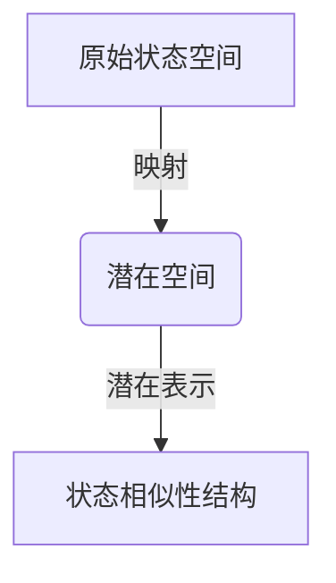
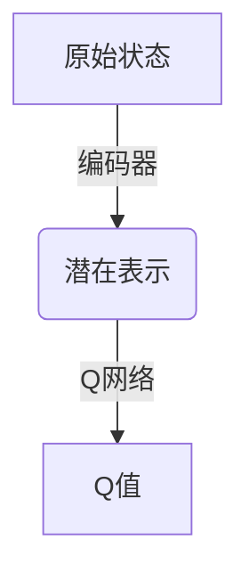
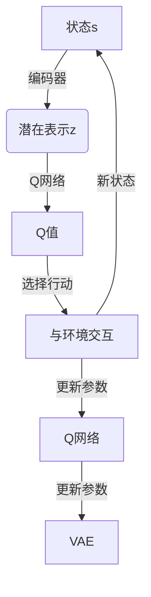

# 一切皆是映射：DQN中潜在代表性学习的研究进展

## 1.背景介绍

### 1.1 强化学习和深度Q网络概述

强化学习是一种基于环境交互的学习方法,旨在通过试错和奖惩机制找到最优策略。在强化学习中,智能体(agent)与环境(environment)进行交互,根据当前状态选择行动,环境则根据这些行动产生新的状态和奖惩信号。智能体的目标是最大化预期的累积奖励。

深度Q网络(Deep Q-Network, DQN)是一种结合深度学习和Q学习的强化学习算法,可以解决传统Q学习在处理高维观测数据时遇到的困难。DQN使用深度神经网络来近似Q函数,从而能够直接从高维原始输入(如图像像素)中学习出有用的特征表示,而不需要手工设计特征。

### 1.2 代表性学习的重要性

尽管DQN取得了巨大的成功,但它仍然存在一些局限性。传统的DQN通过将状态映射到Q值,学习状态-行为值函数的表示。然而,这种方法忽视了状态之间的内在结构和相似性。代表性学习(Representation Learning)旨在学习出状态的潜在表示,从而揭示状态之间的相似性结构,有助于提高泛化能力和样本效率。

### 1.3 潜在代表性学习在DQN中的应用

近年来,研究人员开始将潜在代表性学习的思想引入DQN,以提高其性能。这种方法通过学习状态的潜在表示,捕捉状态之间的相似性,从而提高了DQN的泛化能力和样本效率。本文将综述DQN中潜在代表性学习的最新研究进展,包括不同方法的原理、优缺点以及未来的发展方向。

## 2.核心概念与联系  

### 2.1 潜在空间和潜在表示

潜在空间(Latent Space)是指通过某种映射(如自编码器)从原始数据空间映射得到的低维空间。在这个低维空间中,每个数据点都用一个低维向量(称为潜在表示或潜在码)来表示。潜在表示旨在捕捉数据的内在结构和语义信息。

在DQN中,我们可以将状态映射到潜在空间,从而获得状态的潜在表示。相似的状态在潜在空间中将彼此靠近,而不同的状态则相距较远。通过利用这种潜在表示,DQN可以更好地捕捉状态之间的相似性结构,从而提高泛化能力。



### 2.2 潜在空间中的Q函数近似

传统的DQN直接将原始状态映射到Q值,而潜在代表性DQN则先将状态映射到潜在空间,再在潜在空间中近似Q函数。具体来说,我们可以使用一个编码器网络将状态编码为潜在表示,然后使用另一个Q网络将潜在表示映射到Q值。

这种方法的优点是,由于潜在表示捕捉了状态之间的相似性结构,因此Q网络只需要学习潜在空间中的Q函数,从而简化了学习任务。此外,由于相似状态在潜在空间中彼此靠近,因此Q网络可以更好地泛化到新的状态。



### 2.3 潜在空间正则化

为了进一步提高潜在表示的质量,我们可以在学习过程中对潜在空间进行正则化。常见的正则化方法包括:

1. 对潜在表示施加先验分布(如高斯分布),以鼓励潜在表示具有所需的统计特性。
2. 最小化潜在表示之间的mutual information,以确保潜在表示捕捉状态的不同方面。
3. 最大化潜在表示与奖励信号之间的mutual information,以确保潜在表示对任务是相关的。

通过潜在空间正则化,我们可以获得更加结构化和信息丰富的潜在表示,从而进一步提高DQN的性能。

## 3.核心算法原理具体操作步骤

在这一部分,我们将介绍一种基于变分自编码器(Variational Autoencoder, VAE)的潜在代表性DQN算法的具体原理和操作步骤。

### 3.1 变分自编码器

VAE是一种常用的生成模型,它通过对潜在变量z和观测数据x的联合分布进行参数化,来学习数据的潜在表示。VAE由一个编码器网络和一个解码器网络组成:

1. 编码器网络 $q_\phi(z|x)$ 将观测数据 x 映射到潜在表示 z 的概率分布。
2. 解码器网络 $p_\theta(x|z)$ 则从潜在表示 z 重构原始数据 x。

通过最大化 $\log p_\theta(x)$ 的证据下界(Evidence Lower Bound, ELBO),VAE可以同时学习编码器和解码器的参数,从而获得良好的潜在表示。

### 3.2 基于VAE的潜在代表性DQN算法

在基于VAE的潜在代表性DQN算法中,我们首先使用VAE对状态进行编码,获得状态的潜在表示z。然后,我们使用一个Q网络将潜在表示z映射到Q值。具体步骤如下:

1. 使用VAE的编码器网络 $q_\phi(z|s)$ 将状态 s 编码为潜在表示 z。
2. 使用Q网络 $Q_\theta(z,a)$ 将潜在表示 z 和行动 a 映射到Q值。
3. 根据Q值选择行动,与环境交互并获得新的状态和奖励。
4. 将新的状态编码为潜在表示,并根据贝尔曼方程更新Q网络的参数。
5. 同时根据ELBO更新VAE的编码器和解码器参数。

通过交替优化VAE和Q网络,我们可以同时获得高质量的潜在表示和精确的Q函数近似。



### 3.3 潜在空间正则化

为了进一步提高潜在表示的质量,我们可以在算法中引入潜在空间正则化。具体来说,我们可以对编码器网络的输出 $q_\phi(z|s)$ 施加高斯先验分布,并将KL散度项作为正则化项加入ELBO的损失函数中:

$$
\mathcal{L}_{VAE} = \mathbb{E}_{q_\phi(z|s)}[\log p_\theta(s|z)] - \beta D_{KL}(q_\phi(z|s)||p(z))
$$

其中 $\beta$ 是一个权重系数,用于平衡重构项和正则化项。通过最小化这个损失函数,我们可以同时最大化数据的似然,并将潜在表示拉向高斯分布,从而获得更加结构化和紧凑的潜在表示。

此外,我们还可以最大化潜在表示与奖励信号之间的mutual information,以确保潜在表示对任务是相关的。具体来说,我们可以添加一个辅助任务,使用一个辅助网络从潜在表示预测奖励,并将预测误差作为正则化项加入总的损失函数中。

通过这些潜在空间正则化技术,我们可以进一步提高潜在代表性DQN算法的性能。

## 4.数学模型和公式详细讲解举例说明

在这一部分,我们将详细介绍潜在代表性DQN算法中涉及的一些核心数学模型和公式,并给出具体的例子说明。

### 4.1 变分自编码器

VAE的核心思想是通过最大化ELBO来同时学习编码器和解码器的参数。ELBO的数学表达式如下:

$$
\begin{aligned}
\log p_\theta(x) &\geq \mathbb{E}_{q_\phi(z|x)}[\log p_\theta(x|z)] - D_{KL}(q_\phi(z|x)||p(z)) \\
&= \mathcal{L}(\theta,\phi;x)
\end{aligned}
$$

其中:

- $p_\theta(x|z)$ 是解码器网络,给定潜在表示 z 生成数据 x 的概率。
- $q_\phi(z|x)$ 是编码器网络,将数据 x 编码为潜在表示 z 的概率分布。
- $p(z)$ 是潜在变量 z 的先验分布,通常设置为标准高斯分布。
- $D_{KL}$ 表示KL散度,用于度量两个概率分布之间的差异。

通过最大化ELBO,我们可以同时最大化数据的似然 $\log p_\theta(x)$,并将编码器网络的输出分布 $q_\phi(z|x)$ 拉向先验分布 $p(z)$。

让我们以一个简单的示例来说明VAE的工作原理。假设我们有一个二维高斯数据集,其均值为 $\mu = (0, 0)$,协方差矩阵为 $\Sigma = \begin{bmatrix}1&0\\0&1\end{bmatrix}$。我们可以使用一个简单的VAE模型来学习这个数据集的潜在表示。

在这个例子中,编码器网络 $q_\phi(z|x)$ 将二维数据 x 映射到一个均值和方差参数,用于参数化一个高斯分布。解码器网络 $p_\theta(x|z)$ 则从潜在表示 z 重构原始数据 x。通过最大化ELBO,VAE可以同时学习编码器和解码器的参数,从而获得数据的潜在表示。

下图展示了VAE在这个示例数据集上的训练过程。我们可以看到,随着训练的进行,VAE逐渐学习到了数据的潜在结构,并将数据映射到一个紧凑的高斯分布中。

```
# 这里插入VAE训练过程的可视化图像
```

### 4.2 Q函数近似

在潜在代表性DQN算法中,我们使用一个Q网络 $Q_\theta(z,a)$ 来近似Q函数,其中 z 是状态的潜在表示。Q网络的目标是最小化以下损失函数:

$$
\mathcal{L}(\theta) = \mathbb{E}_{s,a,r,s'}\left[(Q_\theta(z,a) - y)^2\right]
$$

其中:

- $z = q_\phi(z|s)$ 是状态 s 的潜在表示,由编码器网络计算得到。
- $y = r + \gamma \max_{a'} Q_{\theta^-}(z',a')$ 是目标Q值,根据贝尔曼方程计算得到。
- $\theta^-$ 表示目标Q网络的参数,用于计算目标Q值。

通过最小化这个损失函数,Q网络可以逐步学习到精确的Q函数近似。

让我们以一个简单的网格世界(Gridworld)环境为例,说明Q函数近似的过程。在这个环境中,智能体需要从起点移动到终点,并尽可能获得更多的奖励。我们使用一个基于VAE的潜在代表性DQN算法来解决这个任务。

在训练过程中,VAE首先将每个状态编码为一个潜在表示 z。然后,Q网络将这个潜在表示 z 和可能的行动 a 映射到对应的Q值。通过与环境交互并根据贝尔曼方程更新Q网络的参数,算法逐步学习到了精确的Q函数近似。

下图展示了Q网络在不同训练阶段对应的Q值估计。我们可以看到,随着训练的进行,Q网络逐渐学习到了环境的奖励结构,并给出了合理的Q值估计。

```
# 这里插入Q网络训练过程的可视化图像
```

## 5.项目实践:代码实例和详细解释说明

在这一部分,我们将提供一个基于PyTorch的潜在代表性DQ