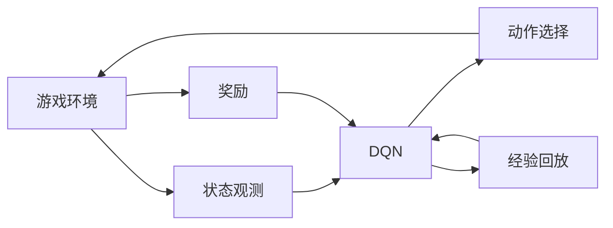

# 一切皆是映射：DQN在自动游戏中的应用：挑战与解决方案

## 1. 背景介绍
### 1.1 强化学习与自动游戏
强化学习(Reinforcement Learning, RL)是机器学习的一个重要分支,它研究如何让智能体(Agent)在与环境的交互中学习最优策略,以获得最大的累积奖励。近年来,随着深度学习的发展,深度强化学习(Deep Reinforcement Learning, DRL)取得了令人瞩目的成就,尤其是在自动游戏领域。

自动游戏是人工智能的一个重要应用场景和测试平台。传统的游戏AI通常依赖于预先设计好的规则和策略,难以应对复杂多变的游戏环境。而深度强化学习为自动游戏带来了新的突破,让AI可以通过自主学习掌握游戏策略,甚至超越人类玩家。

### 1.2 DQN的崛起
在众多DRL算法中,DQN(Deep Q-Network)可以说是一个里程碑式的存在。2015年,DeepMind提出了DQN[1],并在Atari 2600的多个游戏中取得了超越人类的成绩,引发了学界和业界的广泛关注。此后,DQN及其变体被广泛应用于各类游戏环境中,展现出了强大的学习能力和普适性。

DQN的核心思想是将Q学习与深度神经网络相结合。传统的Q学习使用Q表来记录每个状态-动作对的价值,但在高维状态空间下会遇到维度灾难。DQN则用深度神经网络来拟合Q函数,将状态作为网络输入,输出各个动作的Q值。通过不断与环境交互并优化网络参数,DQN可以逐步学习到最优Q函数,进而得到最优策略。

### 1.3 DQN在自动游戏中的应用现状
目前,DQN已经在多种类型的游戏中得到应用,展现出了卓越的性能表现,例如:

- Atari系列游戏:DQN在57个Atari 2600游戏中的29个超越了人类玩家[1]。
- 第一人称射击游戏:DQN在Doom游戏中学会了导航、收集物品、射击等技能[2]。  
- 多智能体游戏:DQN在星际争霸等多智能体游戏中实现了智能体间的协作与对抗[3]。
- 开放世界游戏:DQN在Minecraft等开放世界游戏中学习了探索、采集资源、建造等行为[4]。

可以看到,DQN在各类游戏中都取得了不俗的表现,展现出了其强大的学习能力和普适性。然而,将DQN应用于自动游戏仍然面临诸多挑战,例如如何高效探索、如何处理部分可观测、如何进行迁移学习等。这些都是亟需攻克的难题。

本文将重点介绍DQN的核心原理,剖析其在自动游戏中的典型应用,分析其面临的挑战,并探讨可能的解决方案。希望能为DQN乃至DRL在自动游戏领域的研究和应用提供一些思路和启发。

## 2. 核心概念与联系
### 2.1 强化学习的数学框架
强化学习可以用一个六元组 $<S,A,P,R,\gamma,\pi>$ 来表示:
- 状态空间 $S$:智能体所处的环境状态集合。
- 动作空间 $A$:智能体可采取的动作集合。
- 状态转移概率 $P$:在状态 $s$ 下采取动作 $a$ 后转移到状态 $s'$ 的概率,即 $P(s'|s,a)$。
- 奖励函数 $R$:在状态 $s$ 下采取动作 $a$ 后获得的即时奖励,即 $R(s,a)$。 
- 折扣因子 $\gamma \in [0,1]$:未来奖励的折扣率,用于平衡即时奖励和长期奖励。
- 策略 $\pi$:将状态映射为动作的函数,即 $\pi(a|s)$。

强化学习的目标是寻找最优策略 $\pi^*$,使得智能体能获得最大的期望累积奖励:

$$\pi^* = \arg\max_\pi \mathbb{E}[\sum_{t=0}^{\infty} \gamma^t R(s_t,a_t)|\pi]$$

其中, $s_t,a_t$ 分别为 $t$ 时刻的状态和动作。

### 2.2 Q学习与DQN
Q学习是一种常用的无模型强化学习算法,其核心是学习动作-价值函数(Q函数):

$$Q(s,a) = \mathbb{E}[\sum_{t=0}^{\infty} \gamma^t R(s_t,a_t)|s_0=s,a_0=a]$$

$Q(s,a)$ 表示在状态 $s$ 下采取动作 $a$ 后能获得的期望累积奖励。若知道最优Q函数 $Q^*$,则最优策略为:

$$\pi^*(s) = \arg\max_a Q^*(s,a)$$

Q学习的目标是逼近 $Q^*$,其迭代更新公式为:

$$Q(s,a) \leftarrow Q(s,a) + \alpha [R(s,a) + \gamma \max_{a'} Q(s',a') - Q(s,a)]$$

其中, $\alpha$ 为学习率, $s'$ 为在 $s$ 下采取 $a$ 后转移到的下一状态。

传统Q学习使用Q表来记录每个状态-动作对的Q值,但在状态和动作空间很大时会遇到维度灾难。DQN的创新在于:
1. 用深度神经网络 $Q(s,a;\theta)$ 来拟合Q函数,其中 $\theta$ 为网络参数。
2. 采用经验回放(Experience Replay)机制,将转移 $(s,a,r,s')$ 存入回放缓存 $D$ 中,之后从 $D$ 中随机采样一批数据来更新网络参数。
3. 引入目标网络(Target Network) $\hat{Q}$,其参数 $\hat{\theta}$ 定期从 $\theta$ 复制而来,用于计算目标Q值。

DQN的损失函数定义为:

$$L(\theta) = \mathbb{E}_{(s,a,r,s') \sim D} [(r + \gamma \max_{a'} \hat{Q}(s',a';\hat{\theta}) - Q(s,a;\theta))^2]$$

通过最小化 $L(\theta)$ 来更新 $\theta$,使 $Q$ 逼近 $Q^*$。

### 2.3 DQN在自动游戏中的应用框架

DQN在自动游戏中的应用可以概括为如下框架:



1. 游戏环境产生状态观测(如游戏画面),输入到DQN。
2. DQN根据当前状态输出各个动作的Q值。
3. 根据Q值选择一个动作(如 $\epsilon$-贪婪策略),反馈给游戏环境。
4. 游戏环境执行动作,给出即时奖励,并转移到下一状态。
5. 将(状态,动作,奖励,下一状态)的四元组存入经验回放缓存。
6. DQN从经验回放中采样一批数据,计算损失函数并更新网络参数。

不断重复上述过程,DQN可以逐步学习到最优Q函数,实现端到端的游戏策略学习。

## 3. 核心算法原理具体操作步骤

DQN算法可以分为以下几个关键步骤:

### 3.1 状态预处理
将游戏画面预处理为神经网络的输入,主要包括:
1. 灰度化:将RGB图像转为灰度图,减少输入通道数。
2. 下采样:将图像缩放到较小的尺寸(如84x84),减少计算量。
3. 帧叠加:将连续几帧(如4帧)图像叠加为一个状态,引入时间信息。

预处理后的状态为 $s_t = f(x_{t-3},x_{t-2},x_{t-1},x_t)$,其中 $x_t$ 为 $t$ 时刻的游戏画面, $f$ 为预处理函数。

### 3.2 Q网络设计
Q网络 $Q(s,a;\theta)$ 采用卷积神经网络(CNN)结构,主要包括:
1. 卷积层:提取图像的空间特征。
2. 全连接层:融合特征并输出每个动作的Q值。

一个典型的Q网络结构如下:

```mermaid
graph LR
A[输入层 84x84x4] --> B[卷积层1 32@8x8]
B --> C[卷积层2 64@4x4]
C --> D[卷积层3 64@3x3]
D --> E[全连接层1 512]
E --> F[全连接层2 |A|]
```

其中,卷积层的参数为"输出通道数@卷积核尺寸",全连接层的参数为输出神经元数。

### 3.3 经验回放
经验回放可以看作一个循环缓冲区,用于存储最近的 $N$ 个转移样本 $(s,a,r,s')$。在每个时间步,智能体与环境交互得到一个新样本,将其放入缓冲区,若缓冲区已满则替换最老的样本。

在训练时,从缓冲区中随机采样一批(batch)样本,用于计算损失函数并更新Q网络的参数。这种做法有以下优点:
1. 打破了样本间的关联性,使训练数据更像独立同分布。
2. 提高数据利用效率,每个样本可被多次采样用于训练。

### 3.4 目标网络
为了提高训练稳定性,DQN引入了目标网络 $\hat{Q}$,其结构与Q网络相同,参数 $\hat{\theta}$ 每隔一定步数从 $\theta$ 复制而来。在计算目标Q值时使用 $\hat{Q}$,即:

$$y = r + \gamma \max_{a'} \hat{Q}(s',a';\hat{\theta})$$

而在计算Q值时使用 $Q$,即:

$$\hat{y} = Q(s,a;\theta)$$

损失函数为目标Q值与预测Q值的均方差:

$$L(\theta) = \mathbb{E}_{(s,a,r,s') \sim D} [(y - \hat{y})^2]$$

通过最小化损失函数来更新Q网络参数 $\theta$,而目标网络参数 $\hat{\theta}$ 保持不变。这种做法可以减少目标计算与参数更新间的相关性,提高收敛性。

### 3.5 $\epsilon$-贪婪探索
为了在探索和利用间取得平衡,DQN采用 $\epsilon$-贪婪策略来选择动作。具体地,在状态 $s$ 下:
- 以 $\epsilon$ 的概率随机选择一个动作 $a$。
- 以 $1-\epsilon$ 的概率选择Q值最大的动作,即 $a = \arg\max_a Q(s,a;\theta)$。

其中 $\epsilon \in [0,1]$ 为探索率。一般初始 $\epsilon$ 设为1,然后随着训练的进行逐渐衰减到一个小值(如0.1)。这样前期可以鼓励探索,后期则偏重利用。

### 3.6 算法流程
结合以上各个部分,DQN的完整算法流程如下:

1. 初始化Q网络参数 $\theta$,目标网络参数 $\hat{\theta} = \theta$。
2. 初始化经验回放缓冲区 $D$,探索率 $\epsilon$。
3. for episode = 1 to M do:
   1. 初始化游戏环境,得到初始状态 $s_0$。
   2. for t = 0 to T do:
      1. 根据 $\epsilon$-贪婪策略选择动作 $a_t$。
      2. 执行动作 $a_t$,得到奖励 $r_t$ 和下一状态 $s_{t+1}$。
      3. 将转移样本 $(s_t,a_t,r_t,s_{t+1})$ 存入 $D$。
      4. 从 $D$ 中随机采样一批样本 $(s,a,r,s')$。
      5. 计算目标Q值 $y = r + \gamma \max_{a'} \hat{Q}(s',a';\hat{\theta})$