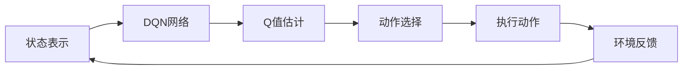

# 一切皆是映射：DQN在自动驾驶中的应用案例分析

## 1. 背景介绍
### 1.1 自动驾驶技术概述
自动驾驶技术是当前人工智能和机器学习领域的一个热点研究方向。它旨在让车辆能够在没有人类驾驶员干预的情况下,自主地感知环境、规划路径并控制车辆行驶。自动驾驶技术的发展将极大地改善交通安全、提高出行效率,并为人们的生活带来深远影响。

### 1.2 强化学习在自动驾驶中的应用
强化学习(Reinforcement Learning)是一种重要的机器学习范式,它通过智能体(Agent)与环境的交互,使智能体学会采取最优的行为策略,从而获得最大的累积奖励。近年来,强化学习在自动驾驶领域得到了广泛应用,它为自动驾驶系统提供了一种自主学习和决策的机制。其中,深度Q网络(Deep Q-Network, DQN)是一种经典的强化学习算法,在自动驾驶任务中展现出了卓越的性能。

### 1.3 本文的研究目的和意义
本文将以DQN算法为切入点,深入分析其在自动驾驶领域的应用案例。通过剖析DQN的核心原理和关键技术,阐述其在自动驾驶任务中的优势和挑战。同时,本文将结合实际项目,给出DQN在自动驾驶中的代码实现和详细讲解。最后,本文将展望DQN乃至强化学习在自动驾驶领域的未来发展趋势和面临的机遇与挑战。

## 2. 核心概念与联系
### 2.1 马尔可夫决策过程
马尔可夫决策过程(Markov Decision Process, MDP)是强化学习的理论基础。MDP由状态集合S、动作集合A、状态转移概率P和奖励函数R构成。在每个时间步,智能体根据当前状态采取一个动作,环境根据状态转移概率转移到下一个状态,并给予智能体一定的奖励。智能体的目标是学习一个最优策略π,使得在该策略下获得的期望累积奖励最大化。

### 2.2 Q-Learning算法
Q-Learning是一种经典的无模型强化学习算法,用于解决MDP问题。它通过值迭代的方式,不断更新动作-状态值函数Q(s,a),估计在状态s下采取动作a可以获得的长期累积奖励。Q-Learning的更新公式为:
$$Q(s,a) \leftarrow Q(s,a) + \alpha [r + \gamma \max_{a'} Q(s',a') - Q(s,a)]$$
其中,α是学习率,γ是折扣因子,r是即时奖励,s'是下一个状态。

### 2.3 深度Q网络
传统的Q-Learning在状态和动作空间较大时会变得低效。深度Q网络(DQN)将深度神经网络引入到Q-Learning中,用于拟合动作-状态值函数。DQN以状态作为输入,输出每个动作的Q值估计,然后选择Q值最大的动作作为最优动作。DQN的损失函数为:
$$L(\theta) = \mathbb{E}_{(s,a,r,s')\sim D}[(r + \gamma \max_{a'} Q(s',a';\theta^-) - Q(s,a;\theta))^2]$$
其中,θ是当前网络的参数,θ^-是目标网络的参数,D是经验回放缓冲区。DQN通过梯度下降法来最小化损失函数,更新网络参数。

### 2.4 DQN在自动驾驶中的应用思路
DQN可以应用于自动驾驶的决策控制任务,通过学习最优的驾驶策略来实现车辆的自主驾驶。具体而言:
1. 状态表示:将车辆周围的环境信息(如车道线、障碍物、交通标志等)编码为状态向量。
2. 动作空间:定义一系列驾驶动作(如加速、减速、转向等)作为动作空间。 
3. 奖励设计:根据车辆行驶的安全性、舒适性、效率等指标,设计合理的奖励函数。
4. 神经网络结构:构建适用于驾驶策略学习的DQN网络结构。
5. 训练优化:通过仿真环境或实车数据,训练DQN网络学习最优驾驶策略。

下图展示了DQN在自动驾驶中的基本工作流程:



## 3. 核心算法原理具体操作步骤
DQN算法主要包括以下几个关键步骤:

### 3.1 状态预处理
将原始的环境状态(如图像、传感器数据等)预处理成适合神经网络输入的形式。常见的预处理方法有:
- 图像裁剪、缩放、归一化等。
- 状态堆叠,将连续几帧的状态拼接成一个状态。
- 特征提取,用预训练的卷积网络提取图像特征。

### 3.2 神经网络搭建
搭建估计动作-状态值函数Q(s,a)的神经网络。主要包括:
- 输入层:接收预处理后的状态。
- 隐藏层:可使用全连接层或卷积层,增加网络的非线性拟合能力。
- 输出层:输出各个动作的Q值估计,其维度等于动作空间的大小。
- 损失函数:均方误差损失函数,用于衡量Q值估计与目标值间的差异。
- 优化算法:梯度下降法,用于最小化损失函数,更新网络参数。

### 3.3 经验回放
DQN引入经验回放机制,将智能体与环境交互得到的转移样本(s,a,r,s')存储到经验回放缓冲区中。训练时,从缓冲区中随机抽取小批量样本,用于更新网络参数。经验回放可以打破样本间的相关性,提高训练效率和稳定性。

### 3.4 ε-贪心探索
为了平衡探索和利用,DQN在训练初期会以较大的概率随机选择动作进行探索,随着训练的进行,逐渐减小随机探索的概率,更多地利用当前的Q值估计来选择最优动作。ε-贪心探索的具体实现为:
$$
a=\begin{cases}
\arg\max_{a} Q(s,a), & \text{with probability }1-\varepsilon \\
\text{random action}, & \text{with probability }\varepsilon
\end{cases}
$$

### 3.5 目标网络更新
为了提高训练稳定性,DQN引入了目标网络。目标网络与估计网络结构相同,但参数更新频率较低。在计算Q值目标时,使用目标网络的参数,而不是估计网络的参数。定期将估计网络的参数复制给目标网络,以保持两个网络的一致性。

### 3.6 算法伪代码
结合上述步骤,DQN算法的完整伪代码如下:

```python
初始化估计网络Q和目标网络Q̂,参数分别为θ和θ̂
初始化经验回放缓冲区D
for episode = 1 to M do
    初始化初始状态s
    for t = 1 to T do
        根据ε-贪心策略,利用Q选择动作a
        执行动作a,观察奖励r和下一状态s'
        将转移样本(s,a,r,s')存储到D中
        从D中随机抽取小批量转移样本(sj,aj,rj,sj')
        计算Q值目标yj:
            if sj'为终止状态:
                yj = rj
            else:
                yj = rj + γ max_a' Q̂(sj',a';θ̂)
        最小化损失函数:
            L(θ) = 1/N Σj(yj - Q(sj,aj;θ))^2
        利用梯度下降法更新估计网络参数θ
        每隔C步,将估计网络参数θ复制给目标网络参数θ̂
        s ← s'
    end for
end for
```

## 4. 数学模型和公式详细讲解举例说明
本节将详细讲解DQN算法中涉及的关键数学模型和公式,并给出具体的例子说明。

### 4.1 马尔可夫决策过程
马尔可夫决策过程(MDP)是一个五元组(S,A,P,R,γ),其中:
- S是有限的状态集合。
- A是有限的动作集合。
- P是状态转移概率矩阵,P(s'|s,a)表示在状态s下执行动作a后转移到状态s'的概率。
- R是奖励函数,R(s,a)表示在状态s下执行动作a获得的即时奖励。
- γ∈[0,1]是折扣因子,表示未来奖励的折现程度。

MDP的目标是寻找一个最优策略π:S→A,使得从任意初始状态出发,执行该策略获得的期望累积奖励最大化:
$$V^{\pi}(s)=\mathbb{E}\left[\sum_{t=0}^{\infty} \gamma^t R\left(s_t, \pi\left(s_t\right)\right) \mid s_0=s\right]$$

例如,考虑一个简单的自动驾驶场景,状态集合S={直道,弯道},动作集合A={加速,减速,维持速度},状态转移概率和奖励函数如下表所示:

| 状态 | 动作 | 下一状态 | 转移概率 | 即时奖励 |
| --- | --- | --- | --- | --- |
| 直道 | 加速 | 直道 | 0.9 | 1 |
| 直道 | 加速 | 弯道 | 0.1 | -10 |
| 直道 | 减速 | 直道 | 0.8 | 0 |
| 直道 | 减速 | 弯道 | 0.2 | 5 |
| 直道 | 维持速度 | 直道 | 0.7 | 2 |
| 直道 | 维持速度 | 弯道 | 0.3 | -5 |
| 弯道 | 加速 | 直道 | 0.1 | -10 |
| 弯道 | 加速 | 弯道 | 0.9 | -20 |
| 弯道 | 减速 | 直道 | 0.2 | 10 |
| 弯道 | 减速 | 弯道 | 0.8 | 5 |
| 弯道 | 维持速度 | 直道 | 0.3 | 0 |
| 弯道 | 维持速度 | 弯道 | 0.7 | -5 |

在该MDP中,最优策略应该是:在直道时加速,在弯道时减速。这样可以在保证安全的前提下,尽可能快速地行驶,获得较高的长期累积奖励。

### 4.2 Q-Learning
Q-Learning的核心是动作-状态值函数Q(s,a),表示在状态s下执行动作a的长期价值。最优动作-状态值函数Q*(s,a)满足贝尔曼最优方程:
$$Q^*(s,a)=R(s,a)+\gamma \sum_{s'} P(s'|s,a) \max_{a'} Q^*(s',a')$$

Q-Learning通过值迭代的方式逼近最优动作-状态值函数,其更新公式为:
$$Q(s,a) \leftarrow Q(s,a) + \alpha [r + \gamma \max_{a'} Q(s',a') - Q(s,a)]$$

例如,对于上述自动驾驶MDP,假设初始化所有状态-动作对的Q值为0,折扣因子γ=0.9,学习率α=0.1。现在智能体处于直道状态,执行加速动作,转移到直道状态并获得奖励1。则Q值更新过程如下:

$$
\begin{aligned}
Q(\text{直道},\text{加速}) &\leftarrow Q(\text{直道},\text{加速}) + \alpha [r + \gamma \max_{a'} Q(\text{直道},a') - Q(\text{直道},\text{加速})] \\
&= 0 + 0.1 [1 + 0.9 \max(0,0,0) - 0] \\
&= 0.1
\end{aligned}
$$

重复类似的更新过程,最终Q值会收敛到最优值,得到最优策略。

### 4{"msg_type":"generate_answer_finish","data":"","from_module":null,"from_unit":null}