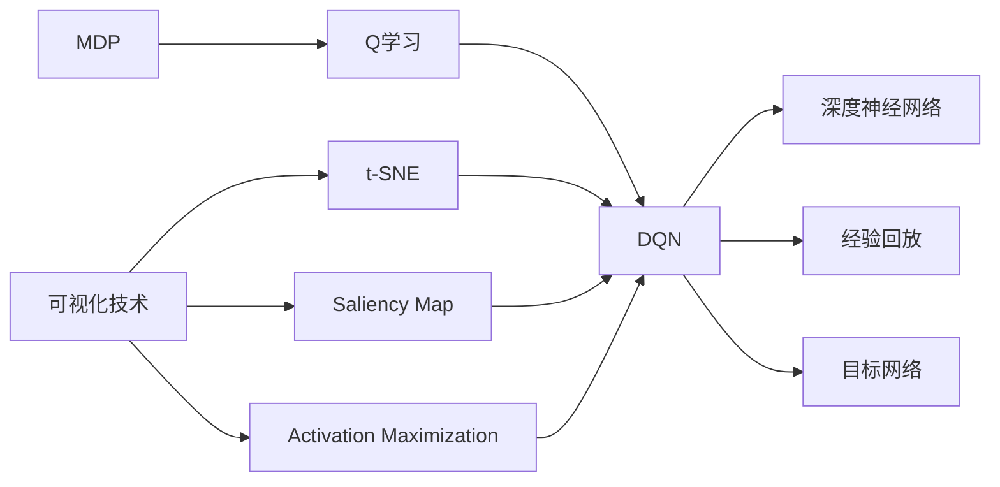

# 一切皆是映射：DQN学习过程的可视化技术及其价值

## 1. 背景介绍

### 1.1 强化学习与DQN
强化学习(Reinforcement Learning, RL)是机器学习的一个重要分支,它研究如何让智能体(Agent)通过与环境的交互来学习最优策略,以获得最大的累积奖励。其中,深度Q网络(Deep Q-Network, DQN)是将深度学习应用于强化学习的典型代表,通过深度神经网络来逼近最优Q值函数,实现了端到端的强化学习。

### 1.2 可视化在机器学习中的重要性
随着深度学习的飞速发展,神经网络模型变得越来越复杂,网络结构和参数量急剧增加,导致模型的可解释性大大降低。而可视化技术能够直观形象地展示模型内部的工作机制,有助于我们更好地理解模型的学习过程,发现潜在的问题,提升算法性能。近年来,可视化在机器学习尤其是深度学习领域受到了广泛关注。

### 1.3 DQN学习过程可视化的意义
DQN作为深度强化学习的代表性算法之一,其学习过程涉及到策略、价值函数、经验回放等多个核心组件的交互更新,非常复杂。对DQN学习过程进行可视化分析,能够帮助我们洞察其内在机理,追踪学习进度,发现潜在问题,为算法改进提供重要参考。此外,通过可视化还能更直观地展示DQN的性能表现,便于与其他算法进行比较。

## 2. 核心概念与联系

### 2.1 MDP与Q学习

- 马尔可夫决策过程(Markov Decision Process, MDP):描述了强化学习的问题框架,包含状态、动作、转移概率和奖励函数。目标是寻找最优策略π使得累积奖励最大化。 
- Q学习:一种无模型的值迭代算法,通过值函数Q(s,a)来评估在状态s下采取动作a的长期价值,Q函数满足贝尔曼方程。

### 2.2 DQN的核心要素

- 深度神经网络:用于逼近最优Q函数,将状态作为输入,输出各个动作的Q值。
- 经验回放(Experience Replay):用一个缓冲区存储智能体与环境交互的转移数据,打破了数据的相关性,提高了样本利用效率。
- 目标网络(Target Network):每隔一定步数将估计网络的参数复制给目标网络,用于计算TD目标,提高训练稳定性。

### 2.3 可视化技术在DQN中的应用

- t-SNE:通过将高维数据映射到二维平面来可视化状态空间,能够反映状态的相似性。
- Saliency Map:通过计算输入图像各像素点对输出的梯度,生成显著图,直观展示对决策产生重要影响的关键区域。
- Activation Maximization:通过梯度上升找到能最大程度激活某个特征图的输入图像,揭示网络学到的视觉概念。

下图展示了DQN学习过程可视化涉及的核心概念之间的关系:



## 3. 核心算法原理与具体步骤

### 3.1 DQN算法流程

1. 初始化估计网络和目标网络参数
2. 初始化经验回放缓冲区
3. for episode = 1 to M do
   1. 初始化初始状态s
   2. for t = 1 to T do 
      1. 根据ε-greedy策略选择动作a
      2. 执行动作a,观察奖励r和下一状态s'
      3. 将转移样本(s,a,r,s')存入回放缓冲区
      4. 从缓冲区中随机采样一批转移样本 
      5. 计算TD目标,更新估计网络参数
      6. 每隔C步,将估计网络参数复制给目标网络
   3. end for
4. end for

### 3.2 t-SNE状态空间可视化

1. 收集一定数量的状态样本{s1,s2,...,sN}
2. 将状态样本输入DQN估计网络,提取最后一层隐藏层激活作为状态特征向量
3. 使用t-SNE算法将高维特征向量映射到二维平面
4. 绘制散点图,每个点表示一个状态

### 3.3 Saliency Map可视化

1. 将一个状态样本s输入DQN估计网络
2. 计算网络输出Q(s,a)关于输入图像各像素点的梯度
3. 取梯度绝对值,然后归一化到[0,1]区间,得到显著图
4. 将原始输入图像和显著图叠加可视化

### 3.4 Activation Maximization可视化

1. 随机初始化一个噪声图像x
2. for i = 1 to K do
   1. 将图像x输入DQN估计网络
   2. 计算网络某一层第j个特征图的平均激活值fj
   3. 计算fj关于x的梯度 
   4. 对x进行梯度上升更新
3. end for
4. 对最终得到的图像x进行可视化,观察其呈现出的视觉概念

## 4. 数学模型与公式详解

### 4.1 MDP的数学描述
一个MDP可以表示为一个五元组$(S,A,P,R,\gamma)$:

- 状态空间$S$
- 动作空间$A$ 
- 转移概率$P(s'|s,a)$
- 奖励函数$R(s,a)$
- 折扣因子$\gamma \in [0,1]$

### 4.2 Q函数的贝尔曼方程
Q函数满足如下贝尔曼方程:

$$Q(s,a)=R(s,a)+\gamma \sum_{s'\in S}P(s'|s,a)\max_{a'}Q(s',a')$$

即当前状态-动作对的Q值等于即时奖励与下一状态的最大Q值的折扣和。

### 4.3 DQN的损失函数
DQN通过最小化TD误差来更新估计网络的参数$\theta$:

$$L(\theta)=\mathbb{E}_{(s,a,r,s')\sim D}[(r+\gamma \max_{a'}Q(s',a';\theta^{-})-Q(s,a;\theta))^2]$$

其中$\theta^{-}$表示目标网络的参数,D表示经验回放缓冲区。

### 4.4 t-SNE的目标函数
t-SNE通过最小化如下KL散度来寻找最优的低维嵌入坐标:

$$C=KL(P||Q)=\sum_i \sum_j p_{ij} \log \frac{p_{ij}}{q_{ij}}$$

其中$p_{ij}$表示高维空间中数据点i,j的相似度,$q_{ij}$表示低维空间中对应点的相似度。

## 5. 代码实践

下面给出了使用PyTorch实现DQN主要组件的示例代码。

### 5.1 DQN网络结构

```python
class DQN(nn.Module):
    def __init__(self, state_dim, action_dim, hidden_dim):
        super(DQN, self).__init__()
        self.fc1 = nn.Linear(state_dim, hidden_dim)
        self.fc2 = nn.Linear(hidden_dim, hidden_dim)
        self.fc3 = nn.Linear(hidden_dim, action_dim)
        
    def forward(self, x):
        x = F.relu(self.fc1(x))
        x = F.relu(self.fc2(x))
        return self.fc3(x)
```

### 5.2 经验回放缓冲区

```python
class ReplayBuffer:
    def __init__(self, capacity):
        self.buffer = deque(maxlen=capacity) 
    
    def push(self, state, action, reward, next_state, done):
        self.buffer.append((state, action, reward, next_state, done))
    
    def sample(self, batch_size):
        transitions = random.sample(self.buffer, batch_size)
        states, actions, rewards, next_states, dones = zip(*transitions)
        return np.array(states), actions, rewards, np.array(next_states), dones
```

### 5.3 DQN训练过程

```python
def train(env, agent, num_episodes, batch_size):
    rewards = []
    for i in range(num_episodes):
        state = env.reset()
        episode_reward = 0
        done = False
        while not done:
            action = agent.select_action(state)
            next_state, reward, done, _ = env.step(action)
            agent.replay_buffer.push(state, action, reward, next_state, done)
            state = next_state
            episode_reward += reward
            
            if len(agent.replay_buffer) > batch_size:
                agent.update(batch_size)
        
        rewards.append(episode_reward)
        print(f"Episode {i}: Reward = {episode_reward:.2f}")
        
    return rewards
```

## 6. 实际应用场景

DQN及其可视化技术在很多领域都有广泛应用,例如:

- 游戏AI:通过DQN学习游戏策略,并使用可视化技术分析AI的游戏理解和行为模式。
- 机器人控制:用DQN训练机器人执行各种任务,通过可视化来监控决策过程,优化机器人性能。
- 自动驾驶:利用DQN处理高维输入并做出驾驶决策,可视化有助于理解决策依据,提高安全性。
- 推荐系统:将推荐问题建模为MDP,用DQN优化长期回报,可视化能揭示用户兴趣变化。

## 7. 工具与资源推荐

- [OpenAI Gym](https://gym.openai.com/):强化学习环境库,提供了多个标准测试环境。
- [PyTorch](https://pytorch.org/):流行的深度学习框架,支持动态计算图。
- [Tensorboard](https://www.tensorflow.org/tensorboard):可视化工具,能实时展示训练过程数据。
- [Matplotlib](https://matplotlib.org/):Python绘图库,支持多种图表类型。
- [Scikit-learn](https://scikit-learn.org/):机器学习算法库,包含t-SNE等流形学习方法。

## 8. 总结与展望

本文介绍了DQN学习过程的可视化技术及其重要价值。我们首先回顾了强化学习与DQN的基本概念,然后重点讨论了t-SNE、Saliency Map、Activation Maximization等可视化方法在DQN中的应用。通过可视化,我们能够深入洞察DQN的学习机制,追踪策略进化,发现潜在问题。

未来,DQN可视化技术还有很大的发展空间。一方面,针对DQN的新变体如Double DQN、Dueling DQN等,需要设计更加有针对性的可视化方案。另一方面,当前可视化方法还主要局限于事后分析,如何实现实时可视化,建立人机交互闭环,将是一个重要的探索方向。此外,VR/AR等新兴技术与DQN可视化的结合也是一个值得期待的研究课题。

## 9. 附录:常见问题解答

### 9.1 为什么DQN需要使用经验回放?

DQN中的经验回放机制主要有以下几个作用:

1. 打破了数据的时序相关性,使得训练样本更加独立同分布。
2. 提高了数据利用效率,加速了学习过程。
3. 通过随机采样避免了训练的发散。

### 9.2 t-SNE的优缺点是什么?

t-SNE的主要优点在于:

1. 能够有效地保持数据的局部结构,使得相似的数据点在低维空间中也靠得近。
2. 对数据的分布没有过多假设,适用范围广。

t-SNE的缺点包括:

1. 计算复杂度高,难以处理大规模数据。
2. 需要调参,对参数较为敏感。
3. 映射结果中的距离没有明确的物理意义。

### 9.3 Saliency Map 与 Activation Maximization 的区别?

Saliency Map和Activation Maximization都是用于理解卷积神经网络内部工作机制的可视化方法,但二者的侧重点不同:

- Saliency Map关注的是输入图像的哪些区域对网络的决策起到了关键作用,通过计算输出对输入的梯度得到。
- Activation Maximization关注的是网络内部