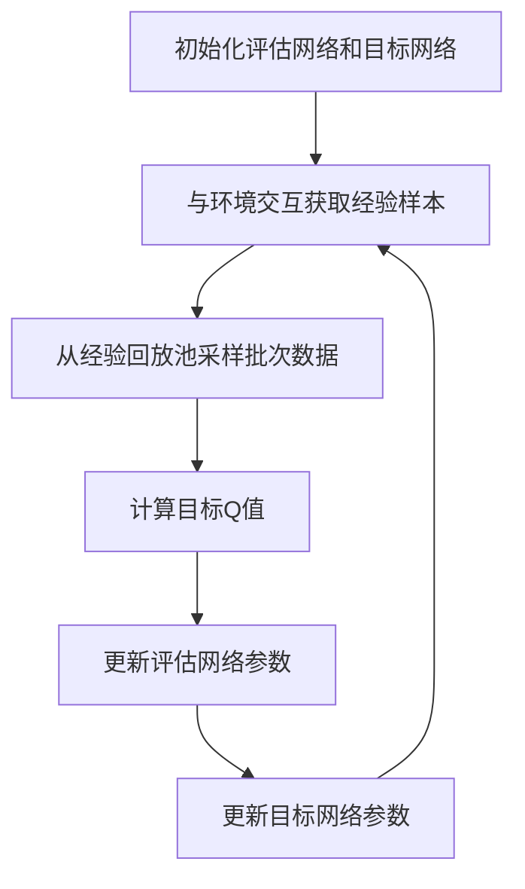

# 一切皆是映射：DQN算法改进历程与关键技术点

## 1.背景介绍

### 1.1 强化学习简介

强化学习(Reinforcement Learning, RL)是机器学习的一个重要分支,它关注智能体(Agent)如何在与环境(Environment)的互动中学习获取最大化的累积奖赏。与监督学习和无监督学习不同,强化学习没有给定的输入-输出数据对,智能体需要通过与环境的交互来学习获取最优策略。

### 1.2 深度强化学习兴起

传统的强化学习算法在处理高维观测和动作空间时往往效率低下。随着深度学习技术的发展,研究人员将深度神经网络引入强化学习,形成了深度强化学习(Deep Reinforcement Learning, DRL)。深度强化学习可以直接从高维原始输入(如图像、视频等)中学习策略,大大扩展了强化学习的应用范围。

### 1.3 DQN算法的重要意义

在2013年,DeepMind团队提出了深度Q网络(Deep Q-Network, DQN),这是第一个将深度神经网络成功应用于强化学习的算法。DQN算法在Atari视频游戏中取得了超越人类水平的表现,开启了深度强化学习的新时代。DQN算法的提出不仅展示了深度神经网络在高维输入下学习控制策略的能力,也推动了强化学习在实际应用中的落地。

## 2.核心概念与联系

### 2.1 马尔可夫决策过程(MDP)

马尔可夫决策过程(Markov Decision Process, MDP)是强化学习问题的数学模型。MDP由一组状态(State)、动作(Action)、状态转移概率(Transition Probability)和奖励函数(Reward Function)组成。智能体在每个时刻观测当前状态,选择一个动作执行,然后获得相应的奖励,并转移到下一个状态。目标是找到一个策略(Policy),使得在MDP中获得的累积奖励最大化。

### 2.2 Q-Learning算法

Q-Learning是一种基于价值迭代的强化学习算法,它通过估计每个状态-动作对的Q值(Q-value)来学习最优策略。Q值表示在当前状态下执行某个动作,然后按照最优策略继续执行下去所能获得的累积奖励的期望。Q-Learning算法通过不断更新Q值,最终收敛到最优Q函数,从而获得最优策略。

### 2.3 深度Q网络(DQN)

DQN算法将Q-Learning与深度神经网络相结合,使用神经网络来近似Q函数。输入是当前状态,输出是所有可能动作对应的Q值。通过训练神经网络,DQN可以直接从高维原始输入(如图像)中学习策略,而不需要手工设计特征。DQN算法还引入了经验回放(Experience Replay)和目标网络(Target Network)等技术来提高训练稳定性。

## 3.核心算法原理具体操作步骤

DQN算法的核心思想是使用深度神经网络来近似Q函数,并通过与环境交互不断更新网络参数,使得Q值估计越来越准确。算法的具体步骤如下:

1. **初始化**:初始化评估网络(Evaluation Network)和目标网络(Target Network),两个网络的权重参数初始相同。创建经验回放池(Experience Replay Buffer)用于存储交互过程中的经验样本。

2. **与环境交互**:对于每一个时间步:
   - 从当前状态$s_t$输入评估网络,获得所有动作对应的Q值$Q(s_t,a;\theta)$。
   - 根据$\epsilon$-贪婪策略选择动作$a_t$,即以$\epsilon$的概率随机选择动作,以$1-\epsilon$的概率选择Q值最大的动作。
   - 执行选择的动作$a_t$,获得奖励$r_{t+1}$和下一个状态$s_{t+1}$。
   - 将经验样本$(s_t,a_t,r_{t+1},s_{t+1})$存入经验回放池。
   - 从经验回放池中随机采样一个批次的经验样本$(s_j,a_j,r_j,s_{j+1})$。

3. **计算目标Q值**:对于每个经验样本,计算目标Q值$y_j$:
   $$y_j = r_j + \gamma \max_{a'}Q(s_{j+1},a';\theta^-)$$
   其中$\gamma$是折现因子,$\theta^-$是目标网络的当前权重参数。

4. **更新评估网络**:使用均方误差损失函数,最小化评估网络输出的Q值与目标Q值之间的差距:
   $$L(\theta) = \mathbb{E}_{(s,a,r,s')\sim U(D)}\left[(y - Q(s,a;\theta))^2\right]$$
   其中$U(D)$表示从经验回放池$D$中均匀采样。通过梯度下降法更新评估网络的权重参数$\theta$。

5. **目标网络更新**:每隔一定步数,将评估网络的权重参数复制到目标网络,即$\theta^- \leftarrow \theta$。这样可以增加目标Q值的稳定性。

6. **回到步骤2**,重复与环境交互、计算目标Q值和更新评估网络,直到算法收敛。

DQN算法的核心在于使用深度神经网络来近似Q函数,通过与环境交互不断更新网络参数,使得Q值估计越来越准确。经验回放和目标网络等技术可以提高训练的稳定性和效率。



## 4.数学模型和公式详细讲解举例说明

### 4.1 马尔可夫决策过程(MDP)

马尔可夫决策过程是强化学习问题的数学模型,由一组五元组$(S,A,P,R,\gamma)$组成:

- $S$是状态集合,表示环境可能的状态。
- $A$是动作集合,表示智能体可选择的动作。
- $P(s'|s,a)$是状态转移概率,表示在状态$s$执行动作$a$后,转移到状态$s'$的概率。
- $R(s,a,s')$是奖励函数,表示在状态$s$执行动作$a$后,转移到状态$s'$所获得的奖励。
- $\gamma \in [0,1)$是折现因子,用于权衡未来奖励的重要性。

在MDP中,智能体的目标是找到一个策略$\pi:S\rightarrow A$,使得在遵循该策略时,从任意初始状态出发,获得的累积折现奖励的期望值最大化:

$$\max_\pi \mathbb{E}\left[\sum_{t=0}^\infty \gamma^t R(s_t,a_t,s_{t+1})\right]$$

其中$s_0$是初始状态,$a_t\sim\pi(s_t)$是根据策略$\pi$在状态$s_t$选择的动作。

### 4.2 Q-Learning算法

Q-Learning算法通过估计每个状态-动作对的Q值来学习最优策略。Q值$Q(s,a)$定义为:在状态$s$执行动作$a$,然后按照最优策略继续执行下去,所能获得的累积折现奖励的期望值。

Q-Learning算法通过以下迭代方式更新Q值:

$$Q(s_t,a_t) \leftarrow Q(s_t,a_t) + \alpha\left[r_{t+1} + \gamma\max_{a'}Q(s_{t+1},a') - Q(s_t,a_t)\right]$$

其中$\alpha$是学习率,控制着Q值更新的幅度。通过不断更新Q值,算法最终会收敛到最优Q函数$Q^*(s,a)$,从而获得最优策略$\pi^*(s) = \arg\max_aQ^*(s,a)$。

### 4.3 DQN算法中的目标Q值计算

在DQN算法中,我们使用神经网络$Q(s,a;\theta)$来近似Q函数,其中$\theta$是网络的权重参数。为了提高训练稳定性,DQN算法引入了目标网络(Target Network)。目标Q值的计算公式为:

$$y_j = r_j + \gamma \max_{a'}Q(s_{j+1},a';\theta^-)$$

其中$\theta^-$是目标网络的当前权重参数,通常每隔一定步数会从评估网络复制过来,以增加目标Q值的稳定性。

### 4.4 DQN算法的损失函数

DQN算法使用均方误差损失函数,最小化评估网络输出的Q值与目标Q值之间的差距:

$$L(\theta) = \mathbb{E}_{(s,a,r,s')\sim U(D)}\left[(y - Q(s,a;\theta))^2\right]$$

其中$U(D)$表示从经验回放池$D$中均匀采样经验样本$(s,a,r,s')$,$y$是根据上述公式计算的目标Q值。通过梯度下降法优化网络参数$\theta$,使得损失函数最小化,从而使评估网络的Q值估计越来越准确。

## 5.项目实践:代码实例和详细解释说明

以下是使用PyTorch实现DQN算法的代码示例,用于解决经典的CartPole-v1环境。

### 5.1 环境和深度神经网络定义

```python
import gym
import torch
import torch.nn as nn
import torch.optim as optim
import numpy as np

# 创建环境
env = gym.make('CartPole-v1')

# 定义深度神经网络
class DQN(nn.Module):
    def __init__(self, state_dim, action_dim):
        super(DQN, self).__init__()
        self.fc1 = nn.Linear(state_dim, 64)
        self.fc2 = nn.Linear(64, action_dim)

    def forward(self, x):
        x = torch.relu(self.fc1(x))
        q_values = self.fc2(x)
        return q_values
```

### 5.2 DQN算法实现

```python
# 超参数设置
BUFFER_SIZE = 10000
BATCH_SIZE = 32
GAMMA = 0.99
EPSILON = 1.0
EPSILON_DECAY = 0.995
MIN_EPSILON = 0.01
TARGET_UPDATE = 10

# 创建评估网络和目标网络
eval_net = DQN(env.observation_space.shape[0], env.action_space.n)
target_net = DQN(env.observation_space.shape[0], env.action_space.n)
target_net.load_state_dict(eval_net.state_dict())

# 优化器和损失函数
optimizer = optim.Adam(eval_net.parameters())
criterion = nn.MSELoss()

# 经验回放池
replay_buffer = []

# 训练循环
for episode in range(1000):
    state = env.reset()
    state = torch.FloatTensor(state).unsqueeze(0)
    done = False
    episode_reward = 0

    while not done:
        # 选择动作
        if np.random.rand() < EPSILON:
            action = env.action_space.sample()
        else:
            q_values = eval_net(state)
            action = torch.argmax(q_values).item()

        # 执行动作并获取经验
        next_state, reward, done, _ = env.step(action)
        next_state = torch.FloatTensor(next_state).unsqueeze(0)
        replay_buffer.append((state, action, reward, next_state, done))

        # 从经验回放池采样数据
        if len(replay_buffer) > BATCH_SIZE:
            sample = random.sample(replay_buffer, BATCH_SIZE)
            states, actions, rewards, next_states, dones = zip(*sample)
            states = torch.cat(states)
            actions = torch.LongTensor(actions)
            rewards = torch.FloatTensor(rewards)
            next_states = torch.cat(next_states)
            dones = torch.FloatTensor(dones)

            # 计算目标Q值
            next_q_values = target_net(next_states).max(1)[0].detach()
            target_q_values = rewards + GAMMA * next_q_values * (1 - dones)

            # 更新评估网络
            q_values = eval_net(states).gather(1, actions.unsqueeze(1)).squeeze()
            loss = criterion(q_values, target_q_values)
            optimizer.zero_grad()
            loss.backward()
            optimizer.step()

        # 更新目标网络
        if episode % TARGET_UPDATE == 0:
            target_net.load_state_dict(eval_net.state_dict())

        # 更新epsilon
        EPSILON = max(EPSILON * EPSILON_DECAY, MIN_EPSILON)

        state = next_state
        episode_reward += reward

    print(f'Episode {episode}: Reward = {episode_rewar