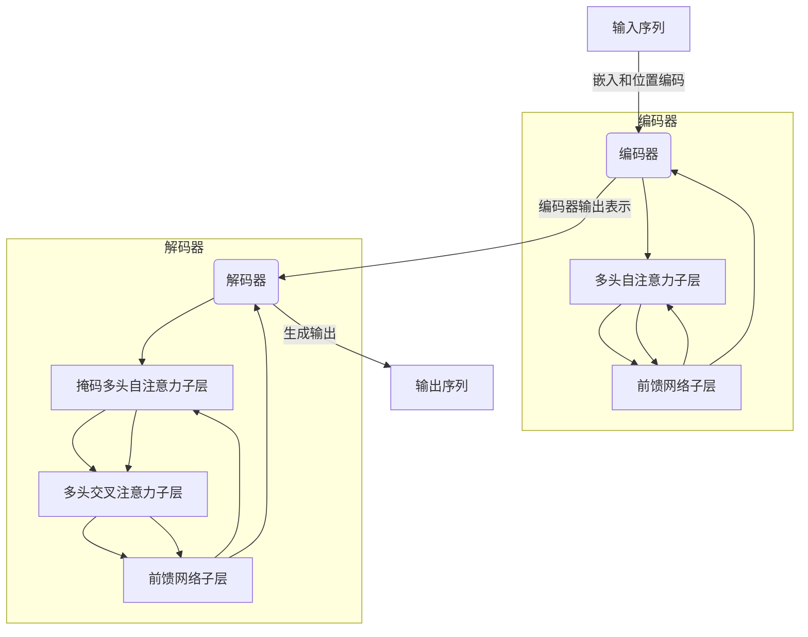

# 一切皆是映射：Transformer架构全面解析

## 1.背景介绍

在深度学习的发展历程中,Transformer架构无疑是一个里程碑式的创新。自2017年Transformer模型被提出以来,它迅速成为自然语言处理(NLP)、计算机视觉(CV)和其他领域的主导范式。Transformer的核心思想是利用注意力机制(Attention Mechanism)来捕捉输入数据中的长程依赖关系,从而有效地建模序列数据。

传统的序列模型,如循环神经网络(RNN)和长短期记忆网络(LSTM),在处理长序列时容易出现梯度消失或爆炸的问题。而Transformer则完全摒弃了循环结构,利用注意力机制直接对序列中的任意两个位置建模,从理论上克服了长期依赖问题。

Transformer最初被设计用于机器翻译任务,但由于其强大的建模能力,很快被推广应用到了自然语言理解、文本生成、语音识别、图像分类等多个领域,取得了卓越的成绩。如今,Transformer及其变体已经成为人工智能领域最重要和最广泛使用的架构之一。

## 2.核心概念与联系

### 2.1 自注意力机制(Self-Attention)

自注意力机制是Transformer的核心组件,它能够捕捉输入序列中任意两个位置之间的依赖关系。具体来说,对于每个输入位置,自注意力机制会计算其与所有其他位置的相关性分数(注意力权重),然后使用这些权重对所有位置的表示进行加权求和,得到该位置的新表示。

自注意力机制可以被形式化为映射:

$$\text{Attention}(Q, K, V) = \text{softmax}(\frac{QK^T}{\sqrt{d_k}})V$$

其中 $Q$ 代表查询(Query)、$K$ 代表键(Key)、$V$ 代表值(Value)。这三个向量通常是从输入序列的嵌入表示通过线性投影得到的。$d_k$ 是缩放因子,用于防止较深层的注意力权重过于集中。

自注意力机制可以并行计算,避免了RNN/LSTM中的递归操作,从而更加高效。此外,它直接对输入序列中任意两个位置建模,能够有效捕捉长程依赖关系。

### 2.2 多头注意力机制(Multi-Head Attention)

为了进一步提高模型的表示能力,Transformer引入了多头注意力机制。多头注意力机制将输入序列的嵌入表示线性投影到多个子空间,分别在每个子空间中计算自注意力,最后将所有子空间的注意力结果拼接起来作为最终的注意力表示。

多头注意力机制可以被形式化为:

$$\text{MultiHead}(Q, K, V) = \text{Concat}(head_1, ..., head_h)W^O$$
$$\text{where } head_i = \text{Attention}(QW_i^Q, KW_i^K, VW_i^V)$$

其中 $W_i^Q$、$W_i^K$、$W_i^V$ 和 $W^O$ 是可学习的线性投影参数。通过多头注意力机制,模型可以从不同的子空间获取不同的表示,提高了对输入序列的建模能力。

### 2.3 位置编码(Positional Encoding)

由于Transformer完全放弃了循环结构,因此需要一种方式来为序列中的每个位置编码位置信息。Transformer采用的是位置编码(Positional Encoding),将位置信息直接编码到输入序列的嵌入表示中。

位置编码可以采用不同的函数形式,如正弦/余弦函数:

$$PE_{(pos, 2i)} = \sin(pos / 10000^{2i/d_{model}})$$
$$PE_{(pos, 2i+1)} = \cos(pos / 10000^{2i/d_{model}})$$

其中 $pos$ 是位置索引, $i$ 是维度索引, $d_{model}$ 是嵌入维度。通过对不同的维度使用不同的周期函数,位置编码可以编码绝对位置信息,并且由于周期性质,也能够很好地推广到更长的序列。

### 2.4 编码器-解码器架构(Encoder-Decoder Architecture)

Transformer采用了编码器-解码器的架构,用于序列到序列(Sequence-to-Sequence)的任务,如机器翻译。编码器将源语言序列编码为一个连续的表示,解码器则基于该表示生成目标语言序列。

编码器由多个相同的层组成,每一层包含两个子层:多头自注意力子层和全连接前馈网络子层。通过这种结构,编码器可以捕捉输入序列中的长程依赖关系,并将其编码为一个连续的表示。

解码器的结构与编码器类似,但在多头自注意力子层之前,还引入了一个额外的注意力子层,用于关注编码器的输出表示。这种交叉注意力机制使得解码器可以综合源语言序列和已生成的目标语言序列的信息,从而生成更好的输出。

## 3.核心算法原理具体操作步骤

Transformer的核心算法原理可以概括为以下几个步骤:

1. **嵌入和位置编码**:将输入序列(如文本)转换为嵌入表示,并添加位置编码。

2. **编码器处理**:
   - 将嵌入表示输入到编码器的第一层
   - 在每一层:
     - 进行多头自注意力计算,捕捉输入序列中的长程依赖关系
     - 进行全连接前馈网络计算,为每个位置的表示增加非线性变换
   - 将最后一层的输出作为编码器的输出表示

3. **解码器处理**:
   - 将输出序列的嵌入表示和位置编码输入到解码器的第一层
   - 在每一层:
     - 进行掩码多头自注意力计算,只关注当前位置之前的输出
     - 进行多头交叉注意力计算,关注编码器的输出表示
     - 进行全连接前馈网络计算
   - 将最后一层的输出作为生成的输出序列

4. **输出生成**:对解码器的输出进行线性投影和归一化,生成最终的输出序列。

以机器翻译任务为例,算法的具体流程如下所示:

通过上述步骤,Transformer能够高效地对输入序列进行建模,并生成高质量的输出序列。

## 4.数学模型和公式详细讲解举例说明

在Transformer中,自注意力机制和多头注意力机制是两个核心的数学模型。下面将详细讲解这两个模型的数学原理和公式推导。

### 4.1 自注意力机制(Self-Attention)

自注意力机制的目标是计算一个加权和,其中每个位置的表示是所有其他位置表示的加权和。具体来说,给定一个输入序列 $X = (x_1, x_2, ..., x_n)$,我们首先计算查询(Query)、键(Key)和值(Value)向量:

$$Q = XW^Q, K = XW^K, V = XW^V$$

其中 $W^Q$、$W^K$ 和 $W^V$ 是可学习的权重矩阵,用于将输入序列 $X$ 映射到查询空间、键空间和值空间。

接下来,我们计算查询 $Q$ 与所有键 $K$ 的点积,得到注意力分数矩阵:

$$\text{Attention Scores} = QK^T$$

为了避免较深层的注意力权重过于集中,我们对注意力分数矩阵进行缩放:

$$\text{Scaled Attention Scores} = \frac{QK^T}{\sqrt{d_k}}$$

其中 $d_k$ 是键向量的维度。

然后,我们对缩放后的注意力分数矩阵进行 softmax 操作,得到注意力权重矩阵:

$$\text{Attention Weights} = \text{softmax}(\frac{QK^T}{\sqrt{d_k}})$$

最后,我们将注意力权重矩阵与值向量 $V$ 相乘,得到自注意力的输出:

$$\text{Attention Output} = \text{Attention}(Q, K, V) = \text{softmax}(\frac{QK^T}{\sqrt{d_k}})V$$

自注意力机制的优点在于,它可以直接对输入序列中任意两个位置建模,从而有效捕捉长程依赖关系。此外,由于自注意力的计算可以高度并行化,因此它比循环神经网络更加高效。

### 4.2 多头注意力机制(Multi-Head Attention)

多头注意力机制是在自注意力机制的基础上进行扩展,目的是提高模型的表示能力。具体来说,多头注意力机制将输入序列的嵌入表示线性投影到多个子空间,分别在每个子空间中计算自注意力,最后将所有子空间的注意力结果拼接起来作为最终的注意力表示。

给定一个输入序列 $X$,我们首先计算查询、键和值向量:

$$Q_i = XW_i^Q, K_i = XW_i^K, V_i = XW_i^V$$

其中 $W_i^Q$、$W_i^K$ 和 $W_i^V$ 是可学习的权重矩阵,用于将输入序列 $X$ 映射到第 $i$ 个子空间的查询空间、键空间和值空间。

接下来,我们在每个子空间中计算自注意力:

$$\text{head}_i = \text{Attention}(Q_i, K_i, V_i) = \text{softmax}(\frac{Q_iK_i^T}{\sqrt{d_k}})V_i$$

最后,我们将所有子空间的注意力结果拼接起来,并进行线性变换:

$$\text{MultiHead}(Q, K, V) = \text{Concat}(head_1, ..., head_h)W^O$$

其中 $W^O$ 是可学习的权重矩阵,用于将拼接后的注意力表示映射回原始空间。

多头注意力机制的优点在于,它允许模型从不同的子空间获取不同的表示,从而提高了对输入序列的建模能力。此外,由于多头注意力机制是在多个子空间中并行计算自注意力,因此它比单头自注意力机制更加高效。

### 4.3 实例说明

为了更好地理解自注意力机制和多头注意力机制,我们来看一个具体的例子。假设我们有一个长度为 4 的输入序列 $X = (x_1, x_2, x_3, x_4)$,其中每个 $x_i$ 是一个 3 维向量。我们将计算自注意力和双头注意力。

**自注意力计算过程**:

1. 计算查询、键和值向量:

   $$Q = XW^Q = \begin{bmatrix}
   q_1\\
   q_2\\
   q_3\\
   q_4
   \end{bmatrix}, K = XW^K = \begin{bmatrix}
   k_1\\
   k_2\\
   k_3\\
   k_4
   \end{bmatrix}, V = XW^V = \begin{bmatrix}
   v_1\\
   v_2\\
   v_3\\
   v_4
   \end{bmatrix}$$

   其中 $q_i$、$k_i$ 和 $v_i$ 都是 3 维向量。

2. 计算注意力分数矩阵:

   $$\text{Attention Scores} = QK^T = \begin{bmatrix}
   q_1 \cdot k_1 & q_1 \cdot k_2 & q_1 \cdot k_3 & q_1 \cdot k_4\\
   q_2 \cdot k_1 & q_2 \cdot k_2 & q_2 \cdot k_3 & q_2 \cdot k_4\\
   q_3 \cdot k_1 & q_3 \cdot k_2 & q_3 \cdot k_3 & q_3 \cdot k_{"msg_type":"generate_answer_finish","data":"","from_module":null,"from_unit":null}