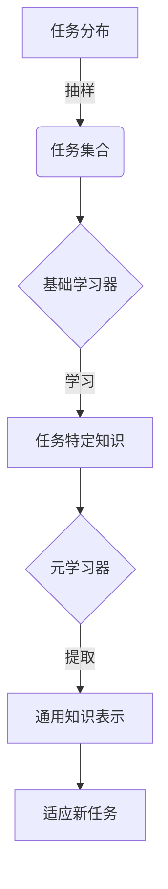

# 一切皆是映射：元学习在医疗图像分析中的突破

## 1. 背景介绍

### 1.1 医疗图像分析的重要性

医疗图像分析是当今医疗保健领域中不可或缺的一部分。通过对医学影像数据(如X射线、CT、MRI等)进行分析,医生可以更准确地诊断疾病、评估病情进展,并制定个性化的治疗方案。然而,由于医学图像数据的多样性和复杂性,手动分析和诊断过程耗时耗力,且容易出现人为错误。

### 1.2 传统机器学习方法的局限性

为了提高医疗图像分析的效率和准确性,研究人员尝试利用机器学习算法自动化这一过程。传统的监督学习方法需要大量标注的训练数据,但医疗数据的标注过程昂贵且耗时。此外,这些方法通常难以泛化到新的数据分布和任务上,因为它们无法从有限的训练数据中捕获足够的知识。

### 1.3 元学习的崛起

元学习(Meta-Learning)作为一种新兴的机器学习范式,旨在从多个相关任务中学习如何快速适应新任务。与传统方法相比,元学习算法能够从少量数据中快速习得新知识,并将其泛化到新的任务和环境中。这使得元学习在医疗图像分析领域具有巨大的应用潜力。

## 2. 核心概念与联系

### 2.1 元学习的核心思想

元学习的核心思想是"学习如何学习"。它旨在从一系列相关任务中提取出通用的知识表示,并将其应用于新的任务上。这种方法可以看作是一种两层学习过程:

1. 基础学习器(base learner)在每个任务上进行学习,获取特定任务的知识。
2. 元学习器(meta-learner)从多个基础学习器中提取出通用的知识表示,用于快速适应新任务。

### 2.2 元学习与传统机器学习的关系

元学习并非完全独立于传统机器学习,而是建立在其基础之上。许多常见的机器学习算法,如梯度下降、神经网络等,都可以用作元学习的基础学习器。元学习的核心在于如何有效地从多个任务中提取通用知识,并将其应用于新任务。

### 2.3 元学习在医疗图像分析中的应用

在医疗图像分析领域,元学习可以解决以下几个关键挑战:

1. **数据稀缺**: 由于标注医疗数据的成本高昂,可用的训练数据往往十分有限。元学习能够从少量数据中快速习得新知识。

2. **任务多样性**: 医疗图像分析涉及多种任务,如分割、检测、分类等。元学习可以从相关任务中提取通用知识,加速新任务的学习。

3. **环境变化**: 不同医院、设备等环境因素会导致数据分布发生变化。元学习可以提高模型在新环境下的泛化能力。

4. **知识积累**: 元学习能够持续积累从多个任务中学习到的知识,从而不断提高模型的性能。

## 3. 核心算法原理具体操作步骤

虽然元学习算法的具体实现方式有所不同,但它们通常遵循以下基本步骤:

1. **任务分布采样**: 首先,从任务分布中抽取一个任务集合,用于元学习的训练。这些任务通常来自相关但不同的领域,以确保学习到的知识具有一定的通用性。

2. **基础学习器训练**: 对于每个任务,使用基础学习器(如神经网络)在该任务上进行训练,获取特定任务的知识表示。

3. **元学习器训练**: 元学习器从多个基础学习器中提取出通用的知识表示。这一过程可以通过不同的方式实现,例如优化一个共享的初始化参数,或者学习一个能够快速适应新任务的更新规则。

4. **适应新任务**: 在测试阶段,元学习器利用从训练任务中学习到的通用知识表示,快速适应新的任务,实现有效的知识迁移。

不同的元学习算法在具体实现上会有所不同,但它们都遵循上述基本原理。下面我们将介绍几种典型的元学习算法。

### 3.1 基于优化的元学习算法

基于优化的元学习算法旨在学习一个能够快速适应新任务的优化过程。其核心思想是,通过在一系列相关任务上进行优化,找到一个好的初始化参数,使得在新任务上只需进行少量的优化步骤,就能获得良好的性能。

**MAML (Model-Agnostic Meta-Learning)** 是基于优化的元学习算法的代表。它的基本思路如下:

1. 从任务分布中采样一批任务 $\mathcal{T}_i$。
2. 对于每个任务 $\mathcal{T}_i$,从该任务的训练集 $\mathcal{D}_i^{train}$ 中采样一个小批量数据 $\mathcal{D}_i^{train,small}$。
3. 使用梯度下降法在 $\mathcal{D}_i^{train,small}$ 上更新模型参数 $\theta_i = \theta - \alpha \nabla_\theta \mathcal{L}_{\mathcal{T}_i}(\theta, \mathcal{D}_i^{train,small})$。
4. 在任务 $\mathcal{T}_i$ 的验证集 $\mathcal{D}_i^{val}$ 上计算损失 $\mathcal{L}_{\mathcal{T}_i}(\theta_i, \mathcal{D}_i^{val})$。
5. 更新初始参数 $\theta$ 以最小化所有任务的验证损失之和: $\theta \leftarrow \theta - \beta \nabla_\theta \sum_{\mathcal{T}_i} \mathcal{L}_{\mathcal{T}_i}(\theta_i, \mathcal{D}_i^{val})$。

通过上述过程,MAML能够找到一个好的初始化参数 $\theta$,使得在新任务上只需进行少量的梯度更新,就能获得良好的性能。

### 3.2 基于度量的元学习算法

基于度量的元学习算法旨在学习一个好的特征空间,使得在该空间中,相似的输入具有相似的表示。在新任务上,只需通过少量示例即可快速生成该任务的分类器。

**Prototypical Networks** 是基于度量的元学习算法的代表。它的基本思路如下:

1. 从任务分布中采样一批任务 $\mathcal{T}_i$。
2. 对于每个任务 $\mathcal{T}_i$,从该任务的支持集 $\mathcal{S}_i$ 中计算每个类别的原型 $\mathbf{c}_k = \frac{1}{|\mathcal{S}_i^k|} \sum_{\mathbf{x} \in \mathcal{S}_i^k} f_\phi(\mathbf{x})$,其中 $f_\phi$ 是一个编码器网络,用于将输入映射到特征空间。
3. 对于查询集 $\mathcal{Q}_i$ 中的每个样本 $\mathbf{x}$,计算它与每个原型的距离 $d(\mathbf{x}, \mathbf{c}_k)$,并将其分配给最近的原型所对应的类别。
4. 通过最小化查询集上的损失函数,更新编码器网络参数 $\phi$。

通过上述过程,Prototypical Networks能够学习到一个好的特征空间,使得在该空间中,相似的输入具有相似的表示。在新任务上,只需通过少量示例计算出每个类别的原型,即可快速生成该任务的分类器。

### 3.3 基于生成模型的元学习算法

基于生成模型的元学习算法旨在学习一个能够生成任务相关参数的生成模型。在新任务上,只需从该生成模型中采样参数,即可快速适应该任务。

**Meta-SGD** 是基于生成模型的元学习算法的代表。它的基本思路如下:

1. 从任务分布中采样一批任务 $\mathcal{T}_i$。
2. 对于每个任务 $\mathcal{T}_i$,使用梯度下降法在该任务的训练集上优化模型参数 $\theta_i$,得到一系列参数更新 $\Delta \theta_i^{(t)}$。
3. 训练一个生成模型 $g_\phi$,使其能够从任务标识符 $\tau_i$ 生成对应的参数更新序列 $\{\Delta \theta_i^{(t)}\}$。
4. 在新任务上,从生成模型 $g_\phi$ 中采样参数更新序列,并应用于初始参数,快速适应该任务。

通过上述过程,Meta-SGD能够学习到一个生成模型,使其能够从任务标识符中生成对应的参数更新序列。在新任务上,只需从该生成模型中采样参数更新序列,即可快速适应该任务。

## 4. 数学模型和公式详细讲解举例说明

在介绍元学习算法的数学模型和公式之前,我们首先定义一些基本概念和符号:

- $\mathcal{T}$: 任务分布,表示所有可能的任务。
- $\mathcal{T}_i$: 第 $i$ 个任务,由一个训练集 $\mathcal{D}_i^{train}$ 和一个验证集 $\mathcal{D}_i^{val}$ 组成。
- $\mathcal{L}_{\mathcal{T}_i}(\theta, \mathcal{D})$: 在任务 $\mathcal{T}_i$ 上,使用参数 $\theta$ 和数据集 $\mathcal{D}$ 计算的损失函数。
- $f_\phi$: 编码器网络,用于将输入映射到特征空间,参数为 $\phi$。
- $g_\phi$: 生成模型,用于从任务标识符生成参数更新序列,参数为 $\phi$。

### 4.1 基于优化的元学习算法: MAML

MAML (Model-Agnostic Meta-Learning) 算法的目标是找到一个好的初始化参数 $\theta$,使得在新任务上只需进行少量的优化步骤,就能获得良好的性能。

MAML 的损失函数定义如下:

$$\min_\theta \sum_{\mathcal{T}_i \sim \mathcal{T}} \mathcal{L}_{\mathcal{T}_i}(f_{\theta_i}, \mathcal{D}_i^{val})$$

其中 $\theta_i$ 是通过在任务 $\mathcal{T}_i$ 的训练集 $\mathcal{D}_i^{train}$ 上进行一步或多步梯度更新得到的参数:

$$\theta_i = \theta - \alpha \nabla_\theta \mathcal{L}_{\mathcal{T}_i}(\theta, \mathcal{D}_i^{train})$$

上式中的 $\alpha$ 是学习率。

通过最小化上述损失函数,MAML 能够找到一个好的初始化参数 $\theta$,使得在新任务上只需进行少量的梯度更新,就能获得良好的性能。

### 4.2 基于度量的元学习算法: Prototypical Networks

Prototypical Networks 算法的目标是学习一个好的特征空间,使得在该空间中,相似的输入具有相似的表示。

在 Prototypical Networks 中,每个类别 $k$ 的原型 $\mathbf{c}_k$ 定义为该类别在支持集 $\mathcal{S}_i$ 中所有样本的特征向量的均值:

$$\mathbf{c}_k = \frac{1}{|\mathcal{S}_i^k|} \sum_{\mathbf{x} \in \mathcal{S}_i^k} f_\phi(\mathbf{x})$$

其中 $f_\phi$ 是编码器网络,用于将输入映射到特征空间。

对于查询集 $\mathcal{Q}_i$ 中的每个样本 $\mathbf{x}$,它的预测类别 $\hat{y}$ 由与其最近的原型所对应的类别决定:

$$\hat{y} = \arg\min_k d(f_\phi(\mathbf{x}), \mathbf{c}_k)