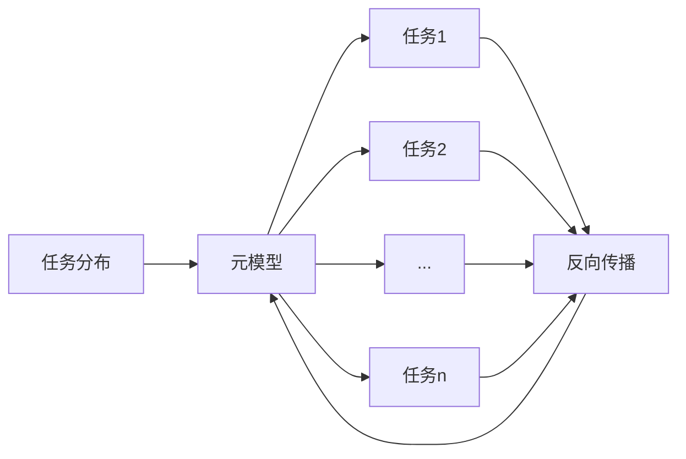

# 一切皆是映射：基于反向传播的元学习框架与实现

## 1. 背景介绍

### 1.1 元学习的定义与意义

元学习（Meta-Learning），也被称为"学会学习"（Learning to Learn），是一种旨在提高机器学习模型学习能力和泛化能力的方法。传统的机器学习模型通常针对特定任务进行训练，难以快速适应新的任务或环境。元学习则致力于设计一种通用的学习框架，使模型能够在少量样本或短时间内快速学习新任务，从而实现更高效、更灵活的学习过程。

### 1.2 反向传播算法的重要性

反向传播（Backpropagation）是现代神经网络训练中最为关键的算法之一。通过计算损失函数对网络参数的梯度，反向传播算法能够有效地调整网络权重，使模型逐步优化，最小化预测结果与真实标签之间的误差。反向传播不仅是训练单个模型的基础，也为元学习的实现提供了重要支持。

### 1.3 将元学习与反向传播相结合的意义

将元学习与反向传播相结合，可以创建一个通用的学习框架，利用反向传播优化元学习模型的参数，使其能够快速适应新任务。这种结合有助于提高模型的泛化能力，减少对大量训练数据的依赖，同时加速模型在新任务上的收敛速度。基于反向传播的元学习框架为实现高效、灵活的机器学习系统提供了新的思路和方向。

## 2. 核心概念与联系

### 2.1 元学习的核心概念

#### 2.1.1 任务分布

在元学习中，我们通常假设存在一个任务分布 $p(\mathcal{T})$，其中每个任务 $\mathcal{T}_i$ 都有自己的训练集 $\mathcal{D}_i^{train}$ 和测试集 $\mathcal{D}_i^{test}$。元学习的目标是通过在一系列任务上的训练，学习一个通用的模型，使其能够在新任务上快速适应并取得良好性能。

#### 2.1.2 元优化目标

元学习的优化目标可以表示为：

$$
\min_{\theta} \mathbb{E}_{\mathcal{T} \sim p(\mathcal{T})} [\mathcal{L}_{\mathcal{T}}(f_{\theta'})]
$$

其中，$\theta$ 表示元模型的参数，$f_{\theta'}$ 表示经过几步梯度下降后适应任务 $\mathcal{T}$ 的模型，$\mathcal{L}_{\mathcal{T}}$ 表示在任务 $\mathcal{T}$ 上的损失函数。元学习算法通过优化这个目标，使元模型能够快速适应新任务。

### 2.2 反向传播的核心概念

#### 2.2.1 前向传播

前向传播是神经网络的预测过程，即将输入数据通过网络的各层计算，得到最终的输出结果。对于一个 $L$ 层的神经网络，前向传播可以表示为：

$$
\begin{aligned}
\mathbf{h}^{(0)} &= \mathbf{x} \\
\mathbf{h}^{(l)} &= f^{(l)}(\mathbf{h}^{(l-1)}), \quad l = 1, 2, \dots, L \\
\mathbf{y} &= \mathbf{h}^{(L)}
\end{aligned}
$$

其中，$\mathbf{x}$ 表示输入数据，$\mathbf{h}^{(l)}$ 表示第 $l$ 层的隐藏状态，$f^{(l)}$ 表示第 $l$ 层的激活函数，$\mathbf{y}$ 表示网络的输出。

#### 2.2.2 损失函数

损失函数用于衡量网络预测结果与真实标签之间的差异。常见的损失函数包括均方误差（MSE）、交叉熵损失等。以均方误差为例，其定义为：

$$
\mathcal{L}(\mathbf{y}, \hat{\mathbf{y}}) = \frac{1}{2} \sum_{i=1}^{n} (y_i - \hat{y}_i)^2
$$

其中，$\mathbf{y}$ 表示真实标签，$\hat{\mathbf{y}}$ 表示网络的预测输出，$n$ 表示样本数量。

#### 2.2.3 梯度计算与参数更新

反向传播算法通过计算损失函数对网络参数的梯度，并使用梯度下降等优化算法更新参数，使网络逐步优化。对于第 $l$ 层的参数 $\mathbf{W}^{(l)}$，其梯度可以表示为：

$$
\frac{\partial \mathcal{L}}{\partial \mathbf{W}^{(l)}} = \frac{\partial \mathcal{L}}{\partial \mathbf{h}^{(l)}} \frac{\partial \mathbf{h}^{(l)}}{\partial \mathbf{W}^{(l)}}
$$

通过反向传播算法，可以高效地计算出所有参数的梯度，并使用梯度下降等优化算法更新参数：

$$
\mathbf{W}^{(l)} \leftarrow \mathbf{W}^{(l)} - \alpha \frac{\partial \mathcal{L}}{\partial \mathbf{W}^{(l)}}
$$

其中，$\alpha$ 表示学习率。

### 2.3 元学习与反向传播的联系

反向传播算法是实现元学习的关键。在元学习中，我们通常使用反向传播来优化元模型的参数，使其能够快速适应新任务。具体而言，元学习算法通过在一系列任务上进行训练，利用反向传播计算元模型参数的梯度，并使用梯度下降等优化算法更新参数，使元模型能够在新任务上快速收敛并取得良好性能。

下图展示了元学习与反向传播的关系：

在这个过程中，反向传播算法起到了优化元模型参数的关键作用，使元模型能够不断改进，提高在新任务上的适应能力和性能。

## 3. 核心算法原理与具体操作步骤

### 3.1 MAML算法原理

MAML（Model-Agnostic Meta-Learning）是一种基于梯度的元学习算法，其核心思想是通过学习一个好的初始化参数，使模型能够在少量梯度步骤内快速适应新任务。MAML算法的主要步骤如下：

1. 随机初始化元模型参数 $\theta$。
2. 对于每个任务 $\mathcal{T}_i$：
   - 在训练集 $\mathcal{D}_i^{train}$ 上计算损失函数 $\mathcal{L}_{\mathcal{T}_i}(f_\theta)$。
   - 通过梯度下降更新参数，得到适应后的参数 $\theta'_i$：
     $$
     \theta'_i = \theta - \alpha \nabla_\theta \mathcal{L}_{\mathcal{T}_i}(f_\theta)
     $$
   - 在测试集 $\mathcal{D}_i^{test}$ 上计算适应后模型的损失 $\mathcal{L}_{\mathcal{T}_i}(f_{\theta'_i})$。
3. 计算所有任务的平均测试损失：
   $$
   \mathcal{L}_{meta} = \frac{1}{n} \sum_{i=1}^{n} \mathcal{L}_{\mathcal{T}_i}(f_{\theta'_i})
   $$
4. 通过梯度下降更新元模型参数 $\theta$：
   $$
   \theta \leftarrow \theta - \beta \nabla_\theta \mathcal{L}_{meta}
   $$
5. 重复步骤2-4，直到收敛。

### 3.2 MAML算法的具体操作步骤

下面我们通过一个具体的例子来说明MAML算法的操作步骤。假设我们有一个包含多个回归任务的任务分布，每个任务都有自己的训练集和测试集。我们的目标是训练一个元模型，使其能够在新的回归任务上快速适应。

1. 随机初始化元模型参数 $\theta$，假设我们使用一个简单的三层全连接神经网络作为基础模型。

2. 对于每个任务 $\mathcal{T}_i$：
   - 从任务分布中采样一个任务 $\mathcal{T}_i$，获取其训练集 $\mathcal{D}_i^{train}$ 和测试集 $\mathcal{D}_i^{test}$。
   - 在训练集 $\mathcal{D}_i^{train}$ 上计算损失函数 $\mathcal{L}_{\mathcal{T}_i}(f_\theta)$，这里我们使用均方误差作为损失函数：
     $$
     \mathcal{L}_{\mathcal{T}_i}(f_\theta) = \frac{1}{|\mathcal{D}_i^{train}|} \sum_{(x, y) \in \mathcal{D}_i^{train}} (f_\theta(x) - y)^2
     $$
   - 通过梯度下降更新参数，得到适应后的参数 $\theta'_i$：
     $$
     \theta'_i = \theta - \alpha \nabla_\theta \mathcal{L}_{\mathcal{T}_i}(f_\theta)
     $$
     其中，$\alpha$ 表示学习率。
   - 在测试集 $\mathcal{D}_i^{test}$ 上计算适应后模型的损失 $\mathcal{L}_{\mathcal{T}_i}(f_{\theta'_i})$：
     $$
     \mathcal{L}_{\mathcal{T}_i}(f_{\theta'_i}) = \frac{1}{|\mathcal{D}_i^{test}|} \sum_{(x, y) \in \mathcal{D}_i^{test}} (f_{\theta'_i}(x) - y)^2
     $$

3. 计算所有任务的平均测试损失：
   $$
   \mathcal{L}_{meta} = \frac{1}{n} \sum_{i=1}^{n} \mathcal{L}_{\mathcal{T}_i}(f_{\theta'_i})
   $$
   其中，$n$ 表示任务的数量。

4. 通过梯度下降更新元模型参数 $\theta$：
   $$
   \theta \leftarrow \theta - \beta \nabla_\theta \mathcal{L}_{meta}
   $$
   其中，$\beta$ 表示元学习率。

5. 重复步骤2-4，直到元模型收敛或达到预设的训练轮数。

通过这个过程，MAML算法学习到了一个好的初始化参数 $\theta$，使得模型能够在新的回归任务上快速适应，只需要几步梯度下降就能取得良好的性能。

## 4. 数学模型和公式详细讲解与举例说明

### 4.1 元学习的数学模型

元学习的数学模型可以用概率图模型来表示。假设我们有一个任务分布 $p(\mathcal{T})$，每个任务 $\mathcal{T}_i$ 都有自己的数据分布 $p(\mathcal{D}_i|\mathcal{T}_i)$。给定一个元模型 $f_\theta$ 和一个任务 $\mathcal{T}_i$，我们可以通过几步梯度下降得到适应后的模型 $f_{\theta'_i}$。元学习的目标是最小化所有任务上适应后模型的期望损失：

$$
\min_{\theta} \mathbb{E}_{\mathcal{T}_i \sim p(\mathcal{T})} [\mathbb{E}_{(x, y) \sim p(\mathcal{D}_i|\mathcal{T}_i)} [\mathcal{L}(f_{\theta'_i}(x), y)]]
$$

其中，$\mathcal{L}$ 表示损失函数，如均方误差或交叉熵损失。

### 4.2 MAML的数学公式

MAML算法的核心是通过梯度下降来优化元模型参数 $\theta$，使其能够快速适应新任务。对于每个任务 $\mathcal{T}_i$，MAML首先在训练集上计算损失函数的梯度，并更新参数得到适应后的模型：

$$
\theta'_i = \theta - \alpha \nabla_\theta \mathcal{L}_{\mathcal{T}_i}(f_\theta)
$$

然后，MAML在测试集上计算适应后模型的损失，并将所有任务的测试损失平均，得到元目标函数：

$$
\