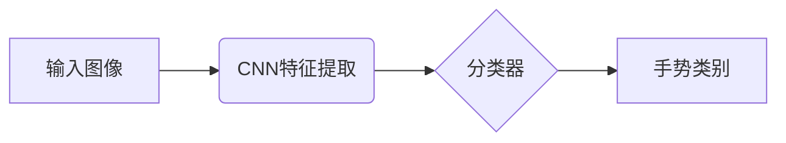
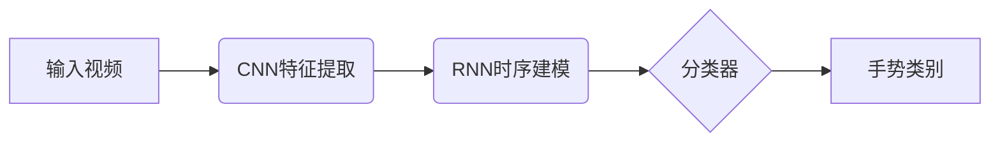
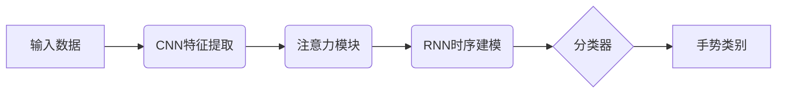
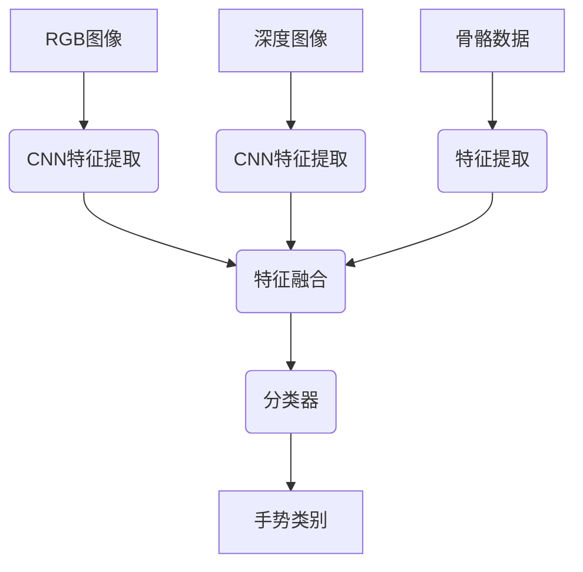

# 一切皆是映射：手势识别技术中的深度学习模型

## 1.背景介绍

在人机交互领域,手势识别技术正在发挥越来越重要的作用。通过捕捉和解释人体手部运动,手势识别系统可以实现自然、无接触的控制方式,为各种应用场景带来全新的交互体验。随着深度学习技术的不断发展,基于深度神经网络的手势识别模型展现出卓越的性能,成为该领域的研究热点。

手势识别技术的应用范围广泛,包括虚拟现实(VR)、增强现实(AR)、智能家居、游戏控制等。通过手势,用户可以直观地操作设备,提高交互效率和体验。此外,手势识别还可以辅助残障人士进行无障碍交互,提高生活质量。

### 1.1 手势识别的挑战

尽管手势识别技术前景广阔,但其中存在一些挑战需要克服:

1. **视角变化**: 相机捕捉的手势可能会因视角不同而产生差异,增加了识别难度。
2. **遮挡和自遮挡**: 手部可能会被其他物体或手指自身遮挡,导致信息丢失。
3. **背景复杂度**: 复杂的背景环境会干扰手部检测和跟踪。
4. **手型变化**: 手部的形状、大小和方向会随着手势变化而改变。
5. **实时性要求**: 对于交互式应用,手势识别需要实时响应,低延迟至关重要。

### 1.2 深度学习在手势识别中的作用

深度学习模型具有强大的特征提取和模式识别能力,可以有效解决上述挑战。通过训练神经网络模型,可以自动学习手部的视觉特征,并将其映射到相应的手势类别。与传统的基于规则或机器学习方法相比,深度学习模型表现出更好的泛化能力和鲁棒性。

此外,深度学习模型还可以利用大量标注数据进行训练,提高识别精度。随着数据量的增加和算力的提升,深度学习在手势识别领域的应用将更加广泛和有效。

## 2.核心概念与联系

在深度学习驱动的手势识别系统中,存在几个核心概念,它们相互关联,共同构建了完整的解决方案。

### 2.1 卷积神经网络 (CNN)

卷积神经网络是深度学习中最常用的网络结构之一,在计算机视觉任务中表现出色。CNN 能够自动从图像或视频中提取层次化的特征,并将这些特征映射到相应的输出类别。

在手势识别中,CNN 通常用于从输入图像或视频帧中提取手部的视觉特征,如轮廓、纹理和关键点等。这些特征携带着手势的重要信息,可以用于后续的分类或回归任务。

### 2.2 循环神经网络 (RNN)

循环神经网络擅长处理序列数据,如文本、语音和视频。在手势识别中,RNN 可以用于捕捉手势的时序信息,因为手势通常是一系列动态的手部运动。

通过将 CNN 提取的特征序列输入到 RNN 中,模型可以学习手势的时间模式,从而更准确地识别动态手势。RNN 的变体,如长短期记忆网络 (LSTM) 和门控循环单元 (GRU),可以有效解决长期依赖问题,提高对长时间手势的建模能力。

### 2.3 注意力机制

注意力机制是深度学习中的一种重要技术,它允许模型专注于输入数据的关键部分,从而提高模型的性能和解释能力。在手势识别中,注意力机制可以帮助模型关注手部区域,忽略背景干扰。

注意力机制通常与 CNN 和 RNN 结合使用。例如,可以在 CNN 的特征图上应用空间注意力,突出显示手部区域;或者在 RNN 的时间步骤上应用时间注意力,关注手势的关键帧。

### 2.4 数据增强

由于手势数据的采集和标注成本较高,数据集通常规模有限。为了提高模型的泛化能力,数据增强技术被广泛应用于手势识别任务。

常见的数据增强方法包括:旋转、平移、缩放、裁剪、噪声添加等。这些变换可以生成更多的训练样本,增加数据的多样性,从而提高模型对视角变化、遮挡和背景复杂度的鲁棒性。

### 2.5 多模态融合

除了视觉信息,手势识别系统还可以利用其他模态的数据,如深度信息、骨骼数据和手部关键点坐标等。通过将这些不同模态的数据融合,模型可以获得更丰富的手部表示,提高识别精度。

多模态融合可以在特征级或决策级进行。在特征级融合中,不同模态的特征被连接或级联,然后输入到后续的网络中进行处理。而在决策级融合中,每个模态单独进行预测,然后将预测结果进行组合。

## 3.核心算法原理具体操作步骤

手势识别系统通常包括以下几个主要步骤:

1. **预处理**: 对输入图像或视频进行预处理,如去噪、调整大小和归一化等,以提高后续处理的效率和精度。

2. **手部检测和跟踪**: 在输入数据中定位手部区域,并在视频序列中跟踪手部运动。常用的方法包括基于深度学习的目标检测算法(如 Faster R-CNN、YOLO)和手部关键点检测算法。

3. **特征提取**: 使用 CNN 从检测到的手部区域提取视觉特征,如轮廓、纹理和关键点等。这些特征携带着手势的重要信息。

4. **时序建模(可选)**: 如果需要识别动态手势,可以使用 RNN 对 CNN 提取的特征序列进行时序建模,捕捉手势的时间模式。

5. **分类或回归**: 将提取的特征输入到全连接层或其他分类器中,预测手势类别或手部关键点坐标等。

6. **后处理(可选)**: 对预测结果进行平滑、滤波或其他后处理操作,提高稳定性和准确性。

这些步骤可以根据具体任务和模型架构进行调整和优化。下面将详细介绍一些常见的深度学习模型及其在手势识别中的应用。

### 3.1 基于 CNN 的手势识别模型

CNN 在静态手势识别任务中表现出色。一种典型的方法是将输入图像直接输入到 CNN 中,让网络自动学习手部的视觉特征,并将这些特征映射到相应的手势类别。

一个流行的 CNN 架构是 VGG 网络,它由多个卷积层和最大池化层组成,最后接上全连接层进行分类。另一个常用的架构是 ResNet,它通过残差连接解决了深层网络的梯度消失问题,提高了模型的性能。

这些 CNN 模型可以直接应用于静态手势识别任务,也可以作为特征提取器,将提取的特征输入到其他分类器中。

### 3.2 基于 RNN 的手势识别模型

对于动态手势识别任务,RNN 可以有效捕捉手势的时序信息。一种常见的方法是将 CNN 提取的特征序列输入到 RNN 中进行时序建模,然后将 RNN 的输出传递给全连接层进行分类。

LSTM 和 GRU 是 RNN 的两种变体,它们通过引入门控机制解决了传统 RNN 的梯度消失和爆炸问题,在长期依赖建模方面表现更好。

### 3.3 基于注意力机制的手势识别模型

注意力机制可以与 CNN 和 RNN 结合使用,帮助模型关注输入数据的关键部分。在手势识别中,注意力机制可以用于突出显示手部区域,忽略背景干扰。

一种常见的方法是在 CNN 的特征图上应用空间注意力机制,生成一个注意力权重图,然后将权重图与特征图相乘,得到强调了手部区域的特征表示。

另一种方法是在 RNN 的时间步骤上应用时间注意力机制,关注手势的关键帧,提高对动态手势的建模能力。

### 3.4 基于多模态融合的手势识别模型

除了视觉信息,手势识别系统还可以利用其他模态的数据,如深度信息、骨骼数据和手部关键点坐标等。通过将这些不同模态的数据融合,模型可以获得更丰富的手部表示,提高识别精度。

多模态融合可以在特征级或决策级进行。在特征级融合中,不同模态的特征被连接或级联,然后输入到后续的网络中进行处理。而在决策级融合中,每个模态单独进行预测,然后将预测结果进行组合。

上述模型架构只是一些常见的示例,实际应用中可以根据具体需求和数据特征进行调整和优化。例如,可以尝试不同的网络结构、损失函数和优化算法,或者引入其他技术,如半监督学习、迁移学习和强化学习等。

## 4.数学模型和公式详细讲解举例说明

在深度学习驱动的手势识别系统中,数学模型和公式扮演着重要的角色。它们不仅描述了模型的结构和计算过程,还为优化和训练提供了理论基础。本节将详细介绍一些常见的数学模型和公式,并通过具体示例说明它们在手势识别任务中的应用。

### 4.1 卷积神经网络 (CNN)

CNN 是深度学习中最广泛使用的网络架构之一,它通过卷积操作和池化操作来提取输入数据的特征。CNN 的基本计算单元是卷积层,它对输入数据进行卷积操作,产生特征映射。

卷积操作可以用下式表示:

$$
y_{ij}^l = f\left(\sum_{m}\sum_{n}w_{mn}^{l-1}x_{i+m,j+n}^{l-1} + b^{l-1}\right)
$$

其中:
- $y_{ij}^l$ 是第 $l$ 层特征映射的元素
- $x_{i+m,j+n}^{l-1}$ 是前一层的输入特征映射
- $w_{mn}^{l-1}$ 是卷积核的权重
- $b^{l-1}$ 是偏置项
- $f$ 是非线性激活函数,如 ReLU

通过在输入数据上滑动卷积核,CNN 可以捕捉局部模式和空间关系,从而提取有用的特征。

在手势识别中,CNN 通常用于从输入图像或视频帧中提取手部的视觉特征,如轮廓、纹理和关键点等。这些特征携带着手势的重要信息,可以用于后续的分类或回归任务。

### 4.2 循环神经网络 (RNN)

RNN 是一种专门设计用于处理序列数据的神经网络,它可以捕捉序列中的时间依赖关系。在手势识别中,RNN 可以用于建模动态手势的时序信息。

RNN 的基本计算单元是循环单元,它在每个时间步骤上执行以下计算:

$$
h_t = f_W(x_t, h_{t-1})
$$

其中:
- $x_t$ 是