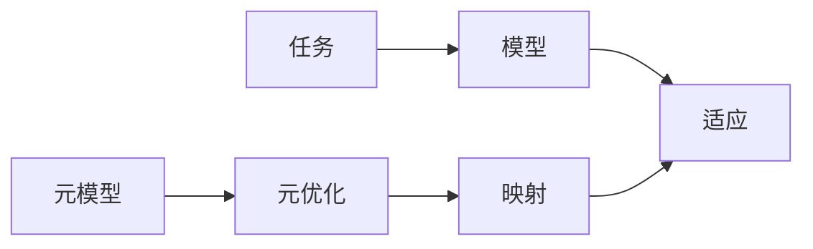

# 一切皆是映射：探索基于模型的元学习方法

## 1. 背景介绍

### 1.1 元学习的定义与意义

元学习（Meta-Learning），也被称为"学会学习"（Learning to Learn），是机器学习领域的一个重要研究方向。它的目标是设计出能够快速适应新任务的学习算法，使机器能够像人类一样，在面对新问题时利用过去的经验快速学习。元学习的研究对于实现通用人工智能（AGI）具有重要意义。

### 1.2 基于模型的元学习

基于模型的元学习（Model-based Meta-Learning）是元学习的一个重要分支。与基于度量的方法和基于优化的方法不同，基于模型的元学习旨在学习一个通用的模型，这个模型能够对不同任务进行快速适应。通过学习任务之间的共性，基于模型的元学习能够实现更高效、更灵活的知识迁移。

### 1.3 映射的概念与作用

在基于模型的元学习中，映射（Mapping）扮演着至关重要的角色。映射描述了不同任务之间的关联关系，体现了任务之间的共性。通过学习映射关系，模型能够在新任务上实现快速适应。因此，探索映射的本质，对于深入理解和发展基于模型的元学习方法具有重要意义。

## 2. 核心概念与联系

### 2.1 任务、模型与适应

- 任务（Task）：每一个待解决的问题都可以抽象为一个任务。不同的任务具有不同的输入空间、输出空间和损失函数。
- 模型（Model）：模型是对任务的一种抽象表示，通常由一组参数来刻画。模型的目标是最小化任务的损失函数。
- 适应（Adaptation）：适应指的是模型在面对新任务时，通过调整参数来最小化新任务损失函数的过程。

### 2.2 元模型与元优化

- 元模型（Meta-Model）：元模型是一个高层次的模型，它的目标是学习如何去学习。元模型通过优化模型在不同任务上的适应过程，来学习任务之间的共性。
- 元优化（Meta-Optimization）：元优化指的是优化元模型参数的过程。通过元优化，元模型能够学习到任务之间的映射关系，从而实现快速适应。

### 2.3 映射的类型

在基于模型的元学习中，映射可以分为以下几类：

- 参数映射（Parameter Mapping）：将任务的特征映射到模型参数的变化。
- 梯度映射（Gradient Mapping）：将任务的特征映射到模型梯度的变化。
- 优化器映射（Optimizer Mapping）：将任务的特征映射到优化算法的选择和超参数设置。

通过学习这些映射关系，元模型能够在新任务上实现快速、灵活的适应。

### 2.4 核心概念之间的关系

下图展示了基于模型的元学习中各个核心概念之间的关系：



元模型通过元优化学习映射关系，映射指导模型在新任务上的适应过程，从而实现快速学习。

## 3. 核心算法原理与具体操作步骤

### 3.1 MAML算法

MAML（Model-Agnostic Meta-Learning）是一种经典的基于模型的元学习算法。它的核心思想是学习一个初始化参数，使得模型能够在几步梯度下降后快速适应新任务。

#### 3.1.1 算法步骤

1. 随机初始化元模型参数$\theta$。
2. 对于每一个任务$\mathcal{T}_i$:
   - 从任务中采样一个支持集$\mathcal{D}_i^{support}$和一个查询集$\mathcal{D}_i^{query}$。
   - 在支持集上进行$K$步梯度下降，得到适应后的参数$\theta_i'$:

     $\theta_i' = \theta - \alpha \nabla_{\theta} \mathcal{L}_{\mathcal{T}_i}(f_{\theta})$

   - 在查询集上计算适应后的模型损失:

     $\mathcal{L}_{\mathcal{T}_i}(f_{\theta_i'})$

3. 更新元模型参数$\theta$:

   $\theta \leftarrow \theta - \beta \nabla_{\theta} \sum_{\mathcal{T}_i \sim p(\mathcal{T})} \mathcal{L}_{\mathcal{T}_i}(f_{\theta_i'})$

4. 重复步骤2-3直到收敛。

#### 3.1.2 算法解释

- 第1步：随机初始化元模型参数，为后续的优化提供起点。
- 第2步：对每一个任务，从任务中采样支持集和查询集，在支持集上通过几步梯度下降适应任务，然后在查询集上评估适应后的模型性能。这一步体现了元学习的核心思想：通过在不同任务上的训练来学习如何快速适应。
- 第3步：更新元模型参数，使其能够最小化所有任务上适应后的模型损失。这一步体现了元优化的过程，通过优化元模型参数来学习任务之间的共性。
- 第4步：重复步骤2-3直到收敛，得到最终的元模型参数。

### 3.2 元SGD算法

元SGD（Meta-SGD）是另一种经典的基于模型的元学习算法。与MAML不同，元SGD学习的是一个优化器，而不是初始化参数。

#### 3.2.1 算法步骤

1. 初始化元优化器参数$\phi$。
2. 对于每一个任务$\mathcal{T}_i$:
   - 从任务中采样一个支持集$\mathcal{D}_i^{support}$和一个查询集$\mathcal{D}_i^{query}$。
   - 在支持集上使用元优化器$g_{\phi}$进行优化，得到适应后的模型参数$\theta_i'$:

     $\theta_i' = \theta - g_{\phi}(\nabla_{\theta} \mathcal{L}_{\mathcal{T}_i}(f_{\theta}))$

   - 在查询集上计算适应后的模型损失:

     $\mathcal{L}_{\mathcal{T}_i}(f_{\theta_i'})$

3. 更新元优化器参数$\phi$:

   $\phi \leftarrow \phi - \beta \nabla_{\phi} \sum_{\mathcal{T}_i \sim p(\mathcal{T})} \mathcal{L}_{\mathcal{T}_i}(f_{\theta_i'})$

4. 重复步骤2-3直到收敛。

#### 3.2.2 算法解释

- 第1步：初始化元优化器参数，为后续的优化提供起点。
- 第2步：对每一个任务，从任务中采样支持集和查询集，在支持集上使用元优化器进行优化，得到适应后的模型参数，然后在查询集上评估适应后的模型性能。
- 第3步：更新元优化器参数，使其能够最小化所有任务上适应后的模型损失。这一步体现了元优化的过程，通过优化元优化器参数来学习任务之间的优化器映射。
- 第4步：重复步骤2-3直到收敛，得到最终的元优化器参数。

## 4. 数学模型和公式详细讲解举例说明

### 4.1 MAML的数学模型

MAML的目标是学习一个初始化参数$\theta$，使得模型能够在几步梯度下降后快速适应新任务。形式化地，MAML的优化目标可以表示为：

$$
\min_{\theta} \mathbb{E}_{\mathcal{T}_i \sim p(\mathcal{T})} [\mathcal{L}_{\mathcal{T}_i}(f_{\theta_i'})]
$$

其中，$\theta_i'$是在任务$\mathcal{T}_i$的支持集上进行$K$步梯度下降后得到的参数：

$$
\theta_i' = \theta - \alpha \nabla_{\theta} \mathcal{L}_{\mathcal{T}_i}(f_{\theta})
$$

$\alpha$是内循环学习率，$\mathcal{L}_{\mathcal{T}_i}$是任务$\mathcal{T}_i$的损失函数。

MAML的优化过程可以分为两个层次：
- 内循环（Inner Loop）：在每个任务的支持集上进行$K$步梯度下降，得到适应后的参数$\theta_i'$。
- 外循环（Outer Loop）：更新初始化参数$\theta$，使其能够最小化所有任务上适应后的模型损失。

通过这两个层次的优化，MAML能够学习到一个良好的初始化参数，使得模型能够在新任务上快速适应。

### 4.2 元SGD的数学模型

元SGD的目标是学习一个优化器$g_{\phi}$，使得模型能够在应用该优化器后快速适应新任务。形式化地，元SGD的优化目标可以表示为：

$$
\min_{\phi} \mathbb{E}_{\mathcal{T}_i \sim p(\mathcal{T})} [\mathcal{L}_{\mathcal{T}_i}(f_{\theta_i'})]
$$

其中，$\theta_i'$是在任务$\mathcal{T}_i$的支持集上应用元优化器$g_{\phi}$后得到的参数：

$$
\theta_i' = \theta - g_{\phi}(\nabla_{\theta} \mathcal{L}_{\mathcal{T}_i}(f_{\theta}))
$$

元SGD的优化过程也可以分为两个层次：
- 内循环：在每个任务的支持集上应用元优化器$g_{\phi}$，得到适应后的参数$\theta_i'$。
- 外循环：更新元优化器参数$\phi$，使其能够最小化所有任务上适应后的模型损失。

通过学习优化器映射，元SGD能够在新任务上实现快速、灵活的适应。

### 4.3 举例说明

考虑一个简单的例子，我们的目标是训练一个线性回归模型，使其能够在不同的数据集上快速适应。每个任务$\mathcal{T}_i$对应一个数据集$\mathcal{D}_i$，数据集中的样本服从$y = ax + b + \epsilon$，其中$a$和$b$是任务特定的参数，$\epsilon$是噪声。

对于MAML，我们的目标是学习一个初始化参数$\theta = (w, b)$，使得模型能够在几步梯度下降后快速适应新任务。在每个任务上，我们从数据集中采样一个支持集和一个查询集，在支持集上进行梯度下降，得到适应后的参数$\theta_i' = (w_i', b_i')$，然后在查询集上评估适应后的模型性能。通过最小化所有任务上适应后的模型损失，我们可以得到一个良好的初始化参数。

对于元SGD，我们的目标是学习一个优化器$g_{\phi}$，使得模型能够在应用该优化器后快速适应新任务。在每个任务上，我们使用元优化器$g_{\phi}$来更新模型参数，得到适应后的参数$\theta_i' = (w_i', b_i')$，然后在查询集上评估适应后的模型性能。通过最小化所有任务上适应后的模型损失，我们可以得到一个高效的元优化器。

## 5. 项目实践：代码实例和详细解释说明

下面我们使用PyTorch实现一个简单的MAML算法，并在一个线性回归任务上进行测试。

```python
import torch
import torch.nn as nn
import torch.optim as optim
import numpy as np

class LinearRegression(nn.Module):
    def __init__(self):
        super(LinearRegression, self).__init__()
        self.linear = nn.Linear(1, 1)

    def forward(self, x):
        return self.linear(x)

def maml(model, tasks, alpha, beta, num_iterations):
    theta = model.state_dict()
    for _ in range(num_iterations):
        task_losses = []
        for task in tasks:
            support_x, support_y, query_x, query_y = task
            support_x, support_y = torch.tensor(support_x).float(), torch.tensor(support_y).float()
            query_x, query_y = torch.tensor(query_x).float(), torch.tensor(query_y).float()

            # Inner loop
            model.load_state_dict(theta)
            for _ in range(5):
                support_pred = model(support_x)
                support_loss = nn.MSELoss()(support_pred, support_y)
                model.zero_grad()
                support_loss.backward()
                for param in model.