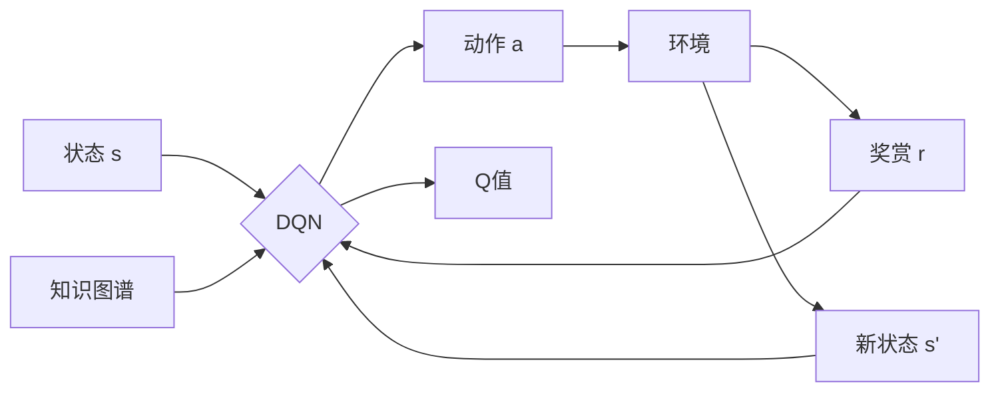

# 一切皆是映射：深度Q网络（DQN）与知识图谱的融合研究

## 1. 背景介绍
### 1.1 人工智能的发展历程
#### 1.1.1 早期的人工智能
#### 1.1.2 机器学习的兴起  
#### 1.1.3 深度学习的崛起
### 1.2 强化学习与深度Q网络
#### 1.2.1 强化学习的基本原理
#### 1.2.2 Q学习算法
#### 1.2.3 深度Q网络的提出
### 1.3 知识图谱技术
#### 1.3.1 知识图谱的概念
#### 1.3.2 知识图谱的构建方法
#### 1.3.3 知识图谱的应用现状

## 2. 核心概念与联系
### 2.1 深度Q网络
#### 2.1.1 DQN的网络结构
#### 2.1.2 DQN的损失函数
#### 2.1.3 DQN的训练过程
### 2.2 知识图谱
#### 2.2.1 RDF与本体
#### 2.2.2 知识表示学习
#### 2.2.3 知识推理
### 2.3 DQN与知识图谱的关联
#### 2.3.1 基于知识的强化学习
#### 2.3.2 知识图谱增强的DQN
#### 2.3.3 DQN驱动的知识图谱构建

## 3. 核心算法原理与具体操作步骤
### 3.1 DQN算法
#### 3.1.1 Q值的更新
#### 3.1.2 经验回放
#### 3.1.3 目标网络
### 3.2 知识图谱嵌入
#### 3.2.1 TransE模型
#### 3.2.2 TransR模型 
#### 3.2.3 TransD模型
### 3.3 将知识图谱融入DQN
#### 3.3.1 动作空间的知识化表示
#### 3.3.2 状态空间的知识化表示
#### 3.3.3 奖赏函数的知识化设计

## 4. 数学模型和公式详细讲解举例说明
### 4.1 马尔可夫决策过程
#### 4.1.1 状态转移概率
#### 4.1.2 奖赏函数
#### 4.1.3 最优策略
### 4.2 Q学习的数学模型
#### 4.2.1 Q值函数
#### 4.2.2 贝尔曼方程
#### 4.2.3 Q学习的收敛性证明
### 4.3 知识图谱嵌入的数学模型  
#### 4.3.1 TransE的能量函数
#### 4.3.2 TransR的映射矩阵
#### 4.3.3 TransD的动态映射矩阵

## 5. 项目实践：代码实例和详细解释说明
### 5.1 DQN算法实现
#### 5.1.1 Q网络的定义
#### 5.1.2 经验回放的实现
#### 5.1.3 目标网络的更新
### 5.2 知识图谱嵌入实现
#### 5.2.1 TransE的代码实现
#### 5.2.2 TransR的代码实现
#### 5.2.3 TransD的代码实现
### 5.3 DQN与知识图谱结合的实现
#### 5.3.1 知识化的状态表示
#### 5.3.2 知识化的动作选择
#### 5.3.3 知识驱动的奖赏函数设计

## 6. 实际应用场景
### 6.1 智能推荐系统
#### 6.1.1 基于知识图谱的推荐
#### 6.1.2 DQN驱动的个性化推荐
#### 6.1.3 案例分析：电商推荐系统
### 6.2 自然语言对话系统
#### 6.2.1 基于知识图谱的问答
#### 6.2.2 DQN驱动的对话策略学习
#### 6.2.3 案例分析：智能客服系统
### 6.3 自动驾驶决策系统
#### 6.3.1 知识图谱辅助的场景理解
#### 6.3.2 DQN驱动的驾驶决策 
#### 6.3.3 案例分析：无人驾驶汽车

## 7. 工具和资源推荐
### 7.1 DQN开发工具
#### 7.1.1 Tensorflow与Keras
#### 7.1.2 PyTorch
#### 7.1.3 OpenAI Gym
### 7.2 知识图谱构建工具
#### 7.2.1 Protégé
#### 7.2.2 Neo4j
#### 7.2.3 Apache Jena
### 7.3 开放数据集
#### 7.3.1 Freebase
#### 7.3.2 WordNet
#### 7.3.3 YAGO

## 8. 总结：未来发展趋势与挑战
### 8.1 知识驱动的强化学习发展趋势
#### 8.1.1 多模态知识的融合
#### 8.1.2 元学习与迁移学习
#### 8.1.3 可解释性与安全性
### 8.2 DQN与知识图谱结合面临的挑战
#### 8.2.1 知识图谱的质量与覆盖度
#### 8.2.2 实时交互中的知识更新
#### 8.2.3 大规模知识图谱的高效推理
### 8.3 未来研究方向展望
#### 8.3.1 知识驱动的多智能体强化学习
#### 8.3.2 知识引导的层次化强化学习
#### 8.3.3 面向可解释性的DQN-KG模型

## 9. 附录：常见问题与解答
### 9.1 DQN容易出现的问题及解决方案
#### 9.1.1 过拟合问题
#### 9.1.2 探索与利用的平衡
#### 9.1.3 奖赏稀疏问题
### 9.2 知识图谱构建中的常见问题及解决方案
#### 9.2.1 知识冲突问题
#### 9.2.2 知识噪声问题
#### 9.2.3 知识孤立点问题
### 9.3 DQN与知识图谱结合中的常见问题及解决方案
#### 9.3.1 知识图谱嵌入维度选择问题
#### 9.3.2 知识驱动的奖赏函数设计问题
#### 9.3.3 知识更新与DQN训练的同步问题

深度Q网络（DQN）与知识图谱都是人工智能领域的重要分支，二者看似风马牛不相及，实则有着千丝万缕的联系。DQN作为强化学习的代表算法之一，擅长在复杂环境中学习最优决策，而知识图谱则以结构化、语义化的方式存储和表示海量知识。将两者融合，可以让DQN在知识的指引下更高效地探索环境，同时让知识图谱借助DQN的学习能力不断完善和进化。这种融合是智能体走向通用人工智能的必由之路。

DQN的核心在于价值网络和经验回放。价值网络用于逼近动作-状态值函数 $Q(s,a)$，即在状态 $s$ 下采取动作 $a$ 能获得的长期累积奖赏的期望。该网络一般采用卷积神经网络或全连接神经网络，输入为状态，输出为各个动作的Q值。在训练过程中，通过最小化时序差分误差，价值网络可以逐步学习到最优的Q函数。经验回放则是一种打破数据相关性的机制，智能体将交互经验 $(s,a,r,s')$ 存入回放池，训练时从中随机采样一个批次用于网络更新，提高了样本利用效率，加速了收敛。此外，DQN还采用了目标网络、双Q学习等技巧来提升稳定性。

知识图谱常以 RDF 三元组 $(h,r,t)$ 的形式表示实体及其关系，$h$、$t$ 为实体（概念），$r$ 为关系（属性）。例如，$(李白,朝代,唐代)$ 表示"李白"属于"唐代"。构建知识图谱需要经过命名实体识别、关系抽取、知识融合等步骤，抽取结构化知识并消除冗余和歧义。为了便于计算，知识图谱通常需要嵌入到连续向量空间，TransE 等知识表示学习算法可以学习实体和关系的低维嵌入表示，同时保留图谱的语义结构。基于嵌入表示，可以进行链接预测、知识推理等下游任务。

DQN 与知识图谱的结合大致分为两类：一是利用知识图谱辅助 DQN 的决策学习，二是利用 DQN 优化知识图谱的构建。在第一类方法中，知识图谱可以作为先验知识引导探索和利用，帮助 DQN 快速找到最优策略。具体而言，可以将知识图谱嵌入作为状态或动作的表示，将实体关系转化为奖赏函数，或将知识约束纳入价值网络的设计中。例如，在推荐系统中，将用户和物品看作知识图谱中的实体，将它们的嵌入向量输入到 DQN 中，就可以充分利用用户和物品的语义信息，学习出个性化的推荐策略。在第二类方法中，DQN 可以作为一种知识提取和优化的工具，通过不断与环境交互来发现新知识，完善已有知识。例如，在对话系统中，DQN 可以根据对话历史动态建立用户画像图谱，并据此生成个性化回复，实现知识的实时更新。

尽管 DQN 和知识图谱的融合前景诱人，但也面临不少挑战。首先，知识图谱的质量和覆盖度直接影响 DQN 的决策效果，而现实世界的知识往往是不完整、有噪声的。其次，在动态环境中，知识图谱需要实时更新以适应新的变化，而频繁的知识更新又会影响 DQN 的训练效率和稳定性。再次，大规模知识图谱的推理需要高效的算法和硬件支持，否则会成为 DQN 学习的瓶颈。未来的研究方向可能包括：利用多模态知识图谱引导 DQN 学习、利用元学习和迁移学习提高知识的复用效率、设计可解释的 DQN-KG 模型以增强可信度等。

总之，DQN 与知识图谱的融合是实现从感知智能到认知智能飞跃的关键一步。这种融合不仅仅是简单的"1+1>2"，而是一种创新性的"化学反应"。未来，知识将成为智能的内在驱动力，而强化学习则是知识进化的主要途径。二者携手并进，必将开创人工智能发展的崭新篇章。让我们拭目以待！

作者：禅与计算机程序设计艺术 / Zen and the Art of Computer Programming