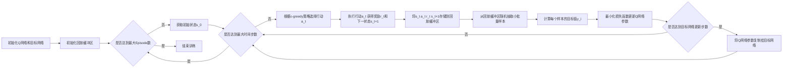

# 一切皆是映射：深度Q网络（DQN）在交通控制系统的应用

## 1. 背景介绍
### 1.1 交通控制系统的挑战
随着城市化进程的加速，交通拥堵问题日益严重，给人们的出行带来了巨大的不便。传统的交通控制系统难以适应日益复杂的交通环境，急需引入新的技术和方法来优化交通控制策略。

### 1.2 强化学习在交通控制中的应用
近年来，强化学习（Reinforcement Learning）作为一种通用的决策优化方法，在交通控制领域得到了广泛的关注和应用。其中，深度Q网络（Deep Q-Network，DQN）作为一种结合了深度学习和强化学习的算法，以其强大的特征提取和决策能力，在交通控制系统中展现出了巨大的潜力。

### 1.3 本文的主要内容
本文将详细介绍DQN算法的基本原理，探讨其在交通控制系统中的应用，并通过实际案例和代码实现，展示DQN算法如何优化交通信号控制策略，提高交通系统的效率。同时，本文还将讨论DQN算法在交通控制领域面临的挑战和未来的发展方向。

## 2. 核心概念与联系
### 2.1 强化学习
强化学习是一种通过与环境交互来学习最优决策的方法。在强化学习中，智能体（Agent）通过观察环境状态（State），采取行动（Action），获得奖励（Reward），并不断调整策略（Policy），以期获得最大的累积奖励。

### 2.2 Q-Learning
Q-Learning是一种经典的强化学习算法，它通过学习状态-行动值函数（Q-function）来估计在给定状态下采取特定行动的长期回报。Q-Learning的更新规则如下：

$$Q(s_t, a_t) \leftarrow Q(s_t, a_t) + \alpha [r_t + \gamma \max_a Q(s_{t+1}, a) - Q(s_t, a_t)]$$

其中，$s_t$和$a_t$分别表示当前状态和行动，$r_t$表示获得的即时奖励，$\alpha$是学习率，$\gamma$是折扣因子。

### 2.3 深度Q网络（DQN）
DQN是将深度神经网络（Deep Neural Network）引入Q-Learning的一种算法。传统的Q-Learning在状态和行动空间较大时难以收敛，而DQN通过深度神经网络来拟合Q-function，大大提高了算法的表示能力和泛化能力。

### 2.4 经验回放（Experience Replay）
经验回放是DQN的一个关键技术，它将智能体与环境交互得到的转移样本（$(s_t, a_t, r_t, s_{t+1})$）存储在一个回放缓冲区（Replay Buffer）中，并从中随机抽取小批量样本来更新神经网络参数。经验回放可以打破样本之间的相关性，提高训练的稳定性。

### 2.5 目标网络（Target Network）
为了提高DQN的训练稳定性，引入了目标网络的概念。目标网络与Q网络结构相同，但参数更新频率较低。在计算Q-Learning的目标值时，使用目标网络的输出，而不是Q网络的输出，以减少估计值的偏差。

## 3. 核心算法原理具体操作步骤
DQN算法的主要步骤如下：

1. 初始化Q网络和目标网络，以及回放缓冲区。
2. 对于每个Episode：
   1. 初始化环境，获得初始状态$s_0$。
   2. 对于每个时间步$t$：
      1. 根据$\epsilon-greedy$策略，以$\epsilon$的概率随机选择行动$a_t$，否则选择$a_t=\arg\max_a Q(s_t, a)$。
      2. 执行行动$a_t$，获得即时奖励$r_t$和下一状态$s_{t+1}$。
      3. 将转移样本$(s_t, a_t, r_t, s_{t+1})$存储到回放缓冲区中。
      4. 从回放缓冲区中随机抽取小批量样本。
      5. 对于每个样本$(s_i, a_i, r_i, s_{i+1})$，计算目标值：
         $$y_i = \begin{cases}
         r_i, & \text{if } s_{i+1} \text{ is terminal} \\
         r_i + \gamma \max_a Q'(s_{i+1}, a), & \text{otherwise}
         \end{cases}$$
         其中，$Q'$表示目标网络。
      6. 使用小批量样本，通过最小化损失函数来更新Q网络：
         $$L(\theta) = \frac{1}{N} \sum_i (y_i - Q(s_i, a_i; \theta))^2$$
         其中，$\theta$表示Q网络的参数，$N$为小批量样本的大小。
      7. 每隔一定步数，将Q网络的参数复制给目标网络。
   3. 如果满足终止条件，则结束训练。

下图展示了DQN算法的整体流程：



## 4. 数学模型和公式详细讲解举例说明
在DQN算法中，Q网络的目的是拟合最优的Q函数，即：

$$Q^*(s, a) = \max_\pi \mathbb{E} [R_t | s_t=s, a_t=a, \pi]$$

其中，$\pi$表示策略，$R_t$表示从时间步$t$开始的累积折扣奖励：

$$R_t = \sum_{k=0}^{\infty} \gamma^k r_{t+k}$$

根据Bellman最优方程，最优Q函数满足以下关系：

$$Q^*(s, a) = \mathbb{E}_{s'}[r + \gamma \max_{a'} Q^*(s', a') | s, a]$$

DQN算法使用深度神经网络来近似最优Q函数，即：

$$Q(s, a; \theta) \approx Q^*(s, a)$$

其中，$\theta$表示神经网络的参数。

在训练过程中，DQN通过最小化时间差分（Temporal Difference）误差来更新神经网络参数：

$$L(\theta) = \mathbb{E}_{(s, a, r, s') \sim D}[(r + \gamma \max_{a'} Q(s', a'; \theta^-) - Q(s, a; \theta))^2]$$

其中，$D$表示从回放缓冲区中抽取的小批量样本，$\theta^-$表示目标网络的参数。

举个例子，假设我们使用DQN来控制一个简单的交通信号灯，状态空间为当前交叉路口各方向的车流量，行动空间为{红灯，绿灯}。我们可以设计一个奖励函数，使得当车辆通过量最大且平均等待时间最小时，奖励值最高。

在训练过程中，DQN会不断与交通环境进行交互，并将转移样本存储到回放缓冲区中。然后，从回放缓冲区中抽取小批量样本，计算每个样本的目标Q值，并使用梯度下降法更新Q网络的参数，使其逼近最优Q函数。最终，我们得到一个训练好的Q网络，可以根据当前交通状态，选择最优的信号灯控制策略。

## 5. 项目实践：代码实例和详细解释说明
下面是一个使用PyTorch实现DQN算法的简单示例，用于控制交通信号灯：

```python
import torch
import torch.nn as nn
import torch.optim as optim
import numpy as np
import random

# 定义Q网络
class QNet(nn.Module):
    def __init__(self, state_dim, action_dim):
        super(QNet, self).__init__()
        self.fc1 = nn.Linear(state_dim, 64)
        self.fc2 = nn.Linear(64, 64)
        self.fc3 = nn.Linear(64, action_dim)
        
    def forward(self, x):
        x = torch.relu(self.fc1(x))
        x = torch.relu(self.fc2(x))
        x = self.fc3(x)
        return x

# 定义DQN智能体
class DQNAgent:
    def __init__(self, state_dim, action_dim, lr, gamma, epsilon, target_update):
        self.q_net = QNet(state_dim, action_dim)
        self.target_net = QNet(state_dim, action_dim)
        self.optimizer = optim.Adam(self.q_net.parameters(), lr=lr)
        self.gamma = gamma
        self.epsilon = epsilon
        self.target_update = target_update
        self.count = 0
        
    def act(self, state):
        if np.random.rand() < self.epsilon:
            return np.random.randint(action_dim)
        else:
            state = torch.tensor(state, dtype=torch.float32)
            q_values = self.q_net(state)
            return torch.argmax(q_values).item()
        
    def learn(self, state, action, reward, next_state, done):
        state = torch.tensor(state, dtype=torch.float32)
        next_state = torch.tensor(next_state, dtype=torch.float32)
        action = torch.tensor(action, dtype=torch.int64)
        reward = torch.tensor(reward, dtype=torch.float32)
        done = torch.tensor(done, dtype=torch.float32)
        
        q_values = self.q_net(state)
        next_q_values = self.target_net(next_state).detach()
        target_q_value = reward + (1 - done) * self.gamma * next_q_values.max()
        
        loss = nn.MSELoss()(q_values[action], target_q_value)
        self.optimizer.zero_grad()
        loss.backward()
        self.optimizer.step()
        
        self.count += 1
        if self.count % self.target_update == 0:
            self.target_net.load_state_dict(self.q_net.state_dict())

# 主循环
state_dim = 4  # 状态维度，即交叉路口各方向车流量
action_dim = 2  # 行动维度，即红灯或绿灯

agent = DQNAgent(state_dim, action_dim, lr=0.001, gamma=0.99, epsilon=0.1, target_update=100)

for episode in range(num_episodes):
    state = env.reset()  # 重置环境，获得初始状态
    done = False
    while not done:
        action = agent.act(state)  # 根据当前状态选择行动
        next_state, reward, done, _ = env.step(action)  # 执行行动，获得下一状态和奖励
        agent.learn(state, action, reward, next_state, done)  # 更新Q网络
        state = next_state
```

在这个示例中，我们定义了一个简单的Q网络`QNet`，包含三个全连接层，激活函数为ReLU。`DQNAgent`类封装了DQN算法的主要组件，包括Q网络、目标网络、优化器、超参数等。

在每个Episode中，智能体与环境进行交互，根据当前状态选择行动（使用$\epsilon-greedy$策略），执行行动后获得下一状态和奖励，并将转移样本传递给`learn`方法进行Q网络的更新。每隔一定步数，将Q网络的参数复制给目标网络。

这个示例代码只是一个简单的框架，实际应用中还需要根据具体问题设计合适的状态表示、行动空间和奖励函数，并进行大量的训练和调参。

## 6. 实际应用场景
DQN算法在交通控制领域有广泛的应用前景，例如：

1. 智能交通信号控制：根据实时交通流量数据，动态调整信号灯的配时方案，减少车辆等待时间，提高通行效率。

2. 自适应车道管理：根据道路拥堵情况，动态调整车道的开放和关闭，引导车流，缓解拥堵。

3. 动态交通诱导：根据道路网络的实时状态，通过可变情报板、导航软件等手段，引导车辆选择最优路径，平衡路网压力{"msg_type":"generate_answer_finish","data":"","from_module":null,"from_unit":null}