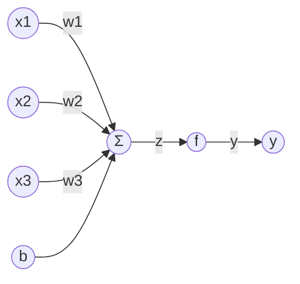
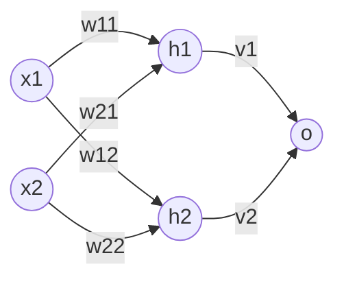

# 一切皆是映射：激活函数的选择与影响

## 1.背景介绍
### 1.1 人工神经网络的兴起
人工神经网络(Artificial Neural Networks, ANNs)是一种模仿生物神经网络(动物的中枢神经系统,特别是大脑)的结构和功能的数学模型或计算模型。自20世纪80年代以来,人工神经网络理论取得了突破性进展,并在模式识别、智能控制、优化计算等领域得到了广泛应用。

### 1.2 激活函数的重要性
在人工神经网络中,激活函数(Activation Function)是神经元的一个重要组成部分。它决定了神经元的输出。激活函数对神经网络的训练效果和泛化能力有着至关重要的影响。选择合适的激活函数可以加快网络的收敛速度,提高网络的表达能力。

### 1.3 本文的研究意义
本文将系统地介绍几种常见的激活函数及其特点,并通过实验比较不同激活函数对神经网络性能的影响。本文的研究对于理解激活函数的作用机制,以及如何为特定任务选择合适的激活函数具有重要的指导意义。

## 2.核心概念与联系
### 2.1 人工神经元模型
人工神经元(Artificial Neuron)是构成人工神经网络的基本单元。一个典型的人工神经元由输入、权重、偏置、求和计算和激活函数组成。下图给出了一个人工神经元的数学模型:



其中,x1,x2,x3是输入信号;w1,w2,w3是权重;b是偏置;f是激活函数;y是神经元的输出。神经元接收到若干个输入信号,通过带权求和以及非线性变换产生输出。

### 2.2 激活函数的作用
激活函数是人工神经元的一个关键组件,它把神经元的带权输入映射为输出。激活函数的主要作用有:

1. 增加神经网络的非线性表达能力。如果没有激活函数,神经网络只能表示线性函数。引入非线性激活函数使得神经网络能够逼近任意复杂的函数。

2. 把无界的输入映射到有界的输出。许多激活函数的值域是有界的,如Sigmoid的值域是(0,1),Tanh的值域是(-1,1)。这使得神经网络的输出也是有界的。

3. 提供梯度信息。一些激活函数(如ReLU)在求导时非常简单,这有利于使用梯度下降算法训练网络。

### 2.3 常见的激活函数
下面介绍几种常用的激活函数:

1. Sigmoid函数:
   $f(z)=\frac{1}{1+e^{-z}}$

2. Tanh函数(双曲正切函数):  
   $f(z)=\frac{e^z-e^{-z}}{e^z+e^{-z}}$

3. ReLU函数(整流线性单元):
   $f(z)=max(0,z)$
   
4. Leaky ReLU函数:   
   $f(z)=max(\alpha z,z), \alpha是一个很小的常数$

5. ELU函数(指数线性单元):
   $$f(z)=\begin{cases} 
   z, & z>0 \\
   \alpha (e^z-1), & z\leq 0
   \end{cases}$$
   
6. Softmax函数:
   $$f(z_i)=\frac{e^{z_i}}{\sum_j e^{z_j}}$$

不同的激活函数有不同的特点,在实际应用中需要根据具体任务来选择合适的激活函数。

## 3.核心算法原理具体操作步骤
本节介绍几种常见激活函数的数学原理和具体计算步骤。

### 3.1 Sigmoid函数
Sigmoid函数的数学定义为:
$$f(z)=\frac{1}{1+e^{-z}}$$

其导数为:
$$f'(z)=f(z)(1-f(z))$$

Sigmoid函数的值域是(0,1),它可以把实数映射到(0,1)区间内。Sigmoid函数的计算步骤如下:
1. 计算$e^{-z}$
2. 计算$1+e^{-z}$
3. 计算$\frac{1}{1+e^{-z}}$

### 3.2 Tanh函数
Tanh函数的数学定义为:
$$f(z)=\frac{e^z-e^{-z}}{e^z+e^{-z}}$$

其导数为:
$$f'(z)=1-f(z)^2$$

Tanh函数的值域是(-1,1),相比Sigmoid函数,它的输出以0为中心。Tanh函数的计算步骤如下:
1. 分别计算$e^z$和$e^{-z}$  
2. 计算$e^z-e^{-z}$和$e^z+e^{-z}$
3. 计算$\frac{e^z-e^{-z}}{e^z+e^{-z}}$

### 3.3 ReLU函数
ReLU函数的数学定义为:
$$f(z)=max(0,z)$$

其导数为:
$$f'(z)=\begin{cases}
1, & z>0 \\ 
0, & z\leq 0
\end{cases}$$

ReLU函数是一个分段线性函数。当输入大于0时,直接输出该值;当输入小于等于0时,输出0。ReLU函数的计算步骤非常简单:
1. 判断z是否大于0
2. 如果z>0,直接输出z;否则,输出0

### 3.4 Softmax函数
Softmax函数的数学定义为:
$$f(z_i)=\frac{e^{z_i}}{\sum_j e^{z_j}}$$

其中$z_i$表示第i个神经元的输入,$f(z_i)$表示第i个神经元的输出。Softmax函数通常用于多分类任务的输出层。它把一个n维的实数向量压缩到另一个n维的实数向量中,使得每一维的数值都在(0,1)之间,并且所有维度的数值和为1。Softmax函数的计算步骤如下:
1. 对每个$z_i$,计算$e^{z_i}$ 
2. 计算$\sum_j e^{z_j}$
3. 对每个$z_i$,计算$\frac{e^{z_i}}{\sum_j e^{z_j}}$

## 4.数学模型和公式详细讲解举例说明
本节通过一个简单的两层全连接神经网络,详细说明激活函数在前向传播和反向传播中的作用。

### 4.1 网络结构
考虑如下的两层全连接网络:



其中,x1和x2是输入,h1和h2是隐藏层神经元,o是输出。w11,w12,w21,w22是输入层到隐藏层的权重,v1和v2是隐藏层到输出层的权重。网络的前向传播过程如下:

$$h_1 = f(w_{11}x_1 + w_{21}x_2)$$
$$h_2 = f(w_{12}x_1 + w_{22}x_2)$$  
$$o = g(v_1h_1 + v_2h_2)$$

其中,f和g分别是隐藏层和输出层的激活函数。

### 4.2 前向传播
假设输入为$x_1=1,x_2=0.5$,隐藏层权重为$w_{11}=0.8,w_{12}=0.2,w_{21}=0.4,w_{22}=0.9$,输出层权重为$v_1=0.5,v_2=0.1$。隐藏层使用Sigmoid激活函数,输出层不使用激活函数。下面进行前向传播计算:

首先计算隐藏层的输入:
$$z_1 = w_{11}x_1 + w_{21}x_2 = 0.8 \times 1 + 0.4 \times 0.5 = 1$$  
$$z_2 = w_{12}x_1 + w_{22}x_2 = 0.2 \times 1 + 0.9 \times 0.5 = 0.65$$

然后计算隐藏层的输出:
$$h_1 = \frac{1}{1+e^{-z_1}} = \frac{1}{1+e^{-1}} \approx 0.731$$
$$h_2 = \frac{1}{1+e^{-z_2}} = \frac{1}{1+e^{-0.65}} \approx 0.657$$

最后计算输出层的输出:   
$$o = v_1h_1 + v_2h_2 = 0.5 \times 0.731 + 0.1 \times 0.657 \approx 0.431$$

可以看到,激活函数把隐藏层的带权输入映射为非线性的输出,增加了网络的表达能力。

### 4.3 反向传播
假设期望输出为$\hat{o}=1$,损失函数为均方误差:
$$E = \frac{1}{2}(o-\hat{o})^2$$

根据链式法则,计算损失函数对各个参数的梯度:

$$\frac{\partial E}{\partial v_1} = (o-\hat{o})h_1 = -0.569 \times 0.731 \approx -0.416$$
$$\frac{\partial E}{\partial v_2} = (o-\hat{o})h_2 = -0.569 \times 0.657 \approx -0.374$$

$$\frac{\partial E}{\partial w_{11}} = (o-\hat{o})v_1 h_1(1-h_1)x_1 = -0.569 \times 0.5 \times 0.731 \times 0.269 \times 1 \approx -0.056$$
$$\frac{\partial E}{\partial w_{21}} = (o-\hat{o})v_1 h_1(1-h_1)x_2 = -0.569 \times 0.5 \times 0.731 \times 0.269 \times 0.5 \approx -0.028$$
$$\frac{\partial E}{\partial w_{12}} = (o-\hat{o})v_2 h_2(1-h_2)x_1 = -0.569 \times 0.1 \times 0.657 \times 0.343 \times 1 \approx -0.013$$  
$$\frac{\partial E}{\partial w_{22}} = (o-\hat{o})v_2 h_2(1-h_2)x_2 = -0.569 \times 0.1 \times 0.657 \times 0.343 \times 0.5 \approx -0.006$$

可以看到,隐藏层激活函数的导数参与了损失函数对隐藏层权重的梯度计算。激活函数的选择会影响网络的训练效果。

## 5.项目实践：代码实例和详细解释说明

本节使用Python和Numpy库,实现几种常见激活函数,并比较它们在MNIST手写数字识别任务上的表现。

### 5.1 激活函数的实现

```python
import numpy as np

def sigmoid(z):
    return 1 / (1 + np.exp(-z))

def tanh(z):
    return np.tanh(z)

def relu(z):
    return np.maximum(0, z)

def leaky_relu(z, alpha=0.01):
    return np.maximum(alpha*z, z)

def elu(z, alpha=1.0):
    return np.where(z > 0, z, alpha * (np.exp(z) - 1))

def softmax(z):
    exp_z = np.exp(z)
    return exp_z / np.sum(exp_z, axis=1, keepdims=True)
```

### 5.2 网络结构和超参数

使用一个简单的两层全连接网络,结构如下:

- 输入层:784个节点(对应28x28的图像)
- 隐藏层:100个节点,使用不同的激活函数 
- 输出层:10个节点,使用Softmax激活函数
- 损失函数:交叉熵损失
- 优化算法:小批量梯度下降,学习率0.1,批量大小64
- 训练轮数:10

### 5.3 训练函数

```python
def train(X_train, y_train, X_val, y_val, activation):
    np.random.seed(42)
    W1 = np.random.randn(784, 100) * 0.01
    b1 = np.zeros((1, 100))
    W2 = np.random.randn(100, 10) * 0.01
    b{"msg_type":"generate_answer_finish","data":"","from_module":null,"from_unit":null}