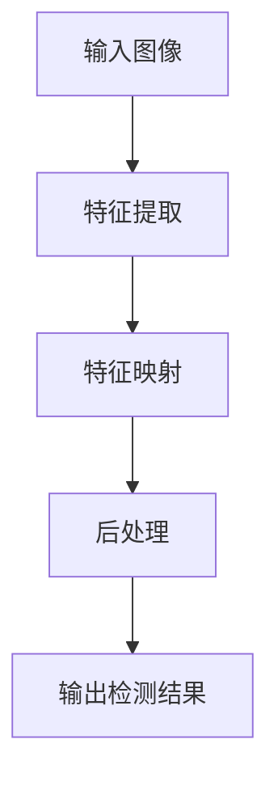
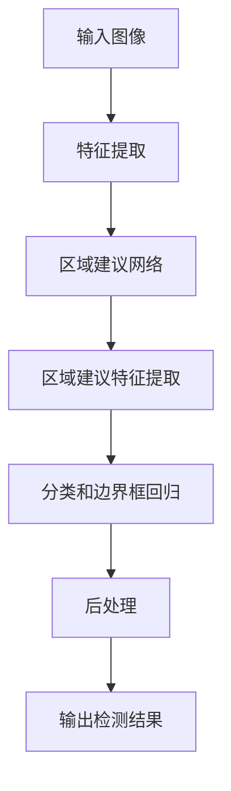

# 一切皆是映射：物体检测与识别：AI的视觉能力

## 1.背景介绍

### 1.1 视觉是人类与世界交互的主要方式

人类依赖视觉来感知和理解周围的环境。我们的大脑能够高效地处理视觉信息,识别物体、人脸、文字,并从中获取有意义的信息。这种视觉能力使我们能够导航环境、识别危险,并与世界互动。

### 1.2 视觉在人工智能中的重要性

视觉是人工智能 (AI) 中一个关键且具有挑战性的领域。赋予机器以类似人类的视觉能力,将极大推动 AI 的发展,使其能够在更广泛的领域发挥作用。例如,自动驾驶汽车需要准确识别道路标志、行人和其他车辆;安防系统需要检测可疑活动;医疗诊断需要分析医学影像等。

### 1.3 物体检测与识别:AI 视觉的核心任务

物体检测和识别是 AI 视觉的核心任务之一。物体检测旨在定位图像中的目标对象,并用边界框将其围绕;而物体识别则进一步确定该对象的类别。这两个任务密切相关,并为 AI 系统理解复杂视觉场景奠定了基础。

## 2.核心概念与联系

### 2.1 特征提取

特征提取是视觉任务的第一步,旨在从原始图像数据中提取有意义的特征。这些特征可以是边缘、纹理、形状或颜色等低级特征,也可以是更高级的语义特征。高质量的特征对于后续的检测和识别任务至关重要。

### 2.2 特征映射

特征映射将提取的特征与目标对象相关联。这通常通过训练模型在特征空间中学习目标对象的表示来实现。例如,在物体检测中,模型需要学习将特征映射到对象的边界框坐标。

### 2.3 模型架构

不同的模型架构,如卷积神经网络 (CNN)、区域卷积神经网络 (R-CNN) 等,被用于物体检测和识别任务。这些架构在特征提取、特征映射和后处理等方面有所不同,但都遵循将输入映射到输出的基本思想。



## 3.核心算法原理具体操作步骤

### 3.1 基于区域的卷积神经网络 (R-CNN)

R-CNN 是一种经典的两阶段物体检测算法,包括以下步骤:

1. **选择区域建议** (Region Proposal)
   - 使用选择性搜索算法生成多个区域建议
2. **特征提取**
   - 对每个区域建议进行特征提取,通常使用预训练的 CNN 模型
3. **分类和边界框回归**
   - 将提取的特征输入分类器,预测该区域是否包含目标对象及其类别
   - 将特征输入边界框回归器,细化目标对象的边界框位置
4. **后处理**
   - 应用非最大值抑制 (NMS) 去除重叠的冗余检测结果

尽管 R-CNN 取得了里程碑式的成就,但它的速度较慢,因为需要对每个区域建议分别提取特征。

### 3.2 快速 R-CNN (Fast R-CNN)

为了提高速度,Fast R-CNN 将特征提取和区域建议两个步骤合并:

1. **整张图像特征提取**
   - 使用 CNN 对整张输入图像进行特征提取,获得特征图
2. **区域建议特征提取**
   - 在特征图上应用选择性搜索,生成区域建议
   - 使用区域建议池化层 (RoI Pooling) 从特征图中提取每个区域建议的特征
3. **分类和边界框回归**
   - 将区域建议特征输入全连接层,进行分类和边界框回归
4. **后处理**
   - 应用 NMS 去除冗余检测结果

通过共享整张图像的特征计算,Fast R-CNN 比 R-CNN 更高效。

### 3.3 更快 R-CNN (Faster R-CNN)

Faster R-CNN 进一步将区域建议的生成也整合到网络中,使整个过程只需一次特征提取:

1. **特征提取**
   - 使用 CNN 对输入图像进行特征提取,获得特征图
2. **区域建议网络 (RPN)**
   - 在特征图上滑动小窗口,对每个窗口预测是否包含目标对象及其边界框
   - 生成区域建议
3. **区域建议特征提取**
   - 使用 RoI Pooling 从特征图中提取每个区域建议的特征
4. **分类和边界框回归**
   - 将区域建议特征输入全连接层,进行分类和边界框回归  
5. **后处理**
   - 应用 NMS 去除冗余检测结果

Faster R-CNN 通过共享卷积特征和使用 RPN 进一步提高了检测速度。



### 3.4 单阶段检测器

除了两阶段检测器如 Faster R-CNN,还有一类单阶段检测器,如 YOLO 和 SSD。它们将物体检测视为一个回归问题,直接从特征图预测边界框坐标和类别概率,避免了生成区域建议的步骤。这使得它们速度更快,但通常精度略低于两阶段检测器。

## 4.数学模型和公式详细讲解举例说明

### 4.1 锚框 (Anchor Box)

锚框是物体检测中的一个关键概念,尤其在 Faster R-CNN 和单阶段检测器中。锚框是一组预定义的边界框,具有不同的尺寸和纵横比,用于匹配图像中的目标对象。

在 Faster R-CNN 的 RPN 中,锚框被用于预测目标对象的位置和尺寸。对于每个滑动窗口,RPN 会预测该窗口中每个锚框是否包含目标对象,以及该对象相对于锚框的偏移量。

在单阶段检测器中,锚框也被用于预测目标对象的位置和尺寸,但是预测过程更加直接。模型会为每个锚框预测一个置信度分数,表示该锚框包含目标对象的概率,以及目标对象的类别和相对于锚框的偏移量。

锚框的数量、尺寸和纵横比通常是预定义的超参数,需要根据具体任务进行调整。

### 4.2 边界框回归 (Bounding Box Regression)

边界框回归是物体检测中另一个关键概念,用于精确定位目标对象的边界框。

在 Faster R-CNN 和单阶段检测器中,模型不仅需要预测目标对象的类别,还需要预测该对象相对于锚框的偏移量。这些偏移量通常表示为四个值:$t_x, t_y, t_w, t_h$,分别代表中心坐标的 x 和 y 偏移量,以及宽度和高度的缩放比例。

给定一个锚框 $(x_a, y_a, w_a, h_a)$ 和预测的偏移量 $(t_x, t_y, t_w, t_h)$,目标对象的预测边界框 $(x, y, w, h)$ 可以通过以下公式计算:

$$
\begin{aligned}
x &= x_a + t_x \cdot w_a\\
y &= y_a + t_y \cdot h_a\\
w &= w_a \cdot e^{t_w}\\
h &= h_a \cdot e^{t_h}
\end{aligned}
$$

通过这种方式,模型可以学习预测相对于锚框的偏移量,从而精确定位目标对象。

### 4.3 非最大值抑制 (Non-Maximum Suppression, NMS)

由于物体检测模型可能会对同一目标对象产生多个重叠的检测结果,因此需要使用非最大值抑制 (NMS) 算法去除这些冗余的检测结果。

NMS 算法的工作原理如下:

1. 对所有检测结果按置信度降序排列
2. 从置信度最高的检测结果开始,将其余所有与之重叠的检测结果移除
   - 重叠程度通常使用交并比 (Intersection over Union, IoU) 来衡量
   - 如果两个检测结果的 IoU 大于预定义的阈值,则认为它们重叠
3. 重复步骤 2,直到所有检测结果都被处理

通过 NMS,可以保留置信度最高的检测结果,并去除与之重叠的冗余检测结果,从而获得最终的检测输出。

## 5.项目实践:代码实例和详细解释说明

以下是一个使用 PyTorch 实现 Faster R-CNN 的简化示例:

```python
import torch
import torchvision
from torchvision.models.detection import FasterRCNN
from torchvision.models.detection.rpn import AnchorGenerator

# 加载预训练模型
model = torchvision.models.detection.fasterrcnn_resnet50_fpn(pretrained=True)

# 设置模型为评估模式
model.eval()

# 加载图像
img = Image.open('example.jpg')
transform = torchvision.transforms.ToTensor()
img_tensor = transform(img)

# 前向传播
with torch.no_grad():
    prediction = model(img_tensor.unsqueeze(0))

# 获取检测结果
boxes = prediction[0]['boxes']
labels = prediction[0]['labels']
scores = prediction[0]['scores']

# 应用 NMS
keep = torchvision.ops.nms(boxes, scores, iou_threshold=0.5)
boxes = boxes[keep]
labels = labels[keep]
scores = scores[keep]

# 可视化结果
img = img_tensor.permute(1, 2, 0).numpy()
for box, label, score in zip(boxes, labels, scores):
    x1, y1, x2, y2 = box
    cv2.rectangle(img, (x1, y1), (x2, y2), (0, 255, 0), 2)
    cv2.putText(img, f'{label.item()}: {score.item():.2f}', (x1, y1 - 10), cv2.FONT_HERSHEY_SIMPLEX, 0.5, (36, 255, 12), 2)
```

在这个示例中,我们首先加载预训练的 Faster R-CNN 模型。然后,我们将输入图像转换为张量,并通过模型进行前向传播,获得预测结果。

预测结果包含检测到的边界框、对应的类别标签和置信度分数。我们应用 NMS 算法去除重叠的检测结果,最后将剩余的检测结果可视化在原始图像上。

需要注意的是,这只是一个简化的示例,实际应用中可能需要进行更多的预处理、后处理和优化。

## 6.实际应用场景

物体检测和识别在许多领域都有广泛的应用,包括但不限于:

### 6.1 自动驾驶

自动驾驶汽车需要准确检测和识别道路上的其他车辆、行人、交通标志等,以确保安全导航。

### 6.2 安防监控

安防系统可以使用物体检测和识别技术来监测可疑活动,如入室盗窃或暴力行为。

### 6.3 机器人视觉

机器人需要视觉能力来感知周围环境,识别目标对象并与之交互。

### 6.4 医疗影像分析

物体检测和识别可以应用于医学影像分析,如检测肿瘤或其他异常。

### 6.5 零售和库存管理

在零售和库存管理领域,物体检测和识别可用于自动化商品计数和库存跟踪。

### 6.6 增强现实 (AR) 和虚拟现实 (VR)

AR 和 VR 应用需要准确检测和识别真实世界中的对象,以实现无缝融合。

## 7.工具和资源推荐

以下是一些用于物体检测和识别的流行工具和资源:

### 7.1 深度学习框架

- **PyTorch**: https://pytorch.org/
- **TensorFlow**: https://www.tensorflow.org/
- **Keras**: https://keras.io/

这些框架提供了实现和