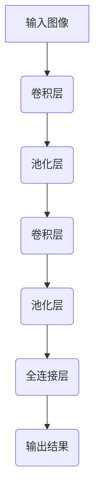

# 一切皆是映射：神经风格迁移和艺术创作中的AI

## 1.背景介绍

### 1.1 艺术与技术的融合

艺术和技术一直是人类文明进步的双翼。在过去的几个世纪里,艺术和技术的发展似乎是分道扬镳的,但随着人工智能(AI)和机器学习技术的不断突破,二者的融合正在重新定义着人类的创作方式。神经风格迁移(Neural Style Transfer)作为机器学习在艺术创作领域的一个重要应用,正在改变着人们对艺术的理解和创作方式。

### 1.2 风格迁移的兴起

风格迁移的概念源于对人类视觉系统的研究。早在20世纪60年代,нек些心理学家和神经科学家就提出,人类视觉系统可能是通过分层的神经网络来处理和理解图像信息的。低层次的神经元对图像的纹理、颜色等底层特征有反应,而高层次的神经元则对图像的更抽象的内容特征有反应。

直到2015年,来自德国的计算机视觉研究员Leon A. Gatys等人在论文《A Neural Algorithm of Artistic Style》中首次提出了基于卷积神经网络(CNN)的风格迁移算法,将这一理论付诸实践,从而开启了神经风格迁移的新纪元。

### 1.3 神经风格迁移的本质

神经风格迁移的本质是将一幅内容图像(如风景照片)与一种艺术风格(如梵高的画作风格)相融合,生成一幅全新的、具有内容图像内容但采用艺术风格的作品。这一过程利用了深度卷积神经网络在图像识别和特征提取方面的优势,实现了人工智能辅助艺术创作的新模式。

## 2.核心概念与联系

### 2.1 卷积神经网络

卷积神经网络(Convolutional Neural Network,CNN)是一种前馈神经网络,它的人工神经元可以响应一部分覆盖范围内的周围神经元,对于大型图像处理有出色的性能。CNN由多个卷积层、池化层和全连接层组成,可以自动从图像中提取出多种视觉特征。



### 2.2 内容损失与风格损失

神经风格迁移算法的核心思想是将内容图像和风格图像输入到同一个预训练的CNN模型中,然后计算内容损失和风格损失,并通过优化目标函数最小化这两种损失,从而生成具有内容图像内容和风格图像风格的输出图像。

- 内容损失(Content Loss)用于保持输出图像的内容信息,通过比较输出图像和内容图像在高层CNN特征图之间的差异来计算。
- 风格损失(Style Loss)用于迁移风格图像的风格,通过比较输出图像和风格图像在中层CNN特征图之间的格拉姆矩阵(Gram Matrix)差异来计算。

### 2.3 格拉姆矩阵

格拉姆矩阵(Gram Matrix)是风格迁移算法中一个关键概念。它表示了特征图中不同滤波器响应之间的相关性,可以很好地捕捉图像的风格信息。

对于一个特征图矩阵 $F$,其格拉姆矩阵 $G$ 定义为:

$$G_{ij} = \sum_k F_{ik}F_{jk}$$

其中 $i,j$ 表示特征图的宽度,而 $k$ 表示特征图的高度。格拉姆矩阵描述了不同滤波器响应之间的线性统计关系,从而编码了图像的纹理信息。

## 3.核心算法原理具体操作步骤 

神经风格迁移算法的核心步骤如下:

1. **预处理输入**:将内容图像 $I_c$ 和风格图像 $I_s$ 预处理为相同尺寸,并执行像素值归一化。

2. **初始化输出图像**:从高斯噪声或内容图像初始化一个输出图像 $I_{out}$。

3. **前向传播**:将 $I_{out}$ 输入到预训练的CNN模型中,获得相应的特征图 $F^l_{out}$,其中 $l$ 表示网络层数。

4. **计算内容损失**:选择一个较高层的特征图 $F^l_{c}$,计算内容损失:

$$L_{content}(I_{out}, I_c) = \frac{1}{2} \sum_{i,j} (F^l_{ij,out} - F^l_{ij,c})^2$$

5. **计算风格损失**:选择一些中层的特征图 $F^l_{out}, F^l_s$,计算它们的格拉姆矩阵 $G^l_{out}, G^l_s$,然后计算风格损失:

$$L_{style}(I_{out}, I_s) = \sum_l w_l E_l$$

$$E_l = \frac{1}{4N_l^2M_l^2} \sum_{i,j} (G^l_{ij,out} - G^l_{ij,s})^2$$

其中 $w_l$ 是风格损失的权重, $N_l, M_l$ 分别是特征图的宽高。

6. **总损失函数**:将内容损失和风格损失相加,得到总损失函数:

$$L_{total}(I_{out}, I_c, I_s) = \alpha L_{content}(I_{out}, I_c) + \beta L_{style}(I_{out}, I_s)$$

其中 $\alpha, \beta$ 是权重系数,控制内容和风格的相对重要性。

7. **优化输出图像**:使用优化算法(如L-BFGS)最小化总损失函数,更新输出图像 $I_{out}$,重复步骤3-7,直到损失函数收敛或达到最大迭代次数。

8. **输出图像**:最终输出具有内容图像内容和风格图像风格的图像 $I_{out}$。

整个过程可视为一个优化问题,目标是找到一个输出图像,使其在内容图像和风格图像之间达到最佳平衡。

## 4.数学模型和公式详细讲解举例说明

为了更好地理解神经风格迁移算法中的数学模型和公式,我们将通过一个具体的例子进行详细说明。

假设我们有一张内容图像 $I_c$ 和一张风格图像 $I_s$,如下所示:

<内容图像>
<风格图像>

我们的目标是生成一张新的输出图像 $I_{out}$,使其具有内容图像的内容信息和风格图像的艺术风格。

### 4.1 内容损失

内容损失的目的是保持输出图像 $I_{out}$ 的内容信息与内容图像 $I_c$ 相似。我们选择预训练CNN模型的一个较高层(如第5卷积层)的特征图 $F^5_{out}$ 和 $F^5_c$ 来计算内容损失:

$$L_{content}(I_{out}, I_c) = \frac{1}{2} \sum_{i,j} (F^5_{ij,out} - F^5_{ij,c})^2$$

这个公式实际上是计算了输出图像和内容图像在该层特征图上的均方误差。特征图 $F^5$ 编码了图像的高层语义信息,因此通过最小化内容损失,我们可以确保输出图像保留了内容图像的主要内容。

### 4.2 风格损失

风格损失的目的是使输出图像 $I_{out}$ 具有风格图像 $I_s$ 的艺术风格。我们选择预训练CNN模型的几个中层(如第1-4卷积层)的特征图 $F^l_{out}$ 和 $F^l_s$,计算它们的格拉姆矩阵 $G^l_{out}$ 和 $G^l_s$,然后计算风格损失:

$$L_{style}(I_{out}, I_s) = \sum_l w_l E_l$$

$$E_l = \frac{1}{4N_l^2M_l^2} \sum_{i,j} (G^l_{ij,out} - G^l_{ij,s})^2$$

其中 $G^l$ 是特征图 $F^l$ 的格拉姆矩阵,定义为:

$$G^l_{ij} = \sum_k F^l_{ik}F^l_{jk}$$

格拉姆矩阵 $G^l$ 描述了同一层不同滤波器响应之间的相关性,可以很好地捕捉图像的纹理信息和风格特征。通过最小化风格损失,我们可以使输出图像的纹理和笔触风格逐渐接近风格图像。

在实际计算中,我们会对不同层的风格损失 $E_l$ 赋予不同的权重 $w_l$,以平衡不同层次的风格信息。

### 4.3 总损失函数

将内容损失和风格损失相加,我们得到总损失函数:

$$L_{total}(I_{out}, I_c, I_s) = \alpha L_{content}(I_{out}, I_c) + \beta L_{style}(I_{out}, I_s)$$

其中 $\alpha$ 和 $\beta$ 是权重系数,用于控制内容和风格的相对重要性。通过调整这两个参数,我们可以在内容保真和风格迁移之间达到平衡。

在优化过程中,我们将不断更新输出图像 $I_{out}$,使总损失函数 $L_{total}$ 最小化。最终,我们可以得到一张具有内容图像内容和风格图像风格的输出图像,如下所示:

<输出图像>

通过这个例子,我们可以更好地理解神经风格迁移算法中的数学模型和公式。内容损失确保了输出图像的内容保真性,而风格损失则使输出图像获得了艺术风格,二者的平衡由总损失函数控制。

## 5.项目实践:代码实例和详细解释说明

为了更好地理解神经风格迁移算法,我们将通过一个基于Python和PyTorch的代码实例来实现这一算法。

### 5.1 导入必要的库

```python
import torch
import torch.nn as nn
import torch.optim as optim
from torchvision import transforms, models
from PIL import Image
import matplotlib.pyplot as plt
import numpy as np
```

### 5.2 加载预训练模型

我们将使用预训练的VGG19模型来提取图像的特征图。

```python
vgg = models.vgg19(pretrained=True).features

# 冻结模型参数
for param in vgg.parameters():
    param.requires_grad_(False)

device = torch.device("cuda" if torch.cuda.is_available() else "cpu")
vgg.to(device)
```

### 5.3 定义内容损失和风格损失函数

```python
class ContentLoss(nn.Module):
    def __init__(self, target):
        super(ContentLoss, self).__init__()
        self.target = target.detach()

    def forward(self, input):
        self.loss = nn.functional.mse_loss(input, self.target)
        return input

class StyleLoss(nn.Module):
    def __init__(self, target_feature):
        super(StyleLoss, self).__init__()
        self.target = gram_matrix(target_feature).detach()

    def forward(self, input):
        G = gram_matrix(input)
        self.loss = nn.functional.mse_loss(G, self.target)
        return input

def gram_matrix(input):
    batch, channel, height, width = input.size()
    features = input.view(batch, channel, height * width)
    features_t = features.transpose(1, 2)
    gram = features.bmm(features_t) / (channel * height * width)
    return gram
```

这里我们定义了内容损失类`ContentLoss`和风格损失类`StyleLoss`。`gram_matrix`函数用于计算特征图的格拉姆矩阵。

### 5.4 加载内容图像和风格图像

```python
content_img = Image.open("content.jpg")
style_img = Image.open("style.jpg")

# 预处理图像
transform = transforms.Compose([
    transforms.Resize((256, 256)),
    transforms.ToTensor(),
    transforms.Normalize(mean=[0.485, 0.456, 0.406], std=[0.229, 0.224, 0.225])
])

content = transform(content_img).unsqueeze(0).to(device)
style = transform(style_img).unsqueeze(0).to(device)
```

### 5.5 初始化输出图像和损失函数

```python
output = content.clone().requires_grad_(True)

content_layers = ['conv_4']
style_layers = ['conv_1', 'conv_2', 'conv_3', 'conv_4', 'conv_5']

content_losses = []
style_losses = []