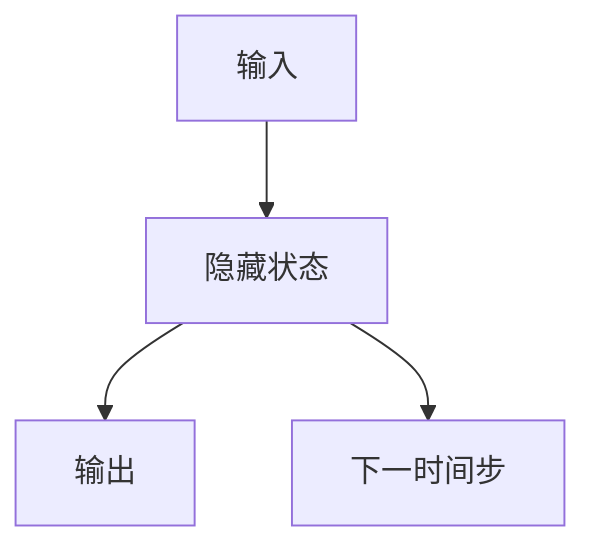

## 1.背景介绍

在我们日常生活中，时间序列数据无处不在，例如股票价格、气温变化、音频信号等，这些数据都是随时间变化的。为了捕捉这种依赖性，我们需要一种能够处理序列数据的特殊类型的神经网络，这就是递归神经网络（RNN）。

## 2.核心概念与联系

### 2.1 什么是递归神经网络（RNN）

递归神经网络（RNN）是一种强大的人工神经网络，它能够处理序列数据。RNN的特点在于它有记忆，能够捕捉时间序列数据中的模式。这是因为RNN在处理每一个新的输入时，都会将前一个时间步骤的隐藏状态作为输入，这使得RNN能够记住过去的信息。

### 2.2 RNN与时间序列数据

时间序列数据是按照时间顺序排列的一系列数据点，每一个数据点都与前一个数据点有关。RNN是处理这种数据的理想选择，因为它能够利用自己的记忆来捕捉数据中的时间依赖性。

## 3.核心算法原理具体操作步骤

RNN的工作原理可以分为以下几个步骤：

1. 在每个时间步，RNN会接收一个输入和前一个时间步的隐藏状态。
2. RNN会计算当前时间步的隐藏状态。
3. 这个新计算出的隐藏状态会被用于下一个时间步的计算，同时也会用于当前时间步的输出。

这个过程会一直持续到所有的输入都被处理完。

## 4.数学模型和公式详细讲解举例说明

RNN的数学模型可以用以下的公式来表示：

$$
h_t = \sigma(W_{hh}h_{t-1}+W_{xh}x_t)
$$

$$
y_t = W_{hy}h_t
$$

其中，$h_t$是在时间$t$的隐藏状态，$W_{hh}$是隐藏状态的权重，$x_t$是在时间$t$的输入，$W