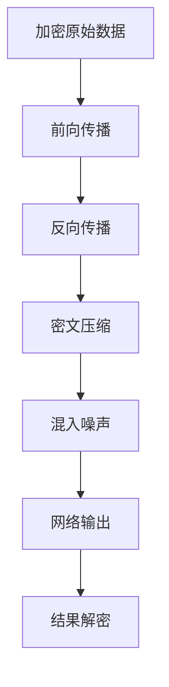

# 一种隐私保护的BP神经网络的设计

## 1. 背景介绍

### 1.1 隐私保护的重要性

在大数据时代,数据已经成为一种重要的资源。越来越多的企业和机构开始利用数据挖掘和机器学习技术从海量数据中提取有价值的信息,用于指导决策和优化业务流程。然而,在数据挖掘和分析的过程中,用户的隐私信息面临着巨大的泄露风险。如何在保护用户隐私的同时,又能充分利用数据的价值,已经成为学术界和工业界共同关注的热点问题。

### 1.2 神经网络中的隐私泄露问题

人工神经网络是一种广泛应用于模式识别、数据挖掘等领域的机器学习模型。BP(Back Propagation)神经网络是应用最广泛的一种前馈神经网络。在BP网络的训练过程中,需要大量的训练数据对网络参数进行优化。然而,训练数据中往往包含大量的用户隐私信息,如果这些信息被不法分子截获或窃取,将会给用户造成难以估量的损失。因此,如何在BP神经网络训练过程中保护用户隐私,成为一个亟待解决的问题。

### 1.3 现有的隐私保护方法及其不足

目前,针对机器学习中的隐私保护问题,学术界提出了多种解决方案,主要包括:

1. 数据脱敏:在数据挖掘之前,先对原始数据进行脱敏处理,去除其中的隐私信息。但该方法可能会损失数据中的部分有用信息,影响挖掘结果的准确性。

2. 加密计算:利用同态加密等密码学技术,在加密数据上直接进行计算,避免了隐私泄露。但该方法计算复杂度高,效率较低,难以应用于大规模数据挖掘场景。

3. 差分隐私:通过在挖掘结果中引入随机噪声,使得攻击者无法从结果中推断出个人隐私信息。但噪声的引入会影响数据挖掘的准确性,且噪声参数的选取存在一定难度。

综上,现有的隐私保护方法在保护效果和计算效率方面都存在不足,亟需一种新的隐私保护机制,既能有效保护隐私,又不影响挖掘效率和准确性。本文提出了一种全新的隐私保护BP神经网络设计方案,在保护隐私的同时,最大限度地保证了模型性能。

## 2. 核心概念与联系

### 2.1 BP神经网络

BP(Back Propagation)神经网络是一种多层前馈神经网络,通过反向传播算法对网络权重进行训练优化,是应用最广泛的神经网络模型之一。一个典型的三层BP网络结构如下:

其中,输入层接收外界输入信号,隐藏层对输入信号进行非线性变换,输出层给出网络的预测结果。BP网络通过不断调整各层神经元之间的连接权重,使得网络输出尽可能接近期望输出,从而完成对输入数据的特征学习和分类预测任务。

### 2.2 隐私保护

隐私保护是指在数据挖掘、机器学习等任务中,防止用户隐私数据被恶意窃取和滥用的一系列措施。常见的隐私保护措施包括:数据脱敏、加密计算、差分隐私等。其中,差分隐私通过在计算结果中引入随机噪声,使得攻击者无法从结果中推断出个人隐私,是一种强有力的隐私保护方法。

### 2.3 同态加密

同态加密是一种特殊的加密方案,它允许对密文进行某些运算,得到的结果解密后与对明文进行同样运算的结果一致。即同态加密支持在不解密数据的情况下进行计算。设enc为加密函数,dec为解密函数,m1和m2为明文,⊕代表某种运算,若满足:

$$ dec(enc(m1) \oplus enc(m2)) = m1 \oplus m2 $$

则称该加密方案对运算⊕满足同态性。若一个加密方案对加法和乘法都满足同态性,则称其为全同态加密方案。同态加密是实现加密数据计算的重要工具。

### 2.4 核心概念间的联系

在BP神经网络的训练过程中,需要使用大量的用户数据进行网络参数优化。若训练数据中包含隐私信息,则存在隐私泄露风险。为保护隐私,可将训练数据加密后再参与运算。但普通加密方案无法支持密文计算。

因此,本文利用同态加密技术,实现加密数据下的神经网络训练。通过对中间计算结果的适当处理,在保证数据安全的同时,最大限度降低加密操作带来的性能损失。同时引入差分隐私思想,在网络输出中混入随机噪声,防止隐私数据从输出结果中泄露。

综上,本文将BP神经网络、隐私保护、同态加密、差分隐私等技术融合应用,构建了一套全新的隐私保护神经网络训练方案。通过加密数据、同态计算、噪声混淆等多重保护措施,在保障隐私安全的同时,又最大限度保证了模型性能,为隐私数据的安全分析挖掘提供了新的解决思路。

## 3. 核心算法原理及具体操作步骤

本节将详细介绍隐私保护BP神经网络的核心算法原理,并给出算法的具体操作步骤。

### 3.1 总体思路

本文提出的隐私保护BP神经网络,在传统BP网络的基础上,融合了同态加密和差分隐私技术,实现了加密数据下的网络训练,并防止了隐私数据从输出结果中泄露。其主要思路如下:

1. 利用同态加密算法对原始训练数据进行加密,将加密后的数据用于网络训练。

2. 在前向传播和反向传播过程中,利用同态性质实现加密数据下的网络计算。

3. 对中间计算结果进行密文压缩和近似处理,降低加密计算带来的性能损失。

4. 对网络输出结果混入随机噪声,满足差分隐私要求,防止隐私泄露。

5. 用户利用私钥对网络输出结果解密,获得最终的预测结果。

算法的总体流程如下图所示:

### 3.2 数据加密

设原始训练数据集为$D=\{(x_i,y_i)\}_{i=1}^N$,其中$x_i$为训练样本的特征向量,$y_i$为样本的标签。利用同态加密算法Enc对原始数据进行加密,得到加密后的训练数据集$D'=\{(Enc(x_i),Enc(y_i))\}_{i=1}^N$。加密过程需要用户提供的公钥pk,用户自己保存私钥sk。

### 3.3 前向传播

利用加密后的训练数据对神经网络进行前向传播计算。设网络共有L层,第$\ell$层的加密输入为$Enc(z^{(\ell)})$,加密输出为$Enc(a^{(\ell)})$,则前向传播过程如下:

$$ Enc(z^{(\ell)}) = Enc(W^{(\ell)}) \otimes Enc(a^{(\ell-1)}) \oplus Enc(b^{(\ell)}) $$

$$ Enc(a^{(\ell)}) = f(Enc(z^{(\ell)})) $$

其中,$W^{(\ell)}$和$b^{(\ell)}$分别为第$\ell$层的权重矩阵和偏置向量,⊗和⊕分别表示同态乘法和同态加法运算,$f$为激活函数。通过逐层计算,得到网络加密输出$Enc(\hat{y})$。

### 3.4 反向传播

网络的加密输出$Enc(\hat{y})$与加密标签$Enc(y)$之间的误差为:

$$ Enc(E) = Enc(\hat{y}) \ominus Enc(y) $$

其中⊖表示同态减法。根据误差进行反向传播,更新网络参数。设$\delta^{(\ell)}$为第$\ell$层的加密误差项,则反向传播过程如下:

$$ Enc(\delta^{(L)}) = Enc(E) \otimes f'(Enc(z^{(L)}))$$

$$ Enc(\delta^{(\ell)}) = (Enc(W^{(\ell+1)})^T \otimes Enc(\delta^{(\ell+1)})) \otimes f'(Enc(z^{(\ell)}))$$

$$ Enc(W^{(\ell)}) := Enc(W^{(\ell)}) \ominus \alpha \cdot Enc(\delta^{(\ell)}) \otimes Enc(a^{(\ell-1)})^T $$

$$ Enc(b^{(\ell)}) := Enc(b^{(\ell)}) \ominus \alpha \cdot Enc(\delta^{(\ell)})$$

其中$\alpha$为学习率,$f'$为激活函数的导数。权重和偏置的更新通过同态运算实现。

### 3.5 密文压缩

同态加密后的中间计算结果长度会急剧增加,导致计算效率下降。为提高训练效率,可对中间结果进行密文压缩,即用更短的密文近似表示原始密文。设压缩函数为Compress,则压缩过程为:

$$Enc(z^{(\ell)}):=Compress(Enc(z^{(\ell)})) $$

$$Enc(\delta^{(\ell)}):=Compress(Enc(\delta^{(\ell)}))$$

压缩函数Compress通过对密文进行二进制截断实现,在保证近似精度的同时大幅降低了密文长度。

### 3.6 差分隐私保护

为防止隐私数据从输出结果$\hat{y}$中泄露,在网络输出中混入随机噪声,使其满足$\epsilon$-差分隐私。具体地,设噪声服从均值为0、标准差为$\sigma$的高斯分布,则噪声化的网络输出$\tilde{y}$为:

$$Enc(\tilde{y}) = Enc(\hat{y}) \oplus Enc(N(0, \sigma^2))$$

根据差分隐私理论,标准差$\sigma$与隐私预算$\epsilon$满足:

$$\sigma \ge \frac{S(f)}{\epsilon}$$

其中$S(f)$为敏感度,表示单个样本变化时输出的最大变化量。添加噪声后,网络输出满足$\epsilon$-差分隐私,可有效防止隐私泄露。

### 3.7 结果解密

用户利用私钥sk对网络输出$Enc(\tilde{y})$进行解密,得到最终的预测结果$\tilde{y}$:

$$\tilde{y} = Dec(Enc(\tilde{y}), sk)$$

经过以上步骤,实现了加密数据下的神经网络训练,并保证了隐私安全。

## 4. 数学模型和公式详细讲解举例说明

本节将对隐私保护神经网络中涉及的关键数学模型和公式进行详细讲解,并给出具体的算例加以说明。

### 4.1 同态加密

同态加密是本文隐私保护方案的核心,它允许在加密数据上直接进行计算。设$pk$为公钥, $sk$为私钥,$Enc$和$Dec$分别为加密和解密函数,对于任意两个明文$m_1$,$m_2$和运算⊙,若满足:

$$Dec(Enc(m_1,pk) \otimes Enc(m_2,pk), sk) = m_1 \oplus m_2$$

则称加密方案$\{Enc, Dec\}$对运算⊙满足同态性,其中⊗表示密文域上对应于明文域运算⊙的运算。若加密方案对加法和乘法都满足同态性,则称其为全同态加密。

常见的同态加密方案包括Paillier加密和BGV加密。以Paillier加密为例,其加密和解密过程为:

加密:选择两个大素数$p$,$q$,计算$n=pq$,$\lambda=lcm(p-1