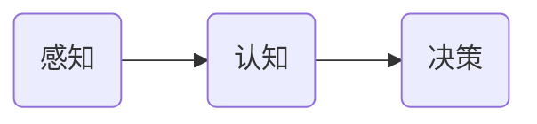
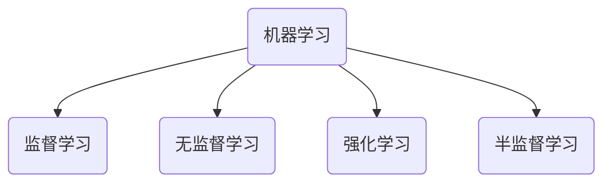

# 人工智能(AI)原理与代码实战案例讲解

## 1. 背景介绍
### 1.1 人工智能的定义与发展历程
#### 1.1.1 人工智能的定义
人工智能(Artificial Intelligence,简称AI)是计算机科学的一个分支,它是研究、开发用于模拟、延伸和扩展人的智能的理论、方法、技术及应用系统的一门新的技术科学。人工智能致力于使计算机能够像人一样进行感知、学习、推理和解决问题。

#### 1.1.2 人工智能的发展历程
人工智能的发展大致经历了以下几个阶段:

1. 孕育阶段(1940s-1950s):在这一阶段,科学家们提出了人工智能的基本概念和思想,如图灵测试、达特茅斯会议等。

2. 形成阶段(1950s-1970s):这一阶段出现了早期的人工智能系统,如"逻辑理论家"、"通用问题求解器"等。同时,机器学习、自然语言处理等重要的人工智能分支开始形成。

3. 低谷阶段(1970s-1980s):由于当时技术和硬件的限制,人工智能的发展遇到了瓶颈,出现了所谓的"人工智能寒冬期"。

4. 复兴阶段(1980s-2000s):随着计算机硬件和算法的发展,人工智能重新焕发生机。专家系统、神经网络、进化算法等技术不断涌现。

5. 深度学习时代(2010s-至今):得益于大数据、高性能计算和深度学习算法的突破,人工智能迎来了新的春天。深度学习在计算机视觉、语音识别、自然语言处理等领域取得了令人瞩目的成就。人工智能开始走向实用化和工业化。

### 1.2 人工智能的主要分支
人工智能主要包括以下几个分支:

1. 机器学习:研究如何让计算机具备自主学习的能力,从数据中学习规律,不断改进和优化自身的性能。

2. 自然语言处理:研究如何让计算机理解、生成和处理人类语言,实现人机交互。 

3. 计算机视觉:研究如何让计算机"看懂"图像和视频,从中提取有用的信息。

4. 语音识别:研究如何让计算机将人类语音转换为文本,实现语音交互。

5. 知识表示与推理:研究如何将人类知识形式化表示,并运用逻辑推理解决问题。

6. 机器人学:研究如何让机器人感知环境,规划行为,完成各种任务。

### 1.3 人工智能的应用场景
人工智能已经在各行各业得到广泛应用,主要包括:

1. 智能客服:利用自然语言处理和知识图谱技术,实现智能客服,自动回答用户问题。

2. 智能推荐:通过机器学习分析用户行为,给出个性化的推荐。

3. 自动驾驶:利用计算机视觉和决策算法,实现无人驾驶。

4. 医疗诊断:利用深度学习分析医学影像,辅助医生进行疾病诊断。

5. 智能安防:利用人脸识别、行为分析等技术,实现智能监控和预警。

6. 金融风控:利用机器学习分析海量交易数据,识别欺诈行为,控制金融风险。

## 2. 核心概念与联系
### 2.1 人工智能的三大核心要素
人工智能的三大核心要素包括:

1. 感知:通过传感器、摄像头等获取外部环境信息,如图像、声音、文本等。

2. 认知:对获取的信息进行分析和理解,提取特征,构建模型,形成知识。

3. 决策:根据认知结果,运用知识和算法,对未知情况进行预测,做出决策和行动。



### 2.2 机器学习的分类
机器学习主要分为以下几类:

1. 监督学习:给定带标签的训练数据,让机器学习建立输入到输出的映射关系。常见算法有决策树、支持向量机、神经网络等。

2. 无监督学习:给定无标签的训练数据,让机器自主发现数据中的结构和规律。常见算法有聚类、降维等。

3. 强化学习:通过与环境的交互,根据反馈的奖励或惩罚信号,不断优化决策策略。常见算法有Q-learning、策略梯度等。

4. 半监督学习:同时利用少量的标签数据和大量的无标签数据,提升学习效果。常见算法有co-training、图半监督学习等。



### 2.3 深度学习与传统机器学习的区别
深度学习是机器学习的一个分支,与传统机器学习的主要区别在于:

1. 模型结构:深度学习采用多层神经网络,具有更强的表达能力和学习能力。传统机器学习通常采用较浅的模型,如支持向量机、决策树等。

2. 特征提取:深度学习可以自动学习层次化的特征表示,不需要人工设计特征。传统机器学习通常需要人工设计和提取特征。

3. 数据规模:深度学习需要大规模的训练数据才能发挥优势,而传统机器学习对数据规模的要求相对较低。

4. 计算资源:深度学习需要更多的计算资源,如GPU、分布式计算等。传统机器学习的计算开销相对较小。

## 3. 核心算法原理具体操作步骤
### 3.1 神经网络
神经网络是一种模拟人脑神经元连接关系,进行分布式并行信息处理的算法模型。其基本原理如下:

1. 定义网络结构:确定神经网络的层数、每层的神经元个数、激活函数等。

2. 初始化参数:随机初始化神经网络的权重和偏置参数。

3. 前向传播:输入数据,逐层计算每个神经元的激活值,直到输出层得到预测结果。

4. 计算损失:比较预测结果与真实标签,计算损失函数值。

5. 反向传播:根据损失函数,计算每个参数的梯度,并将梯度反向传播到上一层。

6. 更新参数:使用优化算法,如梯度下降,根据梯度更新每个参数。

7. 迭代优化:重复步骤3-6,直到损失函数收敛或达到预设的迭代次数。

### 3.2 卷积神经网络
卷积神经网络(CNN)是一种特殊的神经网络,常用于图像识别等场景。其核心思想是利用卷积和池化操作提取局部特征。其基本步骤如下:

1. 卷积层:使用卷积核在输入图像上滑动,提取局部特征,生成特征图。

2. 激活函数:对特征图使用非线性激活函数,如ReLU,增加网络的非线性表达能力。

3. 池化层:对特征图进行下采样,减小特征图的尺寸,提取主要特征。

4. 全连接层:将最后一个池化层的输出展平,送入全连接层,生成最终的预测结果。

5. 训练优化:使用反向传播算法和优化器,最小化损失函数,更新网络参数。

### 3.3 循环神经网络
循环神经网络(RNN)是一种适合处理序列数据的神经网络,常用于自然语言处理、时间序列预测等任务。其基本原理如下:

1. 定义网络结构:确定RNN的类型(如简单RNN、LSTM、GRU等),以及隐藏层的维度。

2. 初始化参数:随机初始化RNN的权重矩阵和偏置向量。

3. 前向传播:将输入序列逐个送入RNN,在每个时间步计算隐藏状态和输出。

4. 计算损失:根据任务类型(如语言模型、序列标注等)定义损失函数,计算预测结果与真实标签的差异。

5. 反向传播:使用BPTT(Back Propagation Through Time)算法,计算每个时间步的梯度,并将梯度累加。

6. 更新参数:使用优化算法,如Adam,根据累加的梯度更新RNN的参数。

7. 迭代优化:重复步骤3-6,直到损失函数收敛或达到预设的迭代次数。

## 4. 数学模型和公式详细讲解举例说明
### 4.1 感知机模型
感知机是一种简单的二分类模型,可以看作是神经网络的基础。其数学模型如下:

给定训练样本 $\{(x_1,y_1),(x_2,y_2),...,(x_N,y_N)\}$,其中 $x_i \in R^d$, $y_i \in \{-1,+1\}$。感知机试图学习一个线性函数:

$$f(x)=sign(w \cdot x+b)$$

其中,$w$是权重向量,$b$是偏置项,$sign$是符号函数。感知机的学习过程就是求解最优的$w$和$b$,使得分类超平面$w \cdot x+b=0$能够将不同类别的样本正确分开。

感知机的学习算法如下:

1. 初始化权重向量$w$和偏置$b$为0或随机小值。

2. 对训练集中的每个样本$(x_i,y_i)$:
   - 计算输出值: $\hat{y_i} = sign(w \cdot x_i+b)$
   - 更新权重和偏置: 
     - 若$\hat{y_i} \neq y_i$,则$w = w + \eta y_i x_i$, $b = b + \eta y_i$
     - 否则,不更新

3. 重复步骤2,直到训练集上无误分类点或达到最大迭代次数。

其中,$\eta$是学习率,控制每次更新的步长。

例如,对于如下训练集:

```
x1 = (3, 3), y1 = +1
x2 = (4, 3), y2 = +1  
x3 = (1, 1), y3 = -1
```

假设初始化$w=(0,0), b=0, \eta=1$,经过感知机学习算法,得到:

- 第一轮:$w=(3,3), b=1$
- 第二轮:$w=(3,3), b=1$ 
- 第三轮:$w=(2,2), b=0$

此时,超平面$2x_1+2x_2=0$可以将正负样本完全分开,感知机收敛,训练结束。

### 4.2 支持向量机模型
支持向量机(SVM)是一种经典的分类模型,特别适合处理线性可分或近似线性可分的问题。其基本思想是在特征空间中找到一个最大间隔超平面,使得不同类别的样本被超平面分开。

SVM的数学模型可以表示为以下优化问题:

$$\min_{w,b} \frac{1}{2} \lVert w \rVert^2$$
$$s.t. \quad y_i(w \cdot x_i+b) \geq 1, \quad i=1,2,...,N$$

其中,$w$是超平面的法向量,$b$是偏置项,$y_i$是样本的标签。这个优化问题的目标是最小化$\lVert w \rVert^2$,即最大化超平面的间隔,同时满足所有样本都被正确分类的约束条件。

引入拉格朗日乘子$\alpha_i \geq 0$,将上述优化问题转化为对偶问题:

$$\max_{\alpha} \sum_{i=1}^N \alpha_i - \frac{1}{2} \sum_{i=1}^N \sum_{j=1}^N \alpha_i \alpha_j y_i y_j (x_i \cdot x_j)$$
$$s.t. \quad \sum_{i=1}^N \alpha_i y_i = 0, \quad \alpha_i \geq 0, \quad i=1,2,...,N$$

求解对偶问题得到最优的$\alpha$,然后可以得到原问题的解:

$$w = \sum_{i=1}^N \alpha_i y_i x_i$$
$$b = y_j - \sum_{i=1}^N \alpha_i y_i (x_i \cdot{"msg_type":"generate_answer_finish","data":"","from_module":null,"from_unit":null}