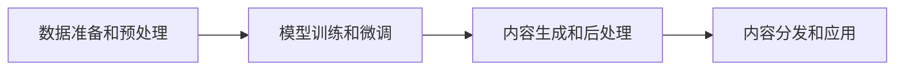

# 人工智能代理在内容创作中的工作流程

## 1. 背景介绍
### 1.1 人工智能代理的发展历程
#### 1.1.1 早期人工智能代理
#### 1.1.2 深度学习时代的人工智能代理
#### 1.1.3 大语言模型与人工智能代理的结合
### 1.2 人工智能代理在内容创作中的应用现状
#### 1.2.1 文本生成领域的应用
#### 1.2.2 图像生成领域的应用  
#### 1.2.3 音视频生成领域的应用
### 1.3 人工智能代理在内容创作中的优势与挑战
#### 1.3.1 人工智能代理的创作效率优势
#### 1.3.2 人工智能代理的个性化创作优势
#### 1.3.3 人工智能代理面临的伦理与版权挑战

## 2. 核心概念与联系
### 2.1 人工智能代理的定义与内涵
#### 2.1.1 人工智能代理的定义
#### 2.1.2 人工智能代理的核心特征
#### 2.1.3 人工智能代理与传统软件的区别
### 2.2 内容创作的定义与流程
#### 2.2.1 内容创作的定义
#### 2.2.2 内容创作的一般流程
#### 2.2.3 不同内容创作领域的特点
### 2.3 人工智能代理与内容创作的关系
#### 2.3.1 人工智能代理作为创作辅助工具
#### 2.3.2 人工智能代理作为创作主体
#### 2.3.3 人工智能代理与人类创作者的协作

## 3. 核心算法原理具体操作步骤
### 3.1 基于深度学习的文本生成算法
#### 3.1.1 Transformer模型原理
#### 3.1.2 GPT系列模型的改进
#### 3.1.3 文本生成的具体操作步骤
### 3.2 基于生成对抗网络的图像生成算法 
#### 3.2.1 GAN模型原理
#### 3.2.2 StyleGAN系列模型的改进
#### 3.2.3 图像生成的具体操作步骤
### 3.3 基于序列到序列模型的音视频生成算法
#### 3.3.1 Seq2Seq模型原理
#### 3.3.2 Tacotron和WaveNet模型的改进
#### 3.3.3 音视频生成的具体操作步骤

## 4. 数学模型和公式详细讲解举例说明
### 4.1 Transformer模型的数学原理
#### 4.1.1 自注意力机制的数学表示
#### 4.1.2 多头注意力的数学表示
#### 4.1.3 残差连接和Layer Normalization的数学表示
### 4.2 GAN模型的数学原理
#### 4.2.1 生成器和判别器的数学表示
#### 4.2.2 对抗损失函数的数学表示 
#### 4.2.3 Wasserstein距离的数学表示
### 4.3 Seq2Seq模型的数学原理
#### 4.3.1 编码器和解码器的数学表示
#### 4.3.2 注意力机制的数学表示
#### 4.3.3 Beam Search算法的数学表示

## 5. 项目实践：代码实例和详细解释说明
### 5.1 使用GPT-3实现文本生成
#### 5.1.1 数据准备和预处理
#### 5.1.2 模型训练和微调
#### 5.1.3 文本生成和后处理
### 5.2 使用StyleGAN实现图像生成
#### 5.2.1 数据准备和预处理
#### 5.2.2 模型训练和微调
#### 5.2.3 图像生成和后处理
### 5.3 使用Tacotron实现语音合成
#### 5.3.1 数据准备和预处理
#### 5.3.2 模型训练和微调 
#### 5.3.3 语音合成和后处理

## 6. 实际应用场景
### 6.1 智能写作助手
#### 6.1.1 自动生成文章大纲和段落
#### 6.1.2 自动校对和润色文章
#### 6.1.3 个性化写作风格模仿
### 6.2 智能设计助手
#### 6.2.1 自动生成海报和Banner
#### 6.2.2 自动生成产品设计图
#### 6.2.3 个性化设计风格模仿
### 6.3 智能配音和视频生成
#### 6.3.1 自动为视频配音
#### 6.3.2 自动生成短视频
#### 6.3.3 个性化配音和视频风格模仿

## 7. 工具和资源推荐
### 7.1 开源的人工智能代理项目
#### 7.1.1 GPT-Neo
#### 7.1.2 Stable Diffusion
#### 7.1.3 Real-Time Voice Cloning
### 7.2 人工智能代理的开发框架
#### 7.2.1 PyTorch
#### 7.2.2 TensorFlow
#### 7.2.3 PaddlePaddle
### 7.3 人工智能代理的数据集资源
#### 7.3.1 Common Crawl
#### 7.3.2 ImageNet
#### 7.3.3 LJ Speech

## 8. 总结：未来发展趋势与挑战
### 8.1 人工智能代理的发展趋势
#### 8.1.1 多模态融合的人工智能代理
#### 8.1.2 更加个性化和交互式的人工智能代理
#### 8.1.3 去中心化的人工智能代理
### 8.2 人工智能代理面临的挑战
#### 8.2.1 算法和模型的创新瓶颈
#### 8.2.2 数据和算力的成本瓶颈
#### 8.2.3 伦理和法律的约束瓶颈
### 8.3 人工智能代理的未来展望
#### 8.3.1 人工智能代理与人类创作者的协同进化
#### 8.3.2 人工智能代理推动内容创作产业变革
#### 8.3.3 人工智能代理赋能全民内容创作

## 9. 附录：常见问题与解答
### 9.1 人工智能代理生成的内容是否有版权？
### 9.2 人工智能代理生成的内容是否有伦理风险？
### 9.3 个人或企业如何构建自己的人工智能代理？

人工智能代理作为一种新兴的内容创作工具和辅助平台，正在得到越来越广泛的应用。人工智能代理利用大数据和深度学习算法，可以高效、快速地生成各种形式的内容，包括文本、图像、音视频等。相比人类创作者，人工智能代理具有创作效率高、成本低、个性化程度高等优势。

人工智能代理在内容创作中的工作流程可以概括为以下几个步骤：

首先是数据准备和预处理阶段，需要收集和清洗大量的高质量数据，进行特征提取和标注，为后续的模型训练做好准备。其次是模型训练和微调阶段，利用预训练的大模型在特定领域的数据上进行微调，提高模型的专业性和适用性。然后是内容生成和后处理阶段，使用训练好的模型生成初始内容，并进行一系列的内容优化和调整，以满足应用需求。最后是内容分发和应用阶段，将生成的内容分发到各个渠道和平台，并应用于实际的场景中。

在技术实现上，人工智能代理主要依赖三类核心算法：基于Transformer的文本生成算法、基于GAN的图像生成算法、基于Seq2Seq的音视频生成算法。以文本生成为例，其核心是自注意力机制和多头注意力机制，可以建模文本序列的长程依赖关系，捕捉词与词之间的关联。数学上可以表示为：

$$
Attention(Q,K,V) = softmax(\frac{QK^T}{\sqrt{d_k}})V
$$

其中，$Q$、$K$、$V$ 分别表示查询向量、键向量、值向量，$d_k$ 为向量维度。

在实践中，可以使用一些开源的人工智能代理项目，如 GPT-Neo、Stable Diffusion 等，利用 PyTorch、TensorFlow 等深度学习框架，在 Common Crawl、ImageNet 等公开数据集上进行训练和测试。经过调优后，这些模型可以生成质量较高的文本、图像等内容。

人工智能代理在智能写作助手、智能设计助手、智能配音等场景中已经得到初步应用，可以大大提高内容创作的效率和质量。但同时，人工智能代理也面临一些挑战，如算法模型创新瓶颈、数据算力成本瓶颈、伦理法律约束瓶颈等。未来，人工智能代理有望与人类创作者形成更加紧密的协同，推动内容创作产业变革，赋能全民内容创作。

当然，在使用人工智能代理的过程中，还有一些常见问题需要注意，如生成内容的版权归属、生成内容的伦理风险等。个人或企业在构建自己的人工智能代理时，需要重点关注数据的版权，以及模型生成内容的可控性。

总之，人工智能代理为内容创作行业带来了新的变革力量，有望极大提升内容生产力，推动内容产业的智能化发展。作为计算机领域的专家，我们要积极拥抱这一技术浪潮，加强人工智能基础理论与应用技术的研究，推动人工智能代理在内容创作中的规范化、普惠化应用。

作者：禅与计算机程序设计艺术 / Zen and the Art of Computer Programming