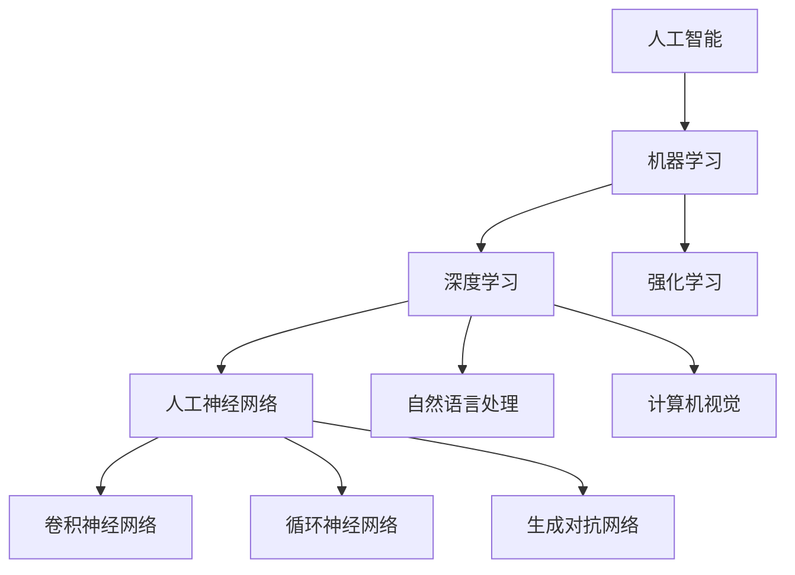

# 人工智能前沿研究热点与发展趋势原理与代码实战案例讲解

## 1.背景介绍

人工智能(Artificial Intelligence, AI)作为当代最具变革性的技术之一,正在推动着各行各业的深刻变革。随着算力的不断提升、数据量的爆炸式增长以及算法的持续创新,人工智能技术正在呈现出前所未有的发展态势。本文将围绕人工智能前沿研究热点和发展趋势,深入探讨其核心概念、算法原理、数学模型,并结合实战案例,为读者提供全面而深入的解析。

### 1.1 人工智能的定义与发展历程

人工智能是一门致力于研究和开发能够模拟人类智能行为的理论、方法、技术与应用系统的学科。它涉及多个领域,包括计算机科学、数学、心理学、语言学、哲学等。人工智能的目标是使机器能够模拟或实现人类的某些智能行为,如感知、学习、推理、规划、问题解决等。

人工智能的发展可以追溯到20世纪40年代,当时一些科学家提出了"智能机器"的构想。1956年,约翰·麦卡锡在达特茅斯学院召开的一次会议上首次提出了"人工智能"这一术语,标志着人工智能作为一个独立学科的正式诞生。

### 1.2 人工智能的重要性与影响

人工智能技术正在深刻影响着我们的生活、工作和社会。它在诸多领域发挥着不可或缺的作用,如计算机视觉、自然语言处理、机器学习、决策支持系统、智能系统等。人工智能技术的应用已经渗透到了金融、医疗、交通、制造、教育、娱乐等各个行业,为我们带来了前所未有的便利和效率提升。

同时,人工智能技术的发展也引发了一些值得关注的伦理和社会问题,如算法偏差、隐私保护、就业影响等,需要我们在追求技术进步的同时,也要正视和解决这些问题。

### 1.3 人工智能发展的驱动力

推动人工智能快速发展的主要驱动力包括:

1. **算力提升**: 计算能力的不断增强,尤其是GPU和TPU等专用硬件的出现,为训练大规模深度神经网络提供了强大的算力支持。
2. **数据爆炸**: 互联网、物联网、移动设备等产生了海量的数据,为机器学习算法提供了丰富的训练资源。
3. **算法创新**: 深度学习、强化学习、迁移学习等算法的不断创新,极大提升了人工智能系统的性能和应用范围。
4. **开源生态**: 开源框架和工具的兴起,如TensorFlow、PyTorch等,降低了人工智能技术的门槛,促进了快速发展。

## 2.核心概念与联系

人工智能是一个庞大而复杂的领域,涉及多个核心概念和技术,这些概念相互关联、相互影响。本节将介绍人工智能的几个核心概念,并阐述它们之间的联系。

### 2.1 机器学习

机器学习(Machine Learning)是人工智能的核心子领域之一,它赋予计算机系统在没有明确编程的情况下,通过学习数据而获取知识或经验的能力。机器学习算法通过分析大量数据,自动捕获数据中蕴含的模式和规律,从而对新数据做出预测或决策。

机器学习可分为三大类:

1. **监督学习**(Supervised Learning):通过学习带有标签的训练数据,建立映射关系,对新数据进行预测或分类。常见算法有线性回归、逻辑回归、决策树、支持向量机等。
2. **无监督学习**(Unsupervised Learning):仅利用未标记的数据,发现数据中隐藏的模式和结构。常见算法有聚类、降维、关联规则挖掘等。
3. **强化学习**(Reinforcement Learning):通过与环境交互,根据获得的奖励或惩罚,不断优化决策策略。常见应用有游戏AI、机器人控制等。

### 2.2 深度学习

深度学习(Deep Learning)是机器学习的一个子领域,它基于对数据的表示学习,使用包含多个隐藏层的人工神经网络模型,对复杂的非线性映射进行建模和学习。深度学习在计算机视觉、自然语言处理、语音识别等领域取得了突破性的进展。

常见的深度学习模型包括:

1. **卷积神经网络**(Convolutional Neural Network, CNN):擅长处理图像和视频数据,在计算机视觉领域有广泛应用。
2. **循环神经网络**(Recurrent Neural Network, RNN):擅长处理序列数据,如文本、语音等,在自然语言处理领域有广泛应用。
3. **生成对抗网络**(Generative Adversarial Network, GAN):由生成器和判别器组成,可用于生成逼真的图像、音频和视频。
4. **transformer**:基于注意力机制的序列到序列模型,在机器翻译、文本生成等任务中表现出色。

深度学习与传统机器学习的区别在于,深度学习能够自动从数据中学习出有意义的特征表示,而无需人工设计特征。

### 2.3 人工神经网络

人工神经网络(Artificial Neural Network, ANN)是一种受生物神经系统启发而设计的计算模型,广泛应用于机器学习和深度学习领域。它由大量互连的节点(神经元)组成,每个节点接收输入信号,经过加权求和和非线性激活函数处理后,产生输出信号。

神经网络的基本结构包括输入层、隐藏层和输出层。通过反向传播算法,神经网络可以自动学习输入和输出之间的映射关系,从而解决复杂的回归、分类或预测问题。

常见的人工神经网络类型包括:

1. **前馈神经网络**(Feedforward Neural Network, FNN)
2. **卷积神经网络**(Convolutional Neural Network, CNN)
3. **循环神经网络**(Recurrent Neural Network, RNN)
4. **长短期记忆网络**(Long Short-Term Memory, LSTM)

人工神经网络是深度学习的核心基础,也是实现机器学习的重要工具。

### 2.4 自然语言处理

自然语言处理(Natural Language Processing, NLP)是人工智能的一个重要分支,旨在使计算机能够理解和生成人类语言。它涉及多个任务,如文本分类、机器翻译、信息抽取、问答系统、文本生成等。

自然语言处理技术包括:

1. **词向量**(Word Embedding):将词语映射到低维连续向量空间,捕捉语义和句法信息。
2. **注意力机制**(Attention Mechanism):允许模型在处理序列数据时,动态关注输入的不同部分。
3. **transformer**:基于注意力机制的序列到序列模型,在机器翻译等任务中表现出色。
4. **BERT**(Bidirectional Encoder Representations from Transformers):一种基于transformer的预训练语言模型,在多项NLP任务中取得了state-of-the-art的性能。

自然语言处理技术在信息检索、智能助手、客户服务、内容生成等领域有着广泛的应用前景。

### 2.5 计算机视觉

计算机视觉(Computer Vision)是人工智能的另一个重要分支,旨在使计算机能够从数字图像或视频中获取有意义的信息,并进行理解和处理。它涉及多个任务,如图像分类、目标检测、语义分割、实例分割、视频分析等。

计算机视觉技术包括:

1. **卷积神经网络**(Convolutional Neural Network, CNN):擅长从图像中提取特征,在图像分类、目标检测等任务中表现出色。
2. **生成对抗网络**(Generative Adversarial Network, GAN):可用于生成逼真的图像,在图像增强、风格迁移等任务中有应用。
3. **目标检测算法**:如YOLO、Faster R-CNN等,能够在图像中准确定位和识别目标物体。
4. **语义分割算法**:如FCN、DeepLab等,能够对图像中的每个像素进行语义分类。

计算机视觉技术在自动驾驶、医疗影像分析、工业缺陷检测、人脸识别等领域有着广泛的应用前景。

### 2.6 核心概念之间的联系

上述核心概念相互关联、相互影响,构成了人工智能技术的基础框架:

- 机器学习是人工智能的核心,深度学习是机器学习的一个重要分支。
- 人工神经网络是实现机器学习和深度学习的关键工具。
- 自然语言处理和计算机视觉是深度学习在不同领域的重要应用,利用了神经网络模型。
- 各个概念和技术相互借鉴和融合,推动了人工智能的快速发展。

总的来说,这些核心概念紧密相连,共同构建了人工智能的理论和技术体系。只有全面掌握和理解这些概念及其联系,才能真正驾驭人工智能技术。

## 3.核心算法原理具体操作步骤

本节将介绍人工智能领域中几种核心算法的原理和具体操作步骤,包括线性回归、逻辑回归、决策树、支持向量机、K-means聚类和主成分分析等。

### 3.1 线性回归

线性回归(Linear Regression)是一种常用的监督学习算法,用于解决回归问题,即预测连续型目标变量的值。它假设目标变量和特征变量之间存在线性关系,并通过最小化误差平方和来估计模型参数。

线性回归算法的具体步骤如下:

1. **收集数据**:获取包含目标变量和特征变量的数据集。
2. **数据预处理**:对数据进行标准化或归一化处理,以消除量纲影响。
3. **定义模型**:根据特征变量的个数,选择简单线性回归或多元线性回归模型。
4. **计算损失函数**:定义均方误差(MSE)作为损失函数。
5. **求解模型参数**:使用最小二乘法或梯度下降法等优化算法,求解模型参数(系数)。
6. **模型评估**:在测试集上计算均方根误差(RMSE)或决定系数(R^2)等指标,评估模型性能。
7. **模型预测**:利用训练好的模型对新数据进行预测。

线性回归算法易于实现和理解,但存在一些限制,如线性假设、异方差性和多重共线性等问题。在实际应用中,需要根据数据特点选择合适的回归模型。

### 3.2 逻辑回归

逻辑回归(Logistic Regression)是一种常用的监督学习算法,用于解决分类问题,即预测离散型目标变量的类别。它通过估计概率值,将实例划分到不同的类别中。

逻辑回归算法的具体步骤如下:

1. **收集数据**:获取包含目标变量(类别标签)和特征变量的数据集。
2. **数据预处理**:对数据进行标准化或归一化处理,以消除量纲影响。
3. **定义模型**:选择二元逻辑回归(用于二分类)或多元逻辑回归(用于多分类)模型。
4. **计算损失函数**:定义交叉熵损失函数。
5. **求解模型参数**:使用梯度下降法等优化算法,求解模型参数(系数)。
6. **模型评估**:在测试集上计算准确率、精确率、召回率、F1分数等指标,评估模型性能。
7. **模型预测**:利用训练好的模型对新数据进行分类预测。

逻辑回归算法易于实现和解释,适用于线性可分的分类问题。但对于