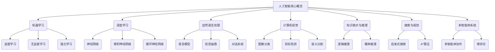

# 人工智能导论原理与代码实战案例讲解

## 1. 背景介绍

人工智能(Artificial Intelligence, AI)是当代最具革命性和颠覆性的技术之一,正在深刻影响着各行各业。随着计算能力的不断提升和大数据时代的到来,人工智能技术得到了前所未有的发展。从语音识别、图像处理到自然语言处理和机器学习等领域,人工智能的应用越来越广泛。

人工智能的核心目标是让机器能够像人一样思考和行动,具备学习、推理、规划和问题解决的能力。为了实现这一目标,研究人员开发了多种算法和技术,包括机器学习、深度学习、知识表示、自然语言处理、计算机视觉等。

### 1.1 人工智能的发展历程

人工智能的概念可以追溯到20世纪40年代,当时一些先驱者提出了"智能机器"的设想。1956年,约翰·麦卡锡在达特茅斯学院举办的研讨会上首次使用了"人工智能"这个术语,标志着人工智能作为一个独立的研究领域正式诞生。

人工智能的发展经历了几个重要阶段:

1. 早期阶段(1950s-1960s):专家系统、逻辑推理、游戏等领域取得了一些初步成果。
2. 知识工程时期(1970s-1980s):发展了知识表示和推理技术,如语义网络、框架理论等。
3. 机器学习时期(1980s-1990s):提出了多种机器学习算法,如决策树、支持向量机等。
4. 深度学习时期(1990s-至今):借助大数据和强大的计算能力,深度学习技术取得了突破性进展。

### 1.2 人工智能的重要分支

人工智能是一个庞大的领域,包含多个重要的分支:

- **机器学习(Machine Learning)**:让计算机从数据中自动分析获得规律,并对新数据做出预测。
- **深度学习(Deep Learning)**:基于人工神经网络的一种机器学习技术,可以自动从数据中学习特征表示。
- **计算机视觉(Computer Vision)**:赋予计算机识别和理解数字图像或视频的能力。
- **自然语言处理(Natural Language Processing)**:使计算机能够理解和生成人类语言。
- **机器人技术(Robotics)**:研究智能机器人系统的设计、制造和应用。
- **专家系统(Expert Systems)**:将人类专家的知识和推理过程编码到计算机程序中。

这些分支相互关联、相互渗透,共同推动着人工智能技术的发展。

## 2. 核心概念与联系

人工智能涉及多个核心概念,这些概念相互关联、相互影响,构成了人工智能技术的理论基础。

### 2.1 机器学习

机器学习是人工智能的核心,旨在让计算机从数据中自动学习模型,并对新数据做出预测或决策。机器学习包括以下几种主要类型:

- **监督学习(Supervised Learning)**:使用带有标签的训练数据,学习一个从输入到输出的映射函数。常见算法有线性回归、逻辑回归、决策树、支持向量机等。
- **无监督学习(Unsupervised Learning)**:从未标记的数据中发现隐藏的模式或结构。常见算法有聚类算法(K-Means等)、降维算法(PCA等)。
- **强化学习(Reinforcement Learning)**:通过与环境的交互,智能体不断尝试不同的行为,获得奖励或惩罚,从而学习最优策略。常见算法有Q-Learning、策略梯度等。

### 2.2 深度学习

深度学习是机器学习的一个子领域,基于人工神经网络,能够自动从数据中学习多层次的特征表示。常见的深度学习模型包括:

- **前馈神经网络(Feedforward Neural Networks)**:最基本的神经网络,由输入层、隐藏层和输出层组成。
- **卷积神经网络(Convolutional Neural Networks, CNN)**:在计算机视觉领域表现出色,能够自动学习图像的特征。
- **循环神经网络(Recurrent Neural Networks, RNN)**:擅长处理序列数据,如自然语言、语音、时间序列等。
- **长短期记忆网络(Long Short-Term Memory, LSTM)**:一种特殊的RNN,能够更好地捕捉长期依赖关系。
- **注意力机制(Attention Mechanism)**:允许神经网络专注于输入的关键部分,在机器翻译、阅读理解等任务中表现出色。

### 2.3 自然语言处理

自然语言处理(Natural Language Processing, NLP)是人工智能的一个重要分支,旨在让计算机能够理解和生成人类语言。常见的NLP任务包括:

- **语言模型(Language Modeling)**:学习语言的概率分布,用于文本生成、机器翻译等。
- **信息抽取(Information Extraction)**:从非结构化文本中提取结构化信息,如命名实体识别、关系抽取等。
- **对话系统(Dialogue Systems)**:构建能够与人自然交互的智能对话系统。
- **情感分析(Sentiment Analysis)**:识别文本中的主观情感,如正面、负面等。
- **文本摘要(Text Summarization)**:自动生成文本的摘要。

### 2.4 计算机视觉

计算机视觉(Computer Vision)是人工智能的另一个重要分支,旨在赋予计算机识别和理解数字图像或视频的能力。常见的计算机视觉任务包括:

- **图像分类(Image Classification)**:将图像归类到预定义的类别中。
- **目标检测(Object Detection)**:在图像中定位并识别出感兴趣的目标。
- **语义分割(Semantic Segmentation)**:对图像中的每个像素进行分类,将图像分割成不同的语义区域。
- **实例分割(Instance Segmentation)**:在语义分割的基础上,进一步区分同一类别的不同实例。
- **视频分析(Video Analysis)**:分析视频中的运动、行为、事件等。

### 2.5 知识表示与推理

知识表示与推理(Knowledge Representation and Reasoning)是人工智能的基础,旨在模拟人类的知识和推理过程。常见的知识表示方法包括:

- **逻辑表示(Logic Representation)**:使用一阶逻辑、描述逻辑等形式化语言表示知识。
- **概率表示(Probabilistic Representation)**:使用贝叶斯网络、马尔可夫网络等表示不确定知识。
- **语义网络(Semantic Networks)**:使用节点和边表示概念及其关系。
- **框架理论(Frame Theory)**:使用框架(Frame)表示对象及其属性和行为。

推理是基于知识表示进行推导的过程,包括逻辑推理(如前向链接、反向链接)和概率推理(如贝叶斯推理)等。

### 2.6 搜索与规划

搜索与规划(Search and Planning)是人工智能中解决问题的重要方法。搜索是在一个问题空间中寻找解决方案的过程,常见的搜索算法包括:

- **启发式搜索(Heuristic Search)**:使用评估函数(启发式函数)来估计当前状态到目标状态的距离,如A*算法、IDA*算法等。
- **局部搜索(Local Search)**:从一个初始状态开始,不断尝试邻域中的状态,直到找到满意的解,如爬山算法、模拟退火算法等。

规划是为了达成目标而制定行动序列的过程,常见的规划算法包括:

- **状态空间规划(State-Space Planning)**:在状态空间中搜索到达目标状态的路径。
- **层次任务网络规划(Hierarchical Task Network Planning)**:将复杂任务分解为子任务,递归地规划和执行子任务。

### 2.7 多智能体系统

多智能体系统(Multi-Agent Systems)是指由多个智能体组成的系统,智能体之间可以相互协作或竞争。常见的多智能体系统包括:

- **多智能体协作(Multi-Agent Cooperation)**:多个智能体通过协调和合作来完成共同目标。
- **分布式约束优化(Distributed Constraint Optimization)**:在分布式环境下解决约束优化问题。
- **博弈论(Game Theory)**:研究智能体在竞争和对抗环境下的行为策略。

多智能体系统广泛应用于机器人系统、交通控制、供应链管理等领域。

## 3. 核心算法原理具体操作步骤

在人工智能领域,有许多核心算法和技术,本节将介绍其中几种最常见和最重要的算法原理及具体操作步骤。

### 3.1 线性回归

线性回归是一种基本的监督学习算法,用于预测连续值的目标变量。它假设目标变量和特征之间存在线性关系,并尝试找到最佳拟合直线。

线性回归算法的具体步骤如下:

1. **收集数据**:收集包含目标变量和特征的数据集。
2. **数据预处理**:对数据进行标准化或归一化,处理缺失值等。
3. **定义代价函数**:通常使用均方误差(MSE)作为代价函数。
4. **求解模型参数**:使用最小二乘法或梯度下降法求解模型参数(权重和偏置)。
5. **评估模型**:在测试集上评估模型的性能,如均方根误差(RMSE)等指标。
6. **模型调整**:根据评估结果,可以尝试特征工程、正则化等方法来改进模型。

线性回归虽然简单,但在许多实际问题中仍然有效,并且可作为更复杂模型的基础。

### 3.2 逻辑回归

逻辑回归是一种用于分类任务的监督学习算法,它可以预测二分类或多分类问题的概率输出。

逻辑回归算法的具体步骤如下:

1. **收集数据**:收集包含类别标签和特征的数据集。
2. **数据预处理**:对数据进行编码(如one-hot编码)、标准化等预处理。
3. **定义代价函数**:通常使用对数似然函数作为代价函数。
4. **求解模型参数**:使用梯度下降法或其他优化算法求解模型参数。
5. **评估模型**:在测试集上评估模型的性能,如准确率、精确率、召回率等指标。
6. **模型调整**:根据评估结果,可以尝试特征工程、正则化等方法来改进模型。

逻辑回归算法的核心思想是通过sigmoid函数将线性模型的输出映射到(0,1)区间,从而表示概率值。它广泛应用于二分类问题,如垃圾邮件检测、疾病诊断等。

### 3.3 决策树

决策树是一种基于树形结构的监督学习算法,可用于分类和回归任务。它通过递归地划分特征空间,将数据划分为更小的子集,从而构建一棵决策树。

构建决策树的具体步骤如下:

1. **收集数据**:收集包含目标变量和特征的数据集。
2. **计算信息增益或信息增益比**:对于每个特征,计算其信息增益或信息增益比,选择最佳特征作为根节点。
3. **递归构建决策树**:对于根节点的每个分支,重复步骤2,构建子树。
4. **决策树剪枝**:为了防止过拟合