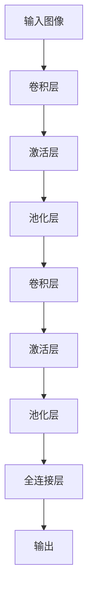
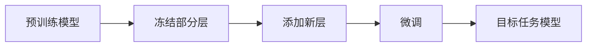

# 从零开始大模型开发与微调：CIFAR-10数据集简介

## 1.背景介绍

### 1.1 人工智能与深度学习的发展

近年来,人工智能(AI)和深度学习(Deep Learning)技术取得了长足的进步,在计算机视觉、自然语言处理、语音识别等领域展现出了令人惊叹的能力。这些进展很大程度上归功于大规模数据集的可用性、算力的飞速增长以及深度神经网络模型的创新。

### 1.2 大模型在AI领域的重要性

在这一背景下,训练大型神经网络模型(通常称为"大模型")已成为深度学习研究和应用的重点领域。大模型通过包含数十亿甚至数万亿参数,能够从海量数据中学习丰富的模式和表示,从而在各种任务上展现出强大的泛化能力。

### 1.3 CIFAR-10数据集介绍  

CIFAR-10是一个广为人知的小型计算机视觉数据集,由60,000张32x32像素的彩色图像组成,分为10个类别:飞机、汽车、鸟类、猫、鹿、狗、青蛙、马、船和卡车。尽管规模较小,但CIFAR-10因其多样性和挑战性而被广泛用作深度学习模型的基准测试数据集。

## 2.核心概念与联系

### 2.1 卷积神经网络

卷积神经网络(Convolutional Neural Networks, CNNs)是深度学习中处理图像数据的核心模型。它通过交替使用卷积层和池化层来提取图像的局部特征,最终将这些特征组合以进行分类或其他任务。



### 2.2 迁移学习与微调

迁移学习(Transfer Learning)是一种利用在大型数据集上预训练的模型,将学习到的知识迁移到新任务上的技术。通过对预训练模型进行微调(Fine-tuning),可以在新任务的数据集上进行进一步训练,从而获得更好的性能。



### 2.3 数据增广

数据增广(Data Augmentation)是一种通过对现有数据应用一系列变换(如旋转、缩放、翻转等)来人工扩充训练数据集的技术。这有助于提高模型的泛化能力,防止过拟合。

## 3.核心算法原理具体操作步骤  

在CIFAR-10数据集上训练大型CNN模型并进行微调的过程可分为以下几个主要步骤:

### 3.1 数据预处理

1. 将CIFAR-10数据集加载到内存中,并将其划分为训练集、验证集和测试集。
2. 对图像数据进行标准化,使像素值在0到1之间。
3. 应用数据增广技术(如随机翻转、裁剪和颜色抖动)来扩充训练数据。

### 3.2 模型构建

1. 选择一个适当的预训练模型作为基础,如ResNet、VGGNet或Inception等。
2. 根据需要对模型进行修改,如添加或删除层、调整超参数等。
3. 设置模型的最后一层,使其与CIFAR-10的10个类别相匹配。

### 3.3 模型训练

1. 定义损失函数(如交叉熵损失)和优化器(如SGD或Adam)。
2. 将预训练模型的部分层冻结,仅对最后几层进行训练。
3. 在训练集上进行若干个epoch的训练,并使用验证集监控模型性能。
4. 根据需要调整超参数,如学习率、批量大小等。

### 3.4 模型微调

1. 解冻更多层或全部层,使整个模型可训练。
2. 继续在训练集上进行训练,同时降低学习率。
3. 监控验证集上的性能,防止过拟合。

### 3.5 模型评估

1. 在测试集上评估最终模型的性能。
2. 计算相关指标,如准确率、精确率、召回率等。
3. 可视化一些预测结果,分析模型的优缺点。

## 4.数学模型和公式详细讲解举例说明

### 4.1 卷积运算

卷积运算是CNN中的核心操作,用于提取图像的局部特征。给定一个输入图像 $I$ 和一个卷积核 $K$,卷积运算可以表示为:

$$
(I * K)(i, j) = \sum_{m} \sum_{n} I(i+m, j+n)K(m, n)
$$

其中 $i$ 和 $j$ 是输出特征图的坐标, $m$ 和 $n$ 是卷积核的坐标。卷积运算通过在输入图像上滑动卷积核,计算元素级乘积的加权和来提取局部特征。

### 4.2 池化运算

池化运算用于降低特征图的空间维度,从而减少计算量和参数数量。最常见的池化方式是最大池化(Max Pooling),它从输入特征图的一个小窗口中选取最大值作为输出:

$$
\text{max\_pool}(X)_{i,j} = \max_{m=0,\dots,k-1 \\ n=0,\dots,k-1} X_{i+m,j+n}
$$

其中 $k$ 是池化窗口的大小。

### 4.3 softmax函数与交叉熵损失

在分类任务中,softmax函数用于将神经网络的输出转换为概率分布:

$$
\text{softmax}(x_i) = \frac{e^{x_i}}{\sum_{j=1}^{C} e^{x_j}}
$$

其中 $C$ 是类别数量。

交叉熵损失则用于衡量预测概率分布与真实标签之间的差异:

$$
\text{loss} = -\sum_{i=1}^{C} y_i \log(p_i)
$$

其中 $y_i$ 是真实标签的one-hot编码, $p_i$ 是预测的概率分布。

## 5.项目实践:代码实例和详细解释说明

以下是使用PyTorch框架在CIFAR-10数据集上训练ResNet-18模型并进行微调的示例代码:

```python
import torch
import torchvision
import torchvision.transforms as transforms

# 数据预处理
transform = transforms.Compose([
    transforms.RandomHorizontalFlip(),
    transforms.RandomCrop(32, padding=4),
    transforms.ToTensor(),
    transforms.Normalize((0.4914, 0.4822, 0.4465), (0.2023, 0.1994, 0.2010))
])

trainset = torchvision.datasets.CIFAR10(root='./data', train=True, download=True, transform=transform)
trainloader = torch.utils.data.DataLoader(trainset, batch_size=128, shuffle=True)

testset = torchvision.datasets.CIFAR10(root='./data', train=False, download=True, transform=transform)
testloader = torch.utils.data.DataLoader(testset, batch_size=128, shuffle=False)

# 模型构建
import torchvision.models as models
model = models.resnet18(pretrained=True)
num_ftrs = model.fc.in_features
model.fc = torch.nn.Linear(num_ftrs, 10)

# 模型训练
criterion = torch.nn.CrossEntropyLoss()
optimizer = torch.optim.SGD(model.parameters(), lr=0.001, momentum=0.9)

for epoch in range(10):
    running_loss = 0.0
    for inputs, labels in trainloader:
        optimizer.zero_grad()
        outputs = model(inputs)
        loss = criterion(outputs, labels)
        loss.backward()
        optimizer.step()
        running_loss += loss.item()
    print(f'Epoch {epoch+1} loss: {running_loss / len(trainloader)}')

# 模型评估
correct = 0
total = 0
with torch.no_grad():
    for inputs, labels in testloader:
        outputs = model(inputs)
        _, predicted = torch.max(outputs.data, 1)
        total += labels.size(0)
        correct += (predicted == labels).sum().item()

print(f'Accuracy on test set: {100 * correct / total}%')
```

上述代码首先对CIFAR-10数据集进行预处理,包括随机翻转、随机裁剪和标准化。然后,它从PyTorch的`torchvision.models`模块加载预训练的ResNet-18模型,并将最后一层替换为10个输出类别的全连接层。

在训练阶段,代码使用交叉熵损失函数和SGD优化器,在训练集上进行10个epoch的训练。每个epoch结束后,它会打印当前epoch的平均损失值。

最后,代码在测试集上评估模型的性能,并打印准确率。

## 6.实际应用场景

CIFAR-10数据集虽然规模较小,但由于其多样性和挑战性,它在以下场景中得到了广泛应用:

1. **模型开发和调试**: CIFAR-10常被用作开发和测试新的CNN架构、优化算法和训练技术的基准数据集。由于其计算成本较低,便于快速迭代和实验。

2. **迁移学习**: 在CIFAR-10上训练的模型可以作为预训练模型,将其知识迁移到其他计算机视觉任务上,如物体检测、语义分割等。

3. **教学和研究**: CIFAR-10的简单性和多样性使其成为深度学习课程和研究项目中的理想数据集,便于说明各种概念和技术。

4. **模型压缩和加速**:研究人员使用CIFAR-10来评估模型压缩和加速技术(如剪枝、量化等)对模型精度和性能的影响。

5. **数据增广技术**: CIFAR-10的有限数据量使其成为测试数据增广技术效果的良好选择。

虽然CIFAR-10本身的应用场景有限,但在这些领域的研究成果可以推广到更大规模、更复杂的计算机视觉任务中。

## 7.工具和资源推荐

在处理CIFAR-10数据集和开发相关模型时,以下工具和资源可能会非常有用:

1. **深度学习框架**: PyTorch、TensorFlow、Keras等主流深度学习框架都提供了加载和预处理CIFAR-10数据集的工具,以及各种预训练模型和优化算法。

2. **开源代码库**: GitHub上有许多开源项目专门针对CIFAR-10数据集,包括模型实现、训练脚本、可视化工具等。

3. **在线资源**: CIFAR-10数据集的官方网站(https://www.cs.toronto.edu/~kriz/cifar.html)提供了数据集的详细说明和相关论文。此外,还有许多博客文章、教程和视频资源介绍了如何使用CIFAR-10进行深度学习实践。

4. **云GPU服务**:如果本地GPU资源有限,可以考虑使用云GPU服务(如Google Colab、AWS EC2等)来训练模型,这些服务通常提供免费的入门资源。

5. **模型可视化工具**: Tensorboard、Weights & Biases等工具可用于可视化模型的训练过程、损失曲线、权重分布等,有助于调试和优化模型。

6. **数据增广库**: Albumentations、imgaug等Python库专门用于图像数据增广,可以为CIFAR-10数据集生成丰富的变换。

7. **模型评估指标**: scikit-learn、TensorFlow等库提供了各种分类评估指标的计算函数,如准确率、精确率、召回率、F1分数等。

利用这些工具和资源,可以更高效地开发和优化CIFAR-10模型,并将所学知识应用到更复杂的计算机视觉任务中。

## 8.总结:未来发展趋势与挑战

尽管CIFAR-10数据集规模有限,但其在深度学习研究和教学中扮演着重要角色。未来,随着计算能力的不断提高和新算法的涌现,我们可以预期以下发展趋势和挑战:

1. **更大规模的数据集**: 随着数据采集和存储能力的提高,我们将看到更大规模、更多样化的图像数据集出现,这将推动模型规模和性能的进一步提升。

2. **自监督学习**: 由于标注数据的成本高昂,自监督学习(Self-Supervised Learning)将成为一个重要的研究方向,旨在从未标注的数据中学习有用的表示。

3. **多任务学习**: 未来的模型