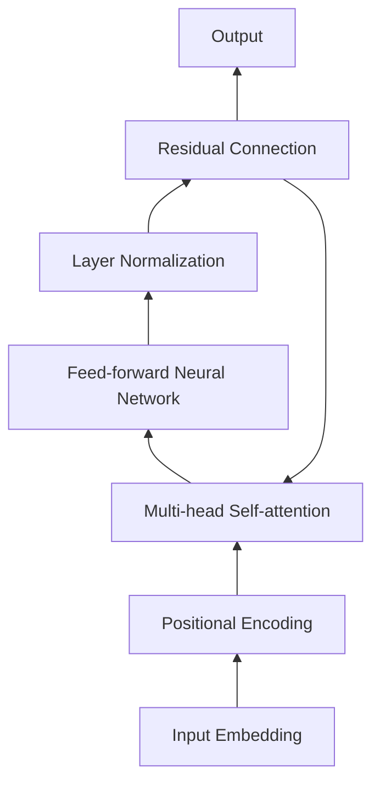

# 从零开始大模型开发与微调：从零开始学习自然语言处理的编码器

## 1. 背景介绍
### 1.1 大语言模型的兴起
近年来,随着深度学习技术的飞速发展,自然语言处理(NLP)领域取得了突破性的进展。其中,大语言模型(Large Language Model,LLM)的出现,更是掀起了NLP领域的一场革命。从GPT系列到BERT,再到最新的GPT-4,LLM展现出了惊人的语言理解和生成能力,在机器翻译、对话系统、文本摘要等诸多任务上取得了超越人类的表现。

### 1.2 预训练与微调范式
LLM的成功很大程度上得益于预训练(Pre-training)和微调(Fine-tuning)范式的广泛应用。预训练是指在海量无标注语料上,以自监督学习的方式训练一个通用的语言模型。这个模型学习到了丰富的语言知识和模式。而微调则是在下游任务的标注数据上,通过监督学习的方式对预训练模型进行针对性的调优,使其适应特定任务。这种范式大大降低了任务特定模型的训练成本,同时显著提升了模型性能。

### 1.3 编码器的重要性
在大模型的架构中,编码器(Encoder)扮演着至关重要的角色。编码器负责将输入的文本序列映射为一个语义丰富的向量表示,捕捉词与词、句与句之间的关联和上下文信息。高质量的编码器输出是大模型取得优异表现的基础。因此,深入理解编码器的原理和构建方法,对于开发和优化大模型至关重要。

## 2. 核心概念与联系
### 2.1 Transformer 架构
Transformer是当前大模型的主流架构选择。它摒弃了此前流行的循环神经网络(RNN)和卷积神经网络(CNN),而是完全基于注意力机制(Attention Mechanism)来建模序列数据。Transformer 的核心组件包括:

- 多头自注意力(Multi-head Self-attention):允许模型在不同的表示子空间中,捕捉序列内部的依赖关系。
- 前馈神经网络(Feed-forward Neural Network):对自注意力的输出进行非线性变换,增强模型的表达能力。
- 残差连接(Residual Connection)和层归一化(Layer Normalization):促进梯度的流动,加速模型训练。

### 2.2 位置编码
由于 Transformer 不包含任何循环或卷积结构,为了让模型感知序列的顺序信息,我们需要在输入嵌入(Input Embedding)中融入位置编码(Positional Encoding)。常见的位置编码方式有:

- 正弦/余弦位置编码(Sinusoidal Positional Encoding):利用正弦和余弦函数的周期性,编码绝对位置信息。
- 可学习的位置编码(Learnable Positional Encoding):将位置编码参数化为可学习的向量,让模型自适应地调整。

### 2.3 自注意力机制
自注意力是 Transformer 的核心,它让模型能够在序列的不同位置之间建立直接的依赖关系。对于序列中的每个位置,自注意力计算其与其他所有位置的相似度,然后基于相似度对这些位置的表示进行加权求和,得到该位置的新表示。

计算自注意力的步骤如下:

1. 将输入序列映射为三个矩阵:查询矩阵(Query Matrix)、键矩阵(Key Matrix)和值矩阵(Value Matrix)。
2. 计算查询矩阵和键矩阵的点积,得到注意力分数(Attention Scores)。
3. 对注意力分数进行缩放(Scaling)和 softmax 归一化,得到注意力权重(Attention Weights)。
4. 将注意力权重与值矩阵相乘,得到加权求和的结果。

多头自注意力则是将上述过程独立重复多次,然后将不同头的输出拼接起来,经过线性变换得到最终的表示。

下图展示了 Transformer 编码器的整体架构,以及各个组件之间的联系:



## 3. 核心算法原理具体操作步骤
### 3.1 Transformer 编码器的前向传播
Transformer 编码器的前向传播过程可以分为以下步骤:

1. 输入嵌入:将输入序列中的每个token映射为一个稠密向量。
2. 位置编码:将位置编码向量与输入嵌入相加,引入位置信息。
3. 多头自注意力:
   - 将输入序列映射为查询矩阵 $Q$、键矩阵 $K$ 和值矩阵 $V$。
   - 计算注意力分数:$Score = \frac{QK^T}{\sqrt{d_k}}$,其中 $d_k$ 为键向量的维度。
   - 对注意力分数应用 softmax 函数,得到注意力权重:$Weights = softmax(Score)$。
   - 将注意力权重与值矩阵相乘,得到加权求和结果:$Output = Weights \cdot V$。
   - 将多头注意力的输出拼接,并经过线性变换得到最终表示。
4. 前馈神经网络:对多头自注意力的输出应用两层前馈神经网络,增强非线性表达能力。
5. 残差连接和层归一化:将前馈神经网络的输出与输入相加,然后应用层归一化。
6. 重复步骤3-5多次,得到 Transformer 编码器的最终输出。

### 3.2 预训练目标
常见的预训练目标包括:

- 语言模型:预测下一个单词或遮罩单词。代表模型有GPT系列。
- 去噪自编码:随机遮罩输入序列的一部分,然后预测被遮罩的单词。代表模型有BERT。
- 对比学习:最大化正样本对的相似度,最小化负样本对的相似度。代表模型有CLIP、SimCSE等。

### 3.3 微调策略
在下游任务上微调预训练模型时,常用的策略包括:

- 特定任务输出层:在预训练模型顶部添加特定于任务的输出层,如分类层、序列标注层等。
- 参数冻结:冻结部分预训练模型参数,只微调顶层或特定的几层。这有助于防止过拟合。
- 学习率调度:使用更小的学习率和更少的训练epochs,避免破坏预训练的权重。
- 数据增强:应用任务特定的数据增强技术,如回译、同义词替换等,增加训练样本的多样性。

## 4. 数学模型和公式详细讲解举例说明
### 4.1 自注意力的数学表达
给定一个长度为 $n$ 的输入序列 $X \in \mathbb{R}^{n \times d}$,自注意力的计算过程可以表示为:

$$
\begin{aligned}
Q &= XW_Q \\
K &= XW_K \\
V &= XW_V \\
Score &= \frac{QK^T}{\sqrt{d_k}} \\
Weights &= softmax(Score) \\
Output &= Weights \cdot V
\end{aligned}
$$

其中,$W_Q, W_K, W_V \in \mathbb{R}^{d \times d_k}$ 是可学习的权重矩阵,$d_k$ 是查询/键/值向量的维度。

例如,假设我们有一个输入序列 $X$:

$$
X = 
\begin{bmatrix}
0.1 & 0.2 & 0.3 \\
0.4 & 0.5 & 0.6 \\
0.7 & 0.8 & 0.9
\end{bmatrix}
$$

假设 $W_Q, W_K, W_V$ 都是单位矩阵,则自注意力的计算过程如下:

$$
Q = K = V = X \\
Score = \frac{XX^T}{\sqrt{3}} = 
\begin{bmatrix}
0.67 & 1.00 & 1.33 \\
1.00 & 1.50 & 2.00 \\
1.33 & 2.00 & 2.67
\end{bmatrix} \\
Weights = softmax(Score) = 
\begin{bmatrix}
0.09 & 0.24 & 0.67 \\
0.09 & 0.24 & 0.67 \\
0.09 & 0.24 & 0.67
\end{bmatrix} \\
Output = Weights \cdot X = 
\begin{bmatrix}
0.42 & 0.52 & 0.62 \\
0.42 & 0.52 & 0.62 \\
0.42 & 0.52 & 0.62
\end{bmatrix}
$$

可以看到,自注意力根据输入序列中不同位置之间的相关性,对原始表示进行了加权聚合,得到了新的表示。

### 4.2 位置编码的数学表达
正弦/余弦位置编码可以表示为:

$$
\begin{aligned}
PE_{(pos,2i)} &= sin(pos / 10000^{2i/d}) \\
PE_{(pos,2i+1)} &= cos(pos / 10000^{2i/d})
\end{aligned}
$$

其中,$pos$ 是位置索引,$i$ 是维度索引,$d$ 是嵌入维度。

例如,假设嵌入维度 $d=4$,则位置编码矩阵为:

$$
PE = 
\begin{bmatrix}
sin(0/10000^{0/4}) & cos(0/10000^{0/4}) & sin(0/10000^{2/4}) & cos(0/10000^{2/4}) \\
sin(1/10000^{0/4}) & cos(1/10000^{0/4}) & sin(1/10000^{2/4}) & cos(1/10000^{2/4}) \\
sin(2/10000^{0/4}) & cos(2/10000^{0/4}) & sin(2/10000^{2/4}) & cos(2/10000^{2/4}) \\
\vdots & \vdots & \vdots & \vdots \\
sin(n/10000^{0/4}) & cos(n/10000^{0/4}) & sin(n/10000^{2/4}) & cos(n/10000^{2/4})
\end{bmatrix}
$$

将位置编码与输入嵌入相加,可以为 Transformer 编码器提供序列的位置信息。

## 5. 项目实践:代码实例和详细解释说明
下面我们使用 PyTorch 实现一个简单的 Transformer 编码器。

```python
import torch
import torch.nn as nn
import math

class PositionalEncoding(nn.Module):
    def __init__(self, d_model, max_len=5000):
        super(PositionalEncoding, self).__init__()
        pe = torch.zeros(max_len, d_model)
        position = torch.arange(0, max_len, dtype=torch.float).unsqueeze(1)
        div_term = torch.exp(torch.arange(0, d_model, 2).float() * (-math.log(10000.0) / d_model))
        pe[:, 0::2] = torch.sin(position * div_term)
        pe[:, 1::2] = torch.cos(position * div_term)
        pe = pe.unsqueeze(0).transpose(0, 1)
        self.register_buffer('pe', pe)

    def forward(self, x):
        x = x + self.pe[:x.size(0), :]
        return x

class TransformerEncoder(nn.Module):
    def __init__(self, d_model, nhead, dim_feedforward, num_layers, dropout=0.1):
        super(TransformerEncoder, self).__init__()
        self.pos_encoder = PositionalEncoding(d_model)
        encoder_layer = nn.TransformerEncoderLayer(d_model, nhead, dim_feedforward, dropout)
        self.transformer_encoder = nn.TransformerEncoder(encoder_layer, num_layers)

    def forward(self, src):
        src = self.pos_encoder(src)
        output = self.transformer_encoder(src)
        return output
```

代码解释:

1. `PositionalEncoding` 类实现了正弦/余弦位置编码。它接受两个参数:嵌入维度 `d_model` 和最大序列长度 `max_len`。在前向传播中,它将位置编码与输入嵌入相加。

2. `TransformerEncoder` 类实现了 Transformer 编码器。它接受以下参数:
   - `d_model`:嵌入维度
   - `nhead`:自注意力头数
   - `dim_feedforward`:前馈神经网络的隐藏层维度
   - `num_layers`:编码器层数
   - `dropout`:dropout 概率

3. 在 `TransformerEncoder` 的前向传播中