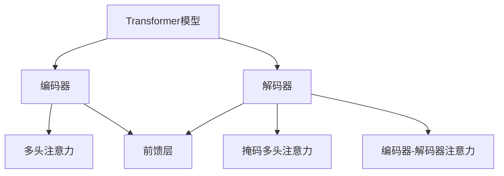
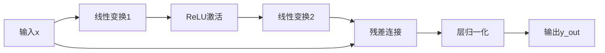

# 从零开始大模型开发与微调：前馈层的实现

## 1.背景介绍

随着深度学习的快速发展,大型神经网络模型在自然语言处理、计算机视觉等领域展现出了卓越的性能。其中,Transformer模型因其强大的并行计算能力和长期依赖建模能力,成为了构建大型语言模型的主流选择。前馈层作为Transformer的核心组成部分,在整个模型的性能中扮演着重要角色。

本文将全面探讨前馈层的原理、实现细节和优化技巧,为读者提供从零开发大型语言模型所需的关键知识。无论您是深度学习初学者还是经验丰富的从业者,都将从本文中获益良多。

## 2.核心概念与联系

### 2.1 Transformer模型概述

Transformer是一种全新的基于注意力机制的序列到序列模型,由编码器(Encoder)和解码器(Decoder)组成。它不再依赖于循环神经网络(RNN)和卷积神经网络(CNN),而是完全基于注意力机制来捕获输入序列中的长期依赖关系。

Transformer的编码器由多个相同的层组成,每层包含两个子层:多头注意力机制(Multi-Head Attention)和前馈层(Feed-Forward Layer)。解码器的结构与编码器类似,但在多头注意力机制之后还增加了一个编码器-解码器注意力子层。



### 2.2 前馈层在Transformer中的作用

前馈层位于Transformer的每一个编码器层和解码器层中,它对来自前一子层的输出进行非线性映射,增强了模型的表达能力。具体来说,前馈层的作用包括:

1. **特征转换**: 通过两个线性变换和一个非线性激活函数,对输入特征进行非线性映射,提取更高级的特征表示。

2. **信息融合**: 将不同位置的信息进行融合,捕获更广泛的上下文依赖关系。

3. **模型容量扩展**: 增加了模型的参数量,扩展了模型的容量,有助于处理更复杂的任务。

前馈层的设计使Transformer模型能够有效地建模长期依赖关系,并在各种自然语言处理任务中取得了卓越的性能。

## 3.核心算法原理具体操作步骤

前馈层的核心思想是对输入进行两次线性变换,中间使用一个非线性激活函数,从而实现对输入特征的非线性映射。具体来说,前馈层的计算过程如下:

1. 输入 $\boldsymbol{x} \in \mathbb{R}^{d_\text{model}}$ 通过第一个线性变换映射到高维空间:

$$\boldsymbol{y} = \boldsymbol{W}_1 \boldsymbol{x} + \boldsymbol{b}_1$$

其中 $\boldsymbol{W}_1 \in \mathbb{R}^{d_\text{ff} \times d_\text{model}}$ 为权重矩阵, $\boldsymbol{b}_1 \in \mathbb{R}^{d_\text{ff}}$ 为偏置向量, $d_\text{ff}$ 为前馈层的隐藏维度。

2. 对线性变换的输出 $\boldsymbol{y}$ 应用非线性激活函数 $\text{ReLU}$:

$$\boldsymbol{z} = \text{ReLU}(\boldsymbol{y})$$

3. 将 $\boldsymbol{z}$ 通过第二个线性变换映射回模型维度 $d_\text{model}$:

$$\boldsymbol{o} = \boldsymbol{W}_2 \boldsymbol{z} + \boldsymbol{b}_2$$

其中 $\boldsymbol{W}_2 \in \mathbb{R}^{d_\text{model} \times d_\text{ff}}$ 为权重矩阵, $\boldsymbol{b}_2 \in \mathbb{R}^{d_\text{model}}$ 为偏置向量。

4. 最后,将前馈层的输出 $\boldsymbol{o}$ 与输入 $\boldsymbol{x}$ 相加,并通过残差连接和层归一化操作,得到前馈层的最终输出 $\boldsymbol{y}_\text{out}$:

$$\boldsymbol{y}_\text{out} = \text{LayerNorm}(\boldsymbol{x} + \boldsymbol{o})$$

其中 $\text{LayerNorm}$ 表示层归一化操作,用于稳定训练过程。

前馈层的计算过程可以用以下 Mermaid 流程图表示:



通过上述步骤,前馈层实现了对输入特征的非线性映射,增强了模型的表达能力。同时,残差连接和层归一化操作有助于训练的稳定性和收敛性。

## 4.数学模型和公式详细讲解举例说明

在前一节中,我们介绍了前馈层的核心算法原理。现在,让我们通过一个具体的数值示例来深入理解前馈层的数学模型和公式。

假设输入 $\boldsymbol{x} = [0.1, 0.2, 0.3]^\top \in \mathbb{R}^3$,模型维度 $d_\text{model} = 3$,前馈层的隐藏维度 $d_\text{ff} = 4$。我们将使用以下随机初始化的权重矩阵和偏置向量:

$$
\boldsymbol{W}_1 = \begin{bmatrix}
    0.1 & 0.2 & 0.3 \\
    0.4 & 0.5 & 0.6 \\
    0.7 & 0.8 & 0.9 \\
    1.0 & 1.1 & 1.2
\end{bmatrix}, \quad
\boldsymbol{b}_1 = \begin{bmatrix}
    0.1 \\
    0.2 \\
    0.3 \\
    0.4
\end{bmatrix}
$$

$$
\boldsymbol{W}_2 = \begin{bmatrix}
    0.1 & 0.2 & 0.3 & 0.4 \\
    0.5 & 0.6 & 0.7 & 0.8 \\
    0.9 & 1.0 & 1.1 & 1.2
\end{bmatrix}, \quad
\boldsymbol{b}_2 = \begin{bmatrix}
    0.1 \\
    0.2 \\
    0.3
\end{bmatrix}
$$

根据前馈层的计算过程,我们可以得到以下中间结果:

1. 第一个线性变换的输出:

$$
\boldsymbol{y} = \boldsymbol{W}_1 \boldsymbol{x} + \boldsymbol{b}_1
            = \begin{bmatrix}
                0.1 & 0.2 & 0.3 \\
                0.4 & 0.5 & 0.6 \\
                0.7 & 0.8 & 0.9 \\
                1.0 & 1.1 & 1.2
            \end{bmatrix}
            \begin{bmatrix}
                0.1 \\
                0.2 \\
                0.3
            \end{bmatrix} +
            \begin{bmatrix}
                0.1 \\
                0.2 \\
                0.3 \\
                0.4
            \end{bmatrix}
            = \begin{bmatrix}
                0.34 \\
                0.74 \\
                1.14 \\
                1.54
            \end{bmatrix}
$$

2. 应用 ReLU 激活函数:

$$
\boldsymbol{z} = \text{ReLU}(\boldsymbol{y}) = \begin{bmatrix}
    0.34 \\
    0.74 \\
    1.14 \\
    1.54
\end{bmatrix}
$$

3. 第二个线性变换的输出:

$$
\boldsymbol{o} = \boldsymbol{W}_2 \boldsymbol{z} + \boldsymbol{b}_2
            = \begin{bmatrix}
                0.1 & 0.2 & 0.3 & 0.4 \\
                0.5 & 0.6 & 0.7 & 0.8 \\
                0.9 & 1.0 & 1.1 & 1.2
            \end{bmatrix}
            \begin{bmatrix}
                0.34 \\
                0.74 \\
                1.14 \\
                1.54
            \end{bmatrix} +
            \begin{bmatrix}
                0.1 \\
                0.2 \\
                0.3
            \end{bmatrix}
            = \begin{bmatrix}
                1.06 \\
                2.12 \\
                3.18
            \end{bmatrix}
$$

4. 残差连接和层归一化:

$$
\boldsymbol{y}_\text{out} = \text{LayerNorm}(\boldsymbol{x} + \boldsymbol{o})
                    = \text{LayerNorm}\left(
                        \begin{bmatrix}
                            0.1 \\
                            0.2 \\
                            0.3
                        \end{bmatrix} +
                        \begin{bmatrix}
                            1.06 \\
                            2.12 \\
                            3.18
                        \end{bmatrix}
                    \right)
                    = \begin{bmatrix}
                        -0.9274 \\
                        -0.0274 \\
                        0.8726
                    \end{bmatrix}
$$

在上述示例中,我们详细展示了前馈层的数学模型和公式在具体数值计算中的应用。通过这个例子,您应该能够更好地理解前馈层的工作原理和数学细节。

## 5.项目实践:代码实例和详细解释说明

为了帮助读者更好地掌握前馈层的实现,我们将提供一个基于PyTorch的代码示例。在这个示例中,我们将构建一个简单的前馈层,并展示如何将其集成到Transformer模型中。

```python
import torch
import torch.nn as nn

class FeedForward(nn.Module):
    def __init__(self, d_model, d_ff, dropout=0.1):
        super(FeedForward, self).__init__()
        self.linear1 = nn.Linear(d_model, d_ff)
        self.dropout = nn.Dropout(dropout)
        self.linear2 = nn.Linear(d_ff, d_model)

    def forward(self, x):
        x = self.linear1(x)
        x = torch.relu(x)
        x = self.dropout(x)
        x = self.linear2(x)
        return x

class TransformerLayer(nn.Module):
    def __init__(self, d_model, nhead, d_ff, dropout=0.1):
        super(TransformerLayer, self).__init__()
        self.self_attn = nn.MultiheadAttention(d_model, nhead, dropout=dropout)
        self.ff = FeedForward(d_model, d_ff, dropout)
        self.norm1 = nn.LayerNorm(d_model)
        self.norm2 = nn.LayerNorm(d_model)
        self.dropout1 = nn.Dropout(dropout)
        self.dropout2 = nn.Dropout(dropout)

    def forward(self, x, mask=None):
        x2 = self.norm1(x)
        x = x + self.dropout1(self.self_attn(x2, x2, x2, attn_mask=mask)[0])
        x2 = self.norm2(x)
        x = x + self.dropout2(self.ff(x2))
        return x
```

让我们逐步解释上述代码:

1. `FeedForward`类实现了前馈层的核心功能。在`__init__`方法中,我们定义了两个线性层`self.linear1`和`self.linear2`,以及一个dropout层`self.dropout`。

2. `FeedForward`的`forward`方法实现了前馈层的计算过程。首先,输入`x`通过`self.linear1`进行线性变换,然后应用ReLU激活函数。接下来,我们使用dropout层进行正则化,最后通过`self.linear2`将特征映射回模型维度。

3. `TransformerLayer`类实现了Transformer的编码器层或解码器层。它包含了多头注意力机制(`self.self_attn`)和前馈层(`self.ff`)。

4. `TransformerLayer`的`forward`方法定义了编码器层或解码器层的前向传播过程。首先,输入`x`通过层归一化(`self.norm1`)和残差连接与多头注意力的输出相加。然后,结果再次通过层归一化(`self.norm2`)和残差连接与前馈层的输出相加。

通过这个示