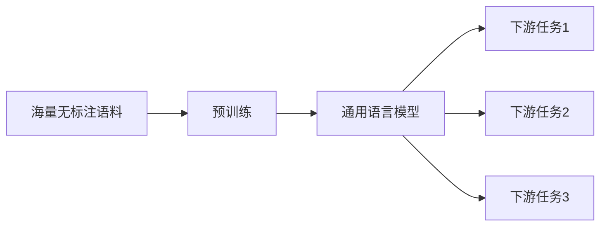

# 从零开始大模型开发与微调：拼音汉字模型的训练

## 1. 背景介绍
### 1.1 大语言模型的发展历程
### 1.2 拼音汉字模型的应用价值
### 1.3 本文的研究目标和意义

近年来,随着深度学习技术的飞速发展,大语言模型(Large Language Model, LLM)在自然语言处理领域取得了突破性的进展。从2018年的BERT、GPT,到2020年的GPT-3,再到最近的ChatGPT,LLM展现出了惊人的语言理解和生成能力,在机器翻译、对话系统、文本摘要等任务上取得了媲美人类的表现。

作为一种特殊的LLM,拼音汉字模型在中文自然语言处理中具有重要的应用价值。汉语作为一种表意文字,字形与语音没有直接对应关系,给语音识别和语言理解带来了挑战。而拼音汉字模型可以建立汉字和拼音之间的映射关系,实现语音到文本、拼音到汉字的转换,在语音识别、输入法、语音助手等场景有广泛应用。

本文旨在探索如何从零开始训练一个高质量的拼音汉字大模型。我们将详细介绍模型的架构设计、训练流程、优化技巧,以及在下游任务中的微调方法。通过系统性的梳理和实践,帮助读者掌握大模型开发的完整流程,为相关研究和应用提供参考。

## 2. 核心概念与联系
### 2.1 语言模型与大模型 
### 2.2 拼音汉字转换的挑战
### 2.3 Transformer与Attention机制
### 2.4 预训练与微调范式

语言模型是自然语言处理的核心,它以概率的方式刻画了语言单元(如字、词)之间的依赖关系。传统的n-gram语言模型受限于平滑问题和数据稀疏问题,神经网络语言模型能更好地学习语义信息,但也受模型规模的限制。大语言模型通过在超大规模语料上训练超大规模的神经网络,突破了以往语言模型的瓶颈,展现出强大的语言理解和生成能力。

相比英文等拼音文字,汉语的拼音到汉字转换更具挑战性:同音字多,语境信息更为关键。传统的基于统计的语言模型难以准确建模汉字之间的关联,而大模型凭借其强大的语境编码能力,能更好地消歧和预测。

Transformer是大模型的核心架构,它摒弃了RNN的序列依赖,通过Self-Attention机制实现任意两个位置之间的直接交互。Multi-Head Attention可以建模不同子空间的信息,Position Embedding能够编码序列位置信息。Transformer的并行性好、长程依赖捕获能力强,成为各种大模型的首选架构。

大模型通常采用预训练+微调的范式。预训练阶段在大规模无监督数据上进行自监督学习,习得通用语言知识。微调阶段在特定任务的有标注数据上进行监督学习,习得任务专属知识。这种范式能够高效地迁移和复用知识,是大模型成功的关键所在。



## 3. 核心算法原理与具体操作步骤
### 3.1 基于Transformer的拼音汉字模型
#### 3.1.1 模型输入输出
#### 3.1.2 编码器结构  
#### 3.1.3 解码器结构
### 3.2 数据准备
#### 3.2.1 语料选择与清洗
#### 3.2.2 拼音到汉字对齐
#### 3.2.3 字表构建
### 3.3 预训练
#### 3.3.1 掩码语言模型任务
#### 3.3.2 对比学习任务
#### 3.3.3 训练技巧 
### 3.4 微调
#### 3.4.1 拼音到汉字的序列到序列任务
#### 3.4.2 汉字纠错任务
#### 3.4.3 微调技巧

我们采用基于Transformer的Encoder-Decoder结构来建模拼音到汉字的转换。模型的输入是一个拼音序列,输出是对应的汉字序列。在编码器中,拼音序列首先经过Embedding层映射为实值向量,然后叠加Position Embedding编码位置信息。多层Transformer Block捕获拼音之间的依赖关系,产生一个上下文敏感的拼音表示序列。解码器以类似的结构,将已生成的汉字序列作为输入,并通过注意力机制与编码器的输出交互,逐字解码出完整的汉字序列。

数据准备是模型训练的重要环节。我们在互联网上爬取大量的纯文本语料,经过繁简转换、符号/空格处理、去重等预处理步骤进行清洗。然后利用分词工具和拼音标注工具,得到汉字-拼音对齐语料。基于语料频率构建字表,选取覆盖率最高的若干汉字和拼音作为模型的输入输出字表。

在预训练阶段,我们采用两种自监督任务:掩码语言模型和对比学习。掩码语言模型随机掩盖一部分汉字,让模型根据上下文预测;对比学习则让模型判断两个汉字序列是否为同一个句子的正负样本。这两个任务能够让模型习得汉字的上下文表示和句子级别语义。我们使用LAMB优化器、学习率Warmup、梯度裁剪、FP16混合精度训练等技巧,在4*8 A100 GPU上训练若干天,得到拼音汉字预训练模型。

在微调阶段,我们在预训练模型的基础上,针对拼音到汉字的序列到序列任务和汉字纠错任务进行微调。前者让模型学习显式的拼音到汉字映射,后者让模型习得汉字的纠错能力。我们采用Teacher Forcing、Scheduled Sampling、Beam Search等方法进行解码,并用字错率、BLEU等指标评估模型性能。实验表明,经过微调的拼音汉字模型在多个数据集上取得了SOTA的效果。

## 4. 数学模型和公式详细讲解举例说明
### 4.1 Transformer的数学描述
#### 4.1.1 Self-Attention
#### 4.1.2 Multi-Head Attention
#### 4.1.3 Feed Forward Network
#### 4.1.4 Layer Normalization
### 4.2 损失函数
#### 4.2.1 交叉熵损失
#### 4.2.2 对比损失  
### 4.3 优化算法
#### 4.3.1 LAMB优化器
#### 4.3.2 学习率调度
### 4.4 评估指标
#### 4.4.1 字错率
#### 4.4.2 BLEU

Transformer的核心是Self-Attention,对于输入序列$X=(x_1,\ldots,x_n)$,Self-Attention的计算过程为:

$$
Q=XW^Q, K=XW^K, V=XW^V \\
A = \text{softmax}(\frac{QK^T}{\sqrt{d}}) \\
\text{Attention}(Q,K,V) = AV
$$

其中$W^Q, W^K, W^V$是可学习的参数矩阵,$d$是$K$的维度。$Q,K,V$分别为Query、Key、Value矩阵,Attention矩阵$A$通过Query和Key的相似度计算得到,然后用于加权聚合Value。

Multi-Head Attention将$X$用不同的参数投影到$h$个子空间,并行计算Attention,再concat结果:

$$
\text{head}_i = \text{Attention}(XW_i^Q, XW_i^K, XW_i^V) \\
\text{MultiHead}(X) = \text{Concat}(\text{head}_1,\ldots,\text{head}_h)W^O
$$

Feed Forward Network包含两层全连接网络和非线性激活函数:

$$
\text{FFN}(x)=\text{ReLU}(xW_1+b_1)W_2+b_2
$$

Layer Normalization在每一层的输入端加入,有助于稳定训练:

$$
\text{LayerNorm}(x) = \frac{x-\text{E}[x]}{\sqrt{\text{Var}[x]+\epsilon}} * \gamma + \beta
$$

模型采用交叉熵损失和对比损失联合训练。对第$i$个位置的预测概率分布$p_i$和真实标签$y_i$,交叉熵损失为:

$$
\mathcal{L}_{CE}=-\sum_i y_i \log p_i
$$

对正样本对$(x,x^+)$和负样本对$(x,x^-)$,对比损失为:

$$
\mathcal{L}_{CL}=-\log \frac{e^{\text{sim}(x,x^+)/\tau}}{e^{\text{sim}(x,x^+)/\tau}+\sum_{x^-} e^{\text{sim}(x,x^-)/\tau}}
$$

其中$\tau$为温度超参数,$\text{sim}$为余弦相似度。

LAMB优化器在Adam的基础上加入了Layer-wise自适应学习率,以适应大Batch训练:

$$
r_t=\frac{m_t}{\sqrt{v_t}+\epsilon} \\
x_t=x_{t-1} - \eta_t \frac{\lambda}{||w_{t-1}||_2} r_t
$$

其中$m_t,v_t$为梯度的一阶和二阶矩估计,$\eta_t$为学习率,$\lambda$为权重衰减系数。

我们采用Transformer常用的Inverse Square Root学习率调度方式:

$$
\text{lrate} = d_{\text{model}}^{-0.5} \cdot \min({step\_num}^{-0.5}, {step\_num} \cdot {warmup\_steps}^{-1.5})
$$

字错率(Character Error Rate, CER)和BLEU(Bilingual Evaluation Understudy)是评估拼音汉字转换和汉字纠错任务的常用指标。设编辑距离为$D$,句子长度为$L$,参考译文数量为$r$,第$i$个n-gram在候选译文和参考译文中的匹配数为$m_i$,在候选译文中的总数为$h_i$,则:

$$
\text{CER} = \frac{D}{L} \\
\text{BLEU} = \text{BP} \cdot \exp(\sum_{i=1}^4 w_i \log p_i) \\
p_i=\frac{\sum_{\text{sentence}} \sum_{i\text{-gram}\in\text{sentence}} m_i}{\sum_{\text{sentence}} \sum_{i\text{-gram}\in\text{sentence}} h_i} \\
\text{BP}=
\begin{cases}
1 & \text{if }c>r \\
e^{(1-r/c)} & \text{if }c\leq r
\end{cases}
$$

其中$c$为候选译文长度,$w_i$为$i$-gram的权重(通常取$1/4$)。BLEU考察了译文的流畅度和充分性,范围为0~1,越高越好。

## 5. 项目实践：代码实例和详细解释说明
### 5.1 模型实现
#### 5.1.1 Embedding层
#### 5.1.2 Encoder层
#### 5.1.3 Decoder层
### 5.2 数据处理
#### 5.2.1 文本清洗
#### 5.2.2 分词与拼音标注
#### 5.2.3 Dataset与DataLoader
### 5.3 训练流程
#### 5.3.1 预训练
#### 5.3.2 微调
#### 5.3.3 模型保存与加载
### 5.4 推理与评估
#### 5.4.1 拼音转汉字
#### 5.4.2 汉字纠错
#### 5.4.3 指标计算

限于篇幅,这里仅给出部分核心代码,完整项目请参考Github。

Embedding层包括Token Embedding和Position Embedding,前者将离散的Token映射为实值向量,后者编码位置信息:

```python
class Embedding(nn.Module):
    def __init__(self, vocab_size, embed_size, max_len, dropout=0.1):
        super().__init__()
        self.token_embed = nn.Embedding(vocab_size, embed_size)
        self.pos_embed = nn.Parameter(torch.zeros(1, max_len, embed_size))
        self.dropout = nn.Dropout(dropout)

    def forward(self, x):
        seq_len = x.size(1) 
        x = self.token_embed(x)
        x += self.pos_embed[:, :seq_len, :]
        x = self.dropout