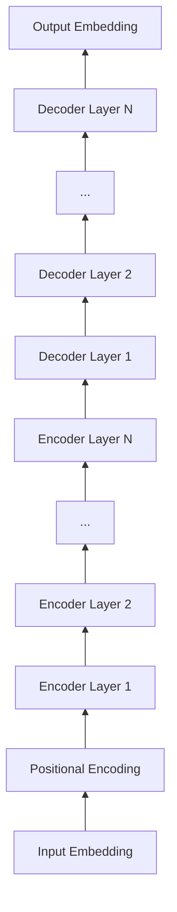

# 从零开始大模型开发与微调：神经网络框架的抽象实现

## 1. 背景介绍

### 1.1 大模型的兴起与发展

近年来,自然语言处理(NLP)领域出现了一种新的范式转变,即预训练语言模型(Pre-trained Language Models,PLMs)的崛起。这些模型通过在大规模无标注文本语料上进行自监督预训练,学习到了丰富的语言知识和通用语义表征能力,并可以通过微调(Fine-tuning)的方式应用到下游的NLP任务中,取得了显著的性能提升。其中,以Transformer为基础的大规模语言模型如BERT、GPT、XLNet等,更是引领了这一浪潮,成为当前NLP研究的主流方向。

### 1.2 大模型面临的挑战

然而,随着模型规模的不断增大,大模型的训练与部署也面临着诸多挑战:

1. **计算资源瓶颈**: 大模型通常包含数亿甚至上千亿的参数,对计算资源提出了极高的要求。单机训练已无法满足需求,分布式训练成为必然选择。但如何有效地在多个设备上并行化模型训练,优化资源利用效率,是一个亟需解决的问题。

2. **训练效率低下**: 由于模型巨大的参数规模,训练一个大模型往往需要数周甚至数月的时间。如何在保证模型性能的同时,提高训练效率,缩短训练周期,成为大模型研发过程中的关键问题。

3. **适配难度大**: 不同的大模型在架构、目标函数、训练范式等方面存在差异,导致在实现和适配新模型时,往往需要对代码框架进行大量的修改和定制化开发,适配成本高,灵活性差。

4. **微调门槛高**: 对于缺乏机器学习专业知识的开发者而言,在特定领域对预训练模型进行微调,并应用到实际任务中,存在一定的技术门槛。如何降低微调难度,让更多用户受益于大模型的性能提升,是值得关注的问题。

### 1.3 神经网络框架的抽象实现

为了应对上述挑战,我们需要一个高效、灵活、易用的神经网络编程框架,能够支持从零开始构建大模型,并提供便捷的微调功能。传统的深度学习框架如TensorFlow、PyTorch等,虽然功能强大,但在实现大模型时,仍然存在一些局限性,如:

1. 抽象层次不够高,需要大量的底层编程和重复工作。
2. 模型定义与训练逻辑耦合紧密,灵活性不足。 
3. 分布式训练支持不完善,扩展性有限。
4. 对于非专业用户,学习成本和使用门槛较高。

因此,我们需要在现有框架的基础上,进一步提升抽象和封装的层次,设计一套面向大模型开发与微调的高阶API,屏蔽底层细节,提供简洁、灵活、高效的编程范式,让用户聚焦于模型本身的设计和应用,而不必过多关注实现细节。

本文将围绕这一目标,系统阐述如何从零开始,基于抽象的神经网络框架,构建大规模语言模型,并支持灵活的微调和应用。通过对核心概念、原理、架构的深入剖析,配合翔实的数学推导、代码实例和实践案例,为读者提供一个全面、清晰的认知视角和实操指南,助力大模型技术的普及和发展。

## 2. 核心概念与联系

### 2.1 Tensor与Autograd

Tensor(张量)是神经网络框架的核心数据结构,本质上是一个多维数组,用于表示模型中的输入、参数、中间状态和输出。与一般的数组不同,Tensor具有自动求导(Autograd)的能力,即在前向计算的同时,记录计算图,并根据链式法则自动推导梯度,为模型优化提供支持。

### 2.2 Layer与Model

Layer(层)是构建神经网络模型的基本单元,定义了数据的传递和变换方式。一个Layer通常包含可学习的参数(如全连接层的权重矩阵)和激活函数(如ReLU),并根据输入数据和参数,计算输出结果。不同的Layer可以灵活组合,形成复杂的网络结构。

Model(模型)则是由一系列Layer按照特定的拓扑结构组合而成的整体,代表了从输入到输出的完整计算过程。一个Model的前向计算,就是数据在各个Layer之间的顺序传递和变换。而在反向传播阶段,Model又会协调各个Layer的梯度计算和参数更新。

### 2.3 Optimizer与Loss Function 

Optimizer(优化器)是用于更新模型参数,使其朝着最优解方向迭代的算法。常见的优化器包括SGD、Adam、AdaGrad等,它们根据模型的梯度信息,按照特定的策略调整参数的值,以最小化Loss Function(损失函数)。

Loss Function则定义了模型预测结果与真实标签之间的差异度量,是优化目标的数学表示。常见的Loss Function包括均方误差、交叉熵等。模型训练的过程,就是通过Optimizer和Loss Function的协同作用,不断迭代更新参数,使得模型在训练数据上的Loss最小化,从而学习到理想的特征表示。

### 2.4 DataLoader与Dataset

DataLoader和Dataset是数据输入流水线的核心组件。Dataset定义了数据集的存储格式和读取方式,支持常见的数据类型如图像、文本、音频等,可以方便地对数据进行预处理和增强。DataLoader则是在Dataset的基础上,实现数据的批次化、乱序化和并行加载,提高数据读取效率,避免I/O瓶颈。

### 2.5 Trainer与Evaluator

Trainer(训练器)封装了模型训练的完整流程,包括数据加载、前向计算、损失函数定义、反向传播、参数更新等步骤。它根据配置的超参数(如批次大小、学习率等),协调各个模块的运行,完成整个训练过程。

Evaluator(评估器)则是在训练过程中,定期对模型的性能进行评估和验证的模块。它在独立的验证集或测试集上,计算模型的各项指标(如准确率、F1等),监控模型的泛化能力和收敛情况,为调优提供依据。

通过以上核心概念的抽象和封装,一个神经网络框架可以提供一套统一、高效、灵活的编程接口,让用户以最小的代码量,完成从数据处理到模型训练、评估的全流程,专注于模型本身的设计和优化。同时,这种抽象也为分布式训练、自动超参搜索等高阶功能提供了基础。

## 3. 核心算法原理与操作步骤

本节将重点介绍构建大规模语言模型的核心算法Transformer的原理,并给出详细的操作步骤。

### 3.1 Transformer架构概览

Transformer是一种基于自注意力机制(Self-Attention)的序列建模架构,摒弃了传统的RNN/CNN等结构,通过Attention机制直接建模序列内和序列间的依赖关系,在并行计算、长程建模等方面具有显著优势。

一个标准的Transformer结构由N个编码器(Encoder)层和N个解码器(Decoder)层组成,如下图所示:

其中,编码器负责对输入序列进行特征提取和上下文编码,解码器则根据编码结果和已生成的序列,预测下一个token。每个编码器/解码器层内部又由多头自注意力(Multi-Head Attention)、前馈神经网络(Feed-Forward Network)等子层组成。

### 3.2 输入表示

对于一个输入序列$X=(x_1, x_2, ..., x_n)$,首先通过Embedding层将其转换为连续的向量表示$E=(e_1, e_2, ..., e_n)$,其中$e_i \in \mathbb{R}^d$,d为嵌入维度。

由于Transformer不包含RNN结构,为了引入位置信息,需要在Embedding的基础上叠加位置编码(Positional Encoding)。一种常用的位置编码方式是利用不同频率的正弦/余弦函数:

$$
PE_{(pos, 2i)} = sin(pos / 10000^{2i/d}) \\
PE_{(pos, 2i+1)} = cos(pos / 10000^{2i/d})
$$

其中,pos为位置索引,i为嵌入维度的索引。将位置编码与词嵌入相加,即可得到最终的输入表示:

$$
H^0 = E + PE
$$

### 3.3 自注意力机制

自注意力机制是Transformer的核心组件,用于捕捉序列内和序列间的依赖关系。对于一个输入序列$H=(h_1, h_2, ..., h_n), h_i \in \mathbb{R}^d$,自注意力的计算过程如下:

1. 根据输入序列计算Query、Key、Value矩阵:

$$
Q = HW_Q, K = HW_K, V = HW_V
$$

其中,$W_Q, W_K, W_V \in \mathbb{R}^{d \times d_k}$为可学习的参数矩阵。

2. 计算注意力权重:

$$
A = softmax(\frac{QK^T}{\sqrt{d_k}})
$$

其中,$A \in \mathbb{R}^{n \times n}$为注意力权重矩阵,表示每个位置对其他位置的关注度。$\sqrt{d_k}$用于缩放点积结果,避免softmax函数的梯度消失。

3. 加权聚合Value:

$$
head_i = AV
$$

最终的自注意力输出为$head_i \in \mathbb{R}^{n \times d_v}$,表示经过注意力聚合后的新的序列表示。

### 3.4 多头注意力

为了捕捉不同子空间的信息,Transformer采用多头注意力(Multi-Head Attention)机制,即并行计算多个独立的自注意力,然后将结果拼接起来:

$$
MultiHead(H) = Concat(head_1, head_2, ..., head_h)W_O
$$

其中,$head_i$为第i个自注意力的输出,$W_O \in \mathbb{R}^{hd_v \times d}$为可学习的参数矩阵,用于将多头注意力的结果映射回原始维度d。

### 3.5 前馈神经网络

除了自注意力子层,Transformer的每个编码器/解码器层还包含一个前馈神经网络(Feed-Forward Network),用于对特征进行非线性变换和信息提取。FFN通常由两个线性变换和一个ReLU激活函数组成:

$$
FFN(x) = max(0, xW_1 + b_1)W_2 + b_2
$$

其中,$W_1 \in \mathbb{R}^{d \times d_{ff}}, b_1 \in \mathbb{R}^{d_{ff}}, W_2 \in \mathbb{R}^{d_{ff} \times d}, b_2 \in \mathbb{R}^d$为可学习的参数,d_ff为FFN的隐藏层维度,通常取4d。

### 3.6 残差连接与Layer Normalization

为了促进梯度的反向传播和模型的收敛,Transformer在每个子层(自注意力和FFN)之后,都添加了残差连接(Residual Connection)和Layer Normalization:

$$
x = LayerNorm(x + Sublayer(x))
$$

其中,Sublayer可以是自注意力或FFN子层。Layer Normalization通过对每一层的激活值进行归一化,使其均值为0,方差为1,有助于稳定训练过程。

### 3.7 Decoder Mask

在生成任务中,Decoder只能看到已生成的序列,不能获取未来的信息。因此,在Decoder的自注意力计算时,需要引入一个Mask矩阵,屏蔽掉当前位置之后的信息:

$$
A = softmax(\frac{QK^T}{\sqrt{d_k}} + Mask)
$$

其中,Mask为一个上三角矩阵,对角线及以下位置为0,其余位置为-inf。这样,在计算{"msg_type":"generate_answer_finish","data":"","from_module":null,"from_unit":null}