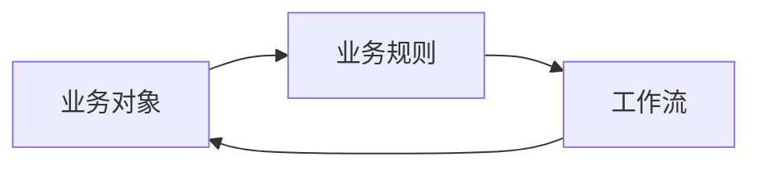
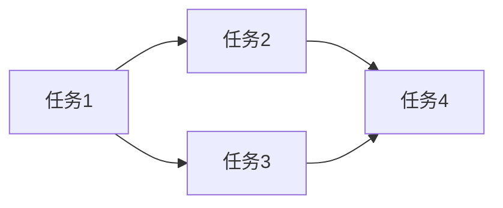

# 企业办公自动化系统详细设计与具体代码实现

## 1. 背景介绍

在现代企业管理中,办公自动化系统扮演着越来越重要的角色。它能够有效地提高工作效率,减少人工操作的错误,并为企业的决策提供数据支持。本文将详细探讨企业办公自动化系统的设计与实现,包括系统架构、核心模块、关键算法、数学模型以及具体的代码实现。

### 1.1 企业办公自动化的发展历程

#### 1.1.1 早期的办公自动化

#### 1.1.2 基于客户端-服务器架构的办公自动化

#### 1.1.3 基于Web的办公自动化

### 1.2 企业办公自动化的意义

#### 1.2.1 提高工作效率

#### 1.2.2 减少人工操作错误

#### 1.2.3 为决策提供数据支持

### 1.3 企业办公自动化系统的主要功能

#### 1.3.1 文档管理

#### 1.3.2 流程管理

#### 1.3.3 人力资源管理

#### 1.3.4 财务管理

## 2. 核心概念与联系

在设计企业办公自动化系统时,需要理解一些核心概念以及它们之间的联系。

### 2.1 业务对象(Business Object)

业务对象是对现实世界中业务实体的抽象,例如员工、部门、文档等。每个业务对象都有自己的属性和行为。

### 2.2 业务规则(Business Rule)

业务规则定义了业务对象之间的约束关系和操作规则,例如"员工必须隶属于某个部门"、"请假申请需要经过上级审批"等。

### 2.3 工作流(Workflow)

工作流描述了一个业务过程中各个步骤的执行顺序以及每个步骤的执行者。它将业务对象、业务规则和人员角色关联起来,形成一个完整的业务流程。

下图展示了这些核心概念之间的关系:



## 3. 核心算法原理具体操作步骤

在企业办公自动化系统中,有几个核心算法值得关注。

### 3.1 文档相似度算法

文档相似度算法用于判断两个文档的相似程度,常用于文档去重、版本管理等场景。其基本步骤如下:

1. 对文档进行预处理,如去除停用词、提取关键词等。
2. 将文档转换为向量表示,如TF-IDF向量、Word2Vec向量等。
3. 计算两个文档向量之间的相似度,常用的相似度度量包括余弦相似度、欧氏距离等。

### 3.2 任务调度算法

任务调度算法用于合理地分配任务给不同的员工,以达到工作负载均衡和效率最大化。常见的任务调度算法包括:

1. 先来先服务(FCFS):按照任务到达的顺序依次执行。
2. 短作业优先(SJF):优先执行执行时间短的任务。
3. 优先级调度:按照任务的优先级高低来决定执行顺序。
4. 轮转调度:每个任务执行一个时间片,然后切换到下一个任务。

## 4. 数学模型和公式详细讲解举例说明

在企业办公自动化系统中,一些数学模型和公式被广泛应用。

### 4.1 流程网络模型

流程网络模型用于描述工作流中各个任务之间的依赖关系。假设一个工作流有n个任务,我们可以定义一个n*n的邻接矩阵A,其中:

$A_{ij} = \begin{cases} 1, & \text{如果任务i必须在任务j之前完成} \\ 0, & \text{otherwise} \end{cases}$

例如,考虑以下工作流:



其对应的邻接矩阵为:

$$
A = \begin{bmatrix}
0 & 1 & 1 & 0\\
0 & 0 & 0 & 1\\
0 & 0 & 0 & 1\\
0 & 0 & 0 & 0
\end{bmatrix}
$$

### 4.2 资源分配模型

资源分配模型用于描述如何将有限的资源分配给不同的任务。假设有m种资源和n个任务,我们定义以下变量:

- $x_{ij}$:分配给任务i的第j种资源的数量
- $c_j$:第j种资源的总量
- $p_i$:完成任务i所需的时间

我们的目标是最小化总的完成时间,即:

$$
\min \sum_{i=1}^n p_i
$$

同时需要满足资源约束:

$$
\sum_{i=1}^n x_{ij} \leq c_j, \forall j=1,2,\ldots,m
$$

这实际上是一个线性规划问题,可以用单纯形法等算法求解。

## 5. 项目实践:代码实例和详细解释说明

下面我们通过一个简单的例子来说明如何用Python实现一个文档管理模块。

### 5.1 文档类定义

首先定义一个`Document`类来表示文档:

```python
class Document:
    def __init__(self, doc_id, title, content):
        self.doc_id = doc_id
        self.title = title
        self.content = content
        self.version = 1
    
    def update_content(self, new_content):
        self.content = new_content
        self.version += 1
```

每个文档有一个唯一的`doc_id`,一个`title`,一个`content`,以及一个表示版本号的`version`属性。`update_content`方法用于更新文档内容并增加版本号。

### 5.2 文档仓库类定义

接下来定义一个`DocumentRepository`类来管理所有的文档:

```python
class DocumentRepository:
    def __init__(self):
        self.documents = {}
    
    def add_document(self, document):
        self.documents[document.doc_id] = document
    
    def get_document(self, doc_id):
        return self.documents.get(doc_id)
    
    def update_document(self, doc_id, new_content):
        document = self.get_document(doc_id)
        if document:
            document.update_content(new_content)
```

`DocumentRepository`维护了一个字典`documents`,用文档的`doc_id`作为键。`add_document`方法将一个新文档添加到仓库中,`get_document`方法根据`doc_id`检索文档,`update_document`方法更新指定文档的内容。

### 5.3 使用示例

下面的代码演示了如何使用上述类:

```python
repo = DocumentRepository()

doc1 = Document(1, 'Doc1', 'This is doc1')
doc2 = Document(2, 'Doc2', 'This is doc2')

repo.add_document(doc1)
repo.add_document(doc2)

print(repo.get_document(1).content) # This is doc1

repo.update_document(1, 'This is updated doc1')
print(repo.get_document(1).content) # This is updated doc1
print(repo.get_document(1).version) # 2
```

## 6. 实际应用场景

企业办公自动化系统在各个行业都有广泛的应用,下面列举几个典型场景:

### 6.1 合同管理

合同管理是企业日常运作中非常重要的一环。通过办公自动化系统,可以实现合同的电子化存储、版本控制、审批流程等,大大提高合同管理的效率和准确性。

### 6.2 人力资源管理

办公自动化系统可以帮助HR部门进行员工信息管理、考勤管理、绩效考核等工作。系统可以自动计算员工的加班时间、请假天数等,为薪酬计算和绩效评估提供数据支持。

### 6.3 财务管理

财务管理是另一个常见的应用场景。办公自动化系统可以与企业的财务软件无缝集成,实现报销申请、发票管理、预算控制等功能,提高财务工作的效率和准确性。

## 7. 工具和资源推荐

在开发企业办公自动化系统时,以下工具和资源可能会有所帮助:

- Python:一种简单易学且功能强大的编程语言,适合快速开发原型系统。
- Django:一个基于Python的Web框架,提供了许多开箱即用的功能,如用户认证、管理后台等。
- Activiti:一个开源的工作流引擎,支持BPMN 2.0标准,可以与Java等语言集成。
- Alfresco:一个开源的企业内容管理平台,提供了文档管理、协作等功能。
- OAuth 2.0:一种开放的授权标准,可用于实现单点登录、第三方应用集成等。

## 8. 总结:未来发展趋势与挑战

企业办公自动化系统的未来发展趋势主要体现在以下几个方面:

- 云化:越来越多的企业将办公系统迁移到云端,以降低运维成本并提高系统的可扩展性。
- 移动化:随着移动设备的普及,移动办公成为一种趋势。未来的办公系统需要支持各种移动终端,并提供良好的用户体验。
- 智能化:人工智能技术的发展为办公自动化带来了新的机遇。未来的系统可能会利用自然语言处理、机器学习等技术,实现更加智能的工作流管理和决策支持。

同时,企业办公自动化系统也面临着一些挑战:

- 安全性:系统中存储了大量敏感的企业数据,如何保证数据的安全性是一个重要问题。
- 互操作性:企业内部可能存在多个异构系统,如何实现这些系统之间的无缝集成和数据交换是一大挑战。
- 用户接受度:办公自动化系统的成功取决于最终用户的接受程度。如何设计出易用、高效的系统,并提供足够的培训和支持,是关键所在。

## 9. 附录:常见问题与解答

### 9.1 如何选择合适的办公自动化系统?

选择办公自动化系统时,需要考虑以下因素:

- 功能是否满足企业的需求
- 系统是否易于使用和维护
- 是否支持与现有系统的集成
- 供应商是否提供及时的技术支持
- 总体成本是否在预算之内

### 9.2 如何确保办公自动化系统的安全性?

可以采取以下措施来提高系统的安全性:

- 使用强密码策略,并定期更换密码
- 及时安装系统补丁和更新
- 使用数据加密技术,如SSL/TLS
- 定期进行安全审计和渗透测试
- 建立完善的数据备份和恢复机制

### 9.3 办公自动化系统的实施流程是怎样的?

一般包括以下步骤:

1. 需求分析:了解企业的业务流程和痛点,明确系统的功能需求。
2. 方案设计:根据需求设计系统架构和功能模块。
3. 系统开发:进行详细设计和编码实现。
4. 测试部署:对系统进行功能测试、性能测试和安全测试,并在试运行环境中部署。
5. 用户培训:对最终用户进行系统使用培训。
6. 上线运维:系统正式上线,并提供持续的运维和技术支持。

作者:禅与计算机程序设计艺术 / Zen and the Art of Computer Programming