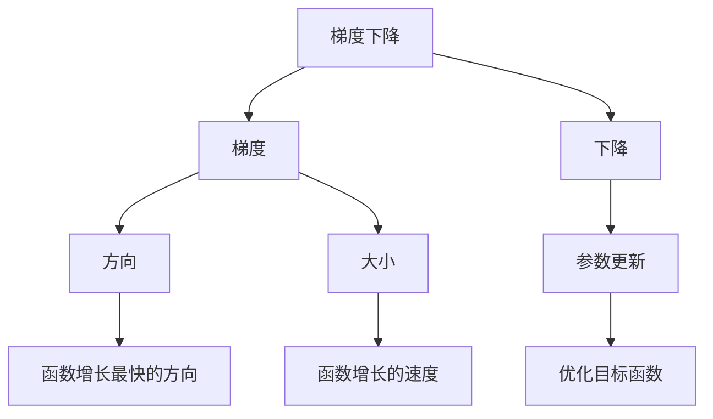

## 1.背景介绍

优化算法在现代计算机科学中扮演了重要的角色，尤其是在机器学习和深度学习领域。梯度下降 (Gradient Descent) 是其中最常用的优化算法之一，它被广泛应用于各种机器学习算法中，如线性回归、逻辑回归、神经网络等。本文将为你详细解读梯度下降的原理，并通过代码实例进行深入讲解。

## 2.核心概念与联系

梯度下降算法的核心概念是梯度（Gradient）和下降（Descent）。首先，我们需要理解什么是梯度。在多元函数中，梯度是一个向量，它的方向是函数在该点处增长最快的方向，大小（长度）表示增长的速度。而“下降”则表示我们希望通过调整参数，使得函数值沿着梯度的反方向，也就是函数值减小最快的方向进行更新，从而达到优化目标函数的目的。



## 3.核心算法原理具体操作步骤

梯度下降算法的操作步骤可以概括为以下几步：

1. 初始化参数值（通常为随机值）。
2. 计算目标函数的梯度值。
3. 根据梯度值更新参数。
4. 重复步骤2和3，直到满足停止条件（如梯度值小于预设的阈值，或者达到预设的迭代次数）。

## 4.数学模型和公式详细讲解举例说明

假设我们的目标函数为 $f(\theta)$，其中 $\theta$ 是我们需要优化的参数。在梯度下降算法中，参数 $\theta$ 的更新公式为：

$$
\theta = \theta - \alpha \nabla f(\theta)
$$

其中，$\alpha$ 是学习率，决定了参数更新的步长；$\nabla f(\theta)$ 是目标函数 $f(\theta)$ 在 $\theta$ 处的梯度。

## 5.项目实践：代码实例和详细解释说明

下面我们以Python实现简单的梯度下降算法为例，来具体看看梯度下降算法的实现过程。

```python
import numpy as np

def gradient_descent(theta_init, grad, alpha, num_iter):
    theta = theta_init
    for i in range(num_iter):
        theta = theta - alpha * grad(theta)
    return theta
```

在这段代码中，`theta_init` 是参数的初始值，`grad` 是计算梯度的函数，`alpha` 是学习率，`num_iter` 是迭代次数。函数返回优化后的参数值。

## 6.实际应用场景

梯度下降算法在机器学习和深度学习中有广泛的应用，如线性回归、逻辑回归、神经网络等。除此之外，梯度下降也被用于最小二乘法、支持向量机等算法的优化过程。

## 7.工具和资源推荐

Python的Numpy库和Scipy库提供了丰富的数学计算和优化工具，非常适合实现梯度下降等优化算法。此外，深度学习框架如TensorFlow和PyTorch也内置了梯度下降等优化算法，可以方便地用于神经网络的训练。

## 8.总结：未来发展趋势与挑战

梯度下降算法虽然简单易懂，但在面对复杂的优化问题时，可能会遇到诸如局部最优、鞍点、梯度消失等问题。因此，如何改进梯度下降算法，使其在更复杂的场景下也能有效地优化目标函数，是未来的一个重要研究方向。

## 9.附录：常见问题与解答

1. **问题：为什么梯度下降算法中需要设置学习率？**
   
   答：学习率决定了参数更新的步长，如果学习率设置得过大，可能会导致算法在优化过程中震荡不收敛；如果设置得过小，可能会导致算法收敛速度过慢。因此，合适的学习率设置对梯度下降算法的效果至关重要。

作者：禅与计算机程序设计艺术 / Zen and the Art of Computer Programming